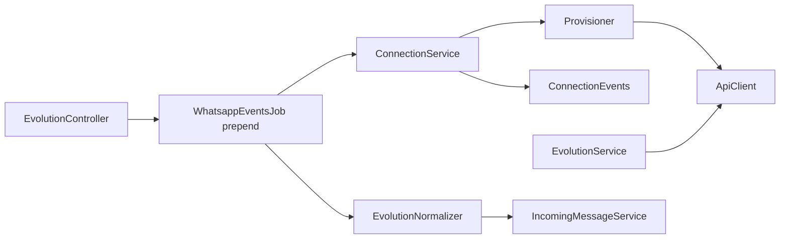

# Spec design — classes do provider Evolution

Contratos públicos das classes em `custom/` para implementação Fase 0–3. Complementa [implementation-plan.md](./implementation-plan.md) e [decisions.md](./decisions.md).

**Padrão de referência upstream:** `Whatsapp::Providers::Whatsapp360DialogService`, `Whatsapp::IncomingMessageService`, `Webhooks::WhatsappEventsJob`.

---

## Visão de dependências



---

## 1. `Custom::Whatsapp::Evolution::ApiClient`

**Arquivo:** `custom/app/services/custom/whatsapp/evolution/api_client.rb`

Cliente HTTP fino — sem regras de negócio Chatwoot.

### Inicialização

```ruby
# Preferido — lê credenciais do channel
Custom::Whatsapp::Evolution::ApiClient.for_channel(channel)

# Ou explícito
Custom::Whatsapp::Evolution::ApiClient.new(
  base_url: channel.provider_config['base_url'],
  api_key: channel.provider_config['api_key'],
  instance_name: channel.provider_config['instance_name']
)
```

### API pública

| Método | Evolution endpoint | Retorno |
|--------|-------------------|---------|
| `#create_instance(body)` | `POST /instance/create` | `Hash` parsed |
| `#connect(number: nil)` | `GET /instance/connect/:instance` | `Hash` (qrcode) |
| `#connection_state` | `GET /instance/connectionState/:instance` | `Hash` |
| `#logout_instance` | `DELETE /instance/logout/:instance` | `Hash` |
| `#restart_instance` | `POST /instance/restart/:instance` | `Hash` |
| `#delete_instance` | `DELETE /instance/delete/:instance` | `Hash` |
| `#apply_webhook(url, events:)` | `POST /webhook/set/:instance` | `Hash` |
| `#apply_settings(settings)` | `POST /settings/set/:instance` | `Hash` |
| `#apply_proxy(proxy)` | `POST /proxy/set/:instance` | `Hash` |
| `#disable_chatwoot_integration` | `POST /chatwoot/set/:instance` | `Hash` — `enabled: false` |
| `#send_text(number:, text:, quoted: nil, delay: nil)` | `POST /message/sendText/:instance` | `Hash` messageRaw |
| `#send_media(number:, mediatype:, media:, caption: nil)` | `POST /message/sendMedia/:instance` | `Hash` |
| `#send_audio(number:, audio:, quoted: nil, delay: nil)` | `POST /message/sendWhatsAppAudio/:instance` | `Hash` |
| `#delete_message_for_everyone(id:, remote_jid:, from_me:)` | `DELETE /chat/deleteMessageForEveryone/:instance` | `Hash` |
| `#find_chatwoot_integration` | `GET /chatwoot/find/:instance` | `Hash` — verificação pós-provision |
| `#mark_message_as_read(read_messages:)` | `POST /chat/markMessageAsRead/:instance` | `Hash` |
| `#find_contacts(page:, offset:, where:)` | `POST /chat/findContacts/:instance` | `Array` |
| `#find_messages(page:, offset:, where:)` | `POST /chat/findMessages/:instance` | `Array` |
| `#get_base64_from_media_message(message:)` | `POST /chat/getBase64FromMediaMessage/:instance` | `Hash` |
| `#fetch_profile_picture_url(number:)` | `POST /chat/fetchProfilePictureUrl/:instance` | `Hash` |
| `#fetch_profile(number:)` | `POST /chat/fetchProfile/:instance` | `Hash` |
| `#fetch_business_profile(number:)` | `POST /chat/fetchBusinessProfile/:instance` | `Hash` |

> **Deferido Fase 3:** `#send_buttons` / `#send_list` — `EvolutionService#send_input_select_message` usa fallback `sendText` com lista numerada.

### `#send_text` — fallback doc vs código

```ruby
def send_text(number:, text:, quoted: nil, delay: nil)
  body = { number: normalize_number(number), text: text }
  body[:quoted] = quoted if quoted.present?
  body[:delay] = delay if delay.present?

  response = post("/message/sendText/#{instance_name}", body)
  return response if response.success?

  # Fallback OpenAPI shape (older published docs)
  if response.code == 400
    fallback = body.except(:text).merge(textMessage: { text: text })
    response = post("/message/sendText/#{instance_name}", fallback)
  end

  response
end
```

### HTTP interno

```ruby
def post(path, body)
  HTTParty.post(
    "#{normalized_base_url}#{path}",
    headers: { 'apikey' => api_key, 'Content-Type' => 'application/json' },
    body: body.to_json
  )
end
```

Erros: logar body; levantar `Custom::Whatsapp::Evolution::ApiError` com `status`, `body` para o service tratar.

---

## 2. `Custom::Whatsapp::Evolution::ConnectionService`

**Arquivo:** `custom/app/services/custom/whatsapp/evolution/connection_service.rb`

Facade de lifecycle da instância: QR, reconnect/logout/restart, polling de status. Delega provisionamento para `Provisioner` e webhooks de conexão para `ConnectionEvents`.

### Inicialização

```ruby
ConnectionService.new(channel: channel) # Channel::Whatsapp, provider: 'evolution'
```

### API pública

| Método | Fase | Descrição |
|--------|------|-----------|
| `#provision_new_instance!` | 1 | Delega → `Provisioner#provision_new_instance!` |
| `#provision_post_create!(parsed)` | 1 | Pós-create: webhook, settings, QR |
| `#register_webhook!` | 1 | Delega → `Provisioner#register_webhook!` |
| `#sync_settings!` | 2 | Delega → `Provisioner#sync_settings!` |
| `#sync_proxy!` | 2 | Delega → `Provisioner#sync_proxy!` |
| `#ensure_chatwoot_integration_disabled!` | 1 | Delega → `Provisioner#ensure_chatwoot_integration_disabled!` |
| `#teardown!` | 1 | `DELETE /instance/delete` na Evolution |
| `#fetch_qr_code` | 1 | `GET /instance/connect` → persiste QR via `ConnectionEvents#qrcode_storage_attrs` |
| `#reconnect!` / `#logout!` / `#restart!` | 3 | Operações de sessão |
| `#refresh_connection_status!` | 1 | Poll `connectionState` |
| `#connection_payload` | 3 | Snapshot para API dashboard (status + QR) |
| `#handle_event(envelope)` | 1 | Delega → `ConnectionEvents#handle_event` |

Runtime updates (`connection_status`, QR, `last_sender`) usam `update_columns` — não disparam `validate_provider_config` remoto nem `sync_settings`/`sync_proxy`.

---

## 2b. `Custom::Whatsapp::Evolution::Provisioner`

**Arquivo:** `custom/app/services/custom/whatsapp/evolution/provisioner.rb`

Create remoto, webhook, settings, proxy e desabilitar integração legada Chatwoot na Evolution.

### `#provision_new_instance!` — sequência

```
1. ApiClient#create_instance (WHATSAPP-BAILEYS, qrcode: true, settings from provider_config)
2. provision_post_create!(parsed):
   a. Persistir api_key (hash), instance_id, connection_status
   b. register_webhook!
   c. sync_settings!
   d. sync_proxy! (se proxy_enabled)
   e. ensure_chatwoot_integration_disabled!
   f. ConnectionService#fetch_qr_code
3. Em falha após create: delete_remote_instance!
```

---

## 2c. `Custom::Whatsapp::Evolution::ConnectionEvents`

**Arquivo:** `custom/app/services/custom/whatsapp/evolution/connection_events.rb`

Handlers de `CONNECTION_UPDATE` e `QRCODE_UPDATED`.

### `#handle_event`

```ruby
def handle_event(envelope)
  case envelope[:event]
  when 'CONNECTION_UPDATE'
    connection_service.update_connection_status(envelope.dig(:data, :state))
    connection_service.extract_phone_number(envelope)
    broadcast_connection_event(...)
    notify_disconnection! # state == 'close' → Broadcaster
  when 'QRCODE_UPDATED'
    attrs = qrcode_storage_attrs(envelope[:data])
    connection_service.update_provider_config!(attrs)
    broadcast_connection_event(qrcode_base64:, qrcode_code:)
  end
end
```

**ActionCable** ([decisions.md §17](./decisions.md)): canal `evolution:connection:{inbox_id}`.

### `provider_config` keys escritas (runtime)

| Key | Quando |
|-----|--------|
| `connection_status` | `open` / `close` / `connecting` |
| `phone_number` | Primeiro `open` com `sender` válido (`+5511...`) |
| `last_qr_base64` / `last_qr_code` | `QRCODE_UPDATED` ou `fetch_qr_code` |
| `last_sender` | Envelope `sender` em `CONNECTION_UPDATE` |

---

## 2d. `Custom::Whatsapp::Evolution::EventNames`

**Arquivo:** `custom/app/services/custom/whatsapp/evolution/event_names.rb`

```ruby
Custom::Whatsapp::Evolution::EventNames.normalize('messages.upsert') # => 'MESSAGES_UPSERT'
```

Chamado em `EvolutionController#sanitized_job_payload` e no prepend `WhatsappEventsJob` antes do `case` de roteamento.

---

## 3. `Custom::Whatsapp::Providers::EvolutionService`

**Arquivo:** `custom/app/services/custom/whatsapp/providers/evolution_service.rb`

Herda `Whatsapp::Providers::BaseService`. Registrado via `MessagingProvider::Registry`.

Fixtures relacionadas: [spec/fixtures/evolution/README.md](../../../../spec/fixtures/evolution/README.md)

### API pública (contrato BaseService)

| Método | Implementação |
|--------|---------------|
| `#send_message(phone_number, message)` | Roteia por attachments / input_select / texto |
| `#send_template(phone_number, template_info, message)` | Se `send_templates_as_text` → texto; senão no-op / erro |
| `#sync_templates` | No-op — mark updated |
| `#validate_provider_config?` | `connectionState` → `state == 'open'` (não só HTTP 2xx) |
| `#media_url(media_id)` | N/A ou URL Evolution se Fase 2 |
| `#api_headers` | Não usado (ApiClient encapsula) |

### `#send_message` — fluxo texto (Fase 1)

```ruby
def send_message(phone_number, message)
  @message = message
  body = message.outgoing_content # Fase 2+: apply_outbound_transforms

  response = api_client.send_text(
    number: phone_number,
    text: body
  )

  process_response(response, message)
end
```

### Transformações outbound (`provider_config`) — Fase 2+

| Flag | Comportamento |
|------|---------------|
| `sign_msg` | Prefixar `*Nome Agente:*\n` (delimiter de `sign_delimiter`) |
| `convert_markdown_outbound` | `**bold**` → `*bold*` (WhatsApp) |
| `mark_read_on_reply` | Após send, `mark_message_read` da msg citada |
| `send_random_delay` | `delay: rand(500..2000)` |

### `#process_response` — override

```ruby
def process_response(response, message)
  parsed = response.parsed_response
  if response.success? && parsed['key'].present?
    parsed.dig('key', 'id')
  else
    handle_error(response, message)
    nil
  end
end
```

### `#send_attachment_message` (Fase 2)

```ruby
api_client.send_media(
  number: phone_number,
  mediatype: map_file_type(attachment),
  media: attachment.download_url, # URL pública ActiveStorage
  caption: message.content
)
```

### `#send_interactive_text_message` (Fase 3)

`input_select` com ≤10 itens → lista numerada via `send_text` (não usa `sendButtons`/`sendList` da Evolution).

---

## 4b. `Custom::Whatsapp::Evolution::ContactsSyncService`

**Arquivo:** `custom/app/services/custom/whatsapp/evolution/contacts_sync_service.rb`

Processa webhooks `CONTACTS_UPSERT` / `CONTACTS_UPDATE` — cria/atualiza contatos e enfileira `ContactEnrichmentJob` para foto/perfil.

---

## 4c. `Custom::Whatsapp::Evolution::DeleteSyncService`

**Arquivo:** `custom/app/services/custom/whatsapp/evolution/delete_sync_service.rb`

Quando agente apaga mensagem no Chatwoot e `sync_delete_to_whatsapp: true`, chama `ApiClient#delete_message_for_everyone`.

---

## 4. `Custom::Whatsapp::Webhooks::EvolutionNormalizer`

**Arquivo:** `custom/app/services/custom/whatsapp/webhooks/evolution_normalizer.rb`

Transforma envelope Evolution → payload flat 360dialog-like para `IncomingMessageService`.

### Inicialização

```ruby
EvolutionNormalizer.new(channel: channel, envelope: envelope).perform
# envelope: Hash com keys 'event', 'instance', 'data', 'apikey', ...
```

### Retorno

```ruby
# Sucesso — passar para IncomingMessageService
{
  contacts: [{ profile: { name: '...' }, wa_id: '5511...' }],
  messages: [{ from: '...', id: '...', timestamp: '...', type: 'text', text: { body: '...' } }]
}

# Status
{ statuses: [{ id: '...', status: 'read', timestamp: '...', recipient_id: '...' }] }

# Filtrado / ignorado
nil
```

### Pipeline interno

```
1. validate_instance!(envelope['instance'] == channel.provider_config['instance_name'])
2. return nil unless supported_event?
3. Array.wrap(envelope['data']).each do |data|   # batch-safe — decisions.md §13
4.   apply_inbound_filters!(data)
5.   normalize_message_or_status(data)
6. end
```

Retorno: para `MESSAGES_UPSERT` com batch, normalizer pode retornar o **último** payload normalizado ou processar cada item em loop no job — preferir **um item por chamada** a `IncomingMessageService` (job itera).

### Filtros (`apply_inbound_filters!`)

Ordem fixa — ver [webhook-events.md](./webhook-events.md). Ler flags de `channel.provider_config`.

### Resolução de telefone (`resolve_wa_id`)

```ruby
def resolve_wa_id(key)
  key ||= {}
  remote_jid = key['remoteJid'].to_s
  jid = if key['remoteJidAlt'].present? &&
           (remote_jid.end_with?('@lid') || key['addressingMode'] == 'lid')
          key['remoteJidAlt']
        else
          key['remoteJid']
        end
  jid_to_phone(jid)
end

def jid_to_phone(jid)
  jid.to_s.split('@').first
end
```

### Mapeamento `messageType` → canônico

| Evolution | `type` | Campos extra |
|-----------|--------|--------------|
| `conversation`, `extendedTextMessage` | `text` | `text.body` |
| `imageMessage` | `image` | `image.id` ou URL/base64 Fase 2 |
| `documentMessage` | `document` | `document.filename` |
| `audioMessage` | `audio` | |
| `videoMessage` | `video` | |
| `stickerMessage` | `sticker` | |
| `locationMessage` | `location` | `location.latitude`, `longitude` |
| `contactMessage` | `contacts` | vCard parse |
| `reactionMessage` | — | `nil` (ignorar MVP) |
| `protocolMessage` (revoke) | — | Fase 2+ delete sync |

### Reply inbound (Fase 2)

Se `message.contextInfo.stanzaId` presente:

```ruby
message_hash[:context] = { id: context_info['stanzaId'] }
```

`IncomingMessageService` mapeia para `content_attributes[:in_reply_to_external_id]`.

### `#build_quoted_context` (outbound, em EvolutionService)

```ruby
{
  key: {
    id: reply_external_id,
    remoteJid: "#{phone}@s.whatsapp.net",
    fromMe: false
  },
  message: { conversation: original_snippet }
}
```

---

## 5. `Webhooks::EvolutionController`

**Arquivo:** `custom/app/controllers/webhooks/evolution_controller.rb`

```ruby
class Webhooks::EvolutionController < ActionController::API
  def process_payload
    authenticate_webhook! # decisions.md §2
    Webhooks::WhatsappEventsJob.perform_later(
      sanitized_job_payload.merge(instance_name: params[:instance_name])
    )
    head :ok
  end

  # sanitized_job_payload: remove apikey; EventNames.normalize(event)
end
```

`permitted_params`: permitir envelope completo (`event`, `data`, `apikey`, `sender`, ...).

---

## 6. `WebhookDispatcher` + prepend `Webhooks::WhatsappEventsJob`

**Dispatcher:** `custom/app/services/custom/whatsapp/evolution/webhook_dispatcher.rb`

| Evento | Ação |
|--------|------|
| `MESSAGES_UPSERT` / `MESSAGES_UPDATE` | `EvolutionNormalizer` → `MessageMutex` → `IncomingMessageService` (ou `PhoneOutgoingSyncService` se `fromMe`) |
| `MESSAGES_DELETE` | `MessageDeleteSyncService` (mutex) |
| `MESSAGES_EDITED` | `MessageEditSyncService` (mutex) |
| `CONTACTS_UPSERT` / `CONTACTS_UPDATE` | `ContactsSyncJob` |
| `CONNECTION_UPDATE` / `QRCODE_UPDATED` | `ConnectionService#handle_event` |
| Outros | `Rails.logger.warn` com `instance_name` |

**Job prepend:** `custom/app/jobs/custom/webhooks/whatsapp_events_job.rb` — `EventNames.normalize`, lookup channel, `WebhookDispatcher.new.dispatch(channel, params)`.

Adicionalmente no pipeline:

- `log_normalizer_skipped` quando normalizer retorna `nil` (filtros inbound, tipo não suportado)
- `MessageMutex` compartilhado com `LostMessagesReconciliationService`
- `RemoteJidFilter` centraliza `skip_remote_jid?` (normalizer, import, phone outgoing)
- Status antes da mensagem existir → `DeferredStatusJob` (retry + log na exaustão)
- Mídia: `MediaDownloadJob` libera lock Redis em `ensure`; `MediaAttachmentService` levanta `ApiError` em HTTP erro
- Import histórico: lock Redis atômico `evolution:import:{channel_id}` em `ImportService`
- Grupos: hot path usa cache + fallback (`pushName` / JID); cache miss enfileira `GroupMetadataFetchJob`

---

## 7. Prepend `Channel::Whatsapp`

**Arquivo:** `custom/app/models/custom/channel/whatsapp.rb`

```ruby
def provider_service
  service = MessagingProvider::Registry.resolve(provider, whatsapp_channel: self)
  return service if service

  super
end
```

---

## 8. Prepend `Conversations::MessageWindowService`

**Arquivo:** `custom/app/services/custom/conversations/message_window_service.rb`

```ruby
def reply_window
  return nil if conversation.inbox.channel.is_a?(Channel::Whatsapp) &&
                conversation.inbox.channel.provider == 'evolution'

  super
end
```

---

## 9. `MessagingProvider::Registry`

**Arquivo:** `custom/lib/messaging_provider/registry.rb`

```ruby
module MessagingProvider
  class Registry
    @providers = {}

    def self.register(key, service_class)
      @providers[key] = service_class
    end

    def self.resolve(key, whatsapp_channel:)
      klass = @providers[key]
      klass&.new(whatsapp_channel: whatsapp_channel)
    end
  end
end
```

Initializer:

```ruby
MessagingProvider::Registry.register('evolution', Custom::Whatsapp::Providers::EvolutionService)
```

---

## 10. `MessagingProvider::Capabilities`

```ruby
module MessagingProvider
  module Capabilities
    def self.for(provider)
      {
        'evolution' => {
          unlimited_session: true,
          supports_templates: false,
          supports_embedded_signup: false,
          supports_calling: false
        }
      }[provider] || {}
    end

    def self.unlimited_session?(provider)
      for(provider)[:unlimited_session] == true
    end
  end
end
```

---

## 11. Frontend (Vue) — contrato mínimo

Não é classe Ruby; interface entre wizard, health page e API interna do fork.

### Detecção de canal Evolution

| Export | Arquivo | Uso |
|--------|---------|-----|
| `isEvolutionWhatsAppChannel(channel)` | `dashboard/mixins/inboxMixin.js` | Gates UI (settings, cloud-only) |

### Composables reais

| Composable | Arquivo | Responsabilidade |
|------------|---------|------------------|
| `useEvolutionQrSession` | `custom/.../composables/evolution/useEvolutionQrSession.js` | Polling 3s, expiry QR ~45s, `qrRefreshError` em falhas de rede, `evolution_reconnect` |
| `useEvolutionConnectionCable` | `custom/.../composables/evolution/useEvolutionConnectionCable.js` | Subscribe `EvolutionConnectionChannel`; `subscribeEvolutionConnection` imperativo para callers legados |
| `useEvolutionHealthConnection` | `custom/.../composables/evolution/useEvolutionHealthConnection.js` | Health page: polling 5s, cable, reconnect/logout/restart, flag `staleData` |

### Componentes

| Componente | Notas |
|------------|-------|
| `EvolutionQrScanModal.vue` | `onUnmounted` limpa polling/cable; prop `cableManagedExternally` evita subscription duplicada quando o pai já inscrito |
| `EvolutionHealthPage.vue` | Composition API + `useEvolutionHealthConnection` |
| `EvolutionSettingsPage.vue` | Settings + import; health embutida |

Registry cable: `custom/.../lib/evolution/evolutionCableRegistry.js` — `acquireEvolutionConnectionCable` dedupe por `inboxId` (ref-count de listeners).

### API interna Rails (implementado)

| Método | Path | Ação |
|--------|------|------|
| GET | `/api/v1/accounts/:id/inboxes/:inbox_id/evolution_connection` | `connection_payload` (status + QR em cache) |
| POST | `/api/v1/accounts/:id/inboxes/:inbox_id/evolution_reconnect` | `reconnect!` |
| POST | `/api/v1/accounts/:id/inboxes/:inbox_id/evolution_logout` | `logout!` |
| POST | `/api/v1/accounts/:id/inboxes/:inbox_id/evolution_restart` | `restart!` |

### ActionCable

Canal: `EvolutionConnectionChannel` — payload plano: `connection_status`, `qrcode_base64`, `qrcode_code`, `phone_number` (mesmas chaves que `evolution_connection`).

---

## Import (Fase 4)

**Job:** `Custom::Whatsapp::Evolution::ImportJob`

```
1. return unless provider_config['import_contacts'] || import_messages
2. find_contacts → ContactInboxBuilder (dedupe merge_brazil_contacts)
3. find_messages per contact, filter by days_limit_import_messages
4. Para cada msg: EvolutionNormalizer em modo histórico (sem webhook) → IncomingMessageService
5. Checkpoint em provider_config['import_cursor'] para retomar
```

**Diferença da Evolution legada:** sem `chatwoot-import-helper.ts` / SQL no Postgres Chatwoot.

Lock Redis `EVOLUTION_IMPORT_LOCK` impede dois `ImportJob` simultâneos; `import_failed_at` separado de `import_completed_at`.

---

## Classes auxiliares (stubs)

| Classe | Arquivo | Papel |
|--------|---------|-------|
| `JidResolver` | `custom/.../jid_resolver.rb` | Normaliza JIDs Baileys (PN/LID, grupo) |
| `MediaDecoder` | `custom/.../media_decoder.rb` | Decodifica base64/mimetype para attachment |
| `ApiError` | `custom/.../api_error.rb` | Erros HTTP Evolution; `user_message` para API |
| `MessageMutex` | `custom/.../message_mutex.rb` | Lock Redis por inbox + sender |
| `InboundMessageProcessor` | `custom/.../inbound_message_processor.rb` | Normalized inbound params → `IncomingMessageService` |
| `RemoteJidFilter` | `custom/.../remote_jid_filter.rb` | `skip_remote_jid?` compartilhado |
| `MessageDeleteSyncService` | `custom/.../message_delete_sync_service.rb` | DELETE webhook → mensagem Chatwoot |
| `MessageEditSyncService` | `custom/.../message_edit_sync_service.rb` | EDIT webhook → atualiza conteúdo |
| `GroupMetadataFetchJob` | `custom/.../group_metadata_fetch_job.rb` | Popula cache de nome de grupo (async) |
| `MediaDownloadJob` | `custom/.../media_download_job.rb` | Download mídia inbound async |
| `DeferredStatusJob` | `custom/.../deferred_status_job.rb` | Status MESSAGES_UPDATE antes da mensagem existir |

---

## Estrutura de specs (quando implementar)

```
spec/custom/
├── services/whatsapp/evolution/api_client_spec.rb
├── services/whatsapp/evolution/connection_service_spec.rb
├── services/whatsapp/providers/evolution_service_spec.rb
├── services/whatsapp/webhooks/evolution_normalizer_spec.rb
├── requests/webhooks/evolution_spec.rb
└── jobs/webhooks/whatsapp_events_job_spec.rb  # prepend evolution
```

Fixtures: [spec/fixtures/evolution/](../../../../spec/fixtures/evolution/README.md)

---

## Checklist pré-implementação

- [ ] Ler [decisions.md](./decisions.md)
- [ ] Substituir fixtures sintéticos por capturas reais do servidor Evolution
- [ ] Validar `sendText` body no staging
- [ ] Confirmar versão Evolution deployada no ambiente alvo
