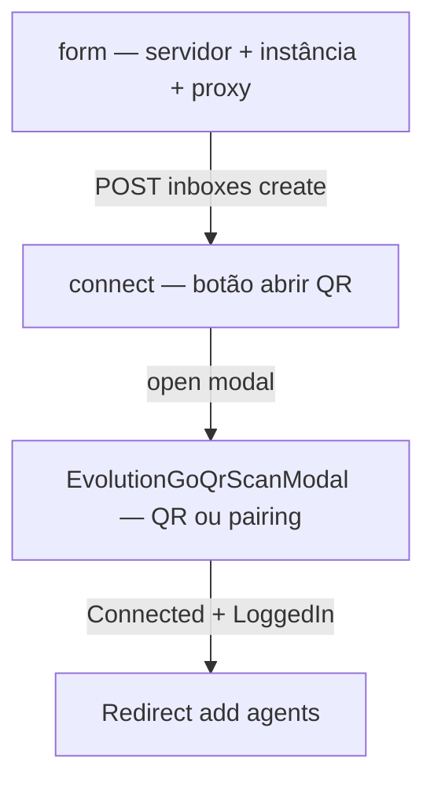
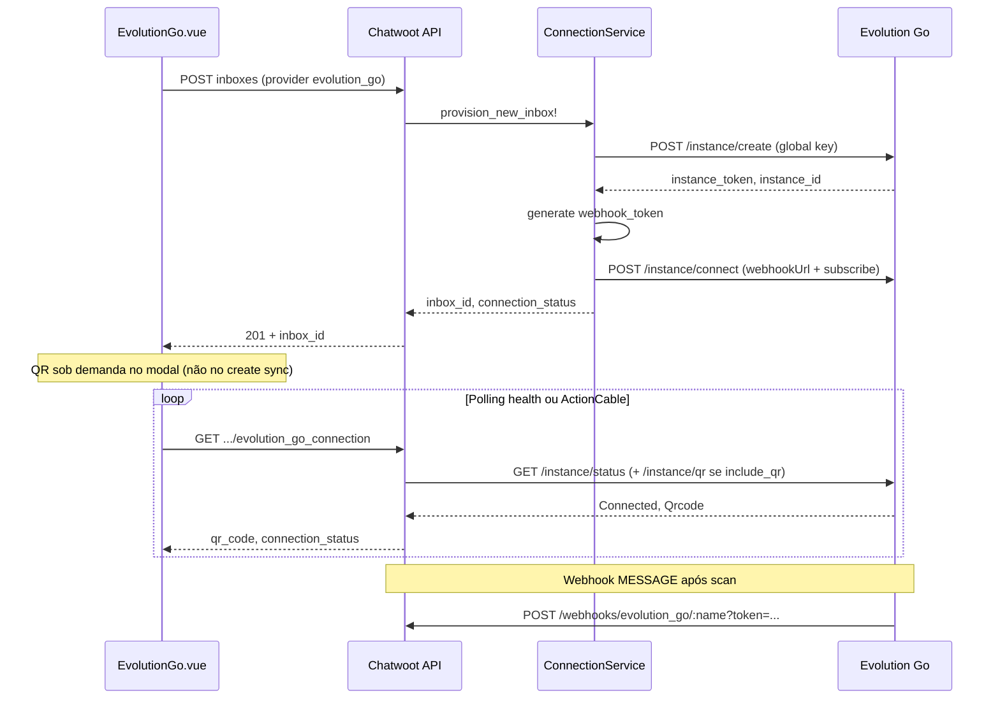

# Especificação UI — Wizard e settings Evolution Go

Planejamento frontend **implementado** (jul/2026). Componentes reais abaixo; este doc descreve contrato UX — ver código em `custom/app/javascript/`.

**Relacionados:** [inbox-business-rules.md](./inbox-business-rules.md) · [implementation-plan.md](./implementation-plan.md) · [../gaps-and-blockers.md](../gaps-and-blockers.md)

---

## Entry point

| Local | Mudança fork |
|-------|--------------|
| `app/javascript/dashboard/routes/dashboard/settings/inbox/channels/Whatsapp.vue` | `// FORK:` import `EvolutionGo.vue` |
| Card | **"Evolution Go"** — subtítulo "High-performance WhatsApp (Go / whatsmeow)" |
| Ícone | `i-woot-evolution-color` ou asset `evolution-go-logo.png` |
| Provider persistido | `provider: 'evolution_go'` |

---

## Fluxo wizard (2 telas + modal QR)

O wizard combina **formulário único** (servidor + instância + proxy) e **tela de conexão** com QR/pairing no modal — não há 3 páginas separadas.



### Tela `form` — Servidor + instância

| Campo | Tipo | Validação |
|-------|------|-----------|
| Inbox name | text | obrigatório |
| `base_url` | url | HTTPS recomendado; sem trailing slash |
| `global_api_key` | password | obrigatório para modo criar |
| `instance_name` | text | regex `^[a-zA-Z0-9_-]+$` |
| `instance_token` | password | obrigatório se "instância existente" |
| Proxy (colapsável) | toggle + host/port/user/pass | opcional |

**Ação antes do create:** `POST .../inboxes/evolution_go_server_check` — valida `base_url` + SSRF guard (`UrlSafetyGuard`).

Modo **instância existente:** `global_api_key` opcional — obrigatório apenas para delete/list admin ([decisions.md §22](./decisions.md)).

**Backend (ao submeter):**

1. `POST /api/v1/accounts/:account_id/inboxes` com `channel.provider: 'evolution_go'`
2. `POST /instance/create` (se nova) → salvar `instance_token`, `instance_id`
3. Gerar `webhook_token` server-side
4. `POST /instance/connect` com `webhookUrl` + subscribe canônico (`WebhookSubscribeSync`)
5. **Sem** fetch síncrono de QR no create — QR só no modal

### Tela `connect` + modal — Pairing

| Método | UI |
|--------|-----|
| QR (default) | `EvolutionGoQrScanModal` — `GET evolution_go_connection?include_qr=true` |
| Pairing code | Campo phone + `POST evolution_go_pair` |

**Realtime:**

- ActionCable `evolution_go:connection:{inbox_id}` via `evolutionGoCableRegistry.js`
- Eventos: `qrcode`, `connection`
- Fallback polling: `GET evolution_go_connection` (status; QR só com `include_qr=true`)

**Sucesso:** `connection_status === 'open'` + `phone_number` → redirect `settings_inboxes_add_agents`.

---

## Composables implementados

| Arquivo | Responsabilidade |
|---------|------------------|
| `useEvolutionGoHealthConnection.js` | Status, reconnect, logout, `isReconnecting` |
| `useEvolutionGoQrSession.js` | QR modal, polling com `includeQr`, expiry timer |
| `useEvolutionGoImportStatus.js` | Banner import contatos/messages |
| `evolutionGoCableRegistry.js` | ActionCable por inbox |

Componentes: `EvolutionGo.vue` (wizard), `EvolutionGoSettingsPage.vue`, `EvolutionGoHealthPage.vue`, `EvolutionGoQrScanModal.vue`.

**QR sob demanda:** health poll **não** busca QR a cada 5s — apenas o modal (`include_qr=true`) dispara `GET /instance/qr`.

---

## Fluxo backend (sequence)



---

## API dashboard (contrato)

Endpoints internos Chatwoot — evitar CORS e vazar keys. Decisão: [decisions.md §21](./decisions.md). Cliente JS: `app/javascript/dashboard/api/inboxes.js`.

| Método | Path | Ação |
|--------|------|------|
| `POST` | `/api/v1/accounts/:account_id/inboxes` | Create inbox + channel `evolution_go` + provision |
| `POST` | `/api/v1/accounts/:account_id/inboxes/evolution_go_server_check` | Valida servidor (collection; wizard step 1) |
| `GET` | `/api/v1/accounts/:account_id/inboxes/:id/evolution_go_connection` | Status; `?include_qr=true` busca QR |
| `POST` | `/api/v1/accounts/:account_id/inboxes/:id/evolution_go_reconnect` | Disconnect + connect + webhook |
| `POST` | `/api/v1/accounts/:account_id/inboxes/:id/evolution_go_pair` | Pairing code |
| `POST` | `/api/v1/accounts/:account_id/inboxes/:id/evolution_go_logout` | Logout sessão |
| `GET` | `/api/v1/accounts/:account_id/inboxes/:id/evolution_go_diagnostics` | Diagnóstico operacional |
| `POST` | `/api/v1/accounts/:account_id/inboxes/:id/evolution_go_sync_webhook` | Re-sync subscribe |
| `POST` | `/api/v1/accounts/:account_id/inboxes/:id/evolution_go_test_webhook` | Ping pipeline webhook |
| `POST` | `/api/v1/accounts/:account_id/inboxes/:id/evolution_go_import` | Força import |
| `POST` | `/api/v1/accounts/:account_id/inboxes/:id/evolution_go_refresh_contacts` | Refresh perfis/fotos contatos |

### `POST /api/v1/accounts/:account_id/inboxes` (create)

**Request** (via `createEvolutionGoChannel` → `InboxesAPI.create`):

```json
{
  "name": "inbox-vendas",
  "channel": {
    "type": "whatsapp",
    "provider": "evolution_go",
    "base_url": "https://evo.example.com",
    "global_api_key": "GLOBAL_KEY",
    "instance_name": "minha-instancia",
    "instance_token": null,
    "provider_config": {
      "proxy_enabled": false,
      "proxy_host": "",
      "proxy_port": "",
      "proxy_username": "",
      "proxy_password": ""
    }
  }
}
```

| Campo | Obrigatório | Notas |
|-------|-------------|-------|
| `channel.provider` | sim | `evolution_go` |
| `instance_token` | se instância existente | Token da instância já criada no Go |
| `global_api_key` | se criar nova | Nunca retornado em GET |

**Response 201:** objeto inbox padrão Chatwoot (`id`, `channel_id`, …). Provision roda async após create; abrir modal QR na tela `connect`.

### `GET .../evolution_go_connection`

Query: `include_qr=true` (boolean) — busca QR sob demanda no modal.

**Response 200:**

```json
{
  "connection_status": "connecting",
  "last_qr_base64": "data:image/png;base64,...",
  "last_qr_code": null,
  "phone_number": null,
  "webhook_subscribe": ["MESSAGE", "SEND_MESSAGE", "..."]
}
```

Polling no modal: até `connection_status === "open"` e `phone_number` presente.

### `POST .../evolution_go_reconnect`

**Response 200:** mesmo shape de `evolution_go_connection` — dispara disconnect + connect com `webhookUrl` e subscribe persistidos.

---

## `useInbox.js` / gates

```javascript
// FORK: adicionar
const isEvolutionGoWhatsAppChannel = computed(
  () => inbox.value?.channel_type === 'Channel::Whatsapp'
    && inbox.value?.provider === 'evolution_go'
);
```

**Ocultar quando `isEvolutionGoWhatsAppChannel`:**

- Template picker Meta
- Campanhas WhatsApp
- Embedded signup
- CSAT cloud template
- `whatsapp_health_management`
- Botão ligar (voz Meta)
- Voice PTT cloud

**Mostrar:**

- Badge connection status
- Botão reconnect (Fase 2)

---

## Settings inbox (implementado)

Componentes: `EvolutionGoSettingsPage.vue` (comportamento), `EvolutionGoHealthPage.vue` (conexão + diagnóstico).

| Seção | Campos |
|-------|--------|
| Connection | status, reconnect, logout, sync webhook, test webhook, diagnostics |
| WhatsApp | `ignore_groups`, `reject_call`, `read_messages`, `always_online`, `ignore_status` |
| Proxy | edit (create-only banner para instância existente) |
| Import | `import_contacts`, `import_messages`, `import_on_connect`, refresh contacts |
| Inbound/outbound sync | `mark_inbound_deleted/edited`, `sync_delete/edit_to_whatsapp` (opt-in) |
| Conversation | `lock_to_single_conversation` (inbox), `merge_brazil_contacts` |

Salvar → PATCH channel + `ConnectionService#sync_settings!` → `PUT advanced-settings` Go. Mudanças em `ignore_groups` / `ignore_from_me_echo` disparam re-sync webhook.

---

## i18n (somente en — pt_BR community)

Arquivos: `app/javascript/dashboard/i18n/locale/en/inboxMgmt.json` e `pt_BR/inboxMgmt.json` — namespace `INBOX_MGMT.ADD.EVOLUTION_GO.*` e `INBOX_MGMT.SETTINGS.EVOLUTION_GO.*`.

Chaves mínimas:

- `ADD.EVOLUTION_GO.TITLE`, `BASE_URL`, `INSTANCE_NAME`, `CONNECT.OPEN_QR`
- `SETTINGS.EVOLUTION_GO.CONNECTION_STATUS`, `RECONNECT`, `REFRESH_CONTACTS`
- `ADD.EVOLUTION_GO.SERVER_CHECK.ERROR`, `API.ERROR_MESSAGE`

---

## Critérios de aceite UI

- [x] Card visível em `Whatsapp.vue` sem quebrar Cloud/Twilio/360dialog
- [x] Wizard form + connect + modal QR com defaults [business-rules-adaptation.md](./business-rules-adaptation.md)
- [x] QR sob demanda no modal (`include_qr=true`)
- [x] Keys nunca retornam em GET channel JSON (masked)
- [x] `isGatewayWhatsAppProvider` / `isEvolutionGoWhatsAppChannel` ocultam features cloud-only

---

## Composable compartilhado (não implementado)

O plano original previa `useGatewayWhatsappWizard.js` compartilhado com Evolution Node.

**Realidade (jul/2026):** composables **dedicados** sob `custom/app/javascript/dashboard/composables/evolution_go/` + `lib/evolution_go/evolutionGoCableRegistry.js`. Gates comuns em `lib/whatsapp/gatewayProviders.js`.

Extrair um wizard genérico permanece opcional — ver [coordination-with-evolution-api.md](./coordination-with-evolution-api.md#frontend--o-que-existe-vs-o-que-foi-planejado).
