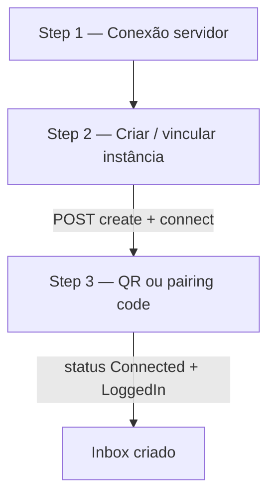
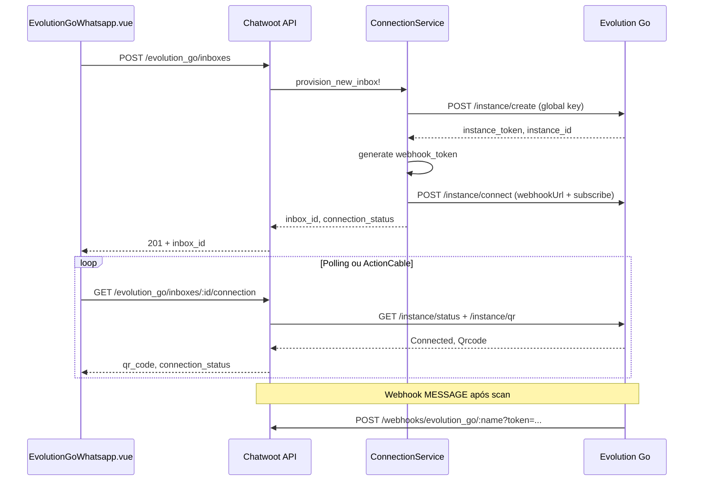

# Especificação UI — Wizard e settings Evolution Go

Planejamento frontend **implementado** (jul/2026). Componentes reais abaixo; este doc descreve contrato UX — ver código em `custom/app/javascript/`.

**Relacionados:** [inbox-business-rules.md](./inbox-business-rules.md) · [implementation-plan.md](./implementation-plan.md) · [../gaps-and-blockers.md](../gaps-and-blockers.md)

---

## Entry point

| Local | Mudança fork |
|-------|--------------|
| `app/javascript/dashboard/routes/dashboard/settings/inbox/channels/Whatsapp.vue` | `// FORK:` import `EvolutionGoWhatsapp.vue` |
| Card | **"Evolution Go"** — subtítulo "High-performance WhatsApp (Go / whatsmeow)" |
| Ícone | `i-woot-evolution-color` ou asset `evolution-go-logo.png` |
| Provider persistido | `provider: 'evolution_go'` |

---

## Fluxo wizard (3 steps)



### Step 1 — Servidor

| Campo | Tipo | Validação |
|-------|------|-----------|
| Inbox name | text | obrigatório |
| `base_url` | url | HTTPS recomendado; sem trailing slash |
| `global_api_key` | password | obrigatório para modo criar |

**Ação:** `GET {base_url}/server/ok` — **recomendado** no Step 1; falha rápida se servidor inacessível.

### Step 2 — Instância

| Modo | Campos |
|------|--------|
| **Criar nova** | `instance_name` (regex: `^[a-zA-Z0-9_-]+$`) |
| **Existente** | `instance_name` + `instance_token` (colar do painel Go) |

Modo **instância existente:** `global_api_key` opcional no Step 1 — obrigatório apenas para delete/list admin ([decisions.md §22](./decisions.md)).

**Seção colapsável — Proxy:**

| Campo | Condicional |
|-------|-------------|
| `proxy_enabled` | toggle |
| `proxy_host`, `proxy_port`, `proxy_username`, `proxy_password` | se enabled |

**Backend (ao avançar):**

1. `POST /instance/create` (se criar) → salvar `instance_token`, `instance_id`
2. Gerar `webhook_token` server-side
3. `POST /instance/connect` com `webhookUrl` + `subscribe`

### Step 3 — Pairing

| Método | UI |
|--------|-----|
| QR (default) | `` de `GET /instance/qr` → `data.Qrcode` |
| Pairing code | Campo phone + `POST /instance/pair` → exibir `data.PairingCode` |

**Realtime:**

- ActionCable `evolution_go:connection:{inbox_id}`
- Eventos: `qrcode`, `connection`
- Fallback polling: `GET /instance/status` a cada 3s

**Sucesso:** `data.Connected && data.LoggedIn` → extrair JID → `phone_number` → redirect inbox settings.

---

## Composables implementados

| Arquivo | Responsabilidade |
|---------|------------------|
| `useEvolutionGoHealthConnection.js` | Status, reconnect, logout, `isReconnecting` |
| `useEvolutionGoQrSession.js` | QR modal, polling com `includeQr`, expiry timer |
| `useEvolutionGoImportStatus.js` | Banner import contatos/messages |
| `evolutionGoCableRegistry.js` | ActionCable por inbox |

Componentes: `EvolutionGo.vue` (wizard), `EvolutionGoSettingsPage.vue`, `EvolutionGoHealthPage.vue`, `EvolutionGoQrScanModal.vue`.

**QR sob demanda:** health poll **não** busca QR a cada 5s — apenas o modal (`include_qr=true`) dispara `GET /instance/qr`.

---

## Fluxo backend (sequence)



---

## API dashboard (contrato)

Endpoints internos Chatwoot para o wizard — evitar CORS e vazar keys. Decisão fechada: [decisions.md §21](./decisions.md).

| Rota fork | Ação |
|-----------|------|
| `POST /api/v1/accounts/:id/evolution_go/inboxes` | create + connect + channel |
| `GET .../evolution_go/inboxes/:id/connection` | qr, status, pairing |
| `POST .../evolution_go/inboxes/:id/reconnect` | disconnect + connect |

### `POST .../evolution_go/inboxes`

**Request:**

```json
{
  "name": "inbox-vendas",
  "base_url": "https://evo.example.com",
  "global_api_key": "GLOBAL_KEY",
  "instance_name": "minha-instancia",
  "instance_token": null,
  "proxy": { "host": "", "port": 0, "username": "", "password": "" },
  "mode": "create"
}
```

| Campo | Obrigatório | Notas |
|-------|-------------|-------|
| `mode` | sim | `create` \| `existing` |
| `instance_token` | se `existing` | Token da instância já criada no Go |
| `global_api_key` | se `create` | Nunca retornado em GET |

**Response 201:**

```json
{
  "inbox_id": 42,
  "channel_id": 99,
  "instance_name": "minha-instancia",
  "connection_status": "connecting",
  "webhook_url": "https://cw.example.com/webhooks/evolution_go/minha-instancia?token=***"
}
```

### `GET .../evolution_go/inboxes/:id/connection`

**Response 200:**

```json
{
  "connection_status": "connecting",
  "qr_code": "data:image/png;base64,...",
  "pairing_code": null,
  "phone_number": null
}
```

Polling frontend: a cada 3s até `connection_status === "open"` e `phone_number` presente.

### `POST .../evolution_go/inboxes/:id/reconnect`

**Response 200:** mesmo shape de `connection` — dispara disconnect + connect com `webhookUrl` e `subscribe` persistidos.

---

## `useInbox.js` / gates

```javascript
// FORK: adicionar
const isEvolutionGoWhatsAppChannel = computed(
  () => inbox.value?.channel_type === 'Channel::Whatsapp'
    && inbox.value?.provider === 'evolution_go'
);
```

**Ocultar quando `isEvolutionGoWhatsAppChannel`:**

- Template picker Meta
- Campanhas WhatsApp
- Embedded signup
- CSAT cloud template
- `whatsapp_health_management`
- Botão ligar (voz Meta)
- Voice PTT cloud

**Mostrar:**

- Badge connection status
- Botão reconnect (Fase 2)

---

## Settings inbox (Fase 2)

Componente: `EvolutionGoSettings.vue` (custom)

| Seção | Campos |
|-------|--------|
| Connection | status, logout, delete instance |
| WhatsApp | ignore_groups, reject_call, read_messages |
| Proxy | edit / remove |
| Conversation | `lock_to_single_conversation`, merge_brazil_contacts |
| Outbound | sign_msg, send_templates_as_text |

Salvar → PATCH channel + `ConnectionService#sync_settings` → advanced-settings Go.

---

## i18n (somente en)

Arquivo: `custom/app/javascript/dashboard/i18n/locale/en/evolutionGo.json`

Chaves mínimas:

- `WIZARD.TITLE`, `WIZARD.STEP_SERVER`, `WIZARD.STEP_INSTANCE`, `WIZARD.STEP_QR`
- `SETTINGS.CONNECTION_STATUS`, `SETTINGS.RECONNECT`
- `ERRORS.LICENSE_REQUIRED`, `ERRORS.INVALID_PROXY`

---

## Critérios de aceite UI (planejamento)

- [ ] Card visível em `Whatsapp.vue` sem quebrar Cloud/Twilio/360dialog
- [ ] Wizard 3 steps com defaults [business-rules-adaptation.md](./business-rules-adaptation.md)
- [ ] QR exibido em < 5s após connect
- [ ] Keys nunca retornam em GET channel JSON
- [ ] `isEvolutionGoWhatsAppChannel` oculta features cloud-only

---

## Composable compartilhado

Ver [coordination-with-evolution-api.md § Composable](./coordination-with-evolution-api.md#o-que-reusar-no-frontend-composable).

Arquivo alvo: `custom/app/javascript/dashboard/composables/useGatewayWhatsappWizard.js`

| Export | Responsabilidade |
|--------|------------------|
| `pollConnectionStatus` | polling QR/status 3s |
| `subscribeConnectionChannel` | ActionCable por provider |
| `validateBaseUrl` | URL sem trailing slash |
