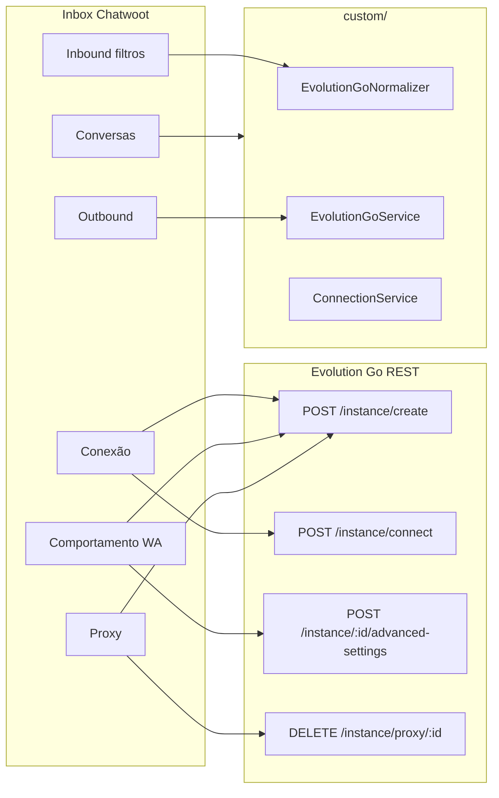

# Regras de negócio — Caixa de entrada Evolution Go

Regras do inbox `provider: 'evolution_go'` mapeadas para campos `provider_config`, APIs Go e UI do fork.

**Defaults adaptados:** [business-rules-adaptation.md](./business-rules-adaptation.md) · **Campos ↔ API:** [provider-config-mapping.md](./provider-config-mapping.md)

**Irmão (referência UI):** [../evolution-api/inbox-business-rules.md](../evolution-api/inbox-business-rules.md) — mesma UX alvo, APIs diferentes.

---

## Escopo por fase

| Fase 1 (wizard + runtime) | Default fork | Fase 2+ (settings) |
|---------------------------|--------------|-------------------|
| `base_url`, `global_api_key`, `instance_name` | — | — |
| `instance_token` (auto após create) | — | somente leitura |
| Proxy opcional no create | `proxy_enabled: false` | delete proxy API |
| QR + pairing + ActionCable | — | — |
| `ignore_groups: true` | no create | advanced-settings UI |
| `reopen_conversation: true` | inbound | toggle UI |
| Webhook no connect | `subscribe` restrito | editar subscribe |
| Filtros hardcoded | `@g.us`, `fromMe`, broadcast | `ignore_jids` UI |

---

## Onde cada regra vive (Evolution Go)

| Camada Go | Regras |
|-----------|--------|
| **Create** | `name`, `token`, `proxy`, flags `ignoreGroups`, `rejectCall`, `readMessages` |
| **Connect** | `webhookUrl`, `subscribe[]`, `phone` (pairing) |
| **Advanced-settings** | `alwaysOnline`, `rejectCall`, `ignoreGroups`, etc. |
| **Fork envio** | `sign_msg`, markdown, template→texto |
| **Fork inbound** | `ignore_jids`, echo, broadcast |
| **Fork conversas** | `reopen_conversation`, merge BR |

> **Sem** `POST /settings/set` nem `POST /webhook/set` — diferente da Evolution API Node.

---

## 1. Conexão (wizard — obrigatório)

| Campo | Tipo | Fase | UI | API Go |
|-------|------|------|-----|--------|
| `base_url` | string | 1 | URL servidor | Todas |
| `global_api_key` | string | 1 | Admin API key | `POST /instance/create`, `GET /instance/all` |
| `instance_name` | string | 1 | Nome instância | body `name` no create |
| `instance_token` | string | 1 | Oculto / readonly | `data.token` do create |
| `instance_id` | string | 1 | Debug readonly | `data.id` do create |
| `webhook_secret` | string | 1 | Auto-gerado | query `?token=` na webhook URL |
| `connection_status` | enum | 1 | Badge | `GET /instance/status` |
| `phone_number` | channel | 1 | Após connect | `data` status / jid |

### Modos de setup

| Modo | Fluxo |
|------|-------|
| **A — Criar nova** | Wizard → create (global key) → connect (instance token) → QR |
| **B — Instância existente** | Operador cola `instance_token` + `instance_name` → connect only |

### Segurança

| Campo | GET API dashboard |
|-------|-------------------|
| `global_api_key` | masked |
| `instance_token` | masked |
| `webhook_secret` | nunca expor |
| `proxy_password` | masked |

Ver [decisions.md §14](./decisions.md).

---

## 2. Comportamento WhatsApp

Flags no **create** (`data` da instância) e **advanced-settings** (Fase 2).

> ⚠️ `advanced-settings`: path REST a confirmar no spike — [api-reference.md](./api-reference.md).

| Campo fork | Campo Go | Default | Fase | Label UI (en) |
|------------|----------|---------|------|---------------|
| `ignore_groups` | `ignoreGroups` | **`true`** | 1 | Ignore groups |
| `reject_call` | `rejectCall` | `false` | 2 | Reject calls |
| `msg_call` | `msgRejectCall` | `""` | 2 | Message when rejecting call |
| `always_online` | `alwaysOnline` | `false` | 2 | Always online |
| `read_messages` | `readMessages` | `false` | 2 | Mark incoming as read on WA |
| `ignore_status` | `ignoreStatus` | **`true`** | 2 | Ignore status broadcasts |

**Fase 1:** `ignore_groups: true` no create — sem UI toggle.

Doc create: [create-a-new-instance](https://docs.evolutionfoundation.com.br/evolution-go/create-a-new-instance)

---

## 3. Proxy

| Campo fork | Campo Go `proxy` | Fase |
|------------|------------------|------|
| `proxy_host` | `address` | 1 (wizard) |
| `proxy_port` | `port` | 1 |
| `proxy_username` | `username` | 1 |
| `proxy_password` | `password` | 1 |

- Configurar no `POST /instance/create` body `proxy`
- Remover: `DELETE /instance/proxy/{instanceId}` — [delete-proxy](https://docs.evolutionfoundation.com.br/evolution-go/delete-proxy)
- **Sem** `POST /proxy/set` como Evolution API Node

---

## 4. Conversas (Chatwoot fork)

| Campo | Default | Fase | Comportamento |
|-------|---------|------|---------------|
| `reopen_conversation` | **`true`** | 1 | Resolved + inbound → reabre |
| `conversation_pending` | `false` | 2 | Status inicial pending |
| `merge_brazil_contacts` | `true` | 2 | Normaliza 9º dígito BR |

Implementar em listener inbound — **não** existe DTO Chatwoot na Evolution Go.

---

## 5. Outbound — agente

| Campo | Default | Fase | Notas |
|-------|---------|------|-------|
| `send_templates_as_text` | `true` | 1 | Template → `POST /send/text` |
| `sign_msg` | `false` | 2 | Prefixo agente |
| `sign_delimiter` | `\n` | 2 | — |
| `convert_markdown_outbound` | `true` | 2 | CW → WA formatting |
| `mark_read_on_reply` | `false` | 2 | → `POST /message/markread` |
| `send_random_delay` | via `delay` no send | 2 | Campo `delay` em SendText |

**Quote reply:** `{ quoted: { messageId, participant } }` — schema Go, não Baileys.

---

## 6. Inbound — filtros

| Campo | Default | Fase | Implementação |
|-------|---------|------|---------------|
| `ignore_from_me_echo` | `true` | 1 | Hardcoded normalizer |
| `ignore_jids` | `["@g.us"]` | 1/2 | Normalizer |
| `ignore_status_broadcast` | `true` | 1 | `status@broadcast` |

### `source_id` inbound

`data.key.id` no webhook `MESSAGE` — formato Baileys-like no envelope, distinto do outbound `data.Info.ID`.

---

## 7. Webhook (automático)

| Regra | Valor |
|-------|-------|
| URL | `{FRONTEND_URL}/webhooks/evolution_go/{instance_name}?token={webhook_secret}` |
| Registro | `POST /instance/connect` body `webhookUrl` |
| Subscribe MVP | `["MESSAGE", "CONNECTION", "QRCODE"]` |
| ActionCable | `evolution_go:connection:{inbox_id}` |
| Integração CW nativa | **Não existe** — nada a desabilitar |

---

## 8. Settings inbox — abas (Fase 2+)

| Aba | Conteúdo |
|-----|----------|
| **Connection** | Status badge, reconnect, logout, QR |
| **WhatsApp** | ignore_groups, reject_call, read_messages |
| **Proxy** | Editar proxy / delete |
| **Advanced** | ignore_jids, sign_msg, reopen_conversation |

Ocultar: templates Meta, campanhas, embedded signup, health cloud, voz Meta.

---

## Checklist UI — paridade mínima Evolution Manager Go

| Tela Manager Go | Equivalente Chatwoot | Fase |
|-----------------|---------------------|------|
| Create instance | Wizard step 1 | 1 |
| Connect + webhook events | Wizard step 2 (automático) | 1 |
| QR / pairing code | Wizard step 3 | 1 |
| Instance list | Não portar (admin no painel Go) | — |
| Advanced settings | Inbox settings | 2 |

Ver [frontend-wizard-spec.md](./frontend-wizard-spec.md).
