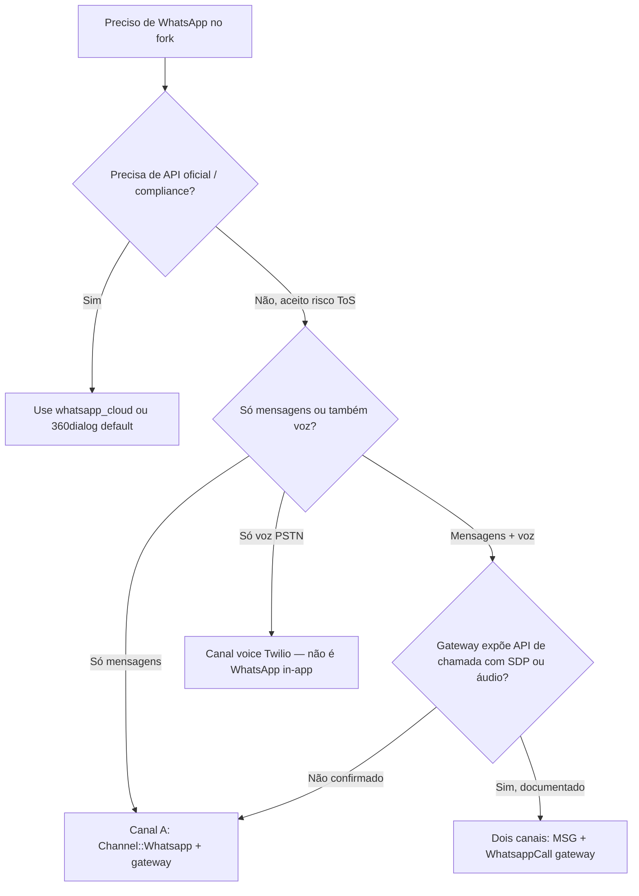

# Árvore de decisão para implementadores

Guia prático: por onde começar, quais abstrações reusar e quando **não** implementar.

---

## 1. Qual problema você está resolvendo?

---

## 2. Escolha do gateway

| Se… | Então… |
|-----|--------|
| Já usa NotificaMe contratualmente | Siga [plano NotificaMe](../notificame-whatsapp-integration/plano-geral.md) |
| Quer self-host e controle | Piloto **Evolution API** (modo Baileys) |
| Quer SaaS sem ops | **Z-API** ou NotificaMe |
| Gateway proprietário interno | Padrão genérico Baileys — [provider-comparison.md](./provider-comparison.md) §4 |

**Regra:** congelar **um** piloto e JSON real de webhook antes de codar.

---

## 3. Arquitetura de canal

| Decisão | Recomendação | Evitar |
|---------|--------------|--------|
| Modelo mensagens | Estender `Channel::Whatsapp` + novo `provider` string | Novo `Channel::Evolution` STI |
| Modelo voz | `Channel::WhatsappCall` separado (fork) | Misturar voz Baileys no mesmo inbox mensagens |
| Mesmo número msg + voz | Dois inboxes independentes (decisão A) | Um inbox, dois providers |
| Código novo | `custom/` overlay | Editar `WhatsappCloudService` |
| Dispatch provider | Registry + `prepend_mod_with` | `case` gigante no OSS |
| Webhook | Normalizer → payload flat → `IncomingMessageService` | Copiar `IncomingMessageBaseService` |

Plano concreto: [implementation-plan-second-whatsapp-provider.md](./implementation-plan-second-whatsapp-provider.md).

---

## 4. O que reusar do código existente (ordem de prioridade)

### Tier 1 — Reuso direto (sem editar upstream)

1. `Whatsapp::Providers::BaseService` — contrato de envio
2. `Whatsapp::IncomingMessageBaseService` — após normalização
3. `Whatsapp::IncomingMessageService` — payload flat
4. `Whatsapp::SendOnWhatsappService` + `SendReplyJob`
5. `Whatsapp360DialogService` — **referência** de segundo provider (não herdar se APIs diferem)

### Tier 2 — Extension points (fork)

1. `Channel::Whatsapp.prepend` — registry `provider_service`
2. `Webhooks::WhatsappEventsJob.prepend` — normalize antes do dispatch
3. `Conversations::MessageWindowService.prepend` — bypass 24h (opcional)
4. `Webhooks::WhatsappController.prepend` — auth webhook gateway

### Edição mínima inevitável

1. `Channel::Whatsapp::PROVIDERS` — adicionar provider keys com `# FORK:`; a validação usa a constante congelada e não é substituída por prepend.

### Tier 3 — Novo em `custom/`

1. `Custom::Whatsapp::Providers::*Service`
2. `Custom::Whatsapp::Webhooks::*Normalizer`
3. `Custom::Whatsapp::ConnectionService` (QR, status)
4. Vue wizard + `messagingProviderCapabilities.js`

### Não tocar

- `Whatsapp::IncomingMessageWhatsappCloudService`
- `Whatsapp::Providers::WhatsappCloudService` (corpo)
- `Enterprise::Webhooks::WhatsappEventsJob` (calls Meta)

---

## 5. Janela 24h e templates — decidir cedo

| Opção | Prós | Contras |
|-------|------|---------|
| **A — Manter regra Chatwoot** | Paridade UX com cloud; menos código | Perde principal benefício do gateway |
| **B — Bypass para gateway** | Texto livre anytime | UX diferente; risco spam/ban |
| **C — Config por inbox** | Flexível | Mais UI e testes |

**Recomendação fork:** **B** ou **C** para providers não oficiais — senão o investimento no gateway tem pouco retorno.

Implementação: capability `unlimited_session: true` no provider + prepend `MessageWindowService`.

---

## 6. Webhook — qual rota?

| Opção | Quando usar |
|-------|-------------|
| **Reutilizar** `/webhooks/whatsapp/:phone_number` | Gateway aceita URL com phone; normalizer identifica provider |
| **Rota dedicada** `/webhooks/gateway/:instance_id` | Z-API (4 URLs), Evolution por instância, auth diferente |

Z-API: considerar controller único que demux por `type` (`MessageStatusCallback`, etc.).

---

## 7. Fases — quando parar

| Fase | Go | No-go |
|------|----|-------|
| 0 — Contratos | Sempre | — |
| 1 — Texto MVP | Webhook + send estáveis | Gateway muda payload sem aviso |
| 2 — Mídia | Piloto envia/recebe mídia documentado | Só base64 sem doc |
| 3 — Ops | QR reconnect funciona | Sessão cai >3x/dia sem runbook |
| 4 — Voz | **Contrato escrito** com SDP/events | "Acho que Evolution tem call" |

---

## 8. Checklist de merge-safety

- [ ] Código em `custom/` ou prepend, não corpo cloud
- [ ] `PROVIDERS` atualizado com `# FORK:` mínimo
- [ ] Toda divergência OSS marcada `# FORK:` ou `// FORK:`
- [ ] `bin/fork-inventory` após merge upstream
- [ ] Commits em `main`, nunca `develop`
- [ ] Provider key não colide com `whatsapp_cloud` / `default`

---

## 9. Referência rápida de arquivos

| Área | Arquivo |
|------|---------|
| Model | `app/models/channel/whatsapp.rb` |
| Provider base | `app/services/whatsapp/providers/base_service.rb` |
| Cloud / 360 | `whatsapp_cloud_service.rb`, `whatsapp_360_dialog_service.rb` |
| Incoming | `incoming_message_base_service.rb`, `incoming_message_service.rb` |
| Webhook job | `app/jobs/webhooks/whatsapp_events_job.rb` |
| Controller | `app/controllers/webhooks/whatsapp_controller.rb` |
| Envio | `app/services/whatsapp/send_on_whatsapp_service.rb` |
| Janela 24h | `app/services/conversations/message_window_service.rb` |
| Frontend setup | `app/javascript/.../channels/Whatsapp.vue` |
| Voz EE | `enterprise/.../whatsapp_cloud_service.rb`, `whatsapp_events_job.rb` |
| Lacunas | [gaps-and-blockers.md](./gaps-and-blockers.md) |
