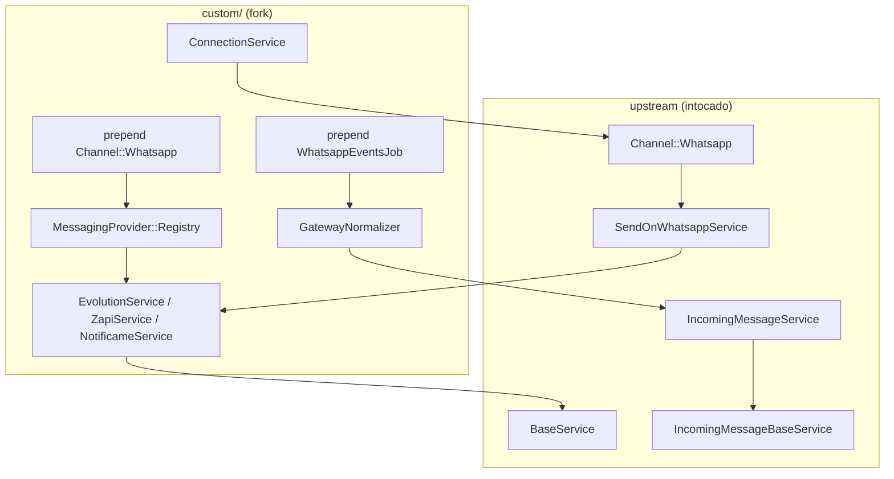
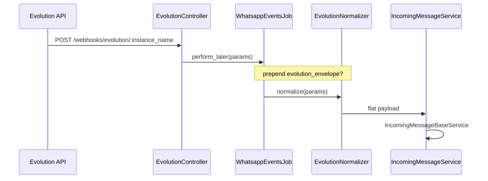

# Plano de implementação — segundo provider WhatsApp

Plano concreto para adicionar um gateway não oficial no fork, reutilizando o máximo do código existente. Atualizado jun/2026 após reanálise do codebase.

**Pré-requisitos:** [implementation-decision-tree.md](./implementation-decision-tree.md) · [gaps-and-blockers.md](./gaps-and-blockers.md) · [feature-mapping.md](./feature-mapping.md)

---

## Recomendação: estender `Channel::Whatsapp`

Segue o padrão **360dialog** (`default`) — segundo provider no mesmo STI — e o plano **NotificaMe**. Não criar `Channel::Evolution`.

360dialog é BSP **oficial** Meta, mas serve de **template mecânico**: REST send + webhook flat + `IncomingMessageService`.

---

## Arquitetura alvo (mensagens)



---

## Fase 0 — Infraestrutura

> **Estado jun/2026:** Fase 0 **implementada para `evolution`** (registry, prepends, rota webhook). Reutilizar ao adicionar `evolution_go` — ver [evolution-go/coordination-with-evolution-api.md](./evolution-go/coordination-with-evolution-api.md).

| Entrega | Local | `evolution` | `evolution_go` |
|---------|-------|-------------|----------------|
| `# FORK:` em `PROVIDERS` | `app/models/channel/whatsapp.rb` | ✅ | ❌ |
| `MessagingProvider::Registry` | `custom/lib/messaging_provider/registry.rb` | ✅ | ❌ |
| Prepend `Channel::Whatsapp` | `custom/app/models/custom/channel/whatsapp.rb` | ✅ | estender |
| Prepend `WhatsappEventsJob` | `custom/app/jobs/custom/webhooks/whatsapp_events_job.rb` | ✅ | branch novo |
| Prepend `MessageWindowService` | `custom/.../message_window_service.rb` | ✅ | estender |

```ruby
# custom/app/models/custom/channel/whatsapp.rb — implementado
def provider_service
  service = MessagingProvider::Registry.resolve(provider, whatsapp_channel: self)
  return service if service
  super
end
```

**Bloqueio resolvido para `evolution`:** `PROVIDERS` inclui `evolution`. Para **`evolution_go`**, adicionar na mesma linha `# FORK:`:

```ruby
PROVIDERS = %w[default whatsapp_cloud evolution evolution_go].freeze
```

---

## Fase 1 — MVP texto (piloto: Evolution API, Evolution Go ou NotificaMe)

Providers gateway no fork (jun/2026):

| Provider | Doc | Estado código |
|----------|-----|---------------|
| `evolution` (Node) | [evolution-api/](./evolution-api/README.md) | Fase 0–3 em `custom/` |
| `evolution_go` (Go) | [evolution-go/](./evolution-go/README.md) | Somente documentação |
| NotificaMe | [notificame-whatsapp-integration/](../notificame-whatsapp-integration/plano-geral.md) | Planejado |

Fase 0 (registry + prepends) é **compartilhada** entre `evolution` e `evolution_go` — ver [evolution-go/coordination-with-evolution-api.md](./evolution-go/coordination-with-evolution-api.md).

### Backend (Evolution API Node — referência)

| Classe | Responsabilidade |
|--------|------------------|
| `Custom::Whatsapp::Providers::EvolutionService` | `send_message`, `validate_provider_config?`, `error_message`, `process_response` override |
| `Custom::Whatsapp::Webhooks::EvolutionNormalizer` | `MESSAGES_UPSERT` → `{ contacts:, messages: }` |
| `Custom::Whatsapp::Evolution::ConnectionService` | QR, `CONNECTION_UPDATE`, register webhook na instância |

### Webhook flow



**Auth webhook:** prepend controller — validar `apikey` header ou token na URL; não usar HMAC Meta.

### Frontend

- Card "Gateway / Evolution" em `Whatsapp.vue` (`// FORK:` import)
- Form: inbox name, `base_url`, `api_key`, `instance_name`
- Step 2: QR via polling `ConnectionService`

### Critério de done (`evolution`)

- [x] Inbox criado com `provider: 'evolution'`
- [ ] Inbound texto → conversa (E2E pendente)
- [x] Outbound texto → `source_id` persistido
- [x] Status mapeado (`MESSAGES_UPDATE`)

---

## Fase 2 — Mídia, reply, janela 24h

| Item | Ação |
|------|------|
| Mídia outbound | `send_attachment_message` — URL pública ou upload gateway |
| Mídia inbound | Override `download_attachment_file` ou URL direta no normalizer |
| Reply | Mapear `quoted` / `context` no send e inbound |
| Janela 24h | Prepend `MessageWindowService` — `nil` para providers com `unlimited_session?` |
| Templates | `sync_templates` noop ou lista local; `send_template` → texto livre |

---

## Fase 3 — Interativos e operação

- Botões/listas: reusar helpers `BaseService#create_button_payload`
- Health: endpoint status no settings (não `whatsapp_health_management` cloud)
- Alertas desconexão + fluxo QR
- `TemplatesSyncSchedulerJob` — noop ou sync gateway

---

## Componentes por provider

| Componente | Evolution (Node) | Evolution Go | Z-API | NotificaMe |
|------------|------------------|--------------|-------|------------|
| Service | `EvolutionService` | `EvolutionGoService` | `ZapiService` | `NotificameService` |
| Normalizer | `EvolutionNormalizer` | `EvolutionGoNormalizer` | `ZapiNormalizer` | conforme plano |
| Webhook route | `/webhooks/evolution/:name` | `/webhooks/evolution_go/:name` | 4 URLs ou demux | conforme API |
| Config | `api_key`, `instance_name` | `global_api_key`, `instance_token` | `instance_id`, token | credenciais NM |

Detalhes: [provider-comparison.md](./provider-comparison.md).

---

## O que NÃO fazer

| Anti-pattern | Motivo |
|--------------|--------|
| Editar `WhatsappCloudService` | Alto churn upstream |
| Forkar `IncomingMessageBaseService` | Duplica dedup, contatos, statuses |
| Usar `else` branch como 360dialog sem normalizer | Payload gateway é incompatível |
| Prometer voz no mesmo inbox | Baileys ≠ Calling API |
| Commit em `develop` | Disciplina do fork |

---

## Voz

Canal **separado**. Não prometer voz como parte do MVP de mensagens. Para decidir stack de voz, ver [whatsapp-voice/README.md](../whatsapp-voice/README.md) e [whatsapp-voice/second-provider-strategy.md](../whatsapp-voice/second-provider-strategy.md).

---

## Estratégia fork (prioridade)

| # | Onde |
|---|------|
| 1 | `# FORK:` mínimo — `PROVIDERS`, import Vue |
| 2 | `custom/app/services/...` — provider + normalizer + connection |
| 3 | Prepend — `Channel::Whatsapp.prepend`, `WhatsappEventsJob.prepend_mod_with`, opcional `MessageWindowService.prepend` |
| 4 | Evitar editar corpo de serviços cloud |

---

## Fases, esforço e critérios

| Fase | Escopo |
|------|--------|
| 0 | Registry + prepends (1 sem) |
| 1 | Texto MVP (2–3 sem) |
| 2 | Mídia + 24h bypass (2–4 sem) |
| 3 | Interativos + ops (2–3 sem) |
| 4 | Voz — projeto separado |

| Fase | Critério de done |
|------|------------------|
| 1 | Criar inbox gateway; receber texto; enviar texto; persistir `source_id`; mapear status básico |
| 2 | Enviar/receber imagem e documento; reply/quote se suportado; templates noop ou bypass documentado |
| 3 | Botões/listas outbound; alerta de desconexão; fluxo QR/reconnect; health no settings |
| 4 | Só iniciar com contrato de voz escrito do provider (SDP/events ou equivalente) |
