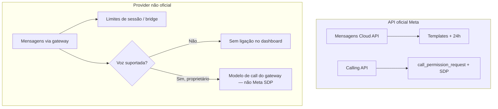

# API oficial Meta vs provider não oficial — restrições reais

Este documento responde à afirmação: **"Como não usaremos o canal WhatsApp oficial, não teremos as restrições do WhatsApp."**

**Veredito antecipado:** abandonar a **WhatsApp Cloud API / WABA** remove muitas **restrições de produto impostas pela Meta na API**, mas **não** remove restrições da plataforma WhatsApp nem cria um ambiente "sem regras". Troca-se o enforcement **contratual e técnico da Meta** por **risco operacional, instabilidade e limites do gateway não oficial**.

Contexto no fork:

- Mensagens: provider alternativo (ex.: NotificaMe) sobre `Channel::Whatsapp`, não `whatsapp_cloud`.
- Voz: canal genérico de ligação WhatsApp descrito em [second-provider-strategy.md](../whatsapp-voice/second-provider-strategy.md) — **não** assume Meta Calling API nativa.

Documentos relacionados:

- [README desta pasta](./README.md)
- [WhatsApp Voice — visão geral](../whatsapp-voice/README.md)
- [Twilio vs WhatsApp Cloud Calling](../whatsapp-voice/twilio-vs-whatsapp-native.md)

---

## 1. Restrições que a API oficial impõe (e o fork evita com provider não oficial)

Estas regras são **impostas ou verificadas pela Meta** no caminho `whatsapp_cloud` + Graph API. Com gateway não oficial (sessão de cliente WhatsApp / bridge proprietário), a **API deixa de ser o gatekeeper** — o comportamento passa a depender do que o gateway emula ou ignora.

| Restrição oficial | O que a Meta exige | Impacto no Chatwoot oficial | Com provider não oficial |
|-------------------|-------------------|------------------------------|--------------------------|
| **Templates aprovados** | Fora da janela de 24h, mensagens **marketing** e **utility** precisam de template pré-aprovado na WABA | `message_templates`, sync, rejeição na API se template inválido/expirado | Gateway costuma permitir texto livre como app WhatsApp normal — **sem fila de aprovação Meta** |
| **Janela de 24 horas / sessão** | Após última mensagem do usuário, só templates (ou mensagens dentro de regras de sessão) até nova interação | Lógica de conversa + templates obrigatórios para reengajamento | Sessão "sempre aberta" do ponto de vista do cliente não oficial — **sem contador 24h na API** |
| **`call_permission_request` / opt-in outbound** | WhatsApp Business Calling exige permissão explícita do contato antes de ligação outbound; erro `138006` | `CallPermissionReplyService`, template interativo, throttle 5 min | **Não existe na API Meta** — se o gateway suportar voz, o modelo de permissão é **do gateway** (pode ser inexistente, informal ou outro protocolo) |
| **WABA, Embedded Signup, políticas de negócio** | Verificação business, display name, política de comércio, restrições por vertical | Embedded signup, reauth, bloqueio de conta na Meta | Setup manual (QR, API key, instância) — **sem Embedded Signup**, mas **sem selo de conformidade Meta** |
| **Rate limits, quality rating, tiers** | Limites de throughput por tier; quality rating afeta tier e entregabilidade | Erros Graph, degradação de número, alertas na Business Manager | Limites da **infra do gateway** + detecção heurística de spam pelo WhatsApp (não documentada como API) |
| **Inscrição Calling API por número** | `POST .../settings` com `calling: ENABLED`; webhook `field=calls`; número elegível na Meta | `enable_whatsapp_calling!`, `voice_calling_supported?` só em `whatsapp_cloud` | **Calling API Meta não se aplica** — voz só existe se o gateway expuser recurso equivalente |
| **Política de conteúdo e comércio** | Filtros na Cloud API (categorias proibidas, catálogo, pagamentos) | Rejeição na API, restrições de template | Enforcement **menos previsível** — pode passar na bridge e ainda assim gerar **ban** do lado cliente |

### O que isso significa na prática

- **Menos fricção de produto** para mensagens: reengajamento sem template, menos burocracia de WABA.
- **Menos gates explícitos** para outbound de voz no sentido Meta (`call_permission_request`).
- **Menos dependência** de Business Manager, app review de templates e enrollment de Calling API.

Isso **não** significa "pode fazer qualquer coisa sem consequência" — ver seções 2 e 3.

---

## 2. Restrições que NÃO desaparecem

Mesmo sem Cloud API, o número ainda é uma **conta WhatsApp** sujeita aos termos e à detecção anti-abuso da Meta.

| Restrição | Por que continua valendo |
|-----------|--------------------------|
| **Termos de uso do WhatsApp** | Clientes não oficiais (Baileys, bridges, automação de sessão pessoal/business) operam em **área cinza ou violação explícita** dos ToS. Risco legal/comercial é do operador, não da Meta como parceiro API. |
| **Risco de ban / bloqueio** | Número ou sessão pode ser **banida temporária ou permanentemente** sem appeal estruturado como na WABA. Sem quality rating visível — o bloqueio é súbito. |
| **Sem garantia de Calling API** | A stack oficial Chatwoot (`useWhatsappCallSession`, SDP, webhooks `field=calls`) assume **Meta Calling API**. Gateway não oficial **pode não ter voz** ou implementar modelo totalmente diferente (SIP, relay, áudio via gateway). |
| **Instabilidade e sessão** | Queda de sessão, necessidade de **re-scan QR**, logout remoto pelo celular, multi-device limits — operação frágil comparada a token OAuth de longa duração da Cloud API. |
| **Entregabilidade e reputação** | Sem tier oficial, mas spam em massa ainda gera **report de usuários** e bloqueios peer-to-peer. |
| **Compliance (LGPD, gravação, telecom)** | Gravação de chamadas, consentimento e retenção **não são resolvidos** pelo tipo de API — continuam obrigações do fork/operador. |

---

## 3. Novas restrições do provider não oficial

Trocar a Meta pela bridge troca um conjunto de regras por outro — em geral **menos documentado** e **menos escalável**.

| Nova restrição | Detalhe típico | Impacto no fork |
|----------------|----------------|-----------------|
| **Uma instância / sessão por número** | Baileys e derivados: **1 sessão ativa** por JID; segundo processo derruba o primeiro | HA, deploy rolling e múltiplos workers exigem **proxy de sessão** ou fila dedicada |
| **Sem Embedded Signup** | Onboarding manual: QR code, pairing code, API key, URL do gateway | UI de inbox diferente; runbook de ops; sem fluxo self-service Meta |
| **Webhook proprietário** | Payload, auth e retries **não** são `field=messages` / `field=calls` da Meta | Jobs e normalizadores próprios (ex. NotificaMe); **não reutilizar** `WhatsappEventsJob` sem adapter |
| **Sem suporte Meta, sem SLA** | Incidentes no WhatsApp ou no protocolo: **sem ticket Meta**, só comunidade/fornecedor do gateway | MTTR imprevisível; breaking changes no WhatsApp quebram bridge antes da documentação |
| **Limites de escala** | Um número ≈ uma sessão ≈ um throughput limitado; filas internas do gateway | Campanhas e picos de inbound podem **atrasar** ou perder mensagem se o gateway não tiver DLQ/idempotência |
| **Cobertura de features irregular** | Reações, listas, botões, typing, mídia criptografada — **depende do gateway** | Matriz de compatibilidade por provider; gaps vs `whatsapp_cloud` |
| **Segurança da sessão** | Credencial equivale ao **controle do WhatsApp**; vazamento = takeover total | Secrets management, rotação, isolamento de rede — mais crítico que API token com escopo |

---

## 4. Impacto no canal genérico de ligação WhatsApp

O plano em [second-provider-strategy.md](../whatsapp-voice/second-provider-strategy.md) assume um **segundo provider WebRTC-compatível** (SDP offer/answer, eventos de call). Um **provider não oficial de mensagens** (NotificaMe, Evolution, etc.) **não implica automaticamente** esse contrato de voz.

### Sem API oficial: o modelo de chamada é definido pelo gateway

| Dimensão | Caminho oficial (`whatsapp_cloud`) | Provider não oficial típico |
|----------|-----------------------------------|-----------------------------|
| **Sinalização** | Graph API `/calls`, SDP, `pre_accept` / `accept` | **Indefinido** — pode ser SIP, WebRTC via gateway, link de chamada, ou **indisponível** |
| **Mídia** | Browser agente ↔ Meta (P2P WebRTC) | Pode ser: agente ↔ gateway ↔ WhatsApp; ou **somente app móvel**; ou nada |
| **Inbound ring no dashboard** | Webhook `connect` + ActionCable `voice_call.incoming` | Só se o gateway emitir evento equivalente com SDP (ou áudio stream substituto) |
| **Outbound da conversa** | `POST /whatsapp_calls/initiate` + opt-in Meta | Depende de API de voz do gateway; **sem** `138006` / `call_permission_request` **não garante** que outbound seja permitido pelo WhatsApp |
| **Integração com `Call` / bolha `voice_call`** | `provider: whatsapp`, gravação client-side | Adapter deve mapear estados para o mesmo modelo **ou** ramo separado no composable |

### O que pode ganhar

- **Sem fluxo `call_permission_request`** da Meta — menos passos de UX se o gateway permitir discar direto.
- **Sem enrollment Calling API** nem toggle `enable_whatsapp_calling` na Meta.
- **Sem dependência de `channel_voice` + `whatsapp_cloud`** para elegibilidade Meta (ainda pode exigir feature flag própria).

### O que pode perder

| Perda | Motivo |
|-------|--------|
| **Ring inbound confiável** | Sem webhook Meta `field=calls`, o dashboard pode não saber que o contato está ligando |
| **WebRTC browser ↔ contato in-app** | Experiência nativa WhatsApp Calling **é produto Meta**; bridge raramente replica P2P idêntico |
| **Gravação alinhada ao pickup** | Fluxo atual arma `MediaRecorder` no `ACCEPTED` Meta — outro modelo exige outro trigger |
| **Conformidade e auditoria enterprise** | Sem SLA Meta; gravação client-side vs server-side; dúvida jurídica de gravação em bridge não oficial |
| **Paridade com documentação Chatwoot EE** | Guias e código em `enterprise/` assumem Meta Calling API |
| **Estabilidade de chamada** | Sessão de mensagens instável **piora** voz — chamada ativa pode cair com reconnect |

### Implicação para o design do canal genérico

1. **Desacoplar** "provider de mensagens não oficial" de "provider de voz" — podem ser produtos diferentes no mesmo número.
2. Tratar voz como **capability opcional** do adapter (`voice_calling_supported?` por gateway), não como extensão automática do canal de texto.
3. Se o gateway **não** expuser SDP/WebRTC, o canal genérico deve cair para **PSTN/Twilio-style** ou **sem voz** — não forçar `useWhatsappCallSession` ([twilio-vs-whatsapp-native.md](../whatsapp-voice/twilio-vs-whatsapp-native.md)).
4. Documentar **matriz gateway × voz** antes de implementar UI de botão "Ligar" na conversa.

---

## 5. Conclusão honesta para o fork

> **"Menos restrições de produto Meta" ≠ "sem restrições".**

Abandonar o canal oficial é uma troca deliberada:

- **Ganha-se** agilidade em mensagens, menos burocracia de templates/WABA/Calling enrollment, e potencialmente outbound de voz sem fluxo Meta de permissão.
- **Perde-se** previsibilidade contratual, suporte, SLA, embedded signup, quality rating visível, WebRTC nativo browser↔Meta, e a assumption de que "WhatsApp no Chatwoot" = Cloud API.

### Tabela de trade-off

| Critério | API oficial (`whatsapp_cloud`) | Provider não oficial |
|----------|-------------------------------|----------------------|
| **Previsibilidade regulatória** | Alta (contrato Business / Cloud API) | Baixa (ToS cliente; risco de ban) |
| **Setup** | Embedded Signup ou chaves Meta | QR / API key / instância manual |
| **Reengajamento sem template** | Não (fora de janela) | Em geral sim |
| **Opt-in outbound voz Meta** | Obrigatório (`call_permission_request`) | Não aplicável; regra desconhecida do gateway |
| **Voz in-app no dashboard** | Sim, com Calling API + WebRTC | **Incerto** — depende 100% do gateway |
| **Escala (múltiplos workers)** | Tokens + webhooks stateless | Sessão única por número — gargalo |
| **Observabilidade de saúde do número** | Quality rating, tiers, alertas BM | Métricas proprietárias ou nenhuma |
| **Custo de merge upstream** | Caminho documentado no EE | `custom/` + adapters; não confundir com `whatsapp_cloud` |
| **Recomendação para voz** | Usar stack existente `WhatsappCallsController` | Só implementar após **contrato de voz** do gateway; senão, não prometer paridade |

### Recomendações

1. **Mensagens:** provider não oficial é viável com adapters (ver plano NotificaMe em `doc/feature/notificame-whatsapp-integration/`) — assumindo risco de ban e ops de sessão.
2. **Voz:** não assumir que "sem restrições Meta" inclui **ligações**. Validar com o fornecedor se existe API de call, formato (SDP ou não), inbound webhook e gravação **antes** de estender [second-provider-strategy.md](../whatsapp-voice/second-provider-strategy.md).
3. **Produto:** comunicar ao cliente final que é **integração não oficial** — sem paridade com WhatsApp Business Platform nem garantia de continuidade se o WhatsApp mudar o protocolo.
4. **Fork:** manter gates explícitos (`voice_calling_supported?`, `provider` string) para não misturar código Meta Calling com bridge não oficial no mesmo adapter.

---

## Referências cruzadas

| Documento | Relação |
|-----------|---------|
| [whatsapp-provider/README.md](./README.md) | Índice desta área de feature |
| [whatsapp-voice/README.md](../whatsapp-voice/README.md) | Voz oficial Meta no Chatwoot EE |
| [architecture-and-flow.md](../whatsapp-voice/architecture-and-flow.md) | Fluxo SDP, `138006`, webhooks `calls` |
| [twilio-vs-whatsapp-native.md](../whatsapp-voice/twilio-vs-whatsapp-native.md) | Por que PSTN Twilio ≠ WhatsApp Calling |
| [second-provider-strategy.md](../whatsapp-voice/second-provider-strategy.md) | Plano de adapter genérico **se** houver SDP |
