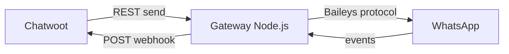

# Comparação de providers alternativos

Notas de alto nível sobre gateways não oficiais comuns e como cada um se encaixa no Chatwoot. **Não substitui** a documentação oficial de cada fornecedor — validar endpoints antes de implementar.

**Relacionados:** [feature-mapping.md](./feature-mapping.md) · [implementation-decision-tree.md](./implementation-decision-tree.md) · [official-vs-unofficial-restrictions.md](./official-vs-unofficial-restrictions.md)

---

## Visão geral

| Provider | Modelo | Sessão | Webhooks | Templates WABA | Grupos | Voz |
|----------|--------|--------|----------|----------------|--------|-----|
| **Meta Cloud API** | Oficial BSP | Token OAuth | `entry/changes/value` | ✅ Aprovados | ❌ individual | ✅ EE Calling API |
| **360dialog** (`default`) | BSP oficial | API key | Flat Meta-like | ✅ Sync BSP | ❌ | ❌ |
| **Evolution API** | Self-host / SaaS | QR + instance | Por evento (`MESSAGES_UPSERT`, …) | ❌ (modo Baileys) | ✅ | ⚠️ experimental |
| **Evolution Go** | Self-host | QR + instance | Por evento (`MESSAGE`, `CONNECTION`, …) | ❌ (whatsmeow) | ✅ | ⚠️ experimental |
| **Z-API** | SaaS | QR + instance | 4 URLs (receive, delivery, status, disconnected) | ❌ | ✅ | ❌ documentado |
| **NotificaMe** | SaaS BR | API + credenciais | Proprietário | ❌ | ⚠️ | ❌ |
| **Baileys/WPPConnect** (genérico) | Self-host | QR | Variável por wrapper | ❌ | ✅ | ⚠️ lib-level |

---

## Evolution API

**Site/docs:** [docs.evolutionfoundation.com.br](https://docs.evolutionfoundation.com.br/en/evolution-api) · GitHub: `evolution-foundation/evolution-api`

### O que expõe

- **REST** com auth `apikey` header (global ou por instância)
- **Instâncias** multi-tenant: `instanceName` no path
- **Modos:** Baileys (WhatsApp Web) **ou** Meta Cloud API na mesma plataforma
- **Webhooks** configuráveis por instância: `MESSAGES_UPSERT`, `MESSAGES_UPDATE`, `CONNECTION_UPDATE`, `QRCODE_UPDATED`, etc.
- **Envio:** `POST /message/sendText/{instanceName}`, mídia, botões, listas (versão-dependent)
- **Integração nativa Chatwoot** na Evolution — útil para referência, mas o fork deve manter adapter próprio em `custom/`

### Formato típico (Baileys mode)

**Envio texto:**

```http
POST /message/sendText/my-instance
apikey: <key>
{ "number": "5511999999999", "textMessage": { "text": "Olá" } }
```

**Webhook `MESSAGES_UPSERT`:** payload com `data.key`, `data.message`, `data.pushName` — **não** é `contacts` + `messages` Meta.

### Paridade vs Cloud API

| Feature | Evolution (Baileys) |
|---------|---------------------|
| Texto livre anytime | ✅ |
| Templates Meta | ❌ (use texto ou modo Cloud na Evolution) |
| Status sent/delivered/read | ✅ via `MESSAGES_UPDATE` |
| Mídia | ✅ URL/base64 — normalizar download |
| Interativos | ⚠️ API própria, mapear para `input_select` Chatwoot |
| Reply/quote | ✅ campo `quoted` no send |
| Typing | ⚠️ depende versão |
| Chamadas | ⚠️ não contrato estável — validar antes |

### Notas para Chatwoot

- **Piloto recomendado** para fork: comunidade ativa, Docker, documentação REST
- Normalizer: `MESSAGES_UPSERT` → `{ contacts:, messages: }` flat
- `provider_config`: `base_url`, `api_key`, `instance_name`
- Conexão: polling `CONNECTION_UPDATE` + exibir QR de `QRCODE_UPDATED`
- **Cuidado:** Evolution pode rodar em modo Cloud — não confundir com provider não oficial
- **Plano detalhado:** [evolution-api/README.md](./evolution-api/README.md)

---

## Evolution Go

**Site/docs:** [docs.evolutionfoundation.com.br/en/evolution-go](https://docs.evolutionfoundation.com.br/en/evolution-go) · GitHub: `evolution-foundation/evolution-go` · Postman: [evolution-go collection](https://www.postman.com/agenciadgcode/evolution-api/collection/nk736ze/evolution-go)

### O que expõe

- **REST** com auth dupla: `GLOBAL_API_KEY` (admin) + **token por instância**
- **whatsmeow** (não Baileys) — payload mensagem similar mas **API paths distintos**
- **Webhooks** configurados no `POST /instance/connect` (`webhookUrl` + `subscribe`)
- **Eventos:** `MESSAGE`, `CONNECTION`, `QRCODE`, `READ_RECEIPT` — **não** `MESSAGES_UPSERT`
- **Licença** obrigatória no painel Go
- **PostgreSQL** obrigatório (auth + users DB)

### Formato típico

**Envio texto:**

```http
POST /send/text
apikey: <instance-token>
{ "number": "5511999999999", "text": "Olá" }
```

**Webhook `MESSAGE`:** envelope `{ event, instance, data }` — sem `apikey` no body.

### Paridade vs Cloud API

| Feature | Evolution Go |
|---------|--------------|
| Texto livre anytime | ✅ |
| Templates Meta | ❌ |
| Status read | ⚠️ via `READ_RECEIPT` |
| Mídia | ✅ MinIO/S3 opcional |
| Integração Chatwoot nativa | ❌ (diferente da Evolution API Node) |

### Notas para Chatwoot

- **Provider key:** `evolution_go` — **separado** de `evolution` (Node)
- **Não reusar** `Custom::Whatsapp::Evolution::*` sem adaptação
- Normalizer: `MESSAGE` → flat `{ contacts:, messages: }`
- Auth webhook: `?token=` (sem `apikey` no envelope)
- **Plano detalhado:** [evolution-go/README.md](./evolution-go/README.md) · divergências: [evolution-go/differences-from-evolution-api.md](./evolution-go/differences-from-evolution-api.md)

---

## Evolution API (Node) vs Evolution Go — quando escolher

| Critério | Evolution API (Node) | Evolution Go |
|----------|----------------------|--------------|
| **Stack** | Node.js + Baileys | Go + whatsmeow |
| **Provider key fork** | `evolution` | `evolution_go` |
| **Performance / memória** | Adequado para maioria | Melhor para alto volume |
| **Integração Chatwoot nativa na Evolution** | Sim (`/chatwoot/set`) — referência apenas | Não — webhook + REST direto |
| **Webhook events** | `MESSAGES_UPSERT`, `CONNECTION_UPDATE` | `MESSAGE`, `CONNECTION`, `QRCODE` |
| **Auth REST** | `apikey` única por instância | `global_api_key` + `instance_token` |
| **Send text path** | `POST /message/sendText/{name}` | `POST /send/text` |
| **Licença** | Depende do deploy | Obrigatória no painel Go |
| **PostgreSQL** | Opcional (Redis comum) | Obrigatório |
| **Código fork hoje** | `custom/.../evolution/` implementado | `custom/.../evolution_go/` implementado |
| **Reusar adapter do outro** | ❌ Nunca | ❌ Nunca |

**Regra:** um inbox = um provider. Não misturar Node e Go na mesma instância ou rota webhook.

**Coexistência:** mesmo fork pode ter inbox A (`evolution`) e inbox B (`evolution_go`) — [evolution-go/coordination-with-evolution-api.md](./evolution-go/coordination-with-evolution-api.md).

---

## Z-API

**Site/docs:** [developer.z-api.io](https://developer.z-api.io/en/quickstart/introduction)

### O que expõe

- **REST** SaaS com `instanceId` + token por instância
- **Fila interna** de envio — retorna ID imediato, entrega assíncrona
- **7 webhooks HTTPS** configuráveis (receive, delivery, status, disconnected, connected, presence, sent-by-me) — ver [z-api/webhook-events.md](./z-api/webhook-events.md)
- **Não armazena mensagens** — mídia em storage Z-API por 30 dias

### Formato típico

**Status webhook:**

```json
{
  "instanceId": "instance.id",
  "status": "READ",
  "ids": ["999999999999999999999"],
  "phone": "5544999999999",
  "type": "MessageStatusCallback",
  "isGroup": false
}
```

### Paridade vs Cloud API

| Feature | Z-API |
|---------|-------|
| Texto | ✅ |
| Mídia | ✅ URLs temporárias 30d |
| Templates | ❌ |
| Interativos | ✅ botões, listas, CTA |
| Grupos | ✅ (Chatwoot não modela) |
| Rate limit API | Sem limite declarado — risco ban WhatsApp |
| Chamadas | ⚠️ API documentada (SIP/voice) — fora escopo Chatwoot MVP |

### Notas para Chatwoot

- **4 rotas webhook** ou **1 rota multiplexada** por `type` no JSON
- Mapear `MessageStatusCallback` → `statuses[]` flat
- `source_id` = `messageId` / `ids[0]`
- `provider_config`: `instance_id`, `instance_token`, `client_token` (conforme doc)
- Bom para **SaaS gerenciado**; menos controle que Evolution self-host
- Plano completo: [z-api/README.md](./z-api/README.md)

---

## Padrão genérico Baileys gateway

Aplica-se a WPPConnect, whatsapp-web.js wrappers, gateways CPaaS custom.

### Arquitetura típica



### Contrato mínimo esperado

| Operação | REST | Webhook |
|----------|------|---------|
| Enviar texto | `POST /send` ou `/message` | — |
| Enviar mídia | `POST` multipart ou URL | — |
| Receber mensagem | — | evento `message` / `messages.upsert` |
| Status | — | evento `message.ack` / `status` |
| Sessão | `GET /status`, `GET /qr` | evento `connection` |

### Variações comuns

- **IDs:** `wamid`, `key.id`, UUID local — normalizar para `source_id` string
- **JIDs:** `5511999999999@s.whatsapp.net`, LID — strip sufixo para `ContactInbox#source_id`
- **Mídia:** base64 inline, URL criptografada, ou relay via gateway
- **Grupos:** `@g.us` — Chatwoot trata como contato individual hoje; **ignorar ou filtrar** no MVP

### Adapter pattern no fork

```
Custom::Whatsapp::Providers::GenericGatewayService < Whatsapp::Providers::BaseService
Custom::Whatsapp::Webhooks::GenericNormalizer
```

Parametrizar por `provider_config['adapter']` se múltiplos gateways compartilharem código.

---

## NotificaMe (fork BR)

O plano detalhado do NotificaMe ainda não está versionado neste repositório.

| Aspecto | Nota |
|---------|------|
| Provider key sugerido | `notificame` |
| Escopo | Texto, mídia, interativos, reply, typing, saúde, bloqueio |
| Estratégia | Idêntica: `Channel::Whatsapp` + service + normalizer em `custom/` |
| Doc API | https://app.notificame.com.br/docs/ |

NotificaMe é **referência de implementação já planejada** neste fork — reutilizar fases e matriz de endpoints.

---

## Matriz de escolha rápida

| Critério | Evolution API | Evolution Go | Z-API | NotificaMe | Self-host Baileys |
|----------|---------------|--------------|-------|------------|-------------------|
| Self-host / controle | ✅ | ✅ | ❌ SaaS | ❌ SaaS | ✅ |
| Doc REST estável | ✅ boa | ⚠️ paths divergentes | ✅ boa | ✅ (fork) | ⚠️ varia |
| Performance / memória | Padrão | ✅ Go | — | — | varia |
| Setup Chatwoot existente | Integração nativa (referência) | — | — | Plano no fork | — |
| Interativos | ⚠️ | ✅ | ✅ planejado | ⚠️ |
| Ops (QR, reconnect) | Médio | Baixo (SaaS) | Baixo | Alto |
| Risco ToS / ban | Alto | Alto | Alto | Alto |

**Recomendação:** escolher **um piloto** (Evolution self-host **ou** NotificaMe se já contratado), congelar contrato webhook, implementar MVP texto+status antes de mídia.

---

## O que desaparece vs API oficial (todos os não oficiais)

Ver [official-vs-unofficial-restrictions.md](./official-vs-unofficial-restrictions.md). Resumo:

- Templates aprovados, janela 24h **na API** (Chatwoot ainda pode impor)
- Embedded Signup, WABA health, quality rating
- Campanhas/CSAT cloud
- Calling API Meta + `call_permission_request`
- SLA e suporte Meta

**Permanece:** risco de ban, instabilidade de sessão, compliance LGPD/gravação.
