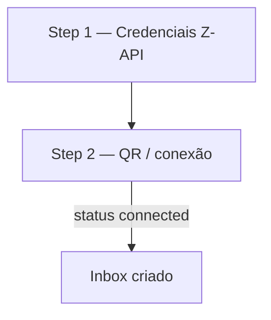

# Especificação UI — Wizard e settings Z-API

Planejamento frontend **sem implementação**. Reutiliza padrão do wizard Evolution com adaptações SaaS.

**Relacionados:** [implementation-plan.md](./implementation-plan.md) · [decisions.md](./decisions.md) · [provider-config-mapping.md](./provider-config-mapping.md)

---

## Entry point

| Local | Mudança fork |
|-------|--------------|
| `Whatsapp.vue` (channels) | `// FORK:` import `ZapiWhatsapp.vue` |
| Card | **"Z-API"** — subtítulo "WhatsApp via Z-API (SaaS)" |
| Provider persistido | `provider: 'zapi'` |

---

## Fluxo wizard (2 steps — MVP)



### Step 1 — Credenciais

| Campo | Tipo | Validação |
|-------|------|-----------|
| Inbox name | text | obrigatório |
| `instance_id` | text | obrigatório — painel Z-API → Instâncias |
| `instance_token` | password | obrigatório |
| `client_token` | password | obrigatório se "Token de Segurança" ativo na conta Z-API |

**Ação backend ao avançar:**

1. Persistir channel `provider: 'zapi'`
2. Gerar `webhook_token`
3. `ConnectionService#setup_webhooks!`
4. `GET .../status` — se já connected, pular Step 2

> Sem campo `base_url` no MVP — fixo `https://api.z-api.io` (override avançado em settings).

### Step 2 — QR

| Elemento | Fonte |
|----------|-------|
| QR image | `GET .../qr-code/image` via backend |
| Status | polling `GET .../status` a cada **10–20s** |
| QR | Renovar `GET .../qr-code/image` no mesmo intervalo — QR invalida a cada ~20s (doc Z-API) |
| ActionCable | `zapi:connection:{inbox_id}` |

**Sucesso:** `connected: true` → extrair telefone de `/me` ou webhook → redirect settings.

**Fase 2:** aba alternativa "Código por telefone" (`phone-code`).

---

## Composable sugerido

```
custom/app/javascript/dashboard/composables/useZapiConnection.js
```

| Export | Responsabilidade |
|--------|------------------|
| `connectionStatus` | `disconnected` / `connecting` / `connected` |
| `qrCodeImage` | base64 da API |
| `startPolling()` | status + qr |
| `subscribeActionCable(inboxId)` | eventos connection |

Chamadas via endpoints internos Chatwoot — **nunca** expor `instance_token` / `client_token` no browser.

---

## API dashboard (contrato interno)

| Método | Path | Ação |
|--------|------|------|
| `POST` | `/api/v1/accounts/:id/inboxes/:id/zapi/setup` | webhooks + status inicial |
| `GET` | `.../zapi/connection` | status + qr |
| `POST` | `.../zapi/disconnect` | disconnect |

Espelhar rotas Evolution Go com namespace `zapi`.

---

## Settings pós-criação

| Seção | Campos |
|-------|--------|
| Conexão | status badge, botão reconnect, disconnect |
| Credenciais | instance_id (readonly), tokens masked, botão "atualizar token" |
| Avançado | `ignore_groups` toggle (default on) |

Ocultar: templates, phone number ID, business account (cloud-only).

---

## Fase 2 — Partners wizard

Step 1 alternativo:

| Campo | Uso |
|-------|-----|
| `partner_auth_token` | Bearer — **sessão only**, não persistir |
| Nome instância | `POST /instances/integrator/on-demand` |

Retorno preenche `instance_id` + `instance_token` automaticamente.
