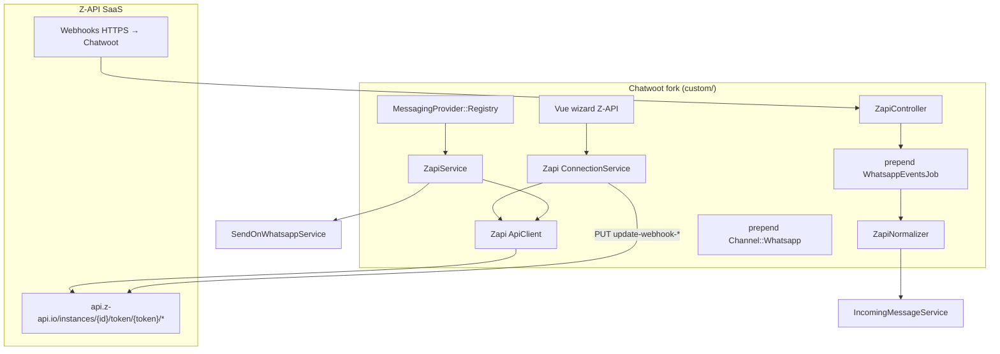

# Plano de implementação — Provider Z-API

Integração `provider: 'zapi'` no fork Chatwoot. Alinhado com [../implementation-plan-second-whatsapp-provider.md](../implementation-plan-second-whatsapp-provider.md).

**Pré-requisitos:** contrato `evolution` estável · [provider-config-mapping.md](./provider-config-mapping.md) · [webhook-events.md](./webhook-events.md)

**Infra Z-API:** externa — operador usa conta Z-API (SaaS). Sem servidor self-host.

---

## Visão da arquitetura



---

## Fase 0 — Infraestrutura

| # | Entrega | Local |
|---|---------|-------|
| 0.1 | `# FORK:` `PROVIDERS` inclui `zapi` | `app/models/channel/whatsapp.rb` |
| 0.2 | Registry register `zapi` | `custom/config/initializers/messaging_provider_registry.rb` |
| 0.3 | Capability `unlimited_session: true` | `custom/lib/messaging_provider/capabilities.rb` |
| 0.4 | Rota webhook | `config/routes.rb` |
| 0.5 | Stub `ZapiController` | `custom/.../zapi_controller.rb` |

**Critério:** `provider: 'zapi'` persiste; providers existentes inalterados.

---

## Fase 1 — MVP texto + conexão QR

### Backend

| # | Classe | Responsabilidade |
|---|--------|------------------|
| 1.1 | `Custom::Whatsapp::Zapi::ApiClient` | HTTP; path auth; header `Client-Token` |
| 1.2 | `Custom::Whatsapp::Zapi::ConnectionService` | status, qr, disconnect, register_webhooks |
| 1.3 | `Custom::Whatsapp::Providers::ZapiService` | `send_message`, `process_response` |
| 1.4 | `Custom::Whatsapp::Webhooks::ZapiNormalizer` | demux por `type` |
| 1.5 | `Custom::Webhooks::ZapiController` | `POST /webhooks/zapi/:instance_id` |
| 1.6 | prepend `WhatsappEventsJob` | dispatch `zapi` |

### ConnectionService — fluxo criação inbox (MVP manual)

```
1. Operador informa instance_id, instance_token, client_token (wizard)
2. Chatwoot gera webhook_token
3. ConnectionService registra 4 webhooks (mesma URL):
   - update-webhook-received
   - update-webhook-delivery
   - update-webhook-message-status
   - update-webhook-disconnected
4. GET /status → connection_status
5. Se disconnected: GET /qr-code/image → exibir no wizard
6. Aguardar webhook ConnectedCallback ou polling /status
```

### Envio texto

```
POST /instances/{id}/token/{token}/send-text
{ "phone": "5544...", "message": "..." }
→ persistir response.messageId como source_id
```

### Frontend (wizard)

| Tela | Campos |
|------|--------|
| Credenciais | `instance_id`, `instance_token`, `client_token` |
| QR | polling `/status` + imagem base64 |
| Conectado | exibir `phone_number` |

Reutilizar estrutura `EvolutionWizard` com componente `ZapiWizard`.

---

## Fase 2 — Mídia + read receipts + contatos

| # | Entrega |
|---|---------|
| 2.1 | `send-image`, `send-audio`, `send-video`, `send-document` |
| 2.2 | Download mídia inbound (URL temporária) |
| 2.3 | `POST /read-message` ao abrir conversa |
| 2.4 | `GET /contacts` — import contatos |
| 2.5 | API Partners — `POST /instances/integrator/on-demand` no wizard |

---

## Fase 3 — Interativos e extras

| # | Entrega | Nota |
|---|---------|------|
| 3.1 | Botões, listas | Sem paridade Cloud API templates |
| 3.2 | Localização, contato vCard | |
| 3.3 | Reações | |
| 3.4 | Responder (`messageId` no send-text) | |

---

## Decisões em aberto

| # | Decisão | Opções |
|---|---------|--------|
| D1 | Auth webhook | `?token=` (como Evolution) vs validar `instanceId` no body |
| D2 | Provisionamento | Manual MVP vs Partners API |
| D3 | Polling QR | Polling `/status` vs só webhook `connected` |
| D4 | `received-delivery` | Desabilitar vs filtrar `fromMe` |

Registrar decisões fechadas em `decisions.md` (criar quando iniciar código).

---

## Estimativa de esforço relativo

| Provider | Complexidade | Motivo |
|----------|--------------|--------|
| `evolution` | Baseline (já feito) | Self-host + 1 webhook + event bus |
| `evolution_go` | Similar | Mesmo padrão gateway, contratos diferentes |
| **`zapi`** | **Menor ops, mais webhooks** | Sem servidor; porém 4–7 callbacks, mídia por URL temporária, auth path+header |

Não há fator numérico único — o ganho SaaS (sem ops) compensa parcialmente o demux de webhooks e download de mídia.

---

## Critérios de aceite Fase 1

- [ ] Criar inbox `provider: 'zapi'` com credenciais válidas
- [ ] Exibir QR e conectar número de teste
- [ ] Receber mensagem texto → conversa no Chatwoot
- [ ] Responder texto → entrega confirmada via webhook
- [ ] Status READ refletido na UI
- [ ] Disconnect detectado e exibido no settings
- [ ] Grupos ignorados
- [ ] Specs em `spec/custom/` para normalizer + ApiClient

---

## Ordem sugerida no roadmap do fork

1. Finalizar `evolution` em produção piloto
2. Implementar `evolution_go` **ou** `zapi` (não paralelizar os dois)
3. Z-API é candidato se o operador preferir **SaaS sem infra** em vez de self-host Go
