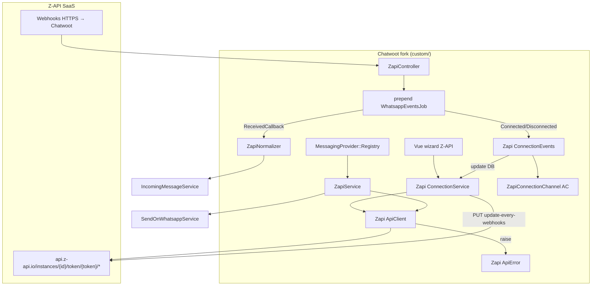

# Plano de implementação — Provider Z-API

Integração `provider: 'zapi'` no fork Chatwoot. Alinhado com [../implementation-plan-second-whatsapp-provider.md](../implementation-plan-second-whatsapp-provider.md).

**Pré-requisitos:** contrato `evolution` estável · [provider-config-mapping.md](./provider-config-mapping.md) · [webhook-events.md](./webhook-events.md)

**Infra Z-API:** externa — operador usa conta Z-API (SaaS). Sem servidor self-host.

---

## Visão da arquitetura



---

## Fase 0 — Infraestrutura

| # | Entrega | Local |
|---|---------|-------|
| 0.1 | `# FORK:` `PROVIDERS` inclui `zapi` | `app/models/channel/whatsapp.rb` |
| 0.2 | Registry register `zapi` (formato posicional — igual evolution) | `custom/config/initializers/messaging_provider_registry.rb` |
| 0.3 | Capability `unlimited_session: true` | `custom/lib/messaging_provider/capabilities.rb` |
| 0.4 | Rota webhook `POST /webhooks/zapi/:instance_id` | `config/routes.rb` |
| 0.5 | Stub `ZapiController` | `custom/app/controllers/webhooks/zapi_controller.rb` |
| 0.6 | Migration índice `instance_id` unique para `provider = 'zapi'` | `db/migrate/` |

**Critério:** `provider: 'zapi'` persiste; providers existentes inalterados; migration aplicada.

---

## Fase 1 — MVP texto + conexão QR

Contratos: [spec-design.md](./spec-design.md) · validação E2E: [validation-checklist.md](./validation-checklist.md)

### Backend

| # | Classe | Responsabilidade |
|---|--------|------------------|
| 1.1 | `Custom::Whatsapp::Zapi::ApiError` | Exceção tipada (`status`, `body`, `user_message` vs `log_message`) |
| 1.2 | `Custom::Whatsapp::Zapi::ApiClient` | HTTP; path auth `instance_id/token`; header `Client-Token` |
| 1.3 | `Custom::Whatsapp::Zapi::ConnectionService` | `setup_webhooks!`, `sync_connection_status!`, `fetch_qr_image`, `disconnect!`, `sync_phone_number!` |
| 1.4 | `Custom::Whatsapp::Zapi::ConnectionEvents` | Side-effects Connected/Disconnected: atualiza `provider_config` + broadcast ActionCable |
| 1.5 | `ZapiConnectionChannel` | ActionCable `zapi:connection:{inbox_id}` |
| 1.6 | `Custom::Whatsapp::Providers::ZapiService` | `send_message`, `process_response` → `messageId` |
| 1.7 | `Custom::Whatsapp::Webhooks::ZapiNormalizer` | Parse por `type` — **sem side-effects** (sem `channel`, sem AC) |
| 1.8 | `Custom::Webhooks::ZapiController` | `process_payload` + `sanitized_job_payload` + `authenticate_webhook!` |
| 1.9 | Prepend `WhatsappEventsJob` | `dispatch_zapi_event` — router por `type` |

### Separação de responsabilidades

```
ZapiController → Job prepend → dispatch_zapi_event
                                ├── ReceivedCallback     → ZapiNormalizer → IncomingMessageService
                                ├── MessageStatusCallback → ZapiNormalizer → update_message_status
                                ├── DeliveryCallback     → log error se payload['error'] presente (MVP)
                                ├── ConnectedCallback    → ConnectionEvents#handle_connected
                                └── DisconnectedCallback → ConnectionEvents#handle_disconnected
```

> `ZapiNormalizer` só **parseia** — não tem referência ao `channel` nem a `ActionCable`. `ConnectionEvents` detém os side-effects de estado.

---

### ConnectionService — fluxo criação inbox (MVP manual)

```
1. Operador informa instance_id, instance_token, client_token (wizard)
2. Chatwoot gera webhook_token
3. ConnectionService registra webhooks via update-every-webhooks (preferido):
   PUT /update-every-webhooks { value: url, notifySentByMe: false }
   Fallback 4× PUT individuais se bulk falhar (confirmed no E2E)
4. GET /status → connection_status
5. Se disconnected: GET /qr-code/image → exibir no wizard (polling 10–20s)
6. Aguardar ConnectedCallback webhook → ConnectionEvents#handle_connected
   Fallback: polling GET /status a cada 10–20s
7. GET /me → sync phone_number
```

### Envio texto

```
POST /instances/{id}/token/{token}/send-text
{ "phone": "5544...", "message": "..." }
→ source_id = response['messageId'] || response['id']
```

### Frontend (wizard — 2 steps)

| # | Entrega |
|---|---------|
| 1.10 | Card "Z-API" em `Whatsapp.vue` (`// FORK:` import) |
| 1.11 | `ZapiWhatsapp.vue` — Step 1: credenciais (`instance_id`, `instance_token`, `client_token`) |
| 1.12 | Step 2: QR polling 10–20s + ActionCable `zapi:connection:{inbox_id}` |
| 1.13 | `useZapiConnection.js` composable |
| 1.14 | `isZapiWhatsAppChannel` em `useInbox.js` — ocultar features cloud-only |

---

## Fase 2 — Mídia + read receipts + contatos

| # | Entrega |
|---|---------|
| 2.1 | `send-image`, `send-audio`, `send-video`, `send-document` |
| 2.2 | Download mídia inbound (URL temporária — baixar imediato) |
| 2.3 | `POST /read-message` ao abrir conversa |
| 2.4 | Reply/quote — `messageId` opcional no `send-text` |
| 2.5 | `GET /contacts` — import contatos |
| 2.6 | API Partners — `POST /instances/integrator/on-demand` no wizard (Step 1 alternativo) |

---

## Fase 3 — Interativos e extras

| # | Entrega | Nota |
|---|---------|------|
| 3.1 | Botões, listas | Sem paridade Cloud API templates |
| 3.2 | Localização, contato vCard | |
| 3.3 | Reações | |
| 3.4 | Pairing code por telefone (`GET /phone-code/{phone}`) | |

---

## Arquivos fork

```
custom/
├── app/channels/
│   └── zapi_connection_channel.rb
├── app/controllers/webhooks/
│   └── zapi_controller.rb
├── app/services/custom/whatsapp/
│   ├── zapi/
│   │   ├── api_error.rb
│   │   ├── api_client.rb
│   │   ├── connection_service.rb
│   │   └── connection_events.rb
│   ├── providers/zapi_service.rb
│   └── webhooks/zapi_normalizer.rb
└── app/javascript/dashboard/
    ├── channels/ZapiWhatsapp.vue
    └── composables/useZapiConnection.js
```

### Upstream mínimo (`# FORK:`)

| Arquivo | Mudança |
|---------|---------|
| `app/models/channel/whatsapp.rb` | `PROVIDERS` + `'zapi'` |
| `config/routes.rb` | `POST /webhooks/zapi/:instance_id` |
| `app/javascript/.../Whatsapp.vue` | Import card Z-API |

---

## Riscos e mitigações

| Risco | Mitigação |
|-------|-----------|
| `update-every-webhooks` ausente na collection Postman | Confirmado na doc oficial; fallback 4× PUT documentado — verificar no E2E |
| URL mídia expira ~30 dias | Download imediato no job de inbound |
| `client_token` obrigatório apenas se ativado | Campo opcional no wizard; validar no setup_webhooks! |
| Sem templates Meta | `sync_templates` noop; ocultar template picker na UI |

---

## Critérios de aceite Fase 1

- [ ] Criar inbox `provider: 'zapi'` com credenciais válidas
- [ ] `setup_webhooks!` registra URL correta via `update-every-webhooks` (ou fallback)
- [ ] Exibir QR e conectar número de teste
- [ ] `ConnectedCallback` → `connection_status: connected` + `phone_number` atualizado
- [ ] Receber mensagem texto → conversa no Chatwoot
- [ ] Responder texto → `source_id` persistido + `DeliveryCallback` logado
- [ ] `MessageStatusCallback READ` → status refletido na UI
- [ ] `DisconnectedCallback` → badge desconectado no settings
- [ ] Grupos ignorados (`isGroup: true`)
- [ ] Specs em `spec/custom/` para `ZapiNormalizer` + `ApiClient` + controller auth

---

## Decisões

Todas registradas em [decisions.md](./decisions.md) (20 ADRs fechadas). Principais:

| Decisão | Resolução |
|---------|-----------|
| Auth webhook | `?token=webhook_token` + `secure_compare` — decisions.md §3 |
| Provisionamento MVP | Credenciais manuais do painel Z-API — §15 |
| Polling QR | 10–20s (doc Z-API: QR invalida ~20s) — §13 |
| `received-delivery` | `notifySentByMe: false`; `DeliveryCallback` → log error MVP — §8 |
| Janela 24h | `MessageWindowService` prepend `nil` + capability `unlimited_session` — §9 |

---

## Estimativa de esforço relativo

| Provider | Complexidade | Motivo |
|----------|--------------|--------|
| `evolution` | Baseline (já feito) | Self-host + 1 webhook + event bus |
| `evolution_go` | Similar | Mesmo padrão gateway, contratos diferentes |
| **`zapi`** | **Menor ops, mais webhooks** | Sem servidor; porém 4–7 callbacks, mídia URL temporária, auth path+header |

---

## Ordem sugerida no roadmap do fork

1. Finalizar `evolution` em produção piloto
2. Implementar `evolution_go` **ou** `zapi` (não paralelizar os dois)
3. Z-API candidato se operador prefere **SaaS sem infra** em vez de self-host Go
