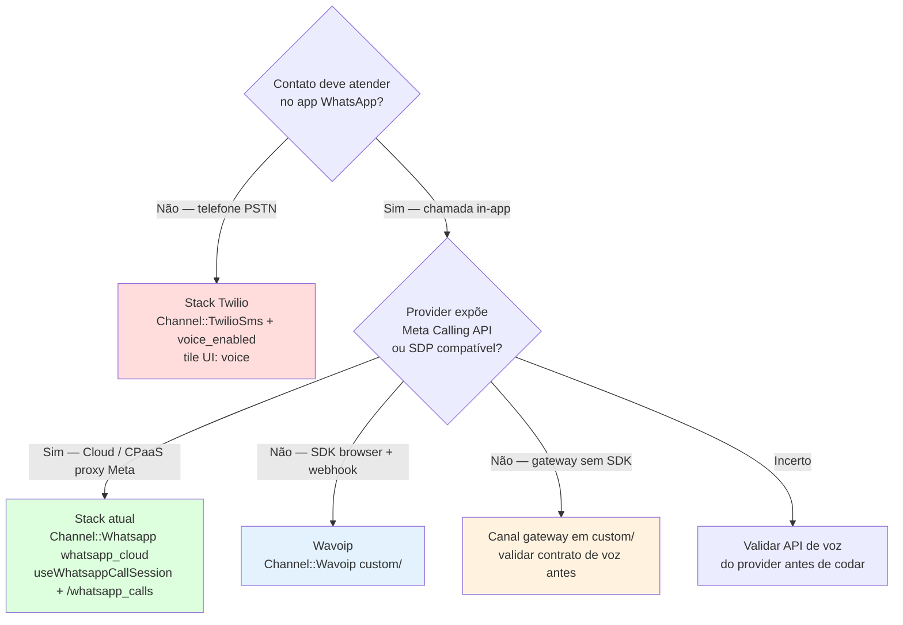

# WhatsApp Voice / Calling — Documentação

Análise e referência do suporte a **chamadas de voz WhatsApp** no Chatwoot (Meta Cloud Calling + provider alternativo Wavoip no fork).

**Última consolidação:** 17 jul. 2026 — docs alinhados ao código shipped em `custom/` + Enterprise.

---

## Por onde começar

| Perfil | Caminho |
|--------|---------|
| **Fluxo Meta oficial** | [architecture-and-flow.md](./architecture-and-flow.md) |
| **Wavoip (implementado)** | [wavoip-provider/README.md](./wavoip-provider/README.md) |
| **Segundo provider Meta-like** | [second-provider-strategy.md](./second-provider-strategy.md) |
| **Twilio vs WhatsApp in-app** | [twilio-vs-whatsapp-native.md](./twilio-vs-whatsapp-native.md) |
| **Providers de mensagens** | [whatsapp-provider/README.md](../whatsapp-provider/README.md) |

---

## Árvore de decisão — qual caminho de voz?

| Caminho | Quando usar | Doc principal |
|---------|-------------|---------------|
| **Meta Cloud Calling** | WABA oficial, EE + `channel_voice` | [architecture-and-flow.md](./architecture-and-flow.md) |
| **Wavoip** | Número no Wavoip; token de dispositivo | [wavoip-provider/](./wavoip-provider/) |
| **Segundo CPaaS Meta-like** | Gateway que proxy Graph `/calls` | [second-provider-strategy.md](./second-provider-strategy.md) |
| **Twilio Voice** | PSTN — **não** substitui WhatsApp in-app | [twilio-vs-whatsapp-native.md](./twilio-vs-whatsapp-native.md) |

---

## Índice

| Documento | Conteúdo |
|-----------|----------|
| [architecture-and-flow.md](./architecture-and-flow.md) | Meta E2E, gaps, roadmap refactor |
| [wavoip-provider/README.md](./wavoip-provider/README.md) | Wavoip — status, decisões, índice |
| [wavoip-provider/architecture.md](./wavoip-provider/architecture.md) | Wavoip as-built |
| [wavoip-provider/operations-runbook.md](./wavoip-provider/operations-runbook.md) | Onboarding e troubleshooting |
| [wavoip-provider/webhook-contract.md](./wavoip-provider/webhook-contract.md) | Auth webhook, ActionCable |
| [second-provider-strategy.md](./second-provider-strategy.md) | Plano segundo provider SDP/CPaaS |
| [twilio-vs-whatsapp-native.md](./twilio-vs-whatsapp-native.md) | Twilio PSTN vs WhatsApp Cloud Calling |

---

## Visão geral

O Chatwoot é **orquestrador de sinalização e estado** (`Call`, mensagens `voice_call`, ActionCable). A **mídia** não passa pelo servidor:

| Stack | Mídia | Canal |
|-------|-------|-------|
| **Meta** | Browser ↔ Meta (WebRTC + SDP) | `Channel::Whatsapp` (`whatsapp_cloud` + `calling_enabled`) |
| **Wavoip** | Browser ↔ Wavoip SDK | `Channel::Wavoip` em `custom/` |
| **Twilio** | PSTN | `Channel::TwilioSms` (`voice_enabled`) |

Modelo compartilhado: `Call` com `provider: { twilio, whatsapp, wavoip }` (`# FORK:` no enum).

### Requisitos Meta Cloud Calling

| Requisito | Detalhe |
|-----------|---------|
| Enterprise Edition | Model `Call`, rotas `/whatsapp_calls` |
| Feature `channel_voice` | Gate em model + UI |
| Provider `whatsapp_cloud` | 360dialog não tem Calling API |
| Webhook Meta `calls` | Inscrito quando `calling_enabled` |
| Navegador | Microfone + WebRTC; STUN via `VOICE_CALL_STUN_URLS` |

Self-hosted: rake `chatwoot:self_hosted_enterprise:enable` — [enterprise-enablement](../enterprise-enablement/enterprise-enablement-baseline.md).

---

## Status resumido

| Área | Estado |
|------|--------|
| Meta Cloud Calling + refactors P0/P1 | ✅ (`MetaCloud::Adapter`, `useWebRtcCallSession`, cable registries) |
| Wavoip (código) | ✅ Inbound/outbound, gravação, device panel/QR, multiagente |
| Wavoip piloto (ops) | ⚠️ Gates **W1** + browser E2E — [runbook](./wavoip-provider/operations-runbook.md#gates-de-piloto-jul-2026) |

Detalhe Wavoip: [wavoip-provider/README.md](./wavoip-provider/README.md).

### Backlog global (Meta + multi-provider)

| # | Item | Status |
|---|------|--------|
| G1 | Registry sessão/eventos por provider | Parcial — cable registries ✅; Twilio ainda brancha no facade |
| G2–G6 | Adapter Meta, builders, handlers FE, Vitest WebRTC | ✅ Done |
| G7–G11 | Canal Wavoip + UX | ✅ Done |

Roadmap detalhado: [architecture-and-flow.md §13](./architecture-and-flow.md#13-roadmap-de-refatoração-melhorias-sugeridas).

---

## Recomendação (fork)

1. **Meta oficial** no caminho upstream — edições `# FORK:` mínimas.
2. **Wavoip** em `custom/` — canal separado; **não** inflar `WhatsappEventsJob`.
3. **Segundo CPaaS Meta-like** — [second-provider-strategy.md](./second-provider-strategy.md).
4. **Não usar Twilio** para WhatsApp in-app — [twilio-vs-whatsapp-native.md](./twilio-vs-whatsapp-native.md).
5. **Merge-safety:** `custom/` overlay, `prepend_mod_with`, `# FORK:` grepável.

**Legado:** `users.wavoip_token` não é usado pelo canal Wavoip — credencial em `channel_wavoip.device_token`.
