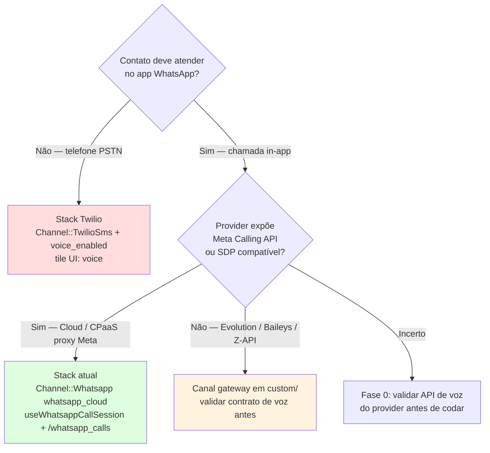

# WhatsApp Voice / Calling — Documentação de análise

Esta pasta consolida a análise técnica do suporte a **chamadas de voz WhatsApp** no Chatwoot Enterprise (WhatsApp Cloud Calling API + WebRTC browser↔Meta). O objetivo é orientar implementação, extensão com providers alternativos e decisões de arquitetura no fork.

**Última reanálise:** jun/2026 — código em `main` (Enterprise + OSS hooks).

---

## Por onde começar

| Perfil | Caminho |
|--------|---------|
| **Entender o fluxo atual (Meta oficial)** | [architecture-and-flow.md](./architecture-and-flow.md) |
| **Implementar Wavoip (primeiro provider alternativo)** | [wavoip-provider/README.md](./wavoip-provider/README.md) |
| **Escolher stack de voz no fork** | Árvore abaixo → [second-provider-strategy.md](./second-provider-strategy.md) |
| **Avaliar acoplamento / refactor** | [second-provider-strategy.md](./second-provider-strategy.md) |
| **Twilio vs WhatsApp in-app** | [twilio-vs-whatsapp-native.md](./twilio-vs-whatsapp-native.md) |
| **Providers alternativos (mensagens + contexto)** | [whatsapp-provider/README.md](../whatsapp-provider/README.md) |

---

## Árvore de decisão — qual caminho de voz?

| Caminho | Quando usar | Doc principal |
|---------|-------------|---------------|
| **Meta Cloud Calling (atual)** | WABA oficial, embedded signup ou keys manuais, EE + `channel_voice` | [architecture-and-flow.md](./architecture-and-flow.md) |
| **Wavoip (SDK browser + webhook)** | Número no Wavoip, sem Graph Calling API; token de dispositivo | [wavoip-provider/README.md](./wavoip-provider/README.md) |
| **Segundo CPaaS Meta-like** | Outro gateway que proxy Graph `/calls` (SDP offer/answer) | [second-provider-strategy.md](./second-provider-strategy.md) |
| **Gateway não oficial** | Evolution/Baileys com API de voz própria (não Graph API) | [second-provider-strategy.md](./second-provider-strategy.md) como checklist de contrato |
| **Twilio Voice** | Voz telefônica PSTN — **não** substitui WhatsApp in-app | [twilio-vs-whatsapp-native.md](./twilio-vs-whatsapp-native.md) |

---

## Índice

| Documento | Conteúdo |
|-----------|----------|
| [architecture-and-flow.md](./architecture-and-flow.md) | Fluxo E2E: setup, inbound, outbound, permissões, Meta API, frontend, gates EE |
| [wavoip-provider/](./wavoip-provider/) | **Wavoip** — estratégia, arquitetura, plano de fases, frontend |
| [wavoip-provider/inbox-setup.md](./wavoip-provider/inbox-setup.md) | Wizard caixa de entrada Wavoip (todos os campos na criação) |
| [second-provider-strategy.md](./second-provider-strategy.md) | Plano para **segundo provider compatível com Meta Calling API** (CPaaS proxy) |
| [twilio-vs-whatsapp-native.md](./twilio-vs-whatsapp-native.md) | O que se perde ao usar stack Twilio em vez de WhatsApp Cloud Calling |

---

## Visão geral (estado atual)

### O que existe hoje

O recurso permite que agentes **atendam e façam chamadas de voz pelo WhatsApp** no dashboard. O Chatwoot é **orquestrador de sinalização e estado** (SDP, model `Call`, mensagens `voice_call`, ActionCable); a **mídia** trafega **browser ↔ Meta** via WebRTC — não passa pelo servidor.

| Camada | Implementação |
|--------|---------------|
| **Canal WhatsApp nativo** | `Channel::Whatsapp` com `provider: whatsapp_cloud` + `provider_config.calling_enabled` |
| **Setup UI dedicado** | Tile `whatsapp_call` → `WhatsappCall.vue` → embedded signup + auto `enable_whatsapp_calling` |
| **Setup em inbox existente** | Tab **Calls** (`WhatsappCallingPage.vue`) em inbox Cloud |
| **Canal Twilio (PSTN)** | Tile `voice` → cria `Channel::TwilioSms` com `voice_enabled` — **produto diferente** |
| **Modelo de dados** | `Call` (EE), enum `provider: { twilio, whatsapp }`, mensagem `content_type: voice_call` |
| **Frontend WebRTC** | `useWhatsappCallSession.js` (~456 linhas) + orquestrador `useCallSession.js` |
| **API REST** | `/api/v1/accounts/:id/whatsapp_calls/*` (EE only) |
| **Webhooks** | Meta `field=calls` via `Enterprise::Webhooks::WhatsappEventsJob` |

> **Nota histórica:** existiu migration `create_channel_voice` / `drop_channel_voice` (2025–2026). A tabela `channel_voice` **foi removida**; voz não usa STI separado — WhatsApp calling vive em `Channel::Whatsapp`; Twilio vive em `Channel::TwilioSms`.

### Requisitos (WhatsApp Cloud Calling)

| Requisito | Detalhe |
|-----------|---------|
| **Enterprise Edition** | Model `Call`, serviços, controllers e rotas em `enterprise/`; registrados com `ChatwootApp.enterprise?` |
| **Feature `channel_voice`** | Gate em `Channel::Whatsapp#voice_enabled?`, UI (`ChannelItem.vue`), billing Cloud (Startups+) |
| **Provider `whatsapp_cloud`** | 360dialog (`default`) **não** tem Calling API — `voice_calling_supported?` retorna `false` |
| **Meta WABA + Calling API** | `enable_voice_calling!` → `POST .../settings` `{ calling: { status: 'ENABLED' } }` |
| **Webhook `calls`** | Inscrito quando `calling_enabled: true` (`Whatsapp::WebhookSetupService#subscribed_fields`) |
| **Navegador** | Microfone + WebRTC; STUN via `VOICE_CALL_STUN_URLS` (default `stun:stun.l.google.com:19302`) |

Self-hosted: habilitar EE + feature — ver rake `chatwoot:self_hosted_enterprise:enable` e [enterprise-enablement](../enterprise-enablement/enterprise-enablement-baseline.md).

---

## Provider não oficial (mensagens / voz)

Se o fork **não** usar `whatsapp_cloud`, restrições da Meta na API oficial deixam de aplicar — mas surgem riscos de ToS, instabilidade e **API de voz muitas vezes inexistente**.

| Tópico | Documento |
|--------|-----------|
| Índice providers alternativos | [whatsapp-provider/README.md](../whatsapp-provider/README.md) |
| Lacunas no código (mensagens + voz) | [gaps-and-blockers.md](../whatsapp-provider/gaps-and-blockers.md) §5 |
| Evolution, Z-API, Baileys | [provider-comparison.md](../whatsapp-provider/provider-comparison.md) |
| Restrições evitadas vs riscos | [official-vs-unofficial-restrictions.md](../whatsapp-provider/official-vs-unofficial-restrictions.md) |
| Canal de chamadas gateway | [second-provider-strategy.md](./second-provider-strategy.md) |
| Árvore de decisão geral | [implementation-decision-tree.md](../whatsapp-provider/implementation-decision-tree.md) |

**Regra prática:** mensagens gateway e voz gateway são **projetos separados** no fork. Voz só deve avançar depois de validar SDP/events ou contrato equivalente no provider.

---

## Top lacunas (implementadores)

| # | Lacuna | Impacto | Mitigação |
|---|--------|---------|-----------|
| 1 | Sem interface `Voice::Provider::Base` | Cada provider = controller/job/composable novos | Adapter em `custom/` + registry incremental |
| 2 | `useWhatsappCallSession` acoplado a `/whatsapp_calls` | Gateway precisa duplicar ou extrair `useWebRtcCallSession` | Ver [second-provider-strategy.md](./second-provider-strategy.md) |
| 3 | `actionCable.js` filtra `provider === 'whatsapp'` | Segundo provider WebRTC não recebe eventos | Estender handlers ou generalizar filtro (`// FORK:`) |
| 4 | `voice_call.permission_granted` sem handler FE | Opt-in confirmado só via activity message | Adicionar handler ou banner manual |
| 5 | `voice_calling_supported?` só `whatsapp_cloud` | Gateways bloqueados no model OSS | `prepend_mod_with` em `custom/` |
| 6 | TURN não configurado por default | NAT restritivo pode falhar mídia | `VOICE_CALL_STUN_URLS` / TURN do gateway |
| 7 | `disable_voice_calling!` não desliga Meta | Flag local + webhook; WABA calling.status intacto | Documentar para admins |

Detalhes: [architecture-and-flow.md §12](./architecture-and-flow.md) · [second-provider-strategy.md](./second-provider-strategy.md)

---

## Recomendação resumida (fork)

1. **Manter Meta oficial** no caminho upstream (`whatsapp_cloud`) — não editar `enterprise/` sem espelhar em `custom/`.
2. **Segundo provider Meta-like (CPaaS proxy):** estender stack WebRTC existente — [second-provider-strategy.md](./second-provider-strategy.md).
3. **Wavoip:** seguir [wavoip-provider/](./wavoip-provider/) — SDK `@wavoip/wavoip-api` + webhook; canal `Channel::Wavoip` em `custom/`.
4. **Gateway não oficial (Evolution, etc.):** canal separado em `custom/`; usar [second-provider-strategy.md](./second-provider-strategy.md) como checklist de viabilidade e adaptar o contrato se não houver Graph `/calls`.
5. **Não usar Twilio Voice** para substituir WhatsApp in-app — [twilio-vs-whatsapp-native.md](./twilio-vs-whatsapp-native.md).
6. **Merge-safety:** preferir `custom/` overlay, `prepend_mod_with`, `# FORK:` grepável — **zero marcadores FORK no código de voz upstream hoje**.
