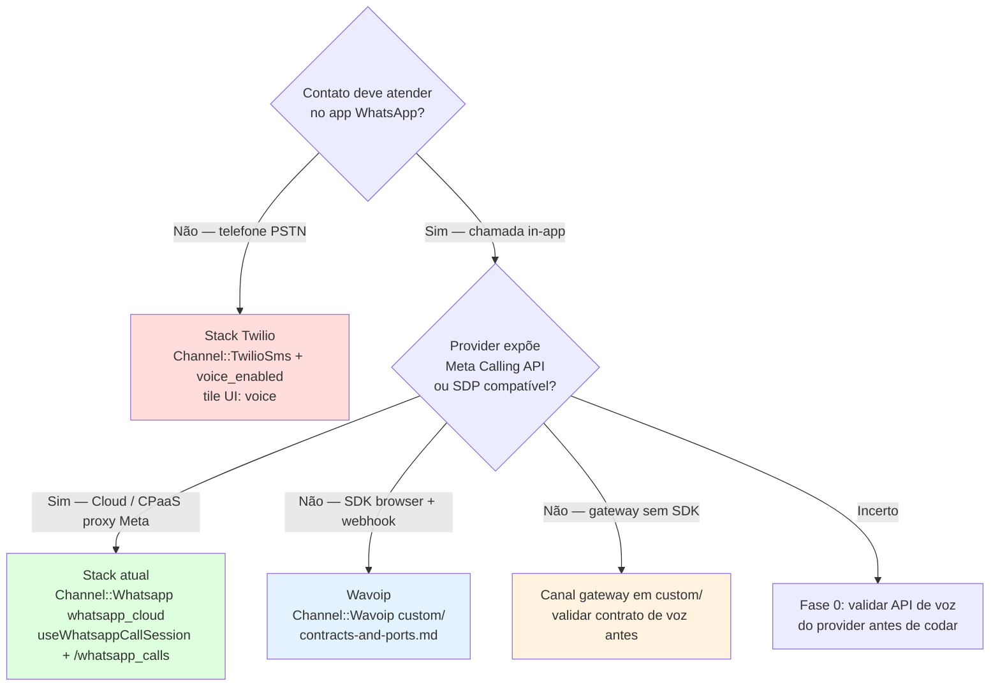

# WhatsApp Voice / Calling — Documentação de análise

Esta pasta consolida a análise técnica do suporte a **chamadas de voz WhatsApp** no Chatwoot Enterprise (WhatsApp Cloud Calling API + WebRTC browser↔Meta). O objetivo é orientar implementação, extensão com providers alternativos e decisões de arquitetura no fork.

**Última reanálise:** jun/2026 (reavaliação arquitetural completa) — código em `main` (Enterprise + OSS hooks).

---

## Por onde começar

| Perfil | Caminho |
|--------|---------|
| **Entender o fluxo atual (Meta oficial)** | [architecture-and-flow.md](./architecture-and-flow.md) |
| **Implementar Wavoip (primeiro provider alternativo)** | [wavoip-provider/README.md](./wavoip-provider/README.md) → [contracts-and-ports.md](./wavoip-provider/contracts-and-ports.md) |
| **Escolher stack de voz no fork** | Árvore abaixo → [second-provider-strategy.md](./second-provider-strategy.md) |
| **Avaliar acoplamento / refactor** | [architecture-and-flow.md §13](./architecture-and-flow.md#13-roadmap-de-refatoração-melhorias-sugeridas) · [second-provider-strategy.md](./second-provider-strategy.md) |
| **Twilio vs WhatsApp in-app** | [twilio-vs-whatsapp-native.md](./twilio-vs-whatsapp-native.md) |
| **Providers alternativos (mensagens + contexto)** | [whatsapp-provider/README.md](../whatsapp-provider/README.md) |

---

## Árvore de decisão — qual caminho de voz?

| Caminho | Quando usar | Doc principal |
|---------|-------------|---------------|
| **Meta Cloud Calling (atual)** | WABA oficial, embedded signup ou keys manuais, EE + `channel_voice` | [architecture-and-flow.md](./architecture-and-flow.md) |
| **Wavoip (SDK browser + webhook)** | Número no Wavoip, sem Graph Calling API; token de dispositivo | [wavoip-provider/contracts-and-ports.md](./wavoip-provider/contracts-and-ports.md) |
| **Segundo CPaaS Meta-like** | Outro gateway que proxy Graph `/calls` (SDP offer/answer) | [second-provider-strategy.md](./second-provider-strategy.md) |
| **Gateway não oficial** | Evolution/Baileys com API de voz própria (não Graph API) | [second-provider-strategy.md](./second-provider-strategy.md) como checklist de contrato |
| **Twilio Voice** | Voz telefônica PSTN — **não** substitui WhatsApp in-app | [twilio-vs-whatsapp-native.md](./twilio-vs-whatsapp-native.md) |

---

## Índice

| Documento | Conteúdo |
|-----------|----------|
| [architecture-and-flow.md](./architecture-and-flow.md) | Fluxo E2E, gaps §12, **roadmap refactor §13**, boas práticas Meta §14 |
| [wavoip-provider/contracts-and-ports.md](./wavoip-provider/contracts-and-ports.md) | **Wavoip** — portas, DTOs, DI, fontes da verdade, backlog §12 |
| [wavoip-provider/](./wavoip-provider/) | Índice Wavoip — estratégia, fases, frontend, ops |
| [wavoip-provider/official-docs.md](./wavoip-provider/official-docs.md) | **Índice documentação oficial Wavoip** (consulta na implementação) |
| [wavoip-provider/webhook-contract.md](./wavoip-provider/webhook-contract.md) | Auth webhook, idempotência, ActionCable |
| [wavoip-provider/operations-runbook.md](./wavoip-provider/operations-runbook.md) | Troubleshooting e onboarding admin |
| [wavoip-provider/implementation-plan.md](./wavoip-provider/implementation-plan.md) | **Plano mestre** Wavoip + melhorias globais (Trilhas A–C, IDs G/W/M) |
| [wavoip-provider/fixtures/](./wavoip-provider/fixtures/) | JSON de referência para specs |
| [wavoip-provider/inbox-setup.md](./wavoip-provider/inbox-setup.md) | Wizard caixa de entrada Wavoip |
| [second-provider-strategy.md](./second-provider-strategy.md) | **Fase 0 refactor** + plano segundo provider Meta-like (CPaaS) |
| [twilio-vs-whatsapp-native.md](./twilio-vs-whatsapp-native.md) | O que se perde ao usar stack Twilio em vez de WhatsApp Cloud Calling |

---

## Visão geral (estado atual)

### O que existe hoje

O recurso permite que agentes **atendam e façam chamadas de voz pelo WhatsApp** no dashboard. O Chatwoot é **orquestrador de sinalização e estado** (SDP, model `Call`, mensagens `voice_call`, ActionCable); a **mídia** trafega **browser ↔ Meta** via WebRTC — não passa pelo servidor.

| Camada | Implementação |
|--------|---------------|
| **Canal WhatsApp nativo** | `Channel::Whatsapp` com `provider: whatsapp_cloud` + `provider_config.calling_enabled` |
| **Setup UI dedicado** | Tile `whatsapp_call` → `WhatsappCall.vue` → embedded signup + auto `enable_whatsapp_calling` |
| **Setup em inbox existente** | Tab **Calls** (`WhatsappCallingPage.vue`) em inbox Cloud |
| **Canal Twilio (PSTN)** | Tile `voice` → cria `Channel::TwilioSms` com `voice_enabled` — **produto diferente** |
| **Modelo de dados** | `Call` (EE), enum `provider: { twilio, whatsapp }`, mensagem `content_type: voice_call` |
| **Frontend WebRTC** | `useWhatsappCallSession.js` (~456 linhas) + orquestrador `useCallSession.js` |
| **API REST** | `/api/v1/accounts/:id/whatsapp_calls/*` (EE only) |
| **Webhooks** | Meta `field=calls` via `Enterprise::Webhooks::WhatsappEventsJob` |

> **Nota histórica:** existiu migration `create_channel_voice` / `drop_channel_voice` (2025–2026). A tabela `channel_voice` **foi removida**; voz não usa STI separado — WhatsApp calling vive em `Channel::Whatsapp`; Twilio vive em `Channel::TwilioSms`.

### Requisitos (WhatsApp Cloud Calling)

| Requisito | Detalhe |
|-----------|---------|
| **Enterprise Edition** | Model `Call`, serviços, controllers e rotas em `enterprise/`; registrados com `ChatwootApp.enterprise?` |
| **Feature `channel_voice`** | Gate em `Channel::Whatsapp#voice_enabled?`, UI (`ChannelItem.vue`), billing Cloud (Startups+) |
| **Provider `whatsapp_cloud`** | 360dialog (`default`) **não** tem Calling API — `voice_calling_supported?` retorna `false` |
| **Meta WABA + Calling API** | `enable_voice_calling!` → `POST .../settings` `{ calling: { status: 'ENABLED' } }` |
| **Webhook `calls`** | Inscrito quando `calling_enabled: true` (`Whatsapp::WebhookSetupService#subscribed_fields`) |
| **Navegador** | Microfone + WebRTC; STUN via `VOICE_CALL_STUN_URLS` (default `stun:stun.l.google.com:19302`) |

Self-hosted: habilitar EE + feature — ver rake `chatwoot:self_hosted_enterprise:enable` e [enterprise-enablement](../enterprise-enablement/enterprise-enablement-baseline.md).

---

## Provider não oficial (mensagens / voz)

Se o fork **não** usar `whatsapp_cloud`, restrições da Meta na API oficial deixam de aplicar — mas surgem riscos de ToS, instabilidade e **API de voz muitas vezes inexistente**.

| Tópico | Documento |
|--------|-----------|
| Índice providers alternativos | [whatsapp-provider/README.md](../whatsapp-provider/README.md) |
| Lacunas no código (mensagens + voz) | [gaps-and-blockers.md](../whatsapp-provider/gaps-and-blockers.md) §5 |
| Evolution, Z-API, Baileys | [provider-comparison.md](../whatsapp-provider/provider-comparison.md) |
| Restrições evitadas vs riscos | [official-vs-unofficial-restrictions.md](../whatsapp-provider/official-vs-unofficial-restrictions.md) |
| Canal de chamadas gateway | [second-provider-strategy.md](./second-provider-strategy.md) |
| Árvore de decisão geral | [implementation-decision-tree.md](../whatsapp-provider/implementation-decision-tree.md) |

**Regra prática:** mensagens gateway e voz gateway são **projetos separados** no fork. Voz só deve avançar depois de validar SDP/events ou contrato equivalente no provider.

---

## Avaliação arquitetural (reanálise jun/2026)

### Veredicto

| Aspecto | Nota | Comentário |
|---------|------|------------|
| Separação de camadas (backend) | **Boa** | Controllers finos; serviços por ação (`IncomingCallService`, `CallService`, builders) |
| Padrão fork (`custom/`, `prepend_mod_with`) | **Boa** | EE isolado; doc Wavoip segue `fork-workflow.mdc` |
| God class / anti-patterns graves | **Baixo risco (BE)** | Backend sem god class; FE concentrado em `useWhatsappCallSession` (~456 linhas) |
| Extensibilidade multi-provider | **Fraca** | Acoplamento WhatsApp/Meta por design; ver roadmap §13 |
| Alinhamento Meta Calling API | **Bom** | `pre_accept`+`accept`, `connect`≠pickup, races tratadas |
| Cobertura de testes | **Parcial** | Specs Ruby nos serviços críticos; FE WebRTC sem testes unitários |

### O que está bem (segue as rules do projeto)

- **Transport → Application → Infrastructure:** controllers delegam; HTTP Meta só no prepend de `WhatsappCloudService`; regras em serviços com `#perform`.
- **Enterprise + OSS:** model `Call`, rotas e webhooks em `enterprise/`; extensão via `prepend_mod_with` (não fork direto no upstream).
- **Frontend:** lógica em composables (`useWhatsappCallSession`, `useCallSession`); estado em Pinia `calls.js`; UI em `components-next/call/`.
- **Produção-real:** mutex Redis por `call_id`, `call.with_lock`, buffers `pendingOutboundAnswers`, `armOutboundRecorder` só no `ACCEPTED`.

### Débito técnico principal (não bloqueia Meta oficial)

| # | Débito | Severidade | Doc |
|---|--------|------------|-----|
| 1 | Assimetria Twilio vs WhatsApp no backend | Média | Twilio tem `Voice::Provider::Twilio::Adapter` + `OutboundCallBuilder`; WhatsApp monta outbound inline no controller |
| 2 | `useWhatsappCallSession.js` quase god module | Média | WebRTC + recorder + API + auth cookie + beacon num arquivo |
| 3 | `useCallSession.js` com branching `isWhatsappCall` | Média | Shotgun surgery ao adicionar 3º provider |
| 4 | Model `Call` mistura concerns Twilio + WhatsApp | Baixa | Pragmático no EE; enum extra via `prepend_mod_with` no fork |
| 5 | Permissão outbound no controller (~70 linhas) | Baixa | Extrair para `Whatsapp::CallPermissionRequestService` |

Detalhes e plano de correção: [architecture-and-flow.md §13](./architecture-and-flow.md#13-roadmap-de-refatoração-melhorias-sugeridas).

---

## Top lacunas (implementadores)

| # | Lacuna | Impacto | Mitigação |
|---|--------|---------|-----------|
| 1 | Sem `Voice::Provider::WhatsappCalling::Base` (só Twilio tem adapter) | Cada provider = controller/job/composable novos | `Voice::Provider::MetaCloud::Adapter` + registry — [second-provider-strategy.md §Fase 0](./second-provider-strategy.md#fase-0--refactor-pré-requisito-recomendado) |
| 2 | `useWhatsappCallSession` acoplado a `/whatsapp_calls` | Gateway duplica ~456 linhas | Extrair `useWebRtcCallSession(callsAPI)` **antes** de Wavoip/CPaaS |
| 3 | `actionCable.js` filtra `provider === 'whatsapp'` | Segundo provider WebRTC não recebe eventos | `WEBRTC_PROVIDERS` + registry (`// FORK:` mínimo) |
| 4 | `voice_call.permission_granted` sem handler FE | Opt-in confirmado só via activity message | Handler em `actionCable.js` + banner/toast no composable |
| 5 | `voice_call.accepted` sem handler FE | Inbound pickup confirmado só server-side | Opcional — widget já transiciona no accept local |
| 6 | `voice_calling_supported?` só `whatsapp_cloud` | Gateways bloqueados no model OSS | `prepend_mod_with` em `custom/` |
| 7 | TURN não configurado por default | NAT corporativo pode falhar mídia | `VOICE_CALL_STUN_URLS` (STUN+TURN); ver [architecture-and-flow.md §14](./architecture-and-flow.md#14-boas-práticas-meta--webrtc-externas) |
| 8 | `disable_voice_calling!` não desliga Meta | Flag local + webhook; WABA `calling.status` intacto | Documentar para admins; opcional `DISABLED` na Meta |
| 9 | Outbound WhatsApp sem builder dedicado | Lógica duplicada vs padrão Twilio | `Voice::OutboundWhatsappCallBuilder` — §13 |
| 10 | Sem testes FE para race buffers / beacon | Regressões silenciosas em WebRTC | Specs Vitest com mocks de `RTCPeerConnection` / API |

Detalhes: [architecture-and-flow.md §12–14](./architecture-and-flow.md) · [second-provider-strategy.md](./second-provider-strategy.md)

---

## Roadmap de melhorias (ordem recomendada)

| Prioridade | Melhoria | Onde | Esforço |
|------------|----------|------|---------|
| **P0** | Extrair `useWebRtcCallSession(callsAPI)` | `custom/` ou upstream FE | ~1 semana |
| **P0** | Registry `WEBRTC_PROVIDERS` em `useCallSession` + `actionCable.js` | `# FORK:` mínimo | 2–3 dias |
| **P1** | `Voice::Provider::MetaCloud::Adapter` (delegar de `WhatsappCloudService`) | `enterprise/` ou `custom/` | 3–5 dias |
| **P1** | `Voice::OutboundWhatsappCallBuilder` (paridade com Twilio) | `enterprise/` | 2–3 dias |
| **P1** | `Whatsapp::CallPermissionRequestService` (sair do controller) | `enterprise/` | 1–2 dias |
| **P2** | Handler FE `voice_call.permission_granted` | `actionCable.js` + composable | 1 dia |
| **P2** | Specs Vitest: `pendingOutboundAnswers`, `beaconTerminate`, permission 422 | `spec/` FE | 2–3 dias |
| **P2** | Suporte TURN em `VOICE_CALL_STUN_URLS` (doc + validação admin) | config + settings UI | 1–2 dias |
| **P3** | Renomear rotas `/voice_calls` (opcional) | refactor amplo | só se valer o diff |

Plano detalhado: [architecture-and-flow.md §13](./architecture-and-flow.md#13-roadmap-de-refatoração-melhorias-sugeridas) · [second-provider-strategy.md §Fase 0](./second-provider-strategy.md#fase-0--refactor-pré-requisito-recomendado) · [wavoip-provider/implementation-plan.md](./wavoip-provider/implementation-plan.md) (Trilha C).

---

## Recomendação resumida (fork)

1. **Manter Meta oficial** no caminho upstream (`whatsapp_cloud`) — não editar `enterprise/` sem espelhar em `custom/`.
2. **Antes de segundo provider:** executar **P0** do roadmap (extrair WebRTC core + registry) — evita duplicar 456 linhas.
3. **Segundo provider Meta-like (CPaaS proxy):** estender stack com adapters — [second-provider-strategy.md](./second-provider-strategy.md).
4. **Wavoip:** seguir [wavoip-provider/](./wavoip-provider/) — canal `Channel::Wavoip` em `custom/`; **não** inflar `WhatsappEventsJob`.
5. **Gateway não oficial (Evolution, etc.):** canal separado em `custom/`; validar contrato SDP/events antes de UI.
6. **Não usar Twilio Voice** para substituir WhatsApp in-app — [twilio-vs-whatsapp-native.md](./twilio-vs-whatsapp-native.md).
7. **Merge-safety:** preferir `custom/` overlay, `prepend_mod_with`, `# FORK:` grepável — **zero marcadores FORK no código de voz upstream hoje** (exceto `InboundCallBuilder` → `Conversations::Resolver`).

---

## Wavoip — primeiro provider alternativo

Implementação **separada** da stack Meta. Ordem obrigatória:

1. [second-provider-strategy.md §Fase 0 FE](./second-provider-strategy.md#fase-0--refactor-pré-requisito-recomendado) — registry + `useWebRtcCallSession`
2. [wavoip-provider/contracts-and-ports.md](./wavoip-provider/contracts-and-ports.md) — portas e DTOs (**ler antes de codar**)
3. [wavoip-provider/implementation-plan.md](./wavoip-provider/implementation-plan.md) — **plano mestre** Trilhas A–C + master checklist

Melhorias catalogadas: [contracts-and-ports.md §12](./wavoip-provider/contracts-and-ports.md#12-melhorias-pendentes-backlog) · execução: [implementation-plan.md](./wavoip-provider/implementation-plan.md) master checklist.

---

## Melhorias pendentes globais (backlog documentado)

Itens levantados na reanálise que **ainda não existem no código** — servem como checklist de implementação futura.

| # | Item | Escopo | Doc |
|---|------|--------|-----|
| G1 | Extrair `useWebRtcCallSession` + registry FE | Meta + Wavoip | [§13](./architecture-and-flow.md#13-roadmap-de-refatoração-melhorias-sugeridas) P0 |
| G2 | `Voice::Provider::MetaCloud::Adapter` | Só Meta | §13 P1 |
| G3 | `Voice::OutboundWhatsappCallBuilder` | Só Meta | §13 P1 |
| G4 | `Whatsapp::CallPermissionRequestService` | Só Meta | §13 P1 |
| G5 | Handler `voice_call.permission_granted` | Só Meta | §13 P2 |
| G6 | Specs Vitest WebRTC race/beacon | Meta | §13 P2 |
| G7 | Canal `Channel::Wavoip` + webhook + composables | Fork `custom/` | [contracts §12](./wavoip-provider/contracts-and-ports.md#12-melhorias-pendentes-backlog) |
| G8 | `PATCH` `accepted_by_agent_id` pós-accept Wavoip | Fork `custom/` | [webhook-contract §4](./wavoip-provider/webhook-contract.md#4-accepted_by_agent_id-sem-rest-mvp) |

**Status código (jun/2026):** stack Meta implementada; itens abaixo rastreados em [implementation-plan.md](./wavoip-provider/implementation-plan.md) master checklist.
