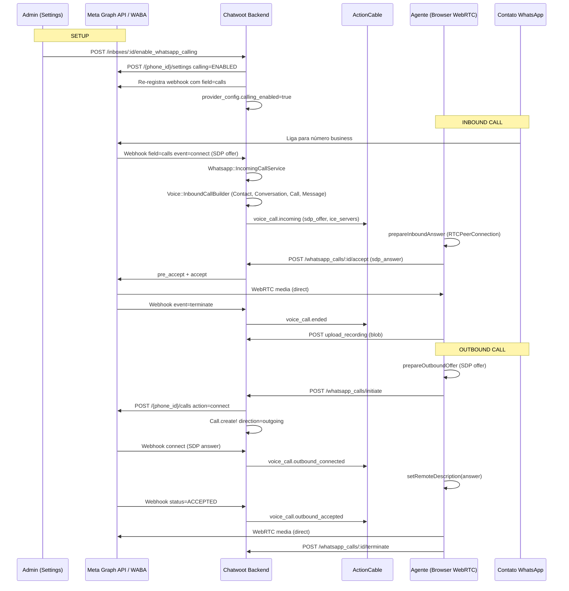
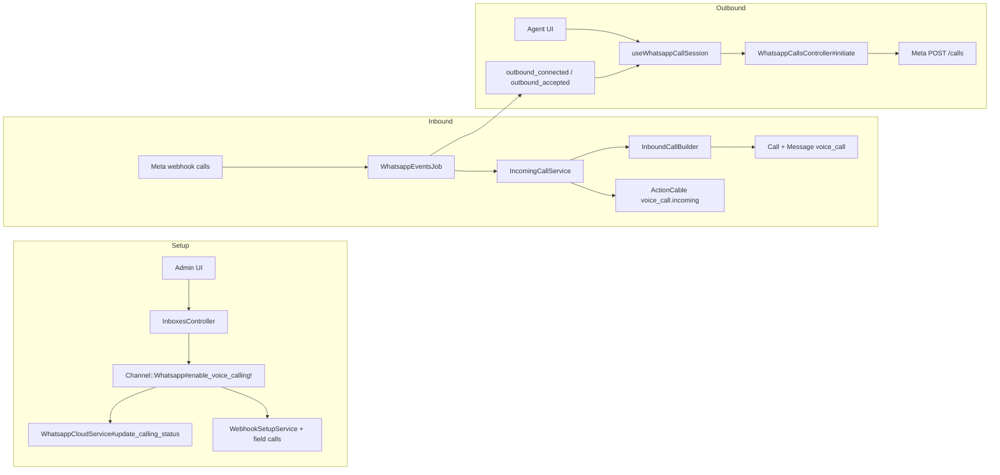

# Arquitetura e fluxo — WhatsApp Voice/Calling

## 1. Visão geral

O recurso permite que **agentes atendam e façam chamadas de voz pelo WhatsApp** diretamente no dashboard, usando **WebRTC no navegador** (mídia vai **browser ↔ Meta**, não passa pelo servidor Chatwoot).

### O que faz

- **Chamadas inbound**: contato liga pelo WhatsApp → agente recebe popup (`FloatingCallWidget`) → aceita/rejeita → áudio peer-to-peer.
- **Chamadas outbound**: agente clica no botão de telefone na conversa → negocia SDP com Meta → toca até o contato atender.
- **Histórico**: cada chamada gera uma mensagem `content_type: voice_call` na conversa, com status, duração e gravação (upload client-side).
- **Permissão outbound**: se o contato não autorizou chamadas, Meta retorna erro `138006` e o sistema envia um template interativo `call_permission_request`.

### Requisitos

| Requisito | Detalhe |
|-----------|---------|
| **Enterprise Edition** | Rotas, model `Call`, serviços e controllers estão em `enterprise/` e são registrados só com `ChatwootApp.enterprise?` |
| **Feature flag `channel_voice`** | Obrigatória em `account.feature_enabled?('channel_voice')` — no Cloud vem do plano Startups+; self-hosted precisa habilitar manualmente |
| **Provider `whatsapp_cloud`** | **Não funciona** com 360dialog (`provider: default`) |
| **Meta WABA + Calling API** | Número precisa estar inscrito na WhatsApp Business Calling API; `enable_voice_calling!` chama `POST .../settings` com `{ calling: { status: 'ENABLED' } }` |
| **Webhook `calls`** | Inscrito automaticamente quando `calling_enabled: true` em `provider_config` |
| **Navegador** | Microfone + WebRTC; STUN via `VOICE_CALL_STUN_URLS` (default `stun:stun.l.google.com:19302`) |

> **Nota:** Existe também um canal **Twilio Voice** separado (`Channel::TwilioSms` com `voice_enabled`) — PSTN tradicional, não WhatsApp Cloud Calling. Ver [twilio-vs-whatsapp-native.md](./twilio-vs-whatsapp-native.md).

---

## 2. Arquitetura

**Padrão central:** Chatwoot é **orquestrador de sinalização e estado**; a mídia é **P2P browser ↔ Meta**.

---

## 3. Setup / Configuração de inbox

### Caminho A — Novo canal "WhatsApp Call" (embedded signup)

| Camada | Arquivo / rota |
|--------|----------------|
| UI lista de canais | `app/javascript/dashboard/routes/dashboard/settings/inbox/ChannelList.vue` — key `whatsapp_call` |
| Factory | `app/javascript/dashboard/routes/dashboard/settings/inbox/ChannelFactory.vue` → `WhatsappCall.vue` |
| Signup | `app/javascript/dashboard/routes/dashboard/settings/inbox/channels/WhatsappCall.vue` → `WhatsappEmbeddedSignup` com `enable-calling-on-complete` |
| Pós-signup | `WhatsappEmbeddedSignup.vue` chama `InboxesAPI.enableWhatsappCalling(inboxId)` |

### Caminho B — Inbox WhatsApp Cloud existente

| Camada | Detalhe |
|--------|---------|
| Tab **Calls** | `Settings.vue` — visível se `isAWhatsAppCloudChannel` + feature `channel_voice` |
| Página | `app/javascript/dashboard/routes/dashboard/settings/inbox/settingsPage/WhatsappCallingPage.vue` |
| Toggle principal | `InboxesAPI.enableWhatsappCalling` / `disableWhatsappCalling` |
| Toggle inbound | `InboxesAPI.setInboundCalls(inboxId, enabled)` |
| Texto permissão | `provider_config.call_permission_request_body` (opcional) |

### Backend do enable

`Channel::Whatsapp#voice_enabled?` exige:

1. `voice_calling_supported?` → `provider == 'whatsapp_cloud'`
2. `provider_config['calling_enabled']` presente
3. `account.feature_enabled?('channel_voice')`

`enable_voice_calling!` (`app/models/channel/whatsapp.rb`):

1. `provider_service.update_calling_status('ENABLED')` na Meta
2. Merge `calling_enabled: true` em `provider_config`
3. `webhook_setup_service.register_callback` (adiciona field `calls`)
4. `save!(validate: false)`

**Controller Enterprise:** `enterprise/app/controllers/enterprise/api/v1/accounts/inboxes_controller.rb`

- `enable_whatsapp_calling` / `disable_whatsapp_calling` / `set_inbound_calls`
- Política: apenas **administradores** (`inbox_policy.rb`)

**Webhook subscription:** `app/services/whatsapp/webhook_setup_service.rb` — adiciona `'calls'` a `subscribed_fields` quando `calling_enabled` está setado.

---

## 4. Fluxo incoming call (passo a passo)

### 4.1 Webhook Meta → Job

1. Meta POST → `/webhooks/whatsapp/:phone_number`
2. Controller: `app/controllers/webhooks/whatsapp_controller.rb`
3. Job: `app/jobs/webhooks/whatsapp_events_job.rb`
4. **Enterprise override:** `enterprise/app/jobs/enterprise/webhooks/whatsapp_events_job.rb`
   - Detecta `field == 'calls'` → `handle_call_events`
   - Mutex por `call_id` (serializa connect/status/terminate)
   - Delega a `Whatsapp::IncomingCallService`

### 4.2 `Whatsapp::IncomingCallService#handle_connect` (event=connect, sdp_type=offer)

Arquivo: `enterprise/app/services/whatsapp/incoming_call_service.rb`

1. Verifica `inbox.channel.voice_enabled?` — senão no-op
2. Se inbound desabilitado (`inbound_calls_enabled == false`) → `provider_service.reject_call`
3. **`Voice::InboundCallBuilder.perform!`** (`enterprise/app/services/voice/inbound_call_builder.rb`):
   - Resolve/cria `ContactInbox` (normaliza `wa_id` via `Whatsapp::PhoneNumberNormalizationService`)
   - Reutiliza conversa aberta (ou cria nova)
   - Cria `Call` (`provider: whatsapp`, `direction: incoming`, `status: ringing`)
   - Cria mensagem via `Voice::CallMessageBuilder`
4. `broadcast_incoming` → ActionCable `voice_call.incoming` com:
   - `sdp_offer`, `ice_servers`, dados do caller
   - Streams: assignee online → senão agentes online do inbox → fallback membros + admins

### 4.3 Agente aceita

1. Frontend: `useWhatsappCallSession.acceptIncomingCall`
   - `getUserMedia` → `RTCPeerConnection` → gera `sdp_answer`
2. `POST /api/v1/accounts/:account_id/whatsapp_calls/:id/accept`
3. **`Whatsapp::CallService#accept`**:
   - Lock na call
   - `pre_accept_call` + `accept_call` na Meta
   - Status → `in_progress`, assignee se vazio
   - Broadcast `voice_call.accepted`

### 4.4 Término

- Meta webhook `event=terminate` → `handle_terminate`
- Deriva status: `completed` / `no_answer` / `failed` (com base em duração, `in_progress`, razão Meta)
- Atualiza mensagem, conversa (`call_status`), broadcast `voice_call.ended`
- Frontend faz upload da gravação se esta aba era dona da call

---

## 5. Fluxo outgoing call

### 5.1 Início (agente)

Pontos de entrada UI:

- `app/javascript/dashboard/components/widgets/conversation/ConversationCallButton.vue`
- `app/javascript/dashboard/components-next/Contacts/VoiceCallButton.vue`
- Bubble outbound em `app/javascript/dashboard/components-next/message/bubbles/VoiceCall.vue`

Fluxo:

1. `prepareOutboundOffer()` — WebRTC offer + ICE gathering
2. `POST /whatsapp_calls/initiate` com `{ conversation_id, sdp_offer }`
3. Controller: `enterprise/app/controllers/api/v1/accounts/whatsapp_calls_controller.rb`
   - `provider_service.initiate_call(phone, sdp_offer)` → Meta `POST /{phone_id}/calls`
   - Cria `Call` outgoing + mensagem `voice_call`

### 5.2 Sinalização assíncrona (webhooks)

| Webhook Meta | Handler | Efeito |
|--------------|---------|--------|
| `connect` (sdp_type=answer) | `accept_outbound_call` | Guarda `sdp_answer`, broadcast `voice_call.outbound_connected` |
| `status=ACCEPTED` | `mark_outbound_accepted` | Status `in_progress`, broadcast `voice_call.outbound_accepted` |
| `terminate` | `handle_terminate` | Finaliza call |

> **Importante:** O evento `connect` outbound chega ~20s **antes** do contato atender. O timer/recorder só iniciam no `ACCEPTED`.

### 5.3 Permissão de chamada (opt-in outbound)

Se Meta retorna erro `138006` (`Voice::CallErrors::NO_CALL_PERMISSION_CODE`):

1. Envia mensagem interativa `call_permission_request`
2. Grava `call_permission_request_message_id` na conversa
3. Retorna HTTP **422** com `{ status: 'permission_requested' }`
4. Quando contato aceita → webhook `call_permission_reply` → `Whatsapp::CallPermissionReplyService`

### 5.4 Encerramento

- Agente: `POST /whatsapp_calls/:id/terminate` → `Whatsapp::CallService#terminate` → Meta `terminate`
- Upload gravação client-side → `POST /whatsapp_calls/:id/upload_recording`
- Beacon no `pagehide` para não deixar call aberta se aba fechar

---

## 6. Integração Meta / WhatsApp Cloud API

Módulo Enterprise: `enterprise/app/services/enterprise/whatsapp/providers/whatsapp_cloud_service.rb`  
Prepended em OSS: `Whatsapp::Providers::WhatsappCloudService.prepend_mod_with(...)`

### Endpoints Graph API (base: `/{version}/{phone_number_id}`)

| Ação | Método | Path | Body chave |
|------|--------|------|------------|
| Habilitar calling | POST | `/settings` | `{ calling: { status: 'ENABLED' } }` |
| Iniciar outbound | POST | `/calls` | `{ action: 'connect', session: { sdp, sdp_type: 'offer' } }` |
| Pre-accept inbound | POST | `/calls` | `{ action: 'pre_accept', session: { sdp, sdp_type: 'answer' } }` |
| Accept | POST | `/calls` | `{ action: 'accept', session: { sdp, sdp_type: 'answer' } }` |
| Reject | POST | `/calls` | `{ action: 'reject' }` |
| Terminate | POST | `/calls` | `{ action: 'terminate' }` |
| Pedir permissão | POST | `/messages` | `type: interactive`, `interactive.type: call_permission_request` |

- **Versão API:** `GlobalConfigService.load('WHATSAPP_API_VERSION', 'v22.0')` — Calls API exige **v17+**
- **Webhook field:** `calls` (eventos `connect`/`terminate` + statuses `RINGING`/`ACCEPTED`)
- **Webhook URL:** `{FRONTEND_URL}/webhooks/whatsapp/{phone_number}`

---

## 7. Frontend

### Componentes principais

| Componente | Caminho | Função |
|------------|---------|--------|
| `FloatingCallWidget` | `app/javascript/dashboard/components-next/call/FloatingCallWidget.vue` | Widget flutuante (incoming/outgoing/active) |
| `CallCard` | `app/javascript/dashboard/components-next/call/CallCard.vue` | Card individual da call |
| `ConversationCallButton` | `app/javascript/dashboard/components/widgets/conversation/ConversationCallButton.vue` | Botão na header da conversa |
| `VoiceCallButton` | `app/javascript/dashboard/components-next/Contacts/VoiceCallButton.vue` | Botão no painel de contato |
| `VoiceCall` bubble | `app/javascript/dashboard/components-next/message/bubbles/VoiceCall.vue` | Bolha de mensagem voice_call |
| `WhatsappCallingPage` | `.../settingsPage/WhatsappCallingPage.vue` | Config de calling na inbox |

### Composables / Store

| Módulo | Caminho | Função |
|--------|---------|--------|
| `useWhatsappCallSession` | `app/javascript/dashboard/composables/useWhatsappCallSession.js` | WebRTC, recorder, API calls |
| `useCallSession` | `app/javascript/dashboard/composables/useCallSession.js` | Abstração Twilio + WhatsApp |
| `useCallsStore` (Pinia) | `app/javascript/dashboard/stores/calls.js` | Estado das calls ativas/incoming |
| `voice.js` helper | `app/javascript/dashboard/helper/voice.js` | Sync message.created → store |

### API client

`app/javascript/dashboard/api/channel/whatsapp/whatsappCallsAPI.js`

### ActionCable events (WhatsApp)

Registrados em `app/javascript/dashboard/helper/actionCable.js`:

- `voice_call.incoming`
- `voice_call.outbound_connected`
- `voice_call.outbound_accepted`
- `voice_call.ended`

### Montagem global

`app/javascript/dashboard/routes/dashboard/Dashboard.vue` — renderiza `FloatingCallWidget` quando há call ativa ou incoming.

### Detecção de provider

`app/javascript/dashboard/helper/inbox.js` — `getVoiceCallProvider()` retorna `'whatsapp'` se inbox WhatsApp + `voice_enabled`.

---

## 8. Enterprise vs OSS

| Camada | OSS | Enterprise |
|--------|-----|------------|
| Model `Call` | — | `enterprise/app/models/call.rb` |
| `Channel::Whatsapp#voice_enabled?`, `enable_voice_calling!` | ✅ OSS | — |
| Meta Calls API methods | Hook `prepend_mod_with` | `enterprise/.../whatsapp_cloud_service.rb` |
| Webhook call routing | Hook `prepend_mod_with` | `enterprise/.../whatsapp_events_job.rb` |
| Serviços WhatsApp call | — | `Whatsapp::IncomingCallService`, `CallService`, `CallPermissionReplyService` |
| Voice builders | — | `Voice::InboundCallBuilder`, `CallMessageBuilder` |
| Controllers | — | `WhatsappCallsController`, extensão `InboxesController` |
| Rotas API | Condicionadas `ChatwootApp.enterprise?` | `config/routes.rb` |
| Message ↔ Call | — | `Enterprise::Message` (`has_one :call`) |
| Twilio Voice (canal separado) | — | `Twilio::VoiceController`, conference, etc. |

**Sem Enterprise:** nenhuma rota `/whatsapp_calls`, model `Call` indisponível, webhooks de `calls` não processados.

---

## 9. Feature flags / plan gates

### `channel_voice`

- Definição: `config/features.yml` (`enabled: false` por default)
- Frontend: `FEATURE_FLAGS.CHANNEL_VOICE` em `featureFlags.js`
- Gate UI canais: `ChannelItem.vue` — `whatsapp_call` e `voice` exigem `channel_voice`
- Gate backend: `Channel::Whatsapp#voice_enabled?`, `enable_voice_calling!`, `WhatsappCallsController#ensure_calling_enabled`
- Cloud billing: incluída em `STARTUP_PLAN_FEATURES` em `enterprise/.../reconcile_plan_features_service.rb`

### Outros gates

- `calling_enabled` em `provider_config` (por inbox)
- `inbound_calls_enabled` (default `true`; explicit `false` bloqueia inbound)
- Agente **online** para receber ring inbound (`actionCable.js`)
- Administrador para toggles de calling nas settings

---

## 10. Diferença vs guia user de setup WhatsApp

O guia [How to setup a WhatsApp channel](https://www.chatwoot.com/hc/user-guide/articles/1677832735-how-to-setup-a-whats-app-channel) cobre:

- Conectar inbox WhatsApp (embedded signup ou manual)
- Mensagens, templates, webhooks de **messages**
- Configuração geral do canal de **texto/mídia**

**Não cobre** (implementado separadamente no código):

- WhatsApp **Business Calling API** / WebRTC
- Canal dedicado **"WhatsApp Call"** (`whatsapp_call` no ChannelList)
- Tab **Calls** nas settings do inbox Cloud
- Fluxo de **permissão outbound** (`call_permission_request`)
- Gravação client-side e upload pós-chamada
- Widget flutuante de voz e bolhas `voice_call`

---

## 11. Pontos de extensão para fork

**Sem marcadores `FORK:`** no código de calls hoje.

### Prioridade recomendada

1. **`custom/` overlay** — novos services/controllers autoloaded
2. **`prepend_mod_with`** (padrão EE):
   - `Whatsapp::Providers::WhatsappCloudService` — endpoints Meta
   - `Webhooks::WhatsappEventsJob` — roteamento webhooks
3. **Edições OSS mínimas com `# FORK:`**:
   - `Channel::Whatsapp#voice_enabled?` / `enable_voice_calling!`
   - `Whatsapp::WebhookSetupService#subscribed_fields`
   - Frontend: composables ou um import em `actionCable.js`

### Arquivos de alto valor para hook

| Arquivo | Por quê |
|---------|---------|
| `enterprise/.../whatsapp_cloud_service.rb` | Customizar API Meta, versão, bodies |
| `enterprise/.../incoming_call_service.rb` | Lógica de roteamento/broadcast inbound |
| `enterprise/.../whatsapp_calls_controller.rb` | Permissões, throttle, outbound rules |
| `useWhatsappCallSession.js` | UX WebRTC, recorder, STUN/TURN |
| `Channel::Whatsapp` | Gates de feature, flags por inbox |
| `WhatsappCallingPage.vue` | UI de configuração |

---

## 12. Gaps / limitações conhecidos

### Produto / plataforma

- **Só `whatsapp_cloud`** — 360dialog não tem Calling API
- **Meta Calling API obrigatória** — erro explícito se número não inscrito
- **Outbound exige opt-in** do contato (erro 138006 + template)
- **Throttle** de permission request: 5 minutos por conversa
- **Mídia só via browser** — agente precisa estar no dashboard com mic
- **Gravação client-side** — qualidade depende do browser; upload best-effort
- **Sem handler frontend** para `voice_call.permission_granted` (só activity message no backend)
- **Inbound ring** só para agentes **online** (availability)
- **Sem vídeo** — apenas áudio WebRTC

### Código / i18n

- **`en/inboxMgmt.json` incompleto** — faltam chaves presentes em outros idiomas
- **`Call` model só em Enterprise** — fork OSS puro não compila/usar sem EE
- **Transcript** no model `Call` existe mas **não há pipeline** visível para WhatsApp
- **TURN não configurado por default** — só STUN; NATs restritivos podem falhar

### Operacional

- `disable_voice_calling!` **não desliga** calling na Meta — só remove flag local e re-subscribe webhook
- Race conditions tratadas com locks Redis + `call.with_lock`

---

## Referência rápida de classes/métodos

| Classe | Método | Papel |
|--------|--------|-------|
| `Whatsapp::IncomingCallService` | `#perform`, `#handle_connect`, `#handle_terminate` | Orquestra webhooks inbound/outbound |
| `Whatsapp::CallService` | `#accept`, `#reject`, `#terminate` | Ações do agente |
| `Whatsapp::CallPermissionReplyService` | `#perform` | Opt-in outbound |
| `Voice::InboundCallBuilder` | `.perform!` | Cria Contact/Conversation/Call/Message inbound |
| `Voice::CallMessageBuilder` | `#perform!`, `#update_status!` | Mensagem voice_call na thread |
| `Channel::Whatsapp` | `#voice_enabled?`, `#enable_voice_calling!` | Gate e setup |
| `Enterprise::Whatsapp::Providers::WhatsappCloudService` | `#initiate_call`, `#accept_call`, etc. | Graph API |
| `Api::V1::Accounts::WhatsappCallsController` | `#initiate`, `#accept`, `#terminate` | API REST |
| `useWhatsappCallSession` | `acceptIncomingCall`, `initiateOutboundCall` | WebRTC no browser |
