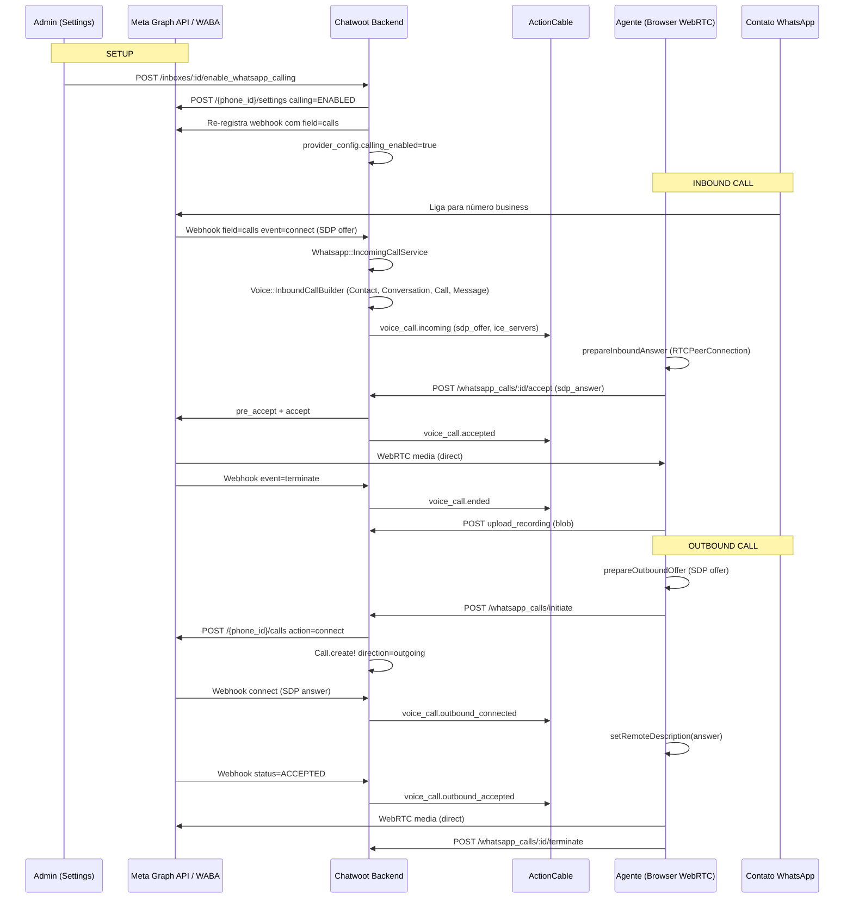
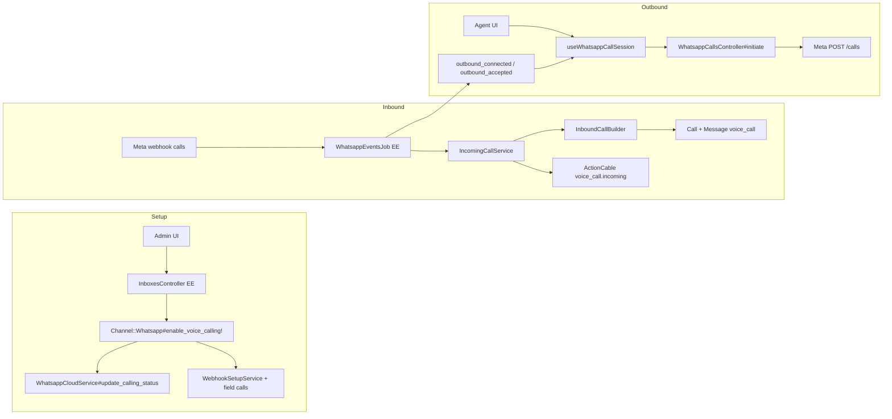

# Arquitetura e fluxo — WhatsApp Voice/Calling

Documentação do stack **WhatsApp Cloud Calling** (Meta Graph API + WebRTC browser↔Meta) no Chatwoot Enterprise. Para Twilio PSTN ou gateways não oficiais, ver [twilio-vs-whatsapp-native.md](./twilio-vs-whatsapp-native.md) e [second-provider-strategy.md](./second-provider-strategy.md).

**Última reanálise:** jun/2026 (reavaliação arquitetural completa).

---

## 1. Visão geral

O recurso permite que **agentes atendam e façam chamadas de voz pelo WhatsApp** diretamente no dashboard, usando **WebRTC no navegador** (mídia vai **browser ↔ Meta**, não passa pelo servidor Chatwoot).

### O que faz

- **Chamadas inbound**: contato liga pelo WhatsApp → agente **online** recebe popup (`FloatingCallWidget`) → aceita/rejeita → áudio peer-to-peer.
- **Chamadas outbound**: agente clica no botão de telefone na conversa → negocia SDP com Meta → toca até o contato atender.
- **Histórico**: cada chamada gera uma mensagem `content_type: voice_call` na conversa, com status, duração e gravação (upload client-side).
- **Permissão outbound**: se o contato não autorizou chamadas, Meta retorna erro `138006` e o sistema envia template interativo `call_permission_request`.

### Canais de voz no produto (não confundir)

| UI key (`ChannelList`) | Modelo backend | Tipo de voz |
|------------------------|----------------|-------------|
| `whatsapp_call` | `Channel::Whatsapp` (`whatsapp_cloud`) | WhatsApp in-app (Meta Calling API) |
| Tab **Calls** em inbox WhatsApp Cloud | idem | idem |
| `voice` | `Channel::TwilioSms` + `voice_enabled` | PSTN / conferência Twilio |

> A tabela `channel_voice` existiu brevemente (migrations 202506 / 202603) e **foi removida**. Não há `Channel::Voice` — voz usa os modelos acima.

### Requisitos

| Requisito | Detalhe |
|-----------|---------|
| **Enterprise Edition** | Rotas, model `Call`, serviços e controllers em `enterprise/`; registrados só com `ChatwootApp.enterprise?` |
| **Feature flag `channel_voice`** | Obrigatória em `account.feature_enabled?('channel_voice')` — Cloud: plano Startups+; self-hosted: rake `chatwoot:self_hosted_enterprise:enable` ou Super Admin |
| **Provider `whatsapp_cloud`** | **Não funciona** com 360dialog (`provider: default`) |
| **Meta WABA + Calling API** | Número inscrito na WhatsApp Business Calling API; `enable_voice_calling!` chama `POST .../settings` com `{ calling: { status: 'ENABLED' } }` |
| **Webhook `calls`** | Inscrito automaticamente quando `calling_enabled: true` em `provider_config` |
| **Navegador** | Microfone + WebRTC; STUN via `VOICE_CALL_STUN_URLS` (default `stun:stun.l.google.com:19302`) |

### Assimetria Twilio vs WhatsApp (débito documentado)

| Aspecto | Twilio (PSTN) | WhatsApp (Meta Calling) |
|---------|---------------|-------------------------|
| Adapter | `Voice::Provider::Twilio::Adapter` | Métodos no prepend `WhatsappCloudService` (sem adapter dedicado) |
| Outbound | `Voice::OutboundCallBuilder` + `Contacts::CallsController` | `WhatsappCallsController#create_outbound_call` inline |
| Sinalização | TwiML + conferência server-side | SDP browser ↔ Meta |
| API REST | `/contacts/:id/calls` | `/whatsapp_calls/*` |

Não é bug — outbound WhatsApp exige `sdp_offer` do browser antes do `Call.create!`. Ainda assim, extrair `Voice::OutboundWhatsappCallBuilder` alinha o padrão e facilita testes.

---

## 2. Arquitetura



**Padrão central:** Chatwoot é **orquestrador de sinalização e estado**; a mídia é **P2P browser ↔ Meta**.



### Modelo de dados (`Call`)

| Campo | Uso WhatsApp |
|-------|----------------|
| `provider` | `:whatsapp` (enum) |
| `provider_call_id` | ID Meta (`calls[].id`) — unique com `provider` |
| `direction` | `incoming` / `outgoing` |
| `status` | `ringing` → `in_progress` → `completed` / `no_answer` / `failed` |
| `meta.sdp_offer` | Offer inbound ou outbound |
| `meta.sdp_answer` | Answer do agente ou Meta (outbound connect) |
| `meta.ice_servers` | STUN/TURN para o browser |
| `message_id` | Bolha `voice_call` na conversa |

Arquivo: `enterprise/app/models/call.rb`.

---

## 3. Setup / Configuração de inbox

### Caminho A — Novo canal "WhatsApp Call" (embedded signup)

| Camada | Arquivo / rota |
|--------|----------------|
| UI lista de canais | `ChannelList.vue` — key `whatsapp_call` (gate: `channel_voice` + `whatsappAppId`) |
| Factory | `ChannelFactory.vue` → `WhatsappCall.vue` |
| Signup | `WhatsappCall.vue` → `WhatsappEmbeddedSignup` com `enable-calling-on-complete` |
| Pós-signup | `WhatsappEmbeddedSignup.vue` chama `InboxesAPI.enableWhatsappCalling(inboxId)` |

### Caminho B — Inbox WhatsApp Cloud existente

| Camada | Detalhe |
|--------|---------|
| Tab **Calls** | `Settings.vue` — visível se `isAWhatsAppCloudChannel` + feature `channel_voice` |
| Página | `WhatsappCallingPage.vue` |
| Toggle principal | `InboxesAPI.enableWhatsappCalling` / `disableWhatsappCalling` |
| Toggle inbound | `InboxesAPI.setInboundCalls(inboxId, enabled)` — também funciona em Twilio voice |
| Texto permissão | `provider_config.call_permission_request_body` (opcional) |

### Backend do enable

`Channel::Whatsapp#voice_enabled?` exige **todas**:

1. `voice_calling_supported?` → `provider == 'whatsapp_cloud'`
2. `provider_config['calling_enabled']` presente
3. `account.feature_enabled?('channel_voice')`

`enable_voice_calling!` (`app/models/channel/whatsapp.rb`):

1. `provider_service.update_calling_status('ENABLED')` na Meta
2. Merge `calling_enabled: true` em `provider_config`
3. `webhook_setup_service.register_callback` (adiciona field `calls`)
4. `save!(validate: false)` — evita re-validação remota de credenciais

`disable_voice_calling!`:

1. Remove `calling_enabled` localmente
2. Re-registra webhook **sem** field `calls`
3. **Não** chama Meta para `DISABLED` — WABA pode continuar com calling ativo na Meta

**Controller Enterprise:** `enterprise/app/controllers/enterprise/api/v1/accounts/inboxes_controller.rb`

- `enable_whatsapp_calling` / `disable_whatsapp_calling` / `set_inbound_calls`
- Política: administradores (`inbox_policy.rb` + `feature_enabled?('channel_voice')`)

**Webhook subscription:** `app/services/whatsapp/webhook_setup_service.rb`:

```ruby
def subscribed_fields
  fields = %w[messages smb_message_echoes]
  fields << 'calls' if @channel.provider_config['calling_enabled']
  fields
end
```

---

## 4. API REST (agente)

Rotas em `config/routes.rb` (condicionadas `ChatwootApp.enterprise?`):

| Método | Rota | Ação |
|--------|------|------|
| `POST` | `/whatsapp_calls/initiate` | Outbound: `{ conversation_id, sdp_offer }` |
| `GET` | `/whatsapp_calls/:id` | SDP offer, ice_servers, caller (fallback se cable atrasar) |
| `POST` | `/whatsapp_calls/:id/accept` | Inbound: `{ sdp_answer }` |
| `POST` | `/whatsapp_calls/:id/reject` | Rejeitar inbound |
| `POST` | `/whatsapp_calls/:id/terminate` | Encerrar (agent hangup) |
| `POST` | `/whatsapp_calls/:id/upload_recording` | Blob `recording` (multipart) |

Controller: `enterprise/app/controllers/api/v1/accounts/whatsapp_calls_controller.rb`.

Respostas de permissão outbound (HTTP **422**):

| `status` | Significado |
|----------|-------------|
| `permission_requested` | Template `call_permission_request` enviado agora |
| `permission_pending` | Throttle 5 min — já pediu recentemente |
| `failed` | Falha ao enviar template |

---

## 5. Fluxo incoming call

### 5.1 Webhook Meta → Job

1. Meta POST → `/webhooks/whatsapp/:phone_number`
2. `app/controllers/webhooks/whatsapp_controller.rb`
3. `app/jobs/webhooks/whatsapp_events_job.rb`
4. **Enterprise prepend:** `enterprise/app/jobs/enterprise/webhooks/whatsapp_events_job.rb`
   - `field == 'calls'` → `handle_call_events`
   - Mutex Redis por `call_id` (serializa connect/status/terminate)
   - Dois shapes no payload: `value.calls[]` (eventos) e `value.statuses[]` (RINGING, ACCEPTED)

### 5.2 `handle_connect` (event=connect, sdp_type=offer)

Arquivo: `enterprise/app/services/whatsapp/incoming_call_service.rb`

1. Verifica `inbox.channel.voice_enabled?` — senão no-op
2. Se inbound desabilitado → `provider_service.reject_call`
3. **`Voice::InboundCallBuilder.perform!`**:
   - Normaliza `wa_id` via `Whatsapp::PhoneNumberNormalizationService`
   - Reutiliza conversa aberta (mesma regra de mensagens)
   - Cria `Call` incoming `ringing` + mensagem `voice_call`
4. `broadcast_incoming` → ActionCable `voice_call.incoming`:
   - Streams: **assignee** se online → senão agentes **online** do inbox → fallback membros + admins
   - **Não** broadcast account-wide no inbound (diferente de outbound/ended)

### 5.3 Agente aceita

1. `useWhatsappCallSession.acceptIncomingCall` — WebRTC answer
2. `POST .../accept` → `Whatsapp::CallService#accept`:
   - Lock + `pre_accept_call` + `accept_call` na Meta
   - Status `in_progress`, assignee se vazio
   - Broadcast `voice_call.accepted` (account-wide)

### 5.4 Término

- Meta webhook `event=terminate` → `handle_terminate`
- Status: `completed` / `no_answer` / `failed` (duração, `in_progress`, `terminate_reason`)
- Broadcast `voice_call.ended` (account-wide)
- Frontend: upload gravação se esta aba é dona da call (`isLocalWhatsappCall`)

---

## 6. Fluxo outgoing call

### 6.1 Início (agente)

Pontos de entrada UI:

- `ConversationCallButton.vue`
- `VoiceCallButton.vue`
- Bolha outbound `VoiceCall.vue`

Fluxo:

1. `prepareOutboundOffer()` — WebRTC offer + ICE gathering
2. `POST /whatsapp_calls/initiate` com `{ conversation_id, sdp_offer }`
3. Cria `Call` outgoing + mensagem `voice_call` **na mesma transaction** (evita bubble sem payload `call`)

### 6.2 Sinalização assíncrona (webhooks)

| Webhook Meta | Handler | Efeito |
|--------------|---------|--------|
| `connect` (sdp_type=answer) | `accept_outbound_call` | Guarda `sdp_answer`, broadcast `voice_call.outbound_connected` |
| `status=ACCEPTED` | `mark_outbound_accepted` | Status `in_progress`, broadcast `voice_call.outbound_accepted` |
| `terminate` | `handle_terminate` | Finaliza call |

> **Importante:** `connect` outbound chega ~20s **antes** do contato atender. Timer/recorder só iniciam no `ACCEPTED` (`armOutboundRecorder`).

Race handling no frontend:

- `pendingOutboundAnswers` Map — cable pode chegar antes de `/initiate` retornar `id`
- `applyOutboundAnswer` filtra por `callId` para não aplicar SDP de outro agente

### 6.3 Permissão de chamada (opt-in outbound)

Erro Meta `138006` (`Voice::CallErrors::NO_CALL_PERMISSION_CODE`):

1. Envia `call_permission_request` interativo
2. Grava `call_permission_request_message_id` na conversa
3. HTTP 422 `{ status: 'permission_requested' | 'permission_pending' }`

Quando contato aceita → webhook `call_permission_reply` → `Whatsapp::CallPermissionReplyService`:

- Limpa flags na conversa
- Activity message `permission_granted`
- Broadcast `voice_call.permission_granted` — **sem handler registrado em `actionCable.js` hoje**

### 6.4 Encerramento

- Agente: `POST .../terminate` → Meta `terminate`
- `pagehide`: `sendWhatsappTerminateBeacon()` — `fetch` + keepalive + headers devise (beacon puro 401)
- Upload gravação client-side → `upload_recording`

---

## 7. Integração Meta / WhatsApp Cloud API

Módulo Enterprise prepended em OSS:

`Whatsapp::Providers::WhatsappCloudService.prepend_mod_with('Enterprise::Whatsapp::Providers::WhatsappCloudService')`

### Endpoints Graph API (base: `/{version}/{phone_number_id}`)

| Ação | Método | Path | Body chave |
|------|--------|------|------------|
| Habilitar calling | POST | `/settings` | `{ calling: { status: 'ENABLED' } }` |
| Iniciar outbound | POST | `/calls` | `{ action: 'connect', to, session: { sdp, sdp_type: 'offer' } }` |
| Pre-accept inbound | POST | `/calls` | `{ action: 'pre_accept', call_id, session: { sdp, sdp_type: 'answer' } }` |
| Accept | POST | `/calls` | `{ action: 'accept', call_id, session: { sdp, sdp_type: 'answer' } }` |
| Reject | POST | `/calls` | `{ action: 'reject', call_id }` |
| Terminate | POST | `/calls` | `{ action: 'terminate', call_id }` |
| Pedir permissão | POST | `/messages` | `type: interactive`, `interactive.type: call_permission_request` |

- **Versão API calls:** `GlobalConfigService.load('WHATSAPP_API_VERSION', 'v22.0')` — Calls exige **v17+** (OSS messages podem usar versão mais antiga)
- **Webhook:** `{FRONTEND_URL}/webhooks/whatsapp/{phone_number}`

---

## 8. Frontend

### Componentes principais

| Componente | Caminho | Função |
|------------|---------|--------|
| `FloatingCallWidget` | `components-next/call/FloatingCallWidget.vue` | Widget flutuante |
| `ConversationCallButton` | `components/widgets/conversation/ConversationCallButton.vue` | Header da conversa |
| `VoiceCallButton` | `components-next/Contacts/VoiceCallButton.vue` | Painel de contato |
| `VoiceCall` | `components-next/message/bubbles/VoiceCall.vue` | Bolha voice_call |
| `WhatsappCallingPage` | `settingsPage/WhatsappCallingPage.vue` | Settings Calls |

Montagem global: `Dashboard.vue` renderiza `FloatingCallWidget` quando há call ativa/incoming.

### Composables / Store

| Módulo | Função |
|--------|--------|
| `useWhatsappCallSession.js` | WebRTC, recorder, race buffers, beacon terminate |
| `useCallSession.js` | Orquestrador Twilio + WhatsApp; timer global; seed de calls após refresh |
| `calls.js` (Pinia) | Estado calls; `teardownByProvider` |
| `voice.js` | Sync `message.created` → store |

API client: `api/channel/whatsapp/whatsappCallsAPI.js`

### ActionCable events (WhatsApp)

Registrados em `actionCable.js`:

| Evento | Handler | Filtros |
|--------|---------|---------|
| `voice_call.incoming` | `onVoiceCallIncoming` | `provider === whatsapp`, agente `availability === online` |
| `voice_call.outbound_connected` | `onVoiceCallOutboundConnected` | SDP answer |
| `voice_call.outbound_accepted` | `onVoiceCallOutboundAccepted` | `armOutboundRecorder` + `setCallActive` |
| `voice_call.ended` | `onVoiceCallEnded` | Teardown só se `isLocalWhatsappCall` |
| `voice_call.accepted` | — | **Não registrado no FE** (inbound pickup confirmado server-side) |
| `voice_call.permission_granted` | — | **Não registrado no FE** |

### Detecção de provider

`helper/inbox.js` — `getVoiceCallProvider()`:

- `Channel::TwilioSms` + `voice_enabled` → `twilio`
- `Channel::Whatsapp` + `voice_enabled` → `whatsapp`

Comentário no código convida novos providers — sem registry formal.

---

## 9. Enterprise vs OSS

| Camada | OSS | Enterprise |
|--------|-----|------------|
| `Channel::Whatsapp#voice_enabled?`, enable/disable | ✅ | — |
| Model `Call` | — | `enterprise/app/models/call.rb` |
| Meta Calls API | Hook prepend (vazio OSS) | `enterprise/.../whatsapp_cloud_service.rb` |
| Webhook call routing | Hook prepend | `enterprise/.../whatsapp_events_job.rb` |
| Serviços call | — | `IncomingCallService`, `CallService`, `CallPermissionReplyService` |
| Voice builders | — | `InboundCallBuilder`, `CallMessageBuilder`, `OutboundCallBuilder` |
| Controllers | — | `WhatsappCallsController`, extensão `InboxesController` |
| Rotas `/whatsapp_calls` | — | Condicionadas `ChatwootApp.enterprise?` |
| Message ↔ Call | — | `Enterprise::Message` (`has_one :call`) |
| Twilio Voice | — | `Twilio::VoiceController`, `ConferenceController`, etc. |
| Erros de domínio | — | `enterprise/lib/voice/call_errors.rb` |

**Sem Enterprise:** sem rotas `/whatsapp_calls`, model `Call` indisponível, webhooks `calls` não processados (prepend no-op).

---

## 10. Feature flags / plan gates

### `channel_voice`

- `config/features.yml` — `enabled: false`, `premium: true`
- Frontend: `FEATURE_FLAGS.CHANNEL_VOICE`
- Gates: `ChannelItem.vue` (`whatsapp_call`, `voice`), backend `voice_enabled?`, controller EE
- Cloud: `STARTUP_PLAN_FEATURES` em `reconcile_plan_features_service.rb`

### Outros gates

| Gate | Comportamento |
|------|---------------|
| `calling_enabled` | Por inbox em `provider_config` |
| `inbound_calls_enabled` | Default `true`; explicit `false` bloqueia inbound |
| Agente online | `actionCable.js` filtra inbound ring |
| Admin | Toggles calling nas settings |

---

## 11. Pontos de extensão para fork

**Sem marcadores `FORK:`** no código de voz upstream (jun/2026), exceto `Voice::InboundCallBuilder` → `Conversations::Resolver`.

**Antes de provider SDP/Meta-like:** executar o roadmap §13. Para Wavoip, executar
primeiro o [spike e os gates próprios](./wavoip-provider/implementation-plan.md);
apenas o registry compartilhado entra no caminho crítico.

### Prioridade recomendada

1. **`custom/` overlay** — services, controllers e channel models de gateway
2. **Prepend** — `WhatsappCloudService`/`WhatsappEventsJob` via `prepend_mod_with`; `Channel::Whatsapp` via prepend direto
3. **Edições OSS mínimas com `# FORK:`** — `inbox.js`, `useCallSession.js`, `actionCable.js`, `ChannelList.vue`

Ver também: [second-provider-strategy.md](./second-provider-strategy.md) · [twilio-vs-whatsapp-native.md](./twilio-vs-whatsapp-native.md) · [wavoip-provider/contracts-and-ports.md](./wavoip-provider/contracts-and-ports.md) (primeiro provider alternativo)

### Wavoip (fork — não Meta)

| Documento | Conteúdo |
|-----------|----------|
| [wavoip-provider/contracts-and-ports.md](./wavoip-provider/contracts-and-ports.md) | Portas, DTOs, DI, backlog §12 |
| [wavoip-provider/implementation-plan.md](./wavoip-provider/implementation-plan.md) | Fases 0–5 |

Pré-requisito: spike Wavoip antes de alterar o frontend compartilhado; registry de
sessão/eventos antes da integração final com widget/store.

### Arquivos de alto valor

| Arquivo | Por quê |
|---------|---------|
| `enterprise/.../whatsapp_cloud_service.rb` | Endpoints Meta |
| `enterprise/.../incoming_call_service.rb` | Roteamento/broadcast inbound |
| `enterprise/.../whatsapp_calls_controller.rb` | API agente, permissões |
| `useWhatsappCallSession.js` | WebRTC, recorder, STUN |
| `Channel::Whatsapp` | Gates por provider |
| `WhatsappCallingPage.vue` | UI config oficial |

---

## 12. Gaps / limitações conhecidos

### Produto / plataforma

- **Só `whatsapp_cloud`** — 360dialog sem Calling API
- **Outbound exige opt-in** Meta (138006 + template)
- **Throttle** permission request: 5 min/conversa
- **Mídia só via browser** — agente no dashboard com mic
- **Gravação client-side** — upload best-effort
- **Inbound ring** só agentes **online**
- **Sem vídeo** — áudio only

### Código

- **`voice_call.permission_granted`** e **`voice_call.accepted`** sem handlers FE
- **`Call.transcript`** existe no model — sem pipeline WhatsApp
- **TURN** não default — só STUN (`VOICE_CALL_STUN_URLS`); NAT corporativo pode falhar
- **`disable_voice_calling!`** não desliga calling na Meta (`calling.status` permanece `ENABLED`)
- Locks Redis + `call.with_lock` para races webhook/agente
- **`useWhatsappCallSession.js` (~456 linhas)** — WebRTC + recorder + API + beacon num módulo
- **`useCallSession.js` (~320 linhas)** — branching `isWhatsappCall` sem registry formal
- **Outbound WhatsApp** sem `OutboundCallBuilder` (lógica no controller)
- **Permissão outbound** (~70 linhas) em `WhatsappCallsController#render_permission_request`
- **Sem testes FE** para race buffers (`pendingOutboundAnswers`), beacon terminate, fluxo 422 permission
- **Model `Call`** mistura meta Twilio (`conference_sid`) e WhatsApp (`sdp_*` em `meta` jsonb)

### Scorecard vs rules do projeto

| Rule (`architecture.mdc` / `chatwoot-core.mdc`) | Status |
|-------------------------------------------------|--------|
| Controllers finos → services | **OK** (permissão outbound é exceção) |
| Uma ação por service | **OK** |
| HTTP só na camada provider | **OK** |
| Vue: lógica em composables | **OK**, mas composable WhatsApp grande |
| `components-next/` para UI | **OK** |
| Evitar god class | **Backend OK**; **FE em risco** |
| Evitar shotgun surgery | **Presente** em `useCallSession` + `actionCable.js` |
| Fork: EE + `custom/` | **OK** — sem FORK em voz upstream (exceto `Conversations::Resolver` no builder) |

### Relação com providers alternativos

Mensagens gateway ≠ voz gateway. Gates em [gaps-and-blockers.md §5](../whatsapp-provider/gaps-and-blockers.md). Para voz gateway, validar contrato de SDP/events antes de implementar e usar [second-provider-strategy.md](./second-provider-strategy.md) como checklist.

---

## 13. Roadmap de refatoração (melhorias sugeridas)

Melhorias identificadas na reanálise jun/2026. **Não bloqueiam** o happy path Meta
oficial. A extração WebRTC bloqueia somente providers SDP/Meta-like; Wavoip precisa
do dispatch por provider, mas não compartilha o core SDP.

### 13.1 Backend

#### A. `Voice::Provider::MetaCloud::Adapter`

Extrair métodos de calling do prepend `Enterprise::Whatsapp::Providers::WhatsappCloudService` para adapter simétrico ao Twilio:

```ruby
# enterprise/app/services/voice/provider/meta_cloud/adapter.rb
class Voice::Provider::MetaCloud::Adapter
  def initialize(channel)
    @channel = channel
  end

  def initiate_call(to_phone, sdp_offer); end
  def pre_accept_call(call_id, sdp_answer); end
  # ... reject, terminate, send_call_permission_request, update_calling_status
end
```

O prepend de `WhatsappCloudService` delega ao adapter (ou o channel expõe `whatsapp_calling_adapter`). Novos CPaaS implementam o mesmo contrato em `custom/`.

**Contrato sugerido:** `Voice::Provider::WhatsappCalling::Base` — ver [second-provider-strategy.md](./second-provider-strategy.md).

#### B. `Voice::OutboundWhatsappCallBuilder`

Espelhar `Voice::OutboundCallBuilder` (Twilio), mas com SDP do browser:

```ruby
# enterprise/app/services/voice/outbound_whatsapp_call_builder.rb
class Voice::OutboundWhatsappCallBuilder
  def self.perform!(conversation:, agent:, sdp_offer:)
    # provider_service.initiate_call → Call.create! → CallMessageBuilder → message_id
  end
end
```

`WhatsappCallsController#initiate` fica: authorize → builder → render.

#### C. `Whatsapp::CallPermissionRequestService`

Mover de `WhatsappCallsController#render_permission_request`:

- throttle 5 min
- `conversation.with_lock`
- `send_call_permission_request` + activity message + `additional_attributes`

Controller: `rescue_from NoCallPermission` → `service.perform!` → render 422.

#### D. `IncomingCallService` (opcional P3)

~216 linhas, responsabilidade coesa. Se crescer com CPaaS, extrair handlers:

- `ConnectHandler`, `TerminateHandler`, `StatusHandler` — cada um chama `InboundCallBuilder` / `update_call!` / `broadcast`.

### 13.2 Frontend

#### A. `useWebRtcCallSession(callsAPI)` (P0)

```
app/javascript/dashboard/composables/useWebRtcCallSession.js   # RTCPeerConnection, recorder, race buffers — API injetável
app/javascript/dashboard/composables/useWhatsappCallSession.js # thin wrapper → WhatsappCallsAPI
custom/.../useWavoipCallSession.js                           # thin wrapper → WavoipCallsAPI (fork)
```

Interface mínima do `callsAPI`:

| Método | Uso |
|--------|-----|
| `show(callId)` | Fallback SDP se cable atrasar |
| `accept(callId, sdpAnswer)` | Inbound |
| `reject(callId)` | Inbound |
| `terminate(callId)` | Hangup |
| `initiate(conversationId, sdpOffer)` | Outbound |
| `uploadRecording(callId, blob)` | Pós-chamada |

Exports module-level preservados: `applyOutboundAnswer`, `armOutboundRecorder`, `handleWhatsappRemoteEnd`, `sendWhatsappTerminateBeacon` (renomear para provider-agnostic no refactor).

#### B. Registry em `useCallSession.js` (P0)

```javascript
// custom/.../voiceCallProviders.js ou FORK mínimo em useCallSession.js
const voiceCallProviderRegistry = {
  [VOICE_CALL_PROVIDERS.TWILIO]: { endCall, joinCall, rejectIncomingCall, /* Twilio */ },
  [VOICE_CALL_PROVIDERS.WHATSAPP]: { endCall, joinCall, rejectIncomingCall, session: useWhatsappCallSession },
  // [VOICE_CALL_PROVIDERS.WAVOIP]: { ... }
};
```

Substituir `isWhatsappCall(call)` espalhado por `registry[call.provider]`.

#### C. `actionCable.js` — generalizar filtro (P0)

```javascript
const WEBRTC_PROVIDERS = [VOICE_CALL_PROVIDERS.WHATSAPP /*, WAVOIP */];

onVoiceCallIncoming = data => {
  if (!WEBRTC_PROVIDERS.includes(data?.provider)) return;
  // ...
};
```

#### D. Handler `voice_call.permission_granted` (P2)

- Registrar em `actionCable.js`
- Toast/banner: "Contato autorizou chamadas — pode ligar novamente"
- Opcional: limpar estado `permission_pending` na conversa ativa

#### E. Testes Vitest (P2)

| Caso | O quê mockar |
|------|--------------|
| `pendingOutboundAnswers` race | Cable antes de `/initiate` |
| `initiateOutboundCall` 422 | `permission_requested` / `permission_pending` |
| `beaconTerminate` | `fetch` keepalive + headers cookie |
| `isLocalWhatsappCall` | teardown só na aba dona |

### 13.3 Modelo e config

| Melhoria | Detalhe |
|----------|---------|
| Enum `Call.provider` | Novo valor exige edição mínima `# FORK:` em `Call`; o model não chama `prepend_mod_with` |
| `VOICE_CALL_STUN_URLS` | Aceitar lista STUN+TURN: `stun:...,turn:...` com credenciais se necessário |
| `disable_voice_calling!` | Opcional: chamar Meta `DISABLED` (hoje só flag local) |

### 13.4 Onde implementar (fork vs upstream)

| Melhoria | Fork (`custom/`) | Upstream (`enterprise/`) |
|----------|------------------|--------------------------|
| `useWebRtcCallSession` | Pode começar em `custom/` com alias Vite | Ideal contribuir ao EE se aceito |
| Meta adapter + builders | Prepend delegando | Natural em EE |
| Wavoip canal + webhook | **Sempre** `custom/` | Não tocar |
| Registry FE | `# FORK:` em 3–4 arquivos | — |

---

## 14. Boas práticas Meta / WebRTC (externas)

Referências: [Meta Calling docs](https://developers.facebook.com/docs/whatsapp/cloud-api/calling), integradores WebRTC (2025–2026). A implementação atual cobre o fluxo oficial; pontos abaixo são **melhorias operacionais**, não bugs confirmados.

| Tópico | Recomendação Meta/mercado | Estado Chatwoot |
|--------|---------------------------|-----------------|
| Sinalização | Webhook `calls` + Graph `/calls` (ou SIP exclusivo — não misturar) | Graph + webhooks ✅ |
| Inbound | `pre_accept` + `accept` com SDP answer | `CallService#forward_answer_to_meta!` ✅ |
| Outbound pickup | `connect` (túnel) ≠ `status=ACCEPTED` (atendimento) | `armOutboundRecorder` no ACCEPTED ✅ |
| ICE | Stack business ICE-FULL; Meta ICE-LITE | Browser gera candidatos ✅ |
| STUN/TURN | STUN mínimo; TURN em NAT restritivo | Só STUN default ⚠️ |
| SDP | CRLF, fingerprint SHA-256 uppercase se DTLS | Browser nativo; pin `setup:active` no outbound ✅ |
| Áudio clipping | SDES ou otimizar DTLS handshake em cenários server-side | N/A (browser↔Meta direto) |
| Opt-in outbound | Erro 138006 + template interativo | Implementado ✅ |
| Gravação | Server-side opcional na Meta; client-side best-effort | Upload client-side apenas |

**Ação recomendada para produção:** documentar na UI admin que `VOICE_CALL_STUN_URLS` aceita TURN (`turn:host:port?transport=udp`) quando agentes estão atrás de firewall corporativo.

---

## Referência rápida de classes

| Classe | Papel | Melhoria sugerida |
|--------|-------|-------------------|
| `Whatsapp::IncomingCallService` | Webhooks connect/terminate/status | Handlers opcionais (§13.1.D) |
| `Whatsapp::CallService` | accept / reject / terminate (agente) | Injetar adapter |
| `Whatsapp::CallPermissionReplyService` | Opt-in outbound (reply webhook) | — |
| `Whatsapp::CallPermissionRequestService` | — | **Extrair** do controller (§13.1.C) |
| `Voice::InboundCallBuilder` | Contact/Conversation/Call/Message inbound | Reuso Wavoip ✅ |
| `Voice::OutboundCallBuilder` | Outbound Twilio | — |
| `Voice::OutboundWhatsappCallBuilder` | — | **Criar** (§13.1.B) |
| `Voice::CallMessageBuilder` | Bolha voice_call | — |
| `Voice::Provider::MetaCloud::Adapter` | — | **Criar** (§13.1.A) |
| `Channel::Whatsapp` | `voice_enabled?`, enable/disable | `whatsapp_calling_adapter` dispatch |
| `Enterprise::Whatsapp::Providers::WhatsappCloudService` | Graph API calls | Delegar ao adapter |
| `Api::V1::Accounts::WhatsappCallsController` | REST | Afinar com builders/services |
| `useWebRtcCallSession` | — | **Extrair** do WhatsApp session (§13.2.A) |
| `useWhatsappCallSession` | WebRTC browser (wrapper) | Thin após extração |
| `useCallSession` | Orquestrador Twilio + WhatsApp | Registry (§13.2.B) |
