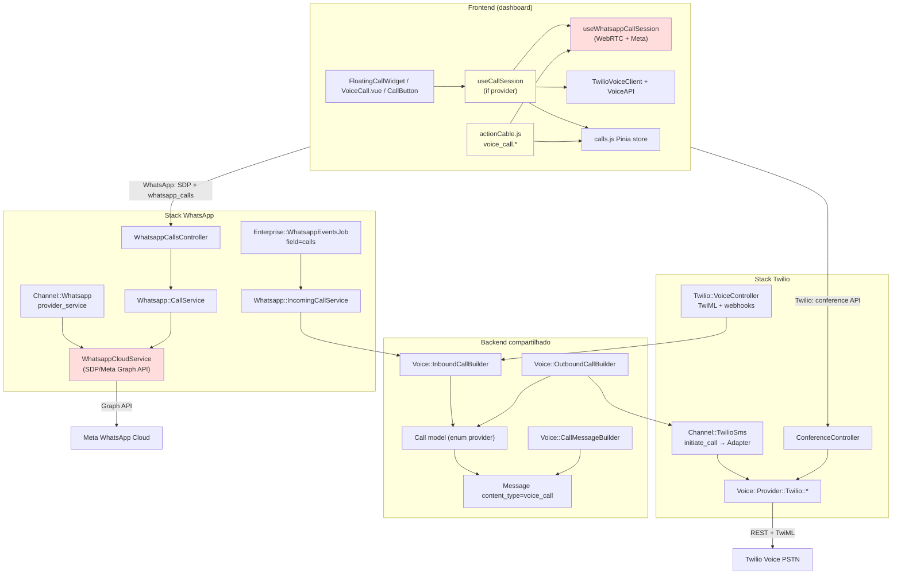

# Acoplamento de providers e extensibilidade

## Resumo executivo

A implementação de voz no Chatwoot Enterprise é **híbrida**: há camadas compartilhadas (`Call`, builders, UI genérica), mas **dois stacks quase independentes** — Twilio (PSTN + conferência + SDK) e WhatsApp (WebRTC browser↔Meta + SDP). Não existe uma interface de provider unificada; o desacoplamento é feito por `if (provider === 'whatsapp')` no frontend e por controllers/serviços separados no backend.

**Veredito:** possível com esforço **médio-alto** (2–6 semanas conforme o tipo de provider). Para um **segundo provider de chamadas WhatsApp**, reutilizar o stack WebRTC (como o atual) — **não** o padrão Twilio PSTN.

---

## 1. Camadas de abstração hoje

### Frontend: `useCallSession` vs `useWhatsappCallSession`

| Camada | Papel | Interface de provider? |
|--------|-------|------------------------|
| `useCallSession.js` | Orquestrador: timer, listeners globais, `joinCall` / `endCall` / `rejectIncomingCall` | **Não** — ramifica com `isWhatsappCall(call)` e importa Twilio + WhatsApp diretamente |
| `useWhatsappCallSession.js` | WebRTC completo: `RTCPeerConnection`, SDP, gravação no browser, beacon de terminate | **Não** — 100% acoplado a Meta + `/whatsapp_calls` |
| `getVoiceCallProvider()` em `inbox.js` | Mapeia `channel_type` → `'twilio'` \| `'whatsapp'` | Discriminador simples; comentário convida novos providers, mas sem registry/plugin |

```javascript
// app/javascript/dashboard/helper/inbox.js
export const getVoiceCallProvider = inbox => {
  if (!voiceEnabled) return null;
  if (channelType === INBOX_TYPES.TWILIO) return VOICE_CALL_PROVIDERS.TWILIO;
  if (channelType === INBOX_TYPES.WHATSAPP) return VOICE_CALL_PROVIDERS.WHATSAPP;
  return null;
};
```

`useCallSession` delega ações por provider — exemplo em `endCall`:

- **WhatsApp:** `whatsappSession.endActiveCall(call?.callId)`
- **Twilio:** `VoiceAPI.leaveConference` + `TwilioVoiceClient.endClientCall`

### Backend: Twilio vs WhatsApp

| Aspecto | Twilio | WhatsApp |
|---------|--------|----------|
| Namespace | `Voice::Provider::Twilio::*` (Adapter, TokenService, ConferenceService) | Métodos em `Enterprise::Whatsapp::Providers::WhatsappCloudService` (prepend) |
| Interface base | **Não existe** `Voice::Provider::Base` | Duck-typing em `channel.provider_service` |
| Outbound API | `Contacts::CallsController` → `Voice::OutboundCallBuilder` | `WhatsappCallsController#initiate` (SDP obrigatório) |
| Inbound | `Twilio::VoiceController` (TwiML) | `Whatsapp::IncomingCallService` via webhook `field=calls` |
| Ações do agente | `ConferenceController` (join/leave/token) | `WhatsappCallsController` (accept/reject/terminate + SDP) |
| Tempo real FE | `message.created` / `message.updated` | ActionCable `voice_call.*` + mensagens |

### Modelo `Call`

Polimorfismo **leve** via enum:

```ruby
# enterprise/app/models/call.rb
enum :provider, { twilio: 0, whatsapp: 1 }
enum :direction, { incoming: 0, outgoing: 1 }
```

- `provider_call_id` + índice único `(provider, provider_call_id)`
- `meta` jsonb: Twilio usa `conference_sid`; WhatsApp guarda `sdp_offer`, `sdp_answer`, `ice_servers`
- Builders compartilhados (`Voice::InboundCallBuilder`, `Voice::OutboundCallBuilder`, `Voice::CallMessageBuilder`) aceitam `provider:` como parâmetro

---

## 2. Diagrama de acoplamento atual



---

## 3. Pontos de acoplamento (severidade)

| Ponto | Severidade | Detalhe |
|-------|------------|---------|
| `useWhatsappCallSession.js` (~450 linhas WebRTC/SDP/Meta) | **Alta** | Lógica de mídia, gravação, race conditions Meta-specific |
| `WhatsappCallsController` + rotas `/whatsapp_calls` | **Alta** | API dedicada; sem equivalente genérico `CallsController` |
| `Enterprise::Whatsapp::Providers::WhatsappCloudService` (Calls API Graph) | **Alta** | `pre_accept`, `accept`, `terminate`, `initiate_call` com corpo Meta |
| `Enterprise::Webhooks::WhatsappEventsJob` (`field=calls`) | **Alta** | Roteamento inbound só no pipeline WhatsApp |
| `actionCable.js` handlers `voice_call.*` | **Alta** | Filtram `provider === 'whatsapp'`; Twilio não usa esses eventos |
| `useCallSession.js` branching | **Média** | Ponto central de extensão, mas cada provider = novo `if` |
| Componentes (`ConversationCallButton`, `VoiceCallButton`, `VoiceCall.vue`) | **Média** | Imports diretos de `useWhatsappCallSession` + ramos WhatsApp |
| `getVoiceCallProvider()` / `VOICE_CALL_PROVIDERS` | **Média** | Extensível, mas manual por `channel_type` |
| `Call` enum + `meta` heterogêneo | **Média** | Modelo unificado; campos por provider no JSON |
| `Voice::Provider::Twilio::*` | **Baixa** | Padrão isolado; não força outros providers |
| `Voice::InboundCallBuilder` / `CallMessageBuilder` | **Baixa** | Já parametrizados por `provider` |
| `calls.js` store | **Baixa** | `teardownByProvider` com switch simples |
| `Channel::Whatsapp#voice_calling_supported?` | **Média** | Só `whatsapp_cloud`; 360dialog bloqueado |
| Feature flag `channel_voice` | **Baixa** | Gate comum a ambos |
| Settings UI (`WhatsappCallingPage` vs `VoiceConfigurationPage`) | **Média** | Páginas separadas por canal |

---

## 4. Padrão Twilio — integração do "segundo provider"

### Como foi feito (reutilizável para PSTN)

1. **Canal existente estendido** — `Channel::TwilioSms` + `prepend_mod_with('Enterprise::Channel::TwilioSms')` com `voice_enabled`, `initiate_call` → `Voice::Provider::Twilio::Adapter`
2. **Webhooks próprios** — `Twilio::VoiceController` (TwiML, status, conference, recording)
3. **API REST separada** — `Contacts::CallsController` (outbound), `ConferenceController` (join/leave/token)
4. **Frontend SDK** — `TwilioVoiceClient` + `VoiceAPI`; sem WebRTC manual
5. **Tempo real** — `Voice::StatusUpdateService` → `message.touch` → `message.updated`
6. **Builders compartilhados** — `OutboundCallBuilder` / `InboundCallBuilder` criam `Call` com `provider: :twilio`

### O que **não** é reutilizável para provider WebRTC tipo WhatsApp

- Conferência Twilio, TwiML, `conference_sid`
- Fluxo outbound conversation-scoped com SDP (WhatsApp exige conversa + offer no initiate)
- Eventos ActionCable com SDP (`outbound_connected`, `outbound_accepted`)
- `call_permission_request` e opt-in Meta

---

## 5. Viabilidade por tipo de novo provider

| Cenário | Esforço estimado | Observação |
|---------|------------------|------------|
| **CPaaS PSTN** (Vonage, Telnyx, Plivo) — modelo Twilio | **Médio** (2–4 sem) | Adapter + VoiceController webhooks + ramo em `useCallSession` |
| **WebRTC via CPaaS** (outro browser↔rede, Meta-like) | **Alto** (4–6 sem) | Generalizar composable WebRTC ou duplicar shape de `useWhatsappCallSession` |
| **Segundo CPaaS WhatsApp Calling** (wrap Meta Calling API) | **Médio-alto** (3–5 sem) | Reutilizar stack WhatsApp; trocar adapter de sinalização |
| **360dialog com calls** (se/quando existir) | **Alto** | Hoje bloqueado em `voice_calling_supported?` |
| **SIP trunk custom** | **Muito alto** (6+ sem) | Sem infra SIP/media server no projeto |

### O que precisaria ser construído

| Camada | Componente novo |
|--------|-----------------|
| **Contrato** | `Voice::Provider::Base` (opcional): `initiate_call`, `accept`, `reject`, `terminate`, webhooks |
| **Backend adapter** | `Voice::Provider::{Nome}::Adapter` ou service prepend no provider WhatsApp |
| **Roteamento webhook** | Job/controller por canal (espelhar `WhatsappEventsJob` vs `Twilio::VoiceController`) |
| **API REST** | Opção A: `CallsController` genérico; Opção B: controller dedicado (padrão atual WhatsApp) |
| **Frontend sessão** | `use{Nome}CallSession` ou `useWebRtcCallSession({ api, iceDefaults })` |
| **ActionCable** | Reusar `voice_call.*` com `provider` no payload |
| **Enum + inbox helper** | Novo valor em `Call.provider`, `VOICE_CALL_PROVIDERS`, `getVoiceCallProvider` |
| **Settings** | Página de configuração do canal |

### Touch points (lista de arquivos principais)

**Backend (provider PSTN-style):**

- `enterprise/app/services/voice/provider/{nome}/adapter.rb`
- `enterprise/app/controllers/{nome}/voice_controller.rb`
- `enterprise/app/models/enterprise/channel/{canal}.rb`
- `enterprise/app/models/call.rb` (enum)
- `config/routes.rb`
- Reuso: `voice/inbound_call_builder.rb`, `voice/outbound_call_builder.rb`, `voice/call_message_builder.rb`

**Backend (provider WebRTC-style / WhatsApp-like):**

- Tudo acima +
- `enterprise/app/controllers/api/v1/accounts/{nome}_calls_controller.rb` (ou genérico)
- `enterprise/app/services/{nome}/incoming_call_service.rb`, `call_service.rb`
- `enterprise/app/jobs/enterprise/webhooks/*_events_job.rb` (prepend)

**Frontend:**

- `app/javascript/dashboard/composables/use{Nome}CallSession.js`
- `app/javascript/dashboard/composables/useCallSession.js`
- `app/javascript/dashboard/helper/inbox.js`
- `app/javascript/dashboard/helper/actionCable.js`
- `app/javascript/dashboard/api/channel/{nome}/*`
- `ConversationCallButton.vue`, `VoiceCallButton.vue`, `VoiceCall.vue`
- `app/javascript/dashboard/stores/calls.js`

**Extensões existentes (`prepend_mod_with`):**

- `Webhooks::WhatsappEventsJob` — calls WhatsApp
- `Whatsapp::Providers::WhatsappCloudService` — Calls API Meta
- `Channel::TwilioSms` — voice Twilio
- `Enterprise::Api::V1::Accounts::InboxesController` — enable calling

Não há hooks genéricos de voz; extensão é por módulo Enterprise prepend.

---

## 6. Tabela: componente | acoplamento | esforço de refatoração

| Componente | Acoplamento | Esforço refactor |
|------------|-------------|------------------|
| `useWhatsappCallSession.js` | Alto (Meta/WebRTC) | Alto — extrair `useWebRtcCallSession(api)` |
| `useCallSession.js` | Médio (orquestrador com ifs) | Médio — registry `providers[call.provider].join()` |
| `WhatsappCallsController` | Alto | Médio — extrair para `CallsController` + strategy |
| `WhatsappCloudService` (calls) | Alto | Baixo se novo provider = novo service |
| `WhatsappEventsJob` (calls) | Alto | Médio — router `Voice::WebhookRouter` |
| `Whatsapp::IncomingCallService` | Alto | Médio — generalizar eventos connect/terminate |
| `Twilio::VoiceController` + `Voice::Provider::Twilio::*` | Baixo (isolado) | Baixo — já é o template PSTN |
| `Call` model | Baixo | Baixo — adicionar enum |
| `Voice::*CallBuilder` | Baixo | Baixo |
| `actionCable.js` voice_call.* | Alto (só WA) | Médio — handlers por provider |
| UI (`CallButton`, `VoiceCall.vue`) | Médio | Médio — composable `useOutboundCall(inbox)` |
| `getVoiceCallProvider` | Baixo | Baixo |
| Settings pages | Médio | Médio — abstração "Calling settings" |

---

## 7. Recomendações para o fork (acoplamento mínimo)

### Princípio: dois eixos de integração

1. **PSTN/Conferência** (como Twilio) — adapter backend + SDK frontend; **não** misturar com WebRTC manual.
2. **WebRTC signaling** (como WhatsApp) — composable + controller com SDP; eventos ActionCable.

### Estratégia mínima

1. **`custom/` overlay** — services/controllers autoloaded; evitar editar OSS sem `# FORK:`
2. **Não refatorar tudo de uma vez** — adicionar provider no padrão adequado ao *tipo* de mídia
3. **Se o provider for WebRTC WhatsApp**, copiar o *shape* de WhatsApp, não o código Twilio
4. **Abstração incremental** (só se 2+ providers WebRTC): `useWebRtcCallSession(apiClient)` + `Voice::Provider::WebRtc::Base`
5. **Evitar**: acoplar novo provider ao `WhatsappEventsJob` sem necessidade; hardcodar SDP/Meta em serviços genéricos

---

## 8. Veredito final

| Pergunta | Resposta |
|----------|----------|
| Há interface de provider? | **Parcial** — discriminador + duck-typing; sem contrato formal |
| Quão acoplado está WhatsApp? | **Alto** em WebRTC, API Meta, webhooks e ActionCable |
| Twilio é modelo para WhatsApp calls? | **Não** — Twilio é PSTN/conferência; WhatsApp é Meta Calling + WebRTC |
| Novo provider WhatsApp é possível? | **Sim, com esforço médio-alto** (3–5 sem) |
| Esforço global | **2–4 sem** (PSTN) · **4–6 sem** (WebRTC genérico) · **3–5 sem** (segundo CPaaS Meta-like) |

### Arquitetura recomendada

```
Channel (Twilio | Whatsapp | Custom)
    → voice_enabled? (duck-type)
    → provider_service / initiate_call
        → Voice::Provider::{X}::Adapter
Webhook → Voice::InboundHandler.for(provider)
API     → CallsController (genérico) OU {provider}_calls_controller
FE      → useCallSession → registry[provider] → {TwilioSDK | WebRtcSession}
Call    → enum provider + meta por provider
Realtime→ message.updated (PSTN) | voice_call.* (WebRTC)
```

Prioridade no fork para **segundo provider de chamadas WhatsApp**: estender o stack WebRTC existente, não o padrão Twilio.
