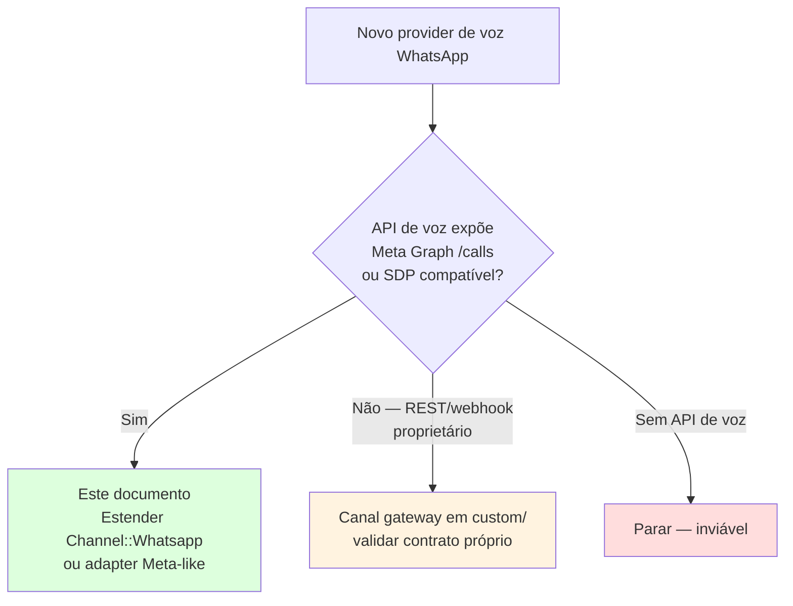
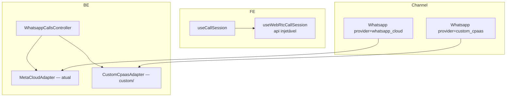

# Estratégia para segundo provider de chamadas WhatsApp

Plano para adicionar um **segundo provider de chamadas WhatsApp in-app**. **Não** usar padrão Twilio PSTN — ver [twilio-vs-whatsapp-native.md](./twilio-vs-whatsapp-native.md).

**Última reanálise:** jun/2026.

---

## Escolha de estratégia (decision tree)



| Tipo de provider | Exemplos | Estratégia | Doc |
|------------------|----------|------------|-----|
| **Meta-like / CPaaS proxy** | Reseller WABA com Graph `/calls` | Adapter + reuso `/whatsapp_calls` shape | **Este doc** |
| **Gateway não oficial** | Evolution, Baileys, Z-API | Canal/modelo separado em `custom/` + webhook dedicado | Este doc como checklist; adaptar contrato |
| **PSTN** | Twilio, Vonage | Padrão Twilio — **não** WA in-app | [twilio-vs-whatsapp-native.md](./twilio-vs-whatsapp-native.md) |

---

## Premissas (Meta-like / CPaaS)

1. Provider expõe fluxo **WebRTC + SDP** (Meta direto ou proxy compatível offer/answer)
2. Agente continua no **dashboard browser** — mesma UX ring/accept/widget
3. Fork merge-safe: `custom/`, `prepend_mod_with`, `# FORK:` mínimos
4. Enterprise permanece obrigatório para model `Call` upstream (gateway pode viver só em `custom/` com enum próprio)

---

## Acoplamento atual que impacta o plano

| Área | Estado atual | Impacto para segundo provider |
|------|--------------|-------------------------------|
| `useWhatsappCallSession.js` | WebRTC + `/whatsapp_calls` + gravação + race buffers | Extrair core `useWebRtcCallSession(callsAPI)` antes de duplicar |
| `WhatsappCallsController` | API dedicada para accept/reject/terminate/initiate/upload | Manter shape ou criar controller fino compatível |
| `WhatsappCloudService` | Métodos Graph `/calls` via EE prepend | Adapter deve normalizar respostas/erros para o mesmo contrato |
| `WhatsappEventsJob` EE | Intercepta `field=calls` formato Meta | Payload diferente pede rota/job dedicado em `custom/` |
| `actionCable.js` | Filtra `provider === 'whatsapp'` | Generalizar para lista de providers WebRTC |
| `Call.provider` | Enum `{ twilio, whatsapp }` | Novo provider exige enum/FORK ou modelo custom |
| `getVoiceCallProvider()` | `Channel::TwilioSms` → `twilio`; `Channel::Whatsapp` → `whatsapp` | Novo provider precisa branch/registry |

Não misturar os eixos: Twilio/PSTN usa `Voice::Provider::Twilio::*` + conferência; WhatsApp in-app usa SDP/WebRTC. Ver [twilio-vs-whatsapp-native.md](./twilio-vs-whatsapp-native.md).

---

## Arquitetura alvo



**Ideia:** manter shape de `useWhatsappCallSession` e `WhatsappCallsController`; extrair Meta-specific para adapters.

---

## Fase 1 — Adapter de sinalização (backend)

### 1.1 Contrato mínimo (`custom/`)

```ruby
# custom/app/services/voice/provider/whatsapp_calling/base.rb
module Voice::Provider::WhatsappCalling::Base
  def initiate_call(to_phone, sdp_offer); end
  def pre_accept_call(call_id, sdp_answer); end
  def accept_call(call_id, sdp_answer); end
  def reject_call(call_id); end
  def terminate_call(call_id); end
  def send_call_permission_request(to_phone, body_text = nil); end
  def update_calling_status(status); end
end
```

### 1.2 Implementação Meta atual

Manter em `Enterprise::Whatsapp::Providers::WhatsappCloudService` ou extrair para `Voice::Provider::MetaCloud::Adapter` com prepend delegando.

### 1.3 Dispatch por provider

```ruby
# Pseudocódigo — custom/ prepend Channel::Whatsapp
def whatsapp_calling_adapter
  case provider
  when 'whatsapp_cloud' then Voice::Provider::MetaCloud::Adapter.new(self)
  when 'custom_cpaas'   then Voice::Provider::CustomCpaas::Adapter.new(self)
  else raise "Calling not supported for #{provider}"
  end
end

def voice_calling_supported?
  %w[whatsapp_cloud custom_cpaas].include?(provider)
end
```

Normalizar erros de permissão para código equivalente ao **138006** (`Voice::CallErrors::NO_CALL_PERMISSION_CODE`).

### 1.4 Webhooks

| Opção | Quando |
|-------|--------|
| **A.** Prepend `WhatsappEventsJob` roteando por provider | CPaaS reenvia payload Meta `field=calls` |
| **B.** Job + rota webhook dedicada em `custom/` | Payload diferente — **preferir** para não inflar job |

Serviços espelhados:

- `IncomingCallService` → mesma saída (`InboundCallBuilder`)
- `CallService` → adapter injetado

---

## Fase 2 — API REST

### Opção mínima (recomendada fork)

- Manter rotas `/whatsapp_calls`
- Controller usa `channel.whatsapp_calling_adapter` (ou `provider_service` estendido)
- Novo provider = novo valor em `Channel::Whatsapp.provider`
- Whitelist de provider exige `# FORK:` mínimo em `Channel::Whatsapp::PROVIDERS` (a validação usa constante congelada)

### Opção limpa (maior diff)

- Renomear para `/voice_calls` — só se valer refactor amplo

**Arquivos:**

- `whatsapp_calls_controller.rb` — injeção adapter
- `incoming_call_service.rb` — provider-agnostic ou duplicar fino em `custom/`

---

## Fase 3 — Frontend

### Shape a preservar (`useWhatsappCallSession`)

| Comportamento | Manter |
|---------------|--------|
| `prepareInboundAnswer` / `prepareOutboundOffer` | ✅ |
| `acceptIncomingCall` / `initiateOutboundCall` | ✅ |
| `applyOutboundAnswer` + `pendingOutboundAnswers` | ✅ |
| `armOutboundRecorder` | ✅ |
| Beacon terminate (`pagehide`) | ✅ |
| Estados `permission_requested` / `permission_pending` | ✅ se CPaaS tiver opt-in |

### Refactor sugerido

```
custom/.../useWebRtcCallSession.js     — RTCPeerConnection + callsAPI injetável
useWhatsappCallSession.js              — thin wrapper WhatsappCallsAPI
custom/.../useCustomCpaasCallSession.js — thin wrapper CustomCpaasCallsAPI
```

### `useCallSession.js`

```javascript
const WEBRTC_PROVIDERS = [VOICE_CALL_PROVIDERS.WHATSAPP, VOICE_CALL_PROVIDERS.CUSTOM_CPAAS];
// registry[provider] em vez de isWhatsappCall only
```

### `actionCable.js`

Reusar `voice_call.*` — estender filtro:

```javascript
// FORK: aceitar múltiplos providers WebRTC
if (!WEBRTC_PROVIDERS.includes(data?.provider)) return;
```

### UI

| Arquivo | Mudança |
|---------|---------|
| `ConversationCallButton.vue` | `isWebRtcVoiceInbox(inbox)` |
| `WhatsappCallingPage.vue` | Seção por provider ou duplicar settings |
| `ChannelList` / signup | Flag no provider existente vs tile separado |

---

## Fase 4 — Modelo e gates

```ruby
# Call enum — enterprise/app/models/call.rb
enum :provider, { twilio: 0, whatsapp: 1, custom_cpaas: 2 }
```

Feature: reusar `channel_voice`; opcional flag rollout `channel_voice_custom_cpaas`.

---

## Mapa de arquivos (`custom/` preferido)

| Arquivo | Responsabilidade |
|---------|------------------|
| `custom/app/services/voice/provider/custom_cpaas/adapter.rb` | API CPaaS |
| `custom/app/services/custom_cpaas/incoming_call_service.rb` | Webhook → builders |
| `custom/app/controllers/webhooks/custom_cpaas/calls_controller.rb` | Webhook |
| `custom/app/models/custom/channel/whatsapp.rb` | Adapter dispatch |
| `custom/.../useCustomCpaasCallSession.js` | Wrapper WebRTC |
| `custom/.../customCpaasCallsAPI.js` | HTTP client |

### Edições `# FORK:` (se inevitável)

| Arquivo | Hook |
|---------|------|
| `app/models/channel/whatsapp.rb` | `PROVIDERS` com `# FORK:` mínimo |
| `inbox.js` | `getVoiceCallProvider` |
| `useCallSession.js` | registry WebRTC |
| `actionCable.js` | filtro provider |
| `config/routes.rb` | webhook CPaaS |

### Reuso sem alteração

- `Voice::InboundCallBuilder`, `CallMessageBuilder`
- `FloatingCallWidget`, `calls.js` (com case teardown)
- ActionCable event names (`voice_call.*`)

---

## Ordem de implementação

1. **Adapter + webhook inbound** — connect SDP → ring widget
2. **Accept/terminate** — loop WebRTC fechado
3. **Outbound initiate** — offer + answer via cable
4. **Permissão outbound** — se CPaaS/Meta exigir
5. **Settings + enable calling**
6. **Gravação upload**

---

## Estimativa

| Escopo | Tempo |
|--------|-------|
| CPaaS API idêntica Meta (proxy) | **2–3 semanas** |
| Payload webhook diferente | **3–5 semanas** |
| + Extrair `useWebRtcCallSession` antes | **+1 semana** |

---

## Anti-padrões

1. Forçar payload diverso no `WhatsappEventsJob` sem normalizer
2. Reusar `Channel::TwilioSms` para WA Calling
3. Duplicar 456 linhas de `useWhatsappCallSession` sem extrair core
4. Editar `enterprise/` upstream sem espelhar em `custom/`
5. Novo canal STI se ainda for `Channel::Whatsapp` com outro `provider` string

---

## Critérios de pronto

- [ ] Inbound: ring → accept → áudio bidirecional
- [ ] Outbound: initiate → SDP → contato atende no WhatsApp
- [ ] Terminate local/remoto limpa WebRTC + mensagem `voice_call`
- [ ] `Call.provider` correto
- [ ] Opt-in outbound (se aplicável)
- [ ] Sem regressão `whatsapp_cloud`
- [ ] `rg "FORK:"` documentado

---

## Referência cruzada

- Fluxo Meta atual: [architecture-and-flow.md](./architecture-and-flow.md)
- Twilio/PSTN não substitui WA in-app: [twilio-vs-whatsapp-native.md](./twilio-vs-whatsapp-native.md)
- Gateway não Meta-like: validar contrato próprio de voz antes de implementar UI
- Mensagens gateway: [whatsapp-provider/README.md](../whatsapp-provider/README.md)
