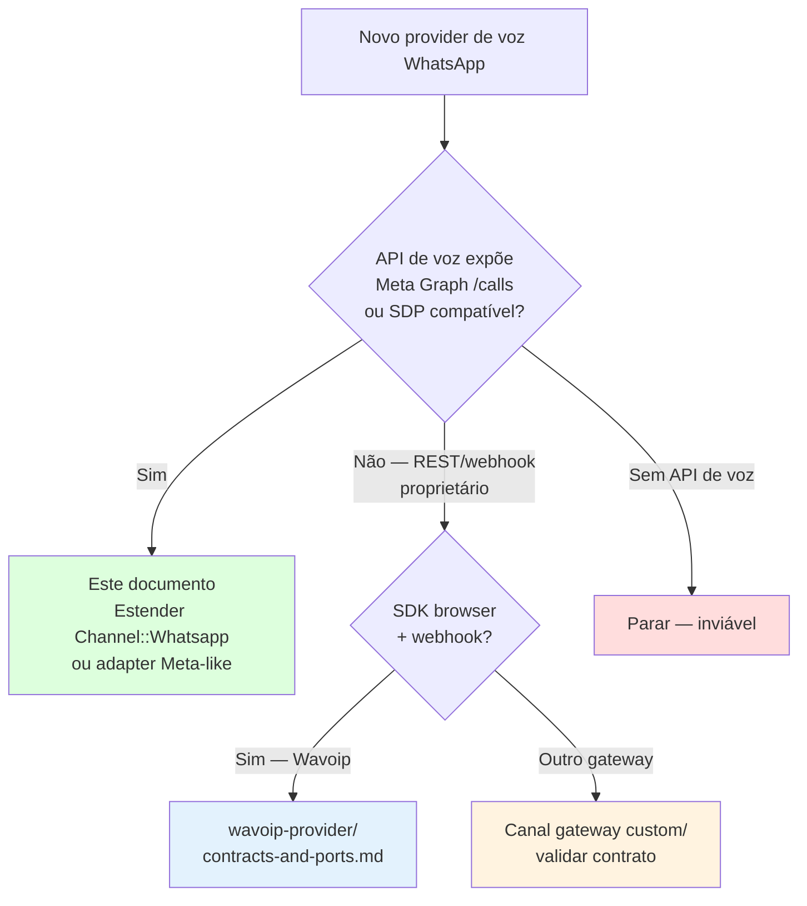
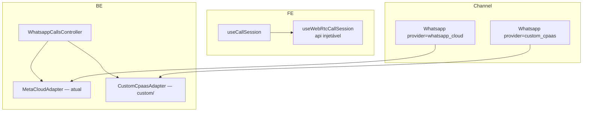

# Estratégia para segundo provider de chamadas WhatsApp

Plano para adicionar um **segundo provider de chamadas WhatsApp in-app**. **Não** usar padrão Twilio PSTN — ver [twilio-vs-whatsapp-native.md](./twilio-vs-whatsapp-native.md).

**Última reanálise:** jun/2026 (reavaliação arquitetural completa).

---

## Escolha de estratégia (decision tree)



> **Primeiro provider alternativo no fork:** Wavoip — seguir o
> [plano consolidado Wavoip](./wavoip-provider/implementation-plan.md), não este
> documento (focado em CPaaS Meta-like).

| Tipo de provider | Exemplos | Estratégia | Doc |
|------------------|----------|------------|-----|
| **Meta-like / CPaaS proxy** | Reseller WABA com Graph `/calls` | Adapter + reuso `/whatsapp_calls` shape | **Este doc** |
| **SDK browser + webhook** | Wavoip | Canal `Channel::Wavoip` em `custom/` | [wavoip-provider/contracts-and-ports.md](./wavoip-provider/contracts-and-ports.md) |
| **Gateway não oficial** | Evolution, Baileys, Z-API | Canal/modelo separado em `custom/` + webhook dedicado | Este doc como checklist; adaptar contrato |
| **PSTN** | Twilio, Vonage | Padrão Twilio — **não** WA in-app | [twilio-vs-whatsapp-native.md](./twilio-vs-whatsapp-native.md) |

---

## Premissas (Meta-like / CPaaS)

1. Provider expõe fluxo **WebRTC + SDP** (Meta direto ou proxy compatível offer/answer)
2. Agente continua no **dashboard browser** — mesma UX ring/accept/widget
3. Fork merge-safe: `custom/`, `prepend_mod_with`, `# FORK:` mínimos
4. Enterprise permanece obrigatório para model `Call` upstream (gateway pode viver só em `custom/` com enum próprio)

---

## Acoplamento atual que impacta o plano

| Área | Estado atual | Impacto para segundo provider |
|------|--------------|-------------------------------|
| `useWhatsappCallSession.js` | WebRTC + `/whatsapp_calls` + gravação + race buffers | Extrair core `useWebRtcCallSession(callsAPI)` antes de duplicar |
| `WhatsappCallsController` | API dedicada para accept/reject/terminate/initiate/upload | Manter shape ou criar controller fino compatível |
| `WhatsappCloudService` | Métodos Graph `/calls` via EE prepend | Adapter deve normalizar respostas/erros para o mesmo contrato |
| `WhatsappEventsJob` EE | Intercepta `field=calls` formato Meta | Payload diferente pede rota/job dedicado em `custom/` |
| `actionCable.js` | Filtra `provider === 'whatsapp'` | Generalizar para lista de providers WebRTC |
| `Call.provider` | Enum `{ twilio, whatsapp }` | Novo provider exige enum/FORK ou modelo custom |
| `getVoiceCallProvider()` | `Channel::TwilioSms` → `twilio`; `Channel::Whatsapp` → `whatsapp` | Novo provider precisa branch/registry |

Não misturar os eixos: Twilio/PSTN usa `Voice::Provider::Twilio::*` + conferência; WhatsApp in-app usa SDP/WebRTC. Ver [twilio-vs-whatsapp-native.md](./twilio-vs-whatsapp-native.md).

### Assimetria documentada (jun/2026)

| Padrão | Twilio | WhatsApp Meta |
|--------|--------|---------------|
| Provider adapter | `Voice::Provider::Twilio::Adapter` ✅ | Métodos em `WhatsappCloudService` prepend — **sem adapter** |
| Outbound builder | `Voice::OutboundCallBuilder` ✅ | Lógica inline em `WhatsappCallsController` |
| Permission flow | N/A | ~70 linhas no controller — **extrair service** |

Ver [architecture-and-flow.md §13](./architecture-and-flow.md#13-roadmap-de-refatoração-melhorias-sugeridas). O plano Wavoip é independente desta trilha SDP.

---

## Fase 0 — Refactor pré-requisito para provider SDP/Meta-like

**Escopo:** esta fase é exclusiva de providers SDP/Meta-like. Para Wavoip, ver
[implementation-plan.md](./wavoip-provider/implementation-plan.md).

**Executar antes** de CPaaS ou qualquer segundo provider que exponha SDP compatível
com a stack Meta. Wavoip não compartilha esse core: o SDK encapsula mídia e
sinalização. Para Wavoip, apenas o registry de sessão/eventos compartilhados é
necessário depois do spike.

### 0.1 Frontend (P0 — ~1 semana)

| # | Entrega | Arquivo | Done |
|---|---------|---------|------|
| 0.1.1 | Extrair `useWebRtcCallSession(callsAPI)` | `composables/useWebRtcCallSession.js` | WebRTC + recorder + buffers; API injetável |
| 0.1.2 | `useWhatsappCallSession` vira thin wrapper | mesmo path | Delega para `WhatsappCallsAPI` |
| 0.1.3 | `WEBRTC_PROVIDERS` constante exportada | `helper/inbox.js` ou `helper/voiceCallProviders.js` | Lista extensível |
| 0.1.4 | Registry em `useCallSession` | `composables/useCallSession.js` | `# FORK:` ou contrib upstream |
| 0.1.5 | Generalizar filtro cable | `helper/actionCable.js` | `WEBRTC_PROVIDERS.includes(provider)` |
| 0.1.6 | Specs Vitest (race, 422, beacon) | `spec/.../useWebRtcCallSession.spec.js` | Mocks RTCPeerConnection/API |

### 0.2 Backend (P1 — ~1 semana, opcional antes de CPaaS)

| # | Entrega | Arquivo | Done |
|---|---------|---------|------|
| 0.2.1 | Contrato `Voice::Provider::WhatsappCalling::Base` | `enterprise/.../whatsapp_calling/base.rb` | Métodos initiate/accept/reject/… |
| 0.2.2 | `Voice::Provider::MetaCloud::Adapter` | `enterprise/.../meta_cloud/adapter.rb` | Move lógica do prepend |
| 0.2.3 | Prepend delega ao adapter | `WhatsappCloudService` EE | Sem mudança de comportamento |
| 0.2.4 | `Voice::OutboundWhatsappCallBuilder` | `enterprise/.../outbound_whatsapp_call_builder.rb` | Paridade com Twilio builder |
| 0.2.5 | `Whatsapp::CallPermissionRequestService` | `enterprise/.../call_permission_request_service.rb` | Controller só rescue/render |
| 0.2.6 | Specs espelhados | `spec/enterprise/services/...` | Builders + permission service |

### 0.3 Critérios de saída Fase 0

- [ ] `useWhatsappCallSession.js` < 80 linhas (wrapper)
- [ ] Zero regressão Meta inbound/outbound em staging
- [ ] `rg isWhatsappCall` — branching reduzido a registry
- [ ] Novo provider WebRTC = novo wrapper + entrada no registry (sem copiar WebRTC core)

**Wavoip:** não depende de 0.1.1–0.1.2 nem de 0.2. Depende somente de um dispatch
provider-agnostic em `useCallSession`, `actionCable.js` e consumidores de chamada,
conforme o [plano consolidado](./wavoip-provider/implementation-plan.md).

---

## Arquitetura alvo



**Ideia:** manter shape de `useWhatsappCallSession` e `WhatsappCallsController`; extrair Meta-specific para adapters.

---

## Fase 1 — Adapter de sinalização (backend)

### 1.1 Contrato mínimo

```ruby
# enterprise/app/services/voice/provider/whatsapp_calling/base.rb
# (ou custom/ se fork não contribuir upstream)
module Voice::Provider::WhatsappCalling::Base
  def initiate_call(to_phone, sdp_offer); end
  def pre_accept_call(call_id, sdp_answer); end
  def accept_call(call_id, sdp_answer); end
  def reject_call(call_id); end
  def terminate_call(call_id); end
  def send_call_permission_request(to_phone, body_text = nil); end
  def update_calling_status(status); end
end
```

Implementações:

| Classe | Provider |
|--------|----------|
| `Voice::Provider::MetaCloud::Adapter` | `whatsapp_cloud` (atual) |
| `Voice::Provider::CustomCpaas::Adapter` | `custom_cpaas` (fork) |

### 1.2 Implementação Meta atual

Extrair de `Enterprise::Whatsapp::Providers::WhatsappCloudService` para `Voice::Provider::MetaCloud::Adapter`. O prepend de `WhatsappCloudService` delega:

```ruby
def initiate_call(to_phone, sdp_offer)
  meta_cloud_adapter.initiate_call(to_phone, sdp_offer)
end

def meta_cloud_adapter
  @meta_cloud_adapter ||= Voice::Provider::MetaCloud::Adapter.new(whatsapp_channel)
end
```

**Não** deixar HTTP Meta espalhado no controller — só no adapter (camada infrastructure).

### 1.3 Dispatch por provider

```ruby
# Pseudocódigo — custom/ prepend Channel::Whatsapp
def whatsapp_calling_adapter
  case provider
  when 'whatsapp_cloud' then Voice::Provider::MetaCloud::Adapter.new(self)
  when 'custom_cpaas'   then Voice::Provider::CustomCpaas::Adapter.new(self)
  else raise "Calling not supported for #{provider}"
  end
end

def voice_calling_supported?
  %w[whatsapp_cloud custom_cpaas].include?(provider)
end
```

Normalizar erros de permissão para código equivalente ao **138006** (`Voice::CallErrors::NO_CALL_PERMISSION_CODE`).

### 1.4 Webhooks

| Opção | Quando |
|-------|--------|
| **A.** Prepend `WhatsappEventsJob` roteando por provider | CPaaS reenvia payload Meta `field=calls` |
| **B.** Job + rota webhook dedicada em `custom/` | Payload diferente — **preferir** para não inflar job |

Serviços espelhados:

- `IncomingCallService` → mesma saída (`InboundCallBuilder`)
- `CallService` → adapter injetado

---

## Fase 2 — API REST

### Opção mínima (recomendada fork)

- Manter rotas `/whatsapp_calls`
- Controller usa `channel.whatsapp_calling_adapter` (ou `provider_service` estendido)
- Novo provider = novo valor em `Channel::Whatsapp.provider`
- Whitelist de provider exige `# FORK:` mínimo em `Channel::Whatsapp::PROVIDERS` (a validação usa constante congelada)

### Opção limpa (maior diff)

- Renomear para `/voice_calls` — só se valer refactor amplo

**Arquivos:**

- `whatsapp_calls_controller.rb` — injeção adapter; `initiate` → `OutboundWhatsappCallBuilder`
- `incoming_call_service.rb` — provider-agnostic via adapter injetado, ou duplicar fino em `custom/`
- `call_service.rb` — `invoke_provider!` → `channel.whatsapp_calling_adapter`

---

## Fase 3 — Frontend

### Shape a preservar (`useWhatsappCallSession`)

| Comportamento | Manter |
|---------------|--------|
| `prepareInboundAnswer` / `prepareOutboundOffer` | ✅ |
| `acceptIncomingCall` / `initiateOutboundCall` | ✅ |
| `applyOutboundAnswer` + `pendingOutboundAnswers` | ✅ |
| `armOutboundRecorder` | ✅ |
| Beacon terminate (`pagehide`) | ✅ |
| Estados `permission_requested` / `permission_pending` | ✅ se CPaaS tiver opt-in |

### Refactor sugerido (após Fase 0)

```
composables/useWebRtcCallSession.js      — RTCPeerConnection + callsAPI injetável (~300 linhas)
composables/useWhatsappCallSession.js    — thin wrapper WhatsappCallsAPI (~50 linhas)
custom/.../useWavoipCallSession.js       — thin wrapper WavoipCallsAPI
helper/voiceCallProviders.js             — WEBRTC_PROVIDERS + registry cable/session
```

### Handler `voice_call.permission_granted` (P2)

Adicionar em `actionCable.js` após generalizar filtro:

```javascript
onVoiceCallPermissionGranted = data => {
  // Toast: contato autorizou — agente pode retentar outbound
  useAlert(t('CONVERSATION.WHATSAPP_CALL.PERMISSION_GRANTED', { name: data.contact_name }));
};
```

### `useCallSession.js`

```javascript
const WEBRTC_PROVIDERS = [VOICE_CALL_PROVIDERS.WHATSAPP, VOICE_CALL_PROVIDERS.CUSTOM_CPAAS];
// registry[provider] em vez de isWhatsappCall only
```

### `actionCable.js`

Reusar `voice_call.*` — estender filtro:

```javascript
// FORK: aceitar múltiplos providers WebRTC
if (!WEBRTC_PROVIDERS.includes(data?.provider)) return;
```

### UI

| Arquivo | Mudança |
|---------|---------|
| `ConversationCallButton.vue` | `isWebRtcVoiceInbox(inbox)` |
| `WhatsappCallingPage.vue` | Seção por provider ou duplicar settings |
| `ChannelList` / signup | Flag no provider existente vs tile separado |

---

## Fase 4 — Modelo e gates

```ruby
# Call enum — enterprise/app/models/call.rb
enum :provider, { twilio: 0, whatsapp: 1, custom_cpaas: 2 }
```

Feature: reusar `channel_voice`; opcional flag rollout `channel_voice_custom_cpaas`.

---

## Mapa de arquivos (`custom/` preferido)

| Arquivo | Responsabilidade |
|---------|------------------|
| `custom/app/services/voice/provider/custom_cpaas/adapter.rb` | API CPaaS |
| `custom/app/services/custom_cpaas/incoming_call_service.rb` | Webhook → builders |
| `custom/app/controllers/webhooks/custom_cpaas/calls_controller.rb` | Webhook |
| `custom/app/models/custom/channel/whatsapp.rb` | Adapter dispatch |
| `custom/.../useCustomCpaasCallSession.js` | Wrapper WebRTC |
| `custom/.../customCpaasCallsAPI.js` | HTTP client |

### Edições `# FORK:` (se inevitável)

| Arquivo | Hook |
|---------|------|
| `app/models/channel/whatsapp.rb` | `PROVIDERS` com `# FORK:` mínimo |
| `inbox.js` | `getVoiceCallProvider` |
| `useCallSession.js` | registry WebRTC |
| `actionCable.js` | filtro provider |
| `config/routes.rb` | webhook CPaaS |

### Reuso sem alteração

- `Voice::InboundCallBuilder`, `CallMessageBuilder`
- `FloatingCallWidget`, `calls.js` (com case teardown)
- ActionCable event names (`voice_call.*`)

---

## Ordem de implementação

0. **Fase 0 refactor** — `useWebRtcCallSession` + registry (para provider SDP/Meta-like)
1. **Adapter + webhook inbound** — connect SDP → ring widget
2. **Accept/terminate** — loop WebRTC fechado
3. **Outbound initiate** — offer + answer via cable
4. **Permissão outbound** — se CPaaS/Meta exigir (+ handler FE `permission_granted`)
5. **Settings + enable calling**
6. **Gravação upload**

---

## Estimativa

| Escopo | Tempo |
|--------|-------|
| **Fase 0** refactor FE (extrair WebRTC + registry) | **~1 semana** |
| **Fase 0** refactor BE (adapter + builders + permission service) | **~1 semana** (opcional antes de Wavoip) |
| CPaaS API idêntica Meta (proxy) | **2–3 semanas** (após Fase 0) |
| Payload webhook diferente | **3–5 semanas** (após Fase 0) |
| Wavoip (canal separado) | Ver [wavoip-provider/implementation-plan.md](./wavoip-provider/implementation-plan.md) |

---

## Anti-padrões

1. Forçar payload diverso no `WhatsappEventsJob` sem normalizer
2. Reusar `Channel::TwilioSms` para WA Calling
3. Duplicar 456 linhas de `useWhatsappCallSession` em outro provider SDP sem extrair core
4. Editar `enterprise/` upstream sem espelhar em `custom/`
5. Novo canal STI se ainda for `Channel::Whatsapp` com outro `provider` string
6. Deixar lógica de permissão outbound no controller — extrair `CallPermissionRequestService`
7. Integrar um provider ao widget sem antes definir dispatch por provider
8. Inflar model `Call` upstream com campos de um só provider — usar `meta` jsonb; novos valores de enum exigem alteração explícita e estável
9. God module FE — misturar WebRTC core com API específica de provider no mesmo arquivo
10. Ignorar TURN em deploy corporativo — documentar `VOICE_CALL_STUN_URLS` com TURN

---

## Critérios de pronto

### Fase 0 (refactor)

- [ ] `useWebRtcCallSession` extraído; `useWhatsappCallSession` < 80 linhas
- [ ] Registry provider em `useCallSession` + `WEBRTC_PROVIDERS` no cable
- [ ] Specs Vitest para race buffer e permission 422
- [ ] Sem regressão `whatsapp_cloud` em inbound/outbound/terminate

### Segundo provider

- [ ] Inbound: ring → accept → áudio bidirecional
- [ ] Outbound: initiate → SDP → contato atende no WhatsApp
- [ ] Terminate local/remoto limpa WebRTC + mensagem `voice_call`
- [ ] `Call.provider` correto
- [ ] Opt-in outbound (se aplicável) + handler `permission_granted` (se Meta-like)
- [ ] Sem regressão `whatsapp_cloud`
- [ ] `rg "FORK:"` documentado
- [ ] TURN documentado para admins se deploy corporativo

---

## Referência cruzada

- Fluxo Meta atual: [architecture-and-flow.md](./architecture-and-flow.md)
- Twilio/PSTN não substitui WA in-app: [twilio-vs-whatsapp-native.md](./twilio-vs-whatsapp-native.md)
- Gateway não Meta-like: validar contrato próprio de voz antes de implementar UI
- Mensagens gateway: [whatsapp-provider/README.md](../whatsapp-provider/README.md)
