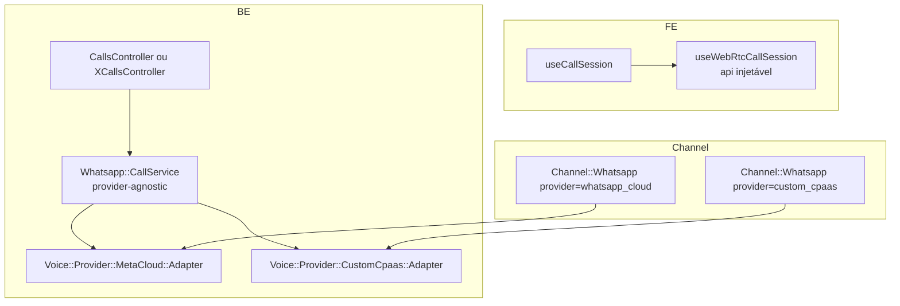
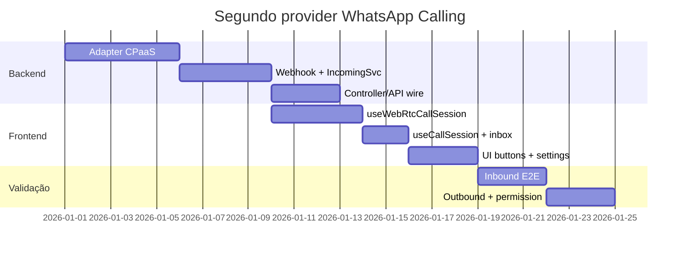

# Estratégia para segundo provider de chamadas WhatsApp

Plano concreto para adicionar um **segundo CPaaS** que também ofereça chamadas WhatsApp (via Meta Calling API ou wrapper compatível com SDP). **Não** usar o padrão Twilio PSTN — ver [twilio-vs-whatsapp-native.md](./twilio-vs-whatsapp-native.md).

---

## Premissas

1. O novo provider expõe fluxo **WebRTC + SDP** (direto na Meta ou proxy compatível com offer/answer)
2. O agente continua no **dashboard browser** — mesma UX de ring, accept, widget flutuante
3. Fork segue regras: preferir `custom/`, `prepend_mod_with`, marcadores `# FORK:` mínimos
4. Enterprise Edition permanece obrigatório (model `Call`, rotas EE)

---

## Arquitetura alvo



**Ideia:** manter o *shape* de `useWhatsappCallSession` e `WhatsappCallsController`, extrair o que é Meta-específico para adapters.

---

## Fase 1 — Extrair adapter de sinalização (backend)

### 1.1 Contrato mínimo (novo em `custom/` ou `enterprise/`)

```ruby
# custom/app/services/voice/provider/whatsapp_calling/base.rb (exemplo)
module Voice::Provider::WhatsappCalling::Base
  def initiate_call(to_phone, sdp_offer); end
  def pre_accept_call(call_id, sdp_answer); end
  def accept_call(call_id, sdp_answer); end
  def reject_call(call_id); end
  def terminate_call(call_id); end
  def send_call_permission_request(to_phone, body_text = nil); end
  def update_calling_status(status); end
end
```

### 1.2 Mover implementação Meta atual

| De | Para |
|----|------|
| `Enterprise::Whatsapp::Providers::WhatsappCloudService` (métodos `*_call`) | `Voice::Provider::MetaCloud::Adapter` ou manter prepend e delegar |

`Channel::Whatsapp#provider_service` passa a retornar adapter conforme `provider`:

```ruby
# Pseudocódigo — implementar em custom/ com prepend_mod_with
def whatsapp_calling_adapter
  case provider
  when 'whatsapp_cloud' then Voice::Provider::MetaCloud::Adapter.new(self)
  when 'custom_cpaas'   then Voice::Provider::CustomCpaas::Adapter.new(self)
  else raise "Calling not supported for #{provider}"
  end
end
```

### 1.3 Novo adapter CPaaS

Arquivo sugerido: `custom/app/services/voice/provider/custom_cpaas/adapter.rb`

- Mapear endpoints do CPaaS para o mesmo contrato (`initiate`, `accept`, `terminate`, …)
- Normalizar respostas para o formato que `WhatsappCallsController` e `IncomingCallService` esperam (`calls[0].id`, erros de permissão equivalentes ao código 138006)
- Config em `provider_config` (API keys, URLs, phone_id equivalente)

### 1.4 Webhooks

| Opção | Quando usar |
|-------|-------------|
| **A.** Reusar `WhatsappEventsJob` com prepend que roteia por `channel.provider` | CPaaS reenvia eventos no formato Meta `field=calls` |
| **B.** Novo job `CustomCpaas::CallEventsJob` + rota webhook dedicada | Formato de payload diferente |

Preferir **B** em `custom/` se o payload divergir — evita inflar `WhatsappEventsJob`.

Serviços a espelhar:

- `custom/app/services/custom_cpaas/incoming_call_service.rb` — mesma saída que `Whatsapp::IncomingCallService` (chama `Voice::InboundCallBuilder`)
- Reusar `Whatsapp::CallService` se adapter for injetado; senão `CustomCpaas::CallService` fino

---

## Fase 2 — Generalizar API REST (opcional mas recomendado)

### Opção mínima (menos refactor)

- Manter rotas `/whatsapp_calls`
- `WhatsappCallsController` usa `channel.whatsapp_calling_adapter` em vez de `provider_service` direto
- Novo provider = novo valor em `Channel::Whatsapp.provider` + adapter

### Opção limpa

- Renomear para `/voice_calls` ou `/calls` genérico (maior diff upstream — só se valer no fork)
- Controller único com `ensure_calling_enabled` duck-typed: `channel.respond_to?(:voice_enabled?)`

**Arquivos a tocar (mínimo):**

- `enterprise/app/controllers/api/v1/accounts/whatsapp_calls_controller.rb` — injeção de adapter
- `config/routes.rb` — só se renomear rotas
- `enterprise/app/services/whatsapp/incoming_call_service.rb` — provider-agnostic ou duplicar em `custom/`

---

## Fase 3 — Frontend: extrair composable WebRTC

### 3.1 Shape a preservar de `useWhatsappCallSession`

| Export / comportamento | Manter |
|------------------------|--------|
| `prepareInboundAnswer(sdpOffer, iceServers)` | ✅ |
| `prepareOutboundOffer()` | ✅ |
| `acceptIncomingCall({ callId, sdpOffer, iceServers })` | ✅ |
| `initiateOutboundCall(conversationId)` | ✅ |
| `endActiveCall(callIdOverride)` | ✅ |
| `applyOutboundAnswer(callId, sdpAnswer)` (cable) | ✅ |
| `armOutboundRecorder()` | ✅ |
| `sendWhatsappTerminateBeacon()` | ✅ (renomear genérico) |
| Estados `permission_requested` / `permission_pending` | ✅ se CPaaS usar opt-in similar |

### 3.2 Refactor sugerido

```
custom/app/javascript/dashboard/composables/useWebRtcCallSession.js
  - aceita callsAPI (initiate, accept, reject, terminate, show, uploadRecording)
  - lógica RTCPeerConnection idêntica ao atual

app/javascript/dashboard/composables/useWhatsappCallSession.js
  - thin wrapper: WhatsappCallsAPI + defaults Meta

custom/.../useCustomCpaasCallSession.js
  - thin wrapper: CustomCpaasCallsAPI
```

### 3.3 `useCallSession.js`

Adicionar ramo (ou registry):

```javascript
const webRtcProviders = [VOICE_CALL_PROVIDERS.WHATSAPP, VOICE_CALL_PROVIDERS.CUSTOM_CPAAS];
if (webRtcProviders.includes(call?.provider)) { /* join via webRtc session */ }
```

### 3.4 `getVoiceCallProvider` / `inbox.js`

```javascript
// FORK: mapear provider_config do canal para VOICE_CALL_PROVIDERS
if (channelType === INBOX_TYPES.WHATSAPP) {
  if (inbox.channel?.provider === 'custom_cpaas') return VOICE_CALL_PROVIDERS.CUSTOM_CPAAS;
  return VOICE_CALL_PROVIDERS.WHATSAPP;
}
```

### 3.5 ActionCable

Reusar eventos `voice_call.*` — garantir payload inclui `provider` para handlers filtrarem. Arquivo: `app/javascript/dashboard/helper/actionCable.js` (um `# FORK:` se precisar aceitar segundo provider no mesmo handler).

### 3.6 Componentes UI

| Arquivo | Mudança |
|---------|---------|
| `ConversationCallButton.vue` | `isWebRtcVoiceInbox` em vez de só `isWhatsappVoiceInbox` |
| `VoiceCallButton.vue` | `startWebRtcCall(inbox)` com factory por provider |
| `VoiceCall.vue` | Já usa `useCallActions` — pouca mudança se provider no store |
| `WhatsappCallingPage.vue` | Duplicar ou generalizar para `CallingPage` com seção por provider |
| `ChannelList.vue` / embedded signup | Novo canal ou flag no signup existente |

---

## Fase 4 — Modelo e gates

### `Call` enum

```ruby
# enterprise/app/models/call.rb
enum :provider, { twilio: 0, whatsapp: 1, custom_cpaas: 2 }
```

### `Channel::Whatsapp`

```ruby
def voice_calling_supported?
  %w[whatsapp_cloud custom_cpaas].include?(provider)
end
```

Implementar em `custom/` via `prepend_mod_with('Channel::Whatsapp')` para não editar OSS sem marker.

### Feature flags

- Reusar `channel_voice` — gate comum
- Opcional: `channel_voice_custom_cpaas` se rollout gradual

---

## Mapa de arquivos (checklist)

### Novos em `custom/` (preferido)

| Arquivo | Responsabilidade |
|---------|------------------|
| `custom/app/services/voice/provider/custom_cpaas/adapter.rb` | API do CPaaS |
| `custom/app/services/custom_cpaas/incoming_call_service.rb` | Webhook → builders |
| `custom/app/controllers/webhooks/custom_cpaas/calls_controller.rb` | Endpoint webhook |
| `custom/app/jobs/webhooks/custom_cpaas_call_events_job.rb` | Processamento async |
| `custom/config/initializers/voice_custom_cpaas.rb` | Autoload / prepend |
| `custom/app/javascript/.../useCustomCpaasCallSession.js` | Wrapper WebRTC |
| `custom/app/javascript/.../customCpaasCallsAPI.js` | Client HTTP |

### Edições pontuais com `# FORK:` (se inevitável)

| Arquivo | Linha de hook |
|---------|---------------|
| `app/javascript/dashboard/helper/inbox.js` | `getVoiceCallProvider` |
| `app/javascript/dashboard/composables/useCallSession.js` | `isWhatsappCall` → `isWebRtcCall` |
| `app/models/channel/whatsapp.rb` | `voice_calling_supported?` (ou prepend) |
| `config/routes.rb` | Rota webhook CPaaS |

### Reuso sem alteração (ideal)

- `Voice::InboundCallBuilder`
- `Voice::CallMessageBuilder`
- `Voice::OutboundCallBuilder` (se outbound conversation-scoped)
- `enterprise/app/models/call.rb` (só enum)
- `FloatingCallWidget`, `calls.js` store (provider no objeto call)

---

## Ordem de implementação sugerida



1. **Adapter + webhook inbound** — provar `connect` com SDP → ring no widget
2. **Accept/terminate** — fechar loop WebRTC
3. **Outbound initiate** — offer + answer via cable
4. **Permissão outbound** — se CPaaS/Meta exigir
5. **Settings + enable calling** — paridade com `WhatsappCallingPage`
6. **Gravação upload** — reutilizar endpoint existente ou espelhar

---

## Estimativa de esforço

| Escopo | Tempo |
|--------|-------|
| CPaaS com API idêntica à Meta (proxy) | **2–3 semanas** |
| CPaaS com payload diferente (webhook próprio) | **3–5 semanas** |
| + Refactor `useWebRtcCallSession` genérico antes | **+1 semana** (paga dividendos no 3º provider) |

---

## Anti-padrões a evitar

1. **Forçar segundo provider no `WhatsappEventsJob`** sem normalizar payload — vira god job
2. **Reusar `Channel::TwilioSms`** para WhatsApp Calling — produto errado
3. **Duplicar 450 linhas de `useWhatsappCallSession`** — extrair composable com API injetável
4. **Editar `enterprise/` upstream** sem espelhar em `custom/` no fork — preferir prepend
5. **Novo canal separado** se o CPaaS ainda for `Channel::Whatsapp` com outro `provider` string — menos UI duplicada

---

## Critérios de pronto

- [ ] Inbound: contato liga → agente online vê ring → accept → áudio bidirecional
- [ ] Outbound: agente inicia → SDP negociado → contato atende no WhatsApp
- [ ] Terminate local e remoto limpa WebRTC + atualiza mensagem `voice_call`
- [ ] `Call.provider` correto; histórico na conversa WhatsApp
- [ ] Opt-in outbound (se aplicável) com UX equivalente
- [ ] `rg "FORK:"` documentado em `doc/fork-divergences.txt`
- [ ] Sem regressão no provider `whatsapp_cloud` existente

---

## Referência cruzada

- Fluxo completo atual: [architecture-and-flow.md](./architecture-and-flow.md)
- Acoplamento e tabela de componentes: [provider-coupling-and-extensibility.md](./provider-coupling-and-extensibility.md)
- Por que não Twilio: [twilio-vs-whatsapp-native.md](./twilio-vs-whatsapp-native.md)
