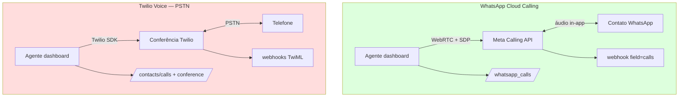

# Twilio vs WhatsApp Cloud Calling — comparação para voz WhatsApp

Este documento responde: **o que se perde** se usar a stack Twilio Voice do Chatwoot em vez do caminho nativo **WhatsApp Cloud Calling** (`Channel::Whatsapp` + Meta Calling API). Foco em **chamadas de voz WhatsApp in-app**, não PSTN genérico.

**Última verificação no código:** jun/2026.

---

## Contexto: três tiles de voz na UI

| Tile `ChannelList` | Backend | Produto |
|--------------------|---------|---------|
| `whatsapp` | `Channel::Whatsapp` | **Mensagens** (Cloud ou 360dialog) — voz só se Cloud + calling enabled |
| `whatsapp_call` | `Channel::Whatsapp` (`whatsapp_cloud`) | **WhatsApp Calling** via embedded signup |
| `voice` | `Channel::TwilioSms` + `voice_enabled` | **PSTN Twilio** — não WhatsApp in-app |

> A antiga tabela `channel_voice` / modelo `Channel::Voice` foi **removida**. O tile `voice` cria `Channel::TwilioSms` via `Enterprise::InboxesController#channel_type_from_params` (`type == 'voice'`).

---

## Verificação no código

### `Channel::TwilioSms` voice — PSTN ou WhatsApp?

**PSTN/conferência Twilio.**

```ruby
# enterprise/app/services/voice/provider/twilio/adapter.rb
def initiate_call(to:, conference_sid: nil, agent_id: nil)
  call = twilio_client.calls.create(**call_params(to))
  # url: twilio_voice_call_url → TwiML conference
end
```

- `Twilio::REST::Client#calls.create` com números PSTN
- Inbound/outbound via `Twilio::VoiceController` → TwiML conferência
- Frontend: `TwilioVoiceClient` + `ConferenceController`
- **Sem** SDP, `RTCPeerConnection`, endpoints Meta `/calls`

O enum `medium: { sms, whatsapp }` em `Channel::TwilioSms` é para **mensagens** Twilio WhatsApp (`whatsapp:+...`), **não** WhatsApp Business Calling API. `getVoiceCallProvider()` retorna `twilio` para qualquer `Channel::TwilioSms` com `voice_enabled`, independente de `medium`.

### Twilio pode rotear voz WhatsApp nativa no Chatwoot?

**Não.**

| Verificação | Resultado |
|-------------|-----------|
| `Contacts::CallsController` | Exige `Channel::TwilioSms` |
| Rotas `/whatsapp_calls` | Só `Channel::Whatsapp` + `voice_enabled?` |
| `WhatsappCallsController#ensure_calling_enabled` | `channel.is_a?(Channel::Whatsapp) && channel.voice_enabled?` |
| Webhook `field=calls` | Só `Enterprise::Webhooks::WhatsappEventsJob` |
| `useCallSession` | WhatsApp → WebRTC; Twilio → conference SDK |

---

## Tabela comparativa (voz WhatsApp in-app)

| Dimensão | WhatsApp Cloud Calling | Twilio Voice channel |
|----------|------------------------|----------------------|
| **Experiência contato** | Chamada **in-app WhatsApp** | Ligação **telefônica PSTN** |
| **Caminho de mídia** | WebRTC **browser ↔ Meta** | Twilio SDK → conferência ↔ PSTN |
| **Sinalização** | SDP via Graph API `/calls` | TwiML + `CallSid` + `conference_sid` |
| **Canal / inbox** | `Channel::Whatsapp` (`whatsapp_cloud`) | `Channel::TwilioSms` + `voice_enabled` |
| **API outbound** | `POST /whatsapp_calls/initiate` + `sdp_offer` | `POST /contacts/:id/calls` |
| **API agente** | accept/reject/terminate + SDP | Conference join/leave/token |
| **Webhooks** | Meta `field=calls` | Twilio voice/status/conference |
| **Tempo real UI** | ActionCable `voice_call.*` + SDP | `message.updated` |
| **Permissão outbound** | `call_permission_request` + 138006 | **Não existe** |
| **Setup UI** | `whatsapp_call` + tab Calls | `VoiceConfigurationPage` |
| **Gravação** | Client-side `MediaRecorder` + upload | Twilio recording webhook |
| **Contato liga pelo WhatsApp** | **Sim** | **Não** |
| **Agente liga in-app WhatsApp** | **Sim** (com opt-in) | **Não** — PSTN para `phone_number` |

---

## O que se PERDE com Twilio para "chamadas WhatsApp"

### Funcionalidade WhatsApp Calling (crítico)

1. Chamadas in-app WhatsApp (UI nativa do app)
2. WebRTC browser↔Meta (sem conferência Twilio)
3. Fluxo SDP completo + ICE servers
4. `call_permission_request` + `CallPermissionReplyService`
5. Webhook `field=calls` + mutex por `call_id`
6. ActionCable `voice_call.incoming`, `outbound_connected`, `outbound_accepted`
7. Canal `whatsapp_call` + auto-enable calling no signup
8. Tab Calls (`WhatsappCallingPage`, toggle inbound)
9. `enable_whatsapp_calling` / webhook field `calls`
10. Gravação alinhada ao pickup real (`armOutboundRecorder` no ACCEPTED)
11. Beacon `pagehide` com terminate autenticado (~60s timeout Meta)
12. Outbound conversation-scoped + contexto thread WhatsApp
13. Bolha `voice_call` provider whatsapp

### O que se GANHA com Twilio (caso de uso diferente)

| Ganho | Relevância WA in-app |
|-------|----------------------|
| PSTN para qualquer número | Telefone tradicional — **não** WA in-app |
| Conferência multi-participante | WA Calling é 1:1 |
| SDK Twilio maduro | Não conecta Meta Calling |
| Gravação server-side | Modelo diferente |

---

## Diagrama: caminhos incompatíveis



---

## Comparativo com gateway não oficial

| Dimensão | Meta oficial | Gateway (Evolution) | Twilio |
|----------|--------------|---------------------|--------|
| In-app WhatsApp | ✅ | ⚠️ Depende do gateway | ❌ |
| WebRTC browser | → Meta | → Gateway (típico) | → Twilio |
| ToS / risco | Baixo | **Alto** | Baixo |
| Doc | [architecture-and-flow.md](./architecture-and-flow.md) | [second-provider-strategy.md](./second-provider-strategy.md) como checklist de contrato | Este doc |

Ver também: [official-vs-unofficial-restrictions.md](../whatsapp-provider/official-vs-unofficial-restrictions.md).

---

## Recomendação

| Abordagem | Adequação |
|-----------|-----------|
| Stack **WhatsApp WebRTC** (Meta ou CPaaS proxy) | ✅ Chamadas WA in-app |
| Stack **Twilio PSTN** | ❌ Não substitui WA in-app |
| Twilio porque já tem Twilio **messaging** WA | ❌ Messaging ≠ Calling |

**Conclusão:** Twilio Voice **não substitui** WhatsApp Cloud Calling. Para segundo provider in-app, ver [second-provider-strategy.md](./second-provider-strategy.md); se o gateway não tiver Graph `/calls`, valide o contrato de voz antes de qualquer UI.

---

## Resumo em uma frase

**Twilio no Chatwoot = voz telefônica PSTN; WhatsApp Cloud Calling = voz in-app via Meta + WebRTC.** Usar Twilio elimina SDP, permissões Meta, webhooks `calls` e experiência in-app no WhatsApp.
