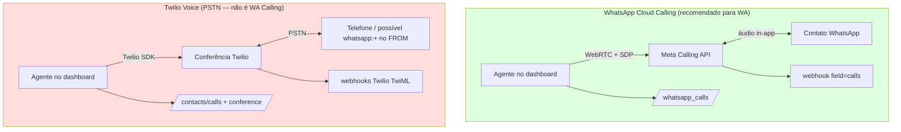

# Twilio vs WhatsApp Cloud Calling — comparação para voz WhatsApp

Este documento responde: **o que se perde** se usar a stack Twilio Voice do Chatwoot em vez do caminho nativo **WhatsApp Cloud Calling** (`Channel::Whatsapp` + Meta Calling API). Foco em **chamadas de voz WhatsApp**, não PSTN genérico.

---

## Verificação no código (jun/2026)

### `Channel::TwilioSms` voice — PSTN ou WhatsApp?

**PSTN/conferência Twilio.** O adapter cria chamadas via REST API Twilio com TwiML:

```ruby
# enterprise/app/services/voice/provider/twilio/adapter.rb
def initiate_call(to:, conference_sid: nil, agent_id: nil)
  call = twilio_client.calls.create(**call_params(to))
  # url: twilio_voice_call_url → TwiML conference
end
```

- Usa `Twilio::REST::Client#calls.create` com `from`/`to` como números de telefone
- Inbound/outbound passam por `Twilio::VoiceController` → TwiML de **conferência**
- Frontend usa `TwilioVoiceClient` (SDK) + `ConferenceController` (join/leave/token)
- **Não há** SDP, `RTCPeerConnection`, nem endpoints Meta `/calls`

O enum `medium: { sms, whatsapp }` em `Channel::TwilioSms` refere-se ao **canal de mensagens** Twilio WhatsApp (`whatsapp:+...`), **não** à WhatsApp Business Calling API. `getVoiceCallProvider()` retorna `twilio` para **qualquer** `Channel::TwilioSms` com `voice_enabled`, independente de `medium` — mas o stack de voz continua sendo PSTN Twilio.

### Twilio pode rotear voz WhatsApp nativa no Chatwoot hoje?

**Não.** Evidências:

| Verificação | Resultado |
|-------------|-----------|
| `Contacts::CallsController` | Exige `channel_type: 'Channel::TwilioSms'` — não aceita `Channel::Whatsapp` |
| Rotas `/whatsapp_calls` | Só para `Channel::Whatsapp` + `whatsapp_cloud` |
| `WhatsappCallsController#ensure_calling_enabled` | `channel.is_a?(Channel::Whatsapp) && channel.voice_enabled?` |
| Webhook `field=calls` | Processado só em `Enterprise::Webhooks::WhatsappEventsJob` |
| `getVoiceCallProvider` | `TWILIO` ↔ `Channel::TwilioSms`; `WHATSAPP` ↔ `Channel::Whatsapp` — **mutuamente exclusivo por tipo de canal** |
| `useCallSession` | Ramifica: WhatsApp → WebRTC; Twilio → conference SDK |

Twilio no Chatwoot **não implementa** Meta Calling API (`pre_accept`, `accept` com SDP, `call_permission_request`, etc.). Mesmo um inbox Twilio com `medium: whatsapp` para mensagens usa voz PSTN se `voice_enabled` estiver ativo.

### `getVoiceCallProvider` — separação twilio vs whatsapp

```javascript
// app/javascript/dashboard/helper/inbox.js
export const VOICE_CALL_PROVIDERS = { TWILIO: 'twilio', WHATSAPP: 'whatsapp' };

export const getVoiceCallProvider = inbox => {
  if (!voiceEnabled) return null;
  if (channelType === INBOX_TYPES.TWILIO) return VOICE_CALL_PROVIDERS.TWILIO;
  if (channelType === INBOX_TYPES.WHATSAPP) return VOICE_CALL_PROVIDERS.WHATSAPP;
  return null;
};
```

São **dois produtos de voz distintos**, selecionados pelo **tipo de canal da inbox**, não por "quero ligar para um contato WhatsApp".

---

## Tabela comparativa (voz WhatsApp)

| Dimensão | WhatsApp Cloud Calling (atual) | Twilio Voice channel |
|----------|-------------------------------|----------------------|
| **Twilio faz chamadas WhatsApp nativas?** | N/A — usa Meta Calling API diretamente | **Não no Chatwoot.** Twilio tem API WhatsApp para **mensagens**; voz no Chatwoot é **PSTN + conferência TwiML** |
| **Caminho de mídia** | WebRTC **browser ↔ Meta** (P2P) | Áudio via **Twilio Voice SDK** → conferência Twilio ↔ PSTN |
| **Sinalização** | SDP offer/answer via Graph API `/calls` | TwiML URLs + `CallSid` + `conference_sid` |
| **Canal / inbox** | `Channel::Whatsapp` (`whatsapp_cloud`) | `Channel::TwilioSms` + `voice_enabled` |
| **API outbound** | `POST /whatsapp_calls/initiate` + `sdp_offer` | `POST /contacts/:id/calls` → `Voice::OutboundCallBuilder` |
| **API agente (join/accept)** | `accept` / `reject` / `terminate` + SDP | `ConferenceController` join/leave + Twilio token |
| **Webhooks** | Meta `field=calls` (connect, terminate, status) | Twilio voice/status/conference/recording |
| **Tempo real UI** | ActionCable `voice_call.*` com SDP | `message.updated` (sem eventos SDP) |
| **Permissão outbound** | `call_permission_request` + erro Meta 138006 | **Não existe** |
| **Setup UI** | Canal `whatsapp_call` + tab Calls + `enable_whatsapp_calling` | `VoiceConfigurationPage` + credenciais Twilio |
| **Gravação** | Client-side `MediaRecorder` + upload | Twilio recording webhook → attachment |
| **Contato liga pelo app WhatsApp** | **Sim** (inbound nativo) | **Não** — inbound é chamada telefônica PSTN para número Twilio |
| **Agente liga para contato no WhatsApp** | **Sim** (outbound nativo com opt-in) | Ligação PSTN para `contact.phone_number` — **não** é chamada in-app WhatsApp |

---

## O que você PERDE usando stack Twilio para "chamadas WhatsApp"

### Funcionalidade WhatsApp Calling (crítico)

1. **Chamadas in-app WhatsApp** — contato recebe/liga pela interface de chamada do WhatsApp, não como ligação telefônica comum
2. **WebRTC direto browser↔Meta** — sem passar por conferência Twilio; latência e qualidade diferentes
3. **Fluxo SDP completo** — `sdp_offer`/`sdp_answer`, ICE servers, `pre_accept`/`accept` na Meta
4. **`call_permission_request`** — template interativo de opt-in outbound exigido pela Meta
5. **Webhook `field=calls`** e handlers (`IncomingCallService`, mutex por `call_id`)
6. **ActionCable `voice_call.incoming`**, `outbound_connected`, `outbound_accepted` — ring com SDP para aceitar no browser
7. **Canal dedicado `whatsapp_call`** no embedded signup com auto-enable calling
8. **Tab Calls** em inbox Cloud (`WhatsappCallingPage`, toggle inbound, texto de permissão)
9. **`enable_whatsapp_calling`** / `update_calling_status('ENABLED')` na Meta
10. **Inscrição webhook `calls`** via `WebhookSetupService`
11. **Gravação client-side** alinhada ao pickup real (`armOutboundRecorder` no status ACCEPTED)
12. **Beacon `pagehide`** com terminate autenticado para Meta (timeout ~60s sem isso)
13. **Integração conversa WhatsApp** — outbound exige `conversation_id`; contexto da thread WhatsApp preservado
14. **`CallPermissionReplyService`** — quando contato aceita permissão de chamada

### Experiência do agente / produto

15. **Botão "WhatsApp Call"** na header (`ConversationCallButton` ramo WhatsApp)
16. **Tooltip e copy específicos** (`CONVERSATION.HEADER.WHATSAPP_CALL`)
17. **Estados de permissão** (`permission_requested`, `permission_pending`) no composable
18. **Bolha `voice_call` com provider whatsapp** e fluxo outbound sem join separado

### Técnico / operacional

19. **`Channel::Whatsapp#voice_calling_supported?`** — gate `whatsapp_cloud` (Twilio WhatsApp messaging ≠ Cloud Calling)
20. **Model `Call` com `provider: :whatsapp`** e meta SDP — histórico unificado na conversa WhatsApp
21. **Sem custo/arquitetura Twilio Voice** (TwiML app, conference, tokens) para um caso que a Meta resolve nativamente

---

## O que você GANHA com Twilio (mas não é equivalente a WhatsApp Calling)

| Ganho Twilio | Relevância para voz WhatsApp |
|--------------|------------------------------|
| PSTN para qualquer número de telefone | Útil para **telefone tradicional**, não substitui chamada WhatsApp in-app |
| Conferência multi-participante (modelo Twilio) | WhatsApp Calling no Chatwoot é 1:1 agente↔contato |
| SDK Twilio Voice maduro | Evita WebRTC manual — mas **não conecta** ao ecossistema Meta Calling |
| Gravação server-side Twilio | Diferente do upload client-side WhatsApp |
| Números Twilio já provisionados | Só se o caso de uso for **voz telefônica**, não WhatsApp nativo |

---

## Diagrama: dois caminhos incompatíveis para "ligar"



---

## Recomendação para segundo provider de chamadas WhatsApp

| Abordagem | Adequação |
|-----------|-----------|
| Reutilizar stack **WhatsApp WebRTC** (`useWhatsappCallSession` shape + adapter de sinalização) | ✅ **Correto** para CPaaS que expõe Meta Calling API ou protocolo SDP similar |
| Reutilizar stack **Twilio PSTN** | ❌ **Inadequado** — não entrega chamadas WhatsApp nativas |
| Usar Twilio só porque já tem Twilio WhatsApp **messaging** | ❌ Messaging e Calling são produtos diferentes na Meta e no Chatwoot |

**Conclusão:** Twilio Voice no Chatwoot **não pode substituir** WhatsApp Cloud Calling para o caso de uso "agente e contato falam pelo WhatsApp". Para um segundo provider, estender o **caminho WhatsApp** (WebRTC + SDP + webhooks de calls), documentado em [second-provider-strategy.md](./second-provider-strategy.md).

---

## Resumo em uma frase

**Twilio no Chatwoot = voz telefônica PSTN/conferência; WhatsApp Cloud Calling = voz in-app via Meta + WebRTC.** Usar Twilio em vez do caminho nativo **elimina** praticamente todo o fluxo WhatsApp Calling (SDP, permissões, webhooks `calls`, UI dedicada e experiência in-app no WhatsApp).
