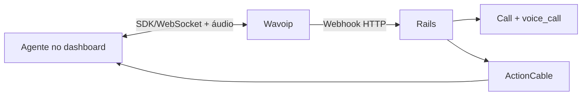

# Wavoip — provider alternativo de voz

Estratégia para integrar Wavoip ao fork sem alterar o fluxo Meta Cloud Calling.

**Reavaliado em:** 27 jun. 2026

## Comece aqui

1. [implementation-plan.md](./implementation-plan.md) — **fonte única de execução** (fases 1–4 code-complete)
2. [spike-notes.md](./spike-notes.md) — gates G0.1–G0.7 e veredicto E2E
3. [operations-runbook.md](./operations-runbook.md) — onboarding e troubleshooting em produção
4. [official-docs.md](./official-docs.md) — documentação oficial atual
5. [contracts-and-ports.md](./contracts-and-ports.md) — contratos de backend/frontend

Os demais documentos são referências especializadas:

| Documento | Uso |
|-----------|-----|
| [architecture.md](./architecture.md) | módulos, responsabilidades e fluxos |
| [frontend-integration.md](./frontend-integration.md) | SDK, lifecycle e integração Vue |
| [sdk-reference.md](./sdk-reference.md) | API `@wavoip/wavoip-api` |
| [webhook-contract.md](./webhook-contract.md) | entrada HTTP, idempotência e ActionCable |
| [inbox-setup.md](./inbox-setup.md) | criação e ativação do inbox |
| [operations-runbook.md](./operations-runbook.md) | suporte e rollout |
| [wavoip-vs-meta.md](./wavoip-vs-meta.md) | limites entre Wavoip e Meta |
| [feature-flags.md](./feature-flags.md) | piloto `channel_wavoip` |
| [fixtures/](./fixtures/) | payloads de teste; substituir no spike |

## Resumo da decisão

Wavoip não é um adapter da Graph Calling API. A mídia e a sinalização ficam no
browser por `@wavoip/wavoip-api`; o Rails recebe webhooks para persistir contato,
conversa, `Call`, mensagem e eventos auxiliares.

Decisões principais:

- canal separado `Channel::Wavoip`;
- registry frontend pequeno para compartilhar widget/store sem compartilhar SDP;
- spike antes de refactor;
- enum `Call.provider` alterado com uma linha `# FORK:` explícita;
- webhook por chave opaca, sem telefone no path ou secret em query;
- MVP termina em inbound/outbound com histórico e aceite auditável;
- push com aba fechada, gravação, pareamento completo e diagnóstico ficam pós-MVP.

## Gates que bloquearam implementação (spike — resolvido com restrições)

Resultados em [spike-notes.md](./spike-notes.md) (19 jun. 2026):

| Gate | Resultado |
|------|-----------|
| G0.1 SDK | ✅ Pass |
| G0.2 IDs | ⚠️ Partial — pipeline OK via simulação; correlação live não provada (sem webhook CALL do painel) |
| G0.3 Webhook bruto | ⚠️ Partial — endpoint `202`; painel Wavoip não POSTa CALL em chamadas live |
| G0.4 Multiagente | ❌ Não testado |
| G0.5 Lifecycle | ✅ Pass |
| G0.6 Segurança | ✅ Pass |
| G0.7 Histórico | ✅ Pass (simulado) |

**Veredicto:** `go com restrições` — código em produção; piloto bloqueado em entrega de webhooks CALL pelo painel Wavoip.

## Escopo revisado

| Fase | Entrega | Estimativa |
|------|---------|------------|
| 0 | Spike SDK, webhook, IDs e multiagente | 2–4 dias |
| 1 | Canal, credenciais, webhook e setup | 4–6 dias |
| 2 | Outbound + histórico | 4–6 dias |
| 3 | Inbound + registry + aceite auditável | 6–8 dias |
| 4 | Hardening e piloto | 3–5 dias |

Estimativa inicial do MVP após spike: **4–6 semanas**, dependendo principalmente da
correlação SDK/webhook e da extensão dos acoplamentos frontend.

## Estado atual (27 jun. 2026)

| Métrica | Valor |
|---------|-------|
| **MVP código** | ~95% (fases 0–4 code-complete; refactory R1–R3 concluído) |
| **Piloto produção** | ~65% (webhooks CALL live resolvido no vendor; G0.4 multiagente pendente) |
| **Bloqueador piloto** | Teste formal G0.4 multiagente; demais fluxos inbound operacionais |

| Componente | Status |
|------------|--------|
| Meta Calling | Implementado em `enterprise/` |
| **Wavoip backend** | ✅ Code complete — `custom/app/models/channel/wavoip.rb`, webhook pipeline, `CallUpsertService`, `ConversationLinker`, `Broadcaster`, `CallsController#update` |
| **Wavoip frontend** | ✅ 18 arquivos em `custom/app/javascript/` — registry, composables SDK, `Wavoip.vue`, `WavoipCallingPage.vue` |
| **Enum `Call.provider`** | ✅ `wavoip: 2` em `enterprise/app/models/call.rb` (`# FORK:`) |
| **Testes** | ✅ 76 RSpec + 21 Vitest (com DB) |
| **E2E live** | ✅ Inbound com webhooks CALL + SDK offer; outbound RINGING → ACTIVE |
| **UX ringtone (27 jun.)** | ✅ Parar som ao rejeitar; mute persistente (`useCallRingtonePreference`); alerta `CALLER_ENDED`; reconciliação `wavoipOfferId` |
| **Produção piloto** | Account 2, inbox 42, device `556697193168` (`open`) |
| Pacote npm | `@wavoip/wavoip-api@2.6.1` |

**Pós-MVP:** UI RECORD, push offline, métricas. Rotação de webhook key — ✅ (`WavoipCallingPage`). Roteamento inbound configurável — ✅ ([inbox-setup.md §3.6](./inbox-setup.md#36-seção--roteamento-de-chamadas-inbound-settings)).

Contexto geral: [../README.md](../README.md) ·
[../architecture-and-flow.md](../architecture-and-flow.md) ·
[../second-provider-strategy.md](../second-provider-strategy.md).
