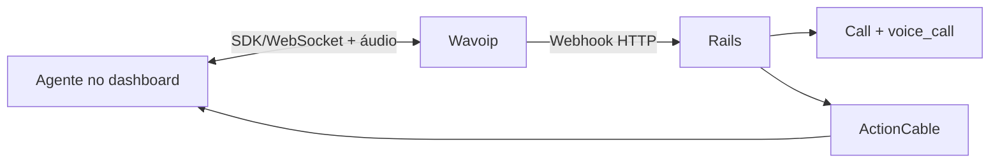

# Wavoip — provider alternativo de voz

Integração shipped no fork: canal `Channel::Wavoip` em `custom/`, sem alterar o fluxo Meta Cloud Calling.

**Status (jul. 2026):** código completo (inbound, outbound, histórico, gravação, device panel/QR, multiagente). Piloto de produção aguarda validação ops/browser — ver [operations-runbook.md](./operations-runbook.md#gates-de-piloto-jul-2026).

## Comece aqui

| Documento | Uso |
|-----------|-----|
| [architecture.md](./architecture.md) | As-built: módulos, jobs, FE, regra browser vs Rails |
| [operations-runbook.md](./operations-runbook.md) | Onboarding, feature flag, troubleshooting, gates piloto |
| [webhook-contract.md](./webhook-contract.md) | HTTP, idempotência, ActionCable |
| [inbox-setup.md](./inbox-setup.md) | Wizard e Settings → Chamadas |
| [frontend-integration.md](./frontend-integration.md) | Lifecycle Vue / SDK |
| [sdk-reference.md](./sdk-reference.md) | API `@wavoip/wavoip-api` |
| [official-docs.md](./official-docs.md) | Índice GitBook Wavoip |
| [wavoip-vs-meta.md](./wavoip-vs-meta.md) | Limites entre Wavoip e Meta |
| [fixtures/](./fixtures/) | Payloads de referência para specs |

Contexto geral: [../README.md](../README.md) · [../architecture-and-flow.md](../architecture-and-flow.md).

## Como funciona

Wavoip não é adapter da Graph Calling API. Mídia e sinalização ficam no browser via `@wavoip/wavoip-api`; o Rails recebe webhooks para persistir contato, conversa, `Call`, mensagem e eventos auxiliares.

## Decisões estáveis

| Tema | Decisão |
|------|---------|
| Canal | `Channel::Wavoip` + tabela `channel_wavoip` (separado de `Channel::Whatsapp`) |
| UI compartilhada | Registry de sessão/cable; não reutilizar SDP Meta |
| `Call.provider` | `wavoip: 2` com `# FORK:` em `enterprise/app/models/call.rb` |
| Webhook | URL com chave opaca rotacionável; sem telefone no path |
| Credencial SDK | `device_token` criptografado quando `ACTIVE_RECORD_ENCRYPTION_*` está configurado |
| Pacote | `@wavoip/wavoip-api@2.6.3` |

## Status da implementação

| Área | Estado | Localização |
|------|--------|-------------|
| Backend | ✅ | `custom/app/models/channel/wavoip.rb`, `webhooks/wavoip_controller.rb`, `services/wavoip/**`, `jobs/wavoip/**` |
| Call enum | ✅ `wavoip: 2` | `enterprise/app/models/call.rb` |
| Accept audit | ✅ | `POST …/calls/:id/join` + `PATCH …/calls/:id` |
| Frontend | ✅ | `custom/app/javascript/dashboard/{composables,lib,components}/wavoip/` |
| Device panel / QR | ✅ | `WavoipDevicePanel.vue`, `useWavoipQrSession` |
| Gravação | ✅ | webhook `RECORD` + fallback `FetchDirectRecordingJob` |
| Testes | ✅ | `spec/custom/**/wavoip`, Vitest em `custom/.../specs/`, Playwright `tests/playwright/.../wavoip/` |

### Gates piloto restantes

| Gate | Descrição | Status |
|------|-----------|--------|
| **W1** | Prova live: webhook CALL do painel Wavoip em chamada real | Pendente (ops) |
| **G0.4 / M1** | Multiagente em 2 browsers (`acceptedElsewhere`) | Código ✅; E2E browser pendente |
| **O1 / D1 / F1** | Outbound bidirecional, dismiss inbound, accept fail | Pendente (browser) |
| **I1 / I2 / O2** | Pipeline caller/receiver | ✅ Pass (`bin/wavoip-pilot-verify`) |

Procedimentos: [operations-runbook.md](./operations-runbook.md).

### Backlog pós-piloto (não bloqueia)

- ~~Web Push com aba fechada~~ — ✅ via `voice_call_incoming` + VAPID (atender ainda exige dashboard)
- ~~Métricas/alertas avançados~~ — ✅ `last_webhook_at` + `WebhookStaleAlertJob` (24h)
- ~~Seleção de mic/speaker~~ — ✅ SDK usa o dispositivo padrão do SO (Windows/macOS); troca nas configurações do sistema
- Guardrails soft de volume outbound (toast 20/50) — ✅

## Legado

Coluna `users.wavoip_token` **não** é usada pelo canal Wavoip — credencial fica em `channel_wavoip.device_token`.
