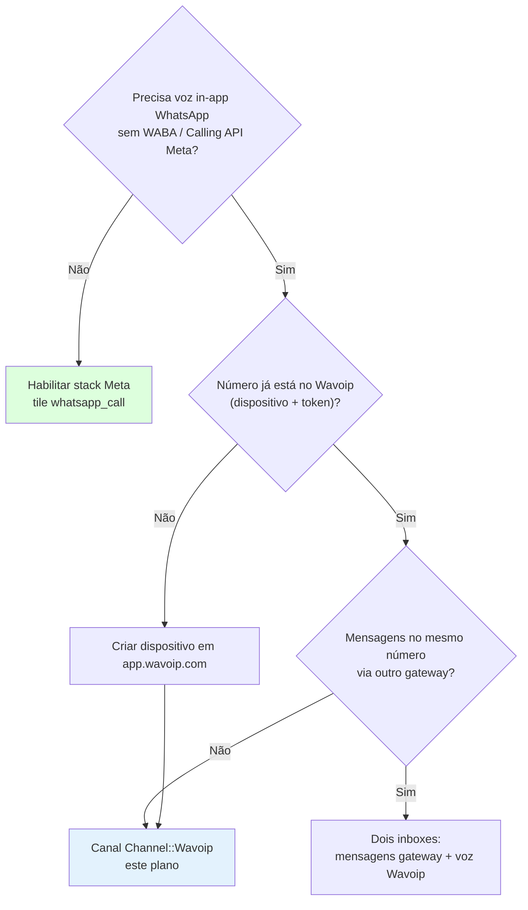

# Wavoip — Estratégia de implementação (provider alternativo de voz)

Plano para integrar **[Wavoip](https://wavoip.gitbook.io/api)** como primeiro provider alternativo de **chamadas de voz WhatsApp in-app** no fork Chatwoot, sem alterar o caminho upstream **Meta Cloud Calling**.

**Última revisão:** jun/2026.

---

## Por onde começar

| Perfil | Documento |
|--------|-----------|
| **Decisão go/no-go e posicionamento vs Meta** | [wavoip-vs-meta.md](./wavoip-vs-meta.md) |
| **Arquitetura, limites de classes, fluxos** | [architecture.md](./architecture.md) |
| **Fases, entregas, critérios de done** | [implementation-plan.md](./implementation-plan.md) |
| **SDK browser, notificações, diagnóstico** | [frontend-integration.md](./frontend-integration.md) |

**Contexto upstream:** [../README.md](../README.md) · [../architecture-and-flow.md](../architecture-and-flow.md) · [../second-provider-strategy.md](../second-provider-strategy.md)

**Docs oficiais Wavoip:**

- [API (`@wavoip/wavoip-api`)](https://wavoip.gitbook.io/api/wavoip-api/primeiros-passos/initialization.md) — WebSocket + chamadas no browser
- [Webphone (`@wavoip/wavoip-webphone`)](https://wavoip.gitbook.io/api/webphone/primeiros-passos/inicializacao.md) — UI React ( **não** usar no Chatwoot)
- [Webhook (Beta)](https://wavoip.gitbook.io/api/wavoip-docs/webhook-beta.md) — eventos `CALL`, `RECORD`, `DEVICE`
- [Notificações push (webphone)](https://wavoip.gitbook.io/api/webphone/recursos/notificacoes-push.md) — referência de comportamento
- [Diagnóstico de chamada](https://wavoip.gitbook.io/api/webphone/recursos/diagnostico.md) — referência de telemetria

---

## Resumo executivo

Wavoip **não** é um CPaaS compatível com Meta Graph `/calls`. É um **SDK browser-first** (`@wavoip/wavoip-api`) + **webhooks HTTP** para sincronizar estado no servidor.

| Camada | Responsável |
|--------|-------------|
| **Sinalização + mídia** | Browser do agente ↔ Wavoip (WebSocket/WebRTC encapsulado) |
| **Histórico CRM** | Chatwoot Rails via webhook + model `Call` + bolha `voice_call` |
| **UI de atendimento** | `FloatingCallWidget` existente + composables Vue finos |

**Não reutilizar:** `WhatsappCallsController`, `useWhatsappCallSession`, `WhatsappEventsJob` (formato Meta).

**Reutilizar:** `FloatingCallWidget`, `calls.js`, `useCallSession` (orquestrador), `Voice::InboundCallBuilder`, feature `channel_voice`.

---

## Árvore de decisão — Wavoip no fork

---

## Princípios de implementação (fork)

Alinhado a `AGENTS.md` e `.cursor/rules/fork-strategy.mdc`:

1. **Código novo em `custom/`** — models, services, controllers, composables, rotas.
2. **Upstream intocado** — não editar `enterprise/` para Wavoip; não forçar adapter em `WhatsappCloudService`.
3. **`# FORK:` mínimo** — apenas ganchos inevitáveis (enum `Call.provider`, registry em `inbox.js`, tile em `ChannelList`).
4. **Classes pequenas** — um handler por tipo de webhook; composables por responsabilidade; controller fino.
5. **Canal separado** — `Channel::Wavoip`, tile `wavoip_call`; não misturar com `whatsapp_call` (Meta).
6. **MVP happy-path** — outbound + inbound + bolha + webhook; diagnóstico e gravação em fases posteriores.

---

## Escopo por fase (visão rápida)

| Fase | Entrega | Duração estimada |
|------|---------|------------------|
| **0** | POC SDK + webhook em ambiente de teste | 2–4 dias |
| **1** | Canal `Channel::Wavoip` + settings + lifecycle SDK | 1 semana |
| **2** | Outbound na conversa + bolha `voice_call` | 1 semana |
| **3** | Inbound + `FloatingCallWidget` + ActionCable auxiliar | 1–2 semanas |
| **4** | Webhook `RECORD` + missed calls | 3–5 dias |
| **5** | Diagnóstico operacional (opcional) | 3–5 dias |

Detalhes: [implementation-plan.md](./implementation-plan.md).

---

## Gates de produto (UI)

Tile **Chamada Wavoip** (`wavoip_call`) ativo quando:

- `account.feature_enabled?('channel_voice')`
- Inbox com `device_token` configurado (não exige `WHATSAPP_APP_ID` Meta)

Diferente do tile `whatsapp_call` (Meta), que exige `channel_voice` + `whatsappAppId`.

---

## Riscos principais

| Risco | Mitigação |
|-------|-----------|
| Multi-agente com mesmo token (`acceptedElsewhere`) | Webhook + ActionCable ring; política documentada (primeiro aceite ganha) |
| Agente offline — ninguém atende | Webhook cria conversa `missed`; notificação Chatwoot existente |
| Webhook Beta — schema instável | `PayloadNormalizer` versionado em `custom/` |
| Bundle `@wavoip/wavoip-api` | Import dinâmico só em rotas de inbox Wavoip |
| ToS / gateway não oficial | Doc separada; produto distinto da Meta oficial |
| iOS Safari sem `Notification` | Reusar push VAPID Chatwoot + ringtone com aba aberta |

---

## Índice de documentos

| Arquivo | Conteúdo |
|---------|----------|
| [wavoip-vs-meta.md](./wavoip-vs-meta.md) | Por que Wavoip não usa o stack Meta |
| [architecture.md](./architecture.md) | Diagramas, módulos, anti–god-class |
| [implementation-plan.md](./implementation-plan.md) | Fases, arquivos, FORK markers, done criteria |
| [frontend-integration.md](./frontend-integration.md) | SDK, notificações, diagnóstico no Vue |
