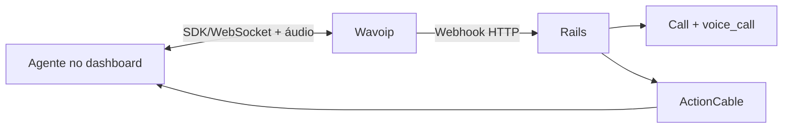

# Wavoip — provider alternativo de voz

Estratégia para integrar Wavoip ao fork sem alterar o fluxo Meta Cloud Calling.

**Reavaliado em:** 19 jun. 2026

## Comece aqui

1. [implementation-plan.md](./implementation-plan.md) — **fonte única de execução**
2. [spike-notes.template.md](./spike-notes.template.md) — gates de go/no-go
3. [official-docs.md](./official-docs.md) — documentação oficial atual
4. [contracts-and-ports.md](./contracts-and-ports.md) — contratos de backend/frontend

Os demais documentos são referências especializadas:

| Documento | Uso |
|-----------|-----|
| [architecture.md](./architecture.md) | módulos, responsabilidades e fluxos |
| [frontend-integration.md](./frontend-integration.md) | SDK, lifecycle e integração Vue |
| [sdk-reference.md](./sdk-reference.md) | API `@wavoip/wavoip-api` |
| [webhook-contract.md](./webhook-contract.md) | entrada HTTP, idempotência e ActionCable |
| [inbox-setup.md](./inbox-setup.md) | criação e ativação do inbox |
| [operations-runbook.md](./operations-runbook.md) | suporte e rollout |
| [wavoip-vs-meta.md](./wavoip-vs-meta.md) | limites entre Wavoip e Meta |
| [feature-flags.md](./feature-flags.md) | piloto `channel_wavoip` |
| [fixtures/](./fixtures/) | payloads de teste; substituir no spike |

## Resumo da decisão

Wavoip não é um adapter da Graph Calling API. A mídia e a sinalização ficam no
browser por `@wavoip/wavoip-api`; o Rails recebe webhooks para persistir contato,
conversa, `Call`, mensagem e eventos auxiliares.

Decisões principais:

- canal separado `Channel::Wavoip`;
- registry frontend pequeno para compartilhar widget/store sem compartilhar SDP;
- spike antes de refactor;
- enum `Call.provider` alterado com uma linha `# FORK:` explícita;
- webhook por chave opaca, sem telefone no path ou secret em query;
- MVP termina em inbound/outbound com histórico e aceite auditável;
- push com aba fechada, gravação, pareamento completo e diagnóstico ficam pós-MVP.

## Gates que bloqueiam implementação

- Correlação determinística entre IDs do SDK e `whatsapp_call_id` do webhook.
- Payload HTTP bruto real, pois o exemplo oficial de `CALL` declara `type` duas vezes.
- Comportamento multiagente (`acceptedElsewhere`/`rejectedElsewhere`).
- Entrega segura do token somente a agentes autorizados do inbox.
- Smoke do `Call`/builder com `provider: :wavoip`.

Sem esses resultados, o plano permanece hipótese e não deve avançar para UI de produto.

## Escopo revisado

| Fase | Entrega | Estimativa |
|------|---------|------------|
| 0 | Spike SDK, webhook, IDs e multiagente | 2–4 dias |
| 1 | Canal, credenciais, webhook e setup | 4–6 dias |
| 2 | Outbound + histórico | 4–6 dias |
| 3 | Inbound + registry + aceite auditável | 6–8 dias |
| 4 | Hardening e piloto | 3–5 dias |

Estimativa inicial do MVP após spike: **4–6 semanas**, dependendo principalmente da
correlação SDK/webhook e da extensão dos acoplamentos frontend.

## Estado atual

- Meta Calling: implementado em `enterprise/`.
- Wavoip: documentação e fixtures de referência; nenhum código de integração.
- Pacote npm verificado em 19 jun. 2026: `@wavoip/wavoip-api@2.5.0`.

Contexto geral: [../README.md](../README.md) ·
[../architecture-and-flow.md](../architecture-and-flow.md) ·
[../second-provider-strategy.md](../second-provider-strategy.md).
