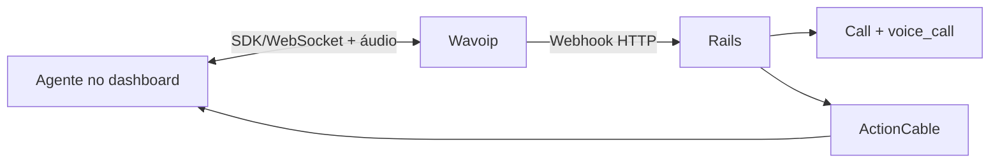

# Wavoip — provider alternativo de voz

Estratégia para integrar Wavoip ao fork sem alterar o fluxo Meta Cloud Calling.

**Reavaliado em:** 04 jul. 2026 — status e métricas completas em
[implementation-plan.md](./implementation-plan.md) (fonte única de execução).

## Comece aqui

1. [implementation-plan.md](./implementation-plan.md) — **fonte única de execução**: fases, status, changelog
2. [spike-notes.md](./spike-notes.md) — gates G0.1–G0.7 e veredicto E2E
3. [operations-runbook.md](./operations-runbook.md) — onboarding, feature flag e troubleshooting em produção
4. [official-docs.md](./official-docs.md) — documentação oficial atual
5. [contracts-and-ports.md](./contracts-and-ports.md) — contratos de backend/frontend

Os demais documentos são referências especializadas:

| Documento | Uso |
|-----------|-----|
| [architecture.md](./architecture.md) | diagramas de fluxo (webhook → handlers, ActionCable) |
| [frontend-integration.md](./frontend-integration.md) | SDK, lifecycle e integração Vue |
| [sdk-reference.md](./sdk-reference.md) | API `@wavoip/wavoip-api` |
| [webhook-contract.md](./webhook-contract.md) | entrada HTTP, idempotência e ActionCable |
| [inbox-setup.md](./inbox-setup.md) | criação e ativação do inbox |
| [wavoip-vs-meta.md](./wavoip-vs-meta.md) | limites entre Wavoip e Meta |
| [refactory/CHANGELOG.md](./refactory/CHANGELOG.md) | histórico condensado de bugs/gaps/qualidade já corrigidos |
| [fixtures/](./fixtures/) | payloads de referência para specs |

## Resumo da decisão

Wavoip não é um adapter da Graph Calling API. A mídia e a sinalização ficam no
browser por `@wavoip/wavoip-api`; o Rails recebe webhooks para persistir contato,
conversa, `Call`, mensagem e eventos auxiliares.

Decisões principais:

- canal separado `Channel::Wavoip`;
- registry frontend pequeno para compartilhar widget/store sem compartilhar SDP;
- spike antes de refactor;
- enum `Call.provider` alterado com uma linha `# FORK:` explícita;
- webhook por chave opaca, sem telefone no path ou secret em query;
- MVP termina em inbound/outbound com histórico e aceite auditável;
- push com aba fechada, pareamento completo e diagnóstico ficam pós-MVP (gravação já entregue — ver changelog).

## Gates que bloquearam implementação (spike — resolvido com restrições)

Resultados completos em [spike-notes.md](./spike-notes.md).

| Gate | Resultado |
|------|-----------|
| G0.1 SDK | ✅ Pass |
| G0.2 IDs | ⚠️ Partial — pipeline OK; correlação live via painel Wavoip (W1) pendente |
| G0.3 Webhook bruto | ⚠️ Partial — endpoint `202`; POST CALL do painel em chamada live ainda não provado |
| G0.4 Multiagente | ❌ Browser E2E pendente |
| G0.5 Lifecycle | ✅ Pass |
| G0.6 Segurança | ✅ Pass |
| G0.7 Histórico | ✅ Pass (simulado) |

**Veredicto:** `go com restrições` — código em produção; piloto bloqueado em **W1**
(prova live painel) + **G0.4** (browser E2E multiagente) + o incidente de webhook descrito
em [implementation-plan.md](./implementation-plan.md#doc-status-04-jul-2026).

Contexto geral: [../README.md](../README.md) ·
[../architecture-and-flow.md](../architecture-and-flow.md) ·
[../second-provider-strategy.md](../second-provider-strategy.md).
