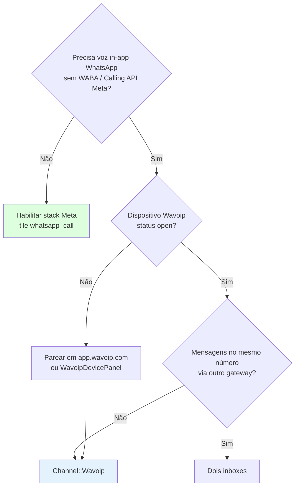

# Wavoip — Estratégia de implementação (provider alternativo de voz)

Plano para integrar **[Wavoip](https://wavoip.gitbook.io/api)** como primeiro provider alternativo de **chamadas de voz WhatsApp in-app** no fork Chatwoot, sem alterar o caminho upstream **Meta Cloud Calling**.

**Última revisão:** jun/2026 — replanejamento pós [sdk-reference.md](./sdk-reference.md).

---

## Por onde começar

| Perfil | Documento |
|--------|-----------|
| **Decisão go/no-go e posicionamento vs Meta** | [wavoip-vs-meta.md](./wavoip-vs-meta.md) |
| **Criação da caixa de entrada (formulário completo)** | [inbox-setup.md](./inbox-setup.md) |
| **Arquitetura, limites de classes, fluxos** | [architecture.md](./architecture.md) |
| **Fases, entregas, critérios de done** | [implementation-plan.md](./implementation-plan.md) |
| **SDK browser, notificações, diagnóstico** | [frontend-integration.md](./frontend-integration.md) |
| **Referência completa `@wavoip/wavoip-api`** | [sdk-reference.md](./sdk-reference.md) |

**Contexto upstream:** [../README.md](../README.md) · [../architecture-and-flow.md](../architecture-and-flow.md) · [../second-provider-strategy.md](../second-provider-strategy.md)

**Docs oficiais Wavoip:**

- [API (`@wavoip/wavoip-api`)](https://wavoip.gitbook.io/api/wavoip-api/primeiros-passos/initialization.md) — WebSocket + chamadas no browser
- [Device](https://wavoip.gitbook.io/api/wavoip-api/conceitos-fundamentais/device.md) · [Media](https://wavoip.gitbook.io/api/wavoip-api/conceitos-fundamentais/media.md)
- [Incoming](https://wavoip.gitbook.io/api/wavoip-api/chamadas/incoming.md) · [Outgoing](https://wavoip.gitbook.io/api/wavoip-api/chamadas/outgoing.md) · [Active](https://wavoip.gitbook.io/api/wavoip-api/chamadas/active.md)
- [Types](https://wavoip.gitbook.io/api/wavoip-api/referencia/types.md) · [Troubleshooting](https://wavoip.gitbook.io/api/wavoip-api/referencia/troubleshooting.md)
- [Webhook (Beta)](https://wavoip.gitbook.io/api/wavoip-docs/webhook-beta.md) — eventos `CALL`, `RECORD`, `DEVICE`
- [Webphone](https://wavoip.gitbook.io/api/webphone/primeiros-passos/inicializacao.md) — **não** usar no Chatwoot

---

## Resumo executivo

Wavoip **não** é CPaaS Meta. É **SDK browser** (`@wavoip/wavoip-api`) + **webhooks HTTP** para CRM.

| Camada | Responsável |
|--------|-------------|
| **Dispositivo + sinalização + mídia** | Browser ↔ Wavoip (WebSocket; WebRTC ou relay) |
| **Histórico CRM** | Rails via webhook + `Call` + bolha `voice_call` |
| **UI** | `FloatingCallWidget` + composables Vue em `custom/` |

**Insight da revisão SDK:** chamadas só ocorrem com `Device.status === 'open'`. QR, hibernação (`wakeUp`) e erros de conta são **pré-requisitos operacionais**, não polish tardio.

---

## O que mudou no plano (jun/2026)

| Antes | Depois |
|-------|--------|
| Device health na Fase 4 | **`WavoipDevicePanel` na Fase 1** — validar token e status `open` |
| Webhook handlers na Fase 2 | **Skeleton webhook na Fase 1** (200 + job); handlers completos na Fase 2 |
| Device após gravação | **Gates runtime** (`open`, `wakeUp`, gesto) documentados como done criteria |
| `Call.prepend` manual | **`prepend_mod_with('Custom::Call')`** |
| REST `register_attempt` no plano | **Fora do MVP** — webhook + SDK bastam |
| Um vocabulário de status | **Dois mappers**: `StatusMapper` (webhook) + `callStatusUI.js` (SDK) |
| FORK ad hoc em 6+ Vue | **Inventário ≤ 12 arquivos** + handlers em `custom/` |

---

## Árvore de decisão — Wavoip no fork

---

## Princípios de implementação (fork)

Alinhado a `AGENTS.md` e `.cursor/rules/fork-strategy.mdc`:

1. **Código novo em `custom/`** — inclui primeiro bloco de JS/Vue (`customDashboard` alias Vite).
2. **Upstream intocado** — Meta, Twilio, `WhatsappCallsController` intactos.
3. **`prepend_mod_with`** para extensões EE (`Call`, inbox create).
4. **`# FORK:` mínimo** — inventário em [implementation-plan.md](./implementation-plan.md).
5. **Canal STI separado** — `Channel::Wavoip`; tile `wavoip`.
6. **Fatias verticais** — Fase 1 infra → Fase 2 outbound → Fase 3 inbound.
7. **Reusar EE** — `Voice::InboundCallBuilder` com `provider: :wavoip`.

---

## Escopo por fase (visão rápida)

| Fase | Entrega | Duração |
|------|---------|---------|
| **0** | Spike SDK + webhook + device lifecycle | 2–4 dias |
| **1** | Canal + wizard + webhook skeleton + **painel dispositivo** | 1–1,5 sem |
| **2** | **Outbound** + handlers webhook + gates `open`/`wakeUp` | ~1 sem |
| **3** | **Inbound** + widget + multi-agente | 1–1,5 sem |
| **4** | Gravação + push offline | 3–5 dias |
| **5** | Diagnóstico + seletor mídia (opcional) | 3–5 dias |

Detalhes: [implementation-plan.md](./implementation-plan.md).

---

## Gates de produto (UI)

**Tile Wavoip** ativo com `channel_voice` — sem `WHATSAPP_APP_ID`.

**Botão ligar / aceitar** ativo somente quando:

1. `channel_voice` + token configurado
2. SDK reporta `Device.status === 'open'`
3. Agente online (inbound/outbound)
4. Ação via clique (política de áudio do browser)

---

## Riscos principais

| Risco | Mitigação |
|-------|-----------|
| Dispositivo não `open` / hibernando | `WavoipDevicePanel` Fase 1; `wakeUp()` antes de discar |
| Multi-agente `acceptedElsewhere` | Webhook `HANDLED_REMOTELY` + evento SDK |
| Dois vocabulários de status | Mappers separados — [sdk-reference §7](./sdk-reference.md#7-dois-vocabulários-de-status-crítico) |
| `connectivityIssue` / NAT | Toast Fase 2; diagnóstico completo Fase 5 |
| Webhook Beta instável | `PayloadNormalizer` + fixtures do spike |
| Bundle SDK | Dynamic import |
| Custom JS sem alias Vite | `# FORK:` em `vite.shared.ts` na Fase 1 |
| ToS gateway não oficial | Produto distinto da Meta — [wavoip-vs-meta.md](./wavoip-vs-meta.md) |

---

## Índice de documentos

| Arquivo | Conteúdo |
|---------|----------|
| [wavoip-vs-meta.md](./wavoip-vs-meta.md) | Por que Wavoip não usa o stack Meta |
| [inbox-setup.md](./inbox-setup.md) | Wizard caixa de entrada |
| [architecture.md](./architecture.md) | Diagramas, módulos, anti–god-class |
| [implementation-plan.md](./implementation-plan.md) | **Fases revisadas**, FORK inventory, done criteria |
| [frontend-integration.md](./frontend-integration.md) | SDK, notificações, Pinia |
| [sdk-reference.md](./sdk-reference.md) | Device, Media, Calls, Types, Troubleshooting |
