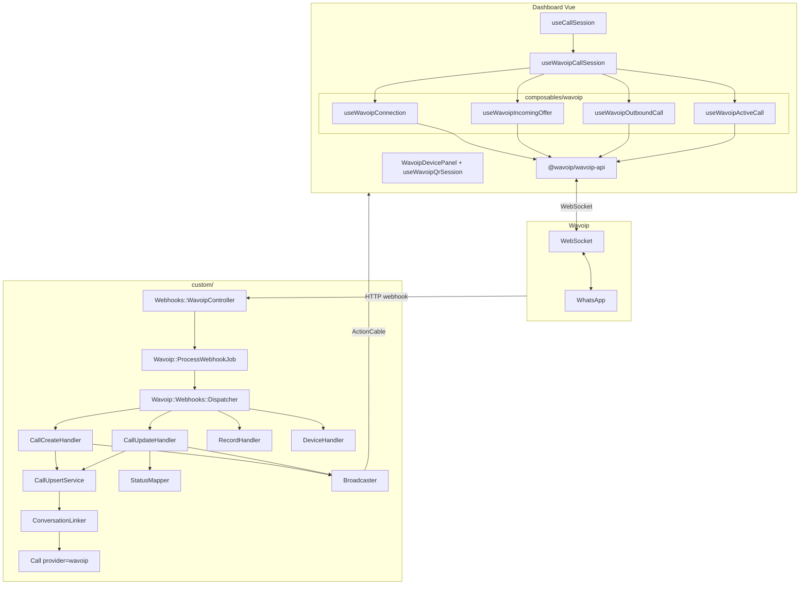
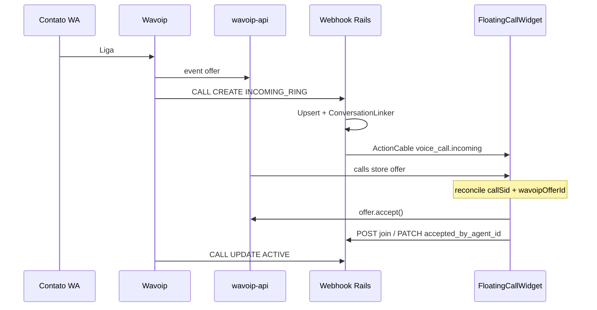
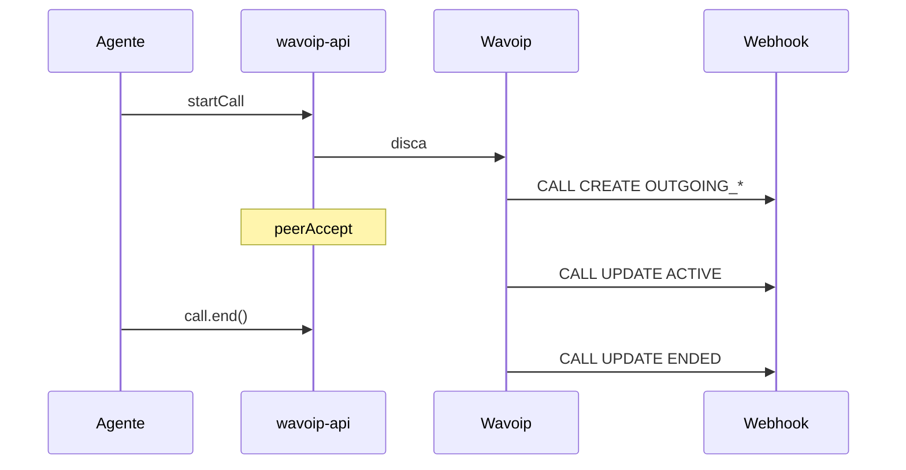

# Arquitetura — Wavoip no Chatwoot (as-built)

Desenho técnico alinhado ao código em `custom/`. Classes pequenas por evento/ação; sem god class.

**Relacionado:** [webhook-contract.md](./webhook-contract.md) · [frontend-integration.md](./frontend-integration.md) · [sdk-reference.md](./sdk-reference.md) · [wavoip-vs-meta.md](./wavoip-vs-meta.md) · [official-docs.md](./official-docs.md) · [../architecture-and-flow.md](../architecture-and-flow.md)

---

## 1. Visão geral



### Regra de ouro

| Camada | Dono de quê |
|--------|-------------|
| **Browser + SDK** | `accept` / `reject` / `startCall` / `end` / mute / WebRTC |
| **Servidor Rails** | Contato, conversa, `Call`, bolha `voice_call`, ActionCable auxiliar, gravação |
| **Webhook Wavoip** | Histórico e transições de status autoritativas para o CRM |
| **SDK `offer`** | Ring em tempo real + áudio (pode chegar **antes** do webhook) |

O servidor **não** aceita chamada Wavoip; o browser **não** cria `Conversation` sozinho.

---

## 2. Modelo de canal

### `Channel::Wavoip` — `custom/app/models/channel/wavoip.rb`

Tabela `channel_wavoip` (migration em `db/migrate/`).

| Campo | Uso |
|-------|-----|
| `phone_number` | E.164; único por **`[account_id, phone_number]`**; identidade do device (celular ou fixo — sem restrição de tipo) |
| `account_id` | Conta |
| `device_token` | Credencial SDK; `encrypts` se `Chatwoot.encryption_configured?` |
| `webhook_key` | Chave opaca rotacionável no path do webhook |
| `provider_config` (jsonb) | `inbound_calls_enabled`, roteamento inbound, `device_status`, `webhook_verified_at`, `call_recording_enabled`, etc. |

```ruby
def voice_enabled?
  device_token.present? &&
    account.feature_enabled?('channel_voice') &&
    account.feature_enabled?('channel_wavoip')
end
```

Feature flag: `config/features.yml` (`channel_wavoip`).

**Por que channel separado?** Voz Wavoip e mensagens Meta/gateway são produtos distintos; evita inflar `Channel::Whatsapp` e mantém merge-safety.

---

## 3. Backend — webhook

Contrato HTTP completo: [webhook-contract.md](./webhook-contract.md).

### 3.1 Entrada

`Webhooks::WavoipController` (`custom/app/controllers/webhooks/wavoip_controller.rb`):

- Resolve canal por `webhook_key` no path
- Rate limit (Rack::Attack) + payload máx. 64 KB
- Enfileira `Wavoip::ProcessWebhookJob.perform_later(inbox_id, payload)`
- Responde **202 Accepted** imediatamente
- Log: `type`, `action`, `whatsapp_call_id`, `status` — sem token/secret

### 3.2 Job + dispatcher

`Wavoip::ProcessWebhookJob` → `Wavoip::Webhooks::Dispatcher`

```ruby
HANDLERS = {
  'CALL'   => Wavoip::Webhooks::Handlers::CallHandler,
  'RECORD' => Wavoip::Webhooks::Handlers::RecordHandler,
  'DEVICE' => Wavoip::Webhooks::Handlers::DeviceHandler,
}.freeze
```

`CallHandler` roteia `CREATE` → `CallCreateHandler`, `UPDATE` → `CallUpdateHandler`.

### 3.3 Serviços por responsabilidade

| Classe | Responsabilidade |
|--------|------------------|
| `Wavoip::Webhooks::PayloadNormalizer` | Hash → `Voice::Dto::WebhookCallEvent` |
| `Wavoip::Webhooks::Handlers::CallCreateHandler` | Inbound/outbound ring no servidor |
| `Wavoip::Webhooks::Handlers::CallUpdateHandler` | Transições de status |
| `Wavoip::Webhooks::Handlers::RecordHandler` | Anexar gravação à mensagem |
| `Wavoip::Webhooks::Handlers::DeviceHandler` | Status do dispositivo no inbox |
| `Wavoip::Calls::StatusMapper` | Status webhook → `Call.status` |
| `Wavoip::Calls::ConversationLinker` | Contato + conversa |
| `Wavoip::Calls::CallUpsertService` | find_or_create `Call` por `provider_call_id` |
| `Wavoip::Calls::CallStatusApplier` / `CallFinalizer` | Aplicar status / sync mensagem |
| `Wavoip::Calls::Broadcaster` | ActionCable `voice_call.*` com `provider: wavoip` |
| `Wavoip::Calls::IncomingCallRecipients` | Agentes para cable + push |
| `Wavoip::Calls::InboundPushService` | Notificação in-app `voice_call_incoming` |
| `Wavoip::Calls::ClaimGuard` | `accepted_by_agent_id` presente → já claimed |
| `Wavoip::Calls::ClearIncomingNotificationsService` | Limpa push após accept/ended |
| `Wavoip::Calls::JoiningAgentCache` | Double-accept no join (PATCH é alias) |
| `Wavoip::Calls::RecordingPolicy` / `DirectRecordingUrl` | Gravação + fallback URL |

Bolha `voice_call`: via upsert + builders EE (`Voice::InboundCallBuilder` / `Voice::CallMessageBuilder`) — **não** existe `MessageSyncService`.

**Parar ring após accept:** `ClaimGuard.claimed?` bloqueia `broadcast_incoming`, escalate e push enquanto status ainda é `ringing`. `broadcast_agent_accepted` limpa notificações via `ClearIncomingNotificationsService`. `AutoNoAnswerRingJob` não mata call claimed — agenda `ClaimedRingGraceJob`. `HANDLED_REMOTELY` claimed+ringing é deferido via `HandledRemotelyStaleJob`.

### 3.4 Jobs

| Job | Uso |
|-----|-----|
| `Wavoip::ProcessWebhookJob` | Ingresso assíncrono |
| `Wavoip::AttachRecordingJob` | Anexar áudio do webhook RECORD |
| `Wavoip::FetchDirectRecordingJob` | Fallback `storage.wavoip.com/{id}` |
| `Wavoip::RetryRecordAttachmentJob` | Retry de anexação (debounce Redis) |
| `Wavoip::InboundCallPushJob` | Push inbound |
| `Wavoip::EscalateRingJob` | Escalação de ring offline |
| `Wavoip::AutoNoAnswerRingJob` | Timeout ringing → no_answer (ou grace se claimed) |
| `Wavoip::ClaimedRingGraceJob` | Fecha ringing claimed se ACTIVE nunca chega (~45 min) |
| `Wavoip::HandledRemotelyStaleJob` | Fecha ringing claimed após HANDLED_REMOTELY deferido (~2 min) |
| `Wavoip::StaleInProgressCallJob` | Sweeper de calls presas |

### 3.5 DTO normalizado

`Voice::Dto::WebhookCallEvent` (`custom/app/services/voice/dto/webhook_call_event.rb`):

| Campo | Uso |
|-------|-----|
| `provider` | `:wavoip` |
| `external_call_id` | `whatsapp_call_id` |
| `action` | `:create` / `:update` |
| `external_status` | Status bruto do webhook |
| `direction` | inbound / outbound |
| `from_phone` / `to_phone` | Peers |
| `duration_seconds` | Duração |
| `session_id` / `call_type` | Meta Wavoip |
| `record_url` / `record_status` | Gravação |
| `raw_type` | `CALL` / `RECORD` / `DEVICE` |

### 3.6 Status webhook → Chatwoot

O webhook usa vocabulário diferente do SDK. Rails: `StatusMapper`. Browser: `lib/wavoip/wavoipCallDiagnostics.js` (não misturar).

| `status` webhook | `Call.status` |
|------------------|---------------|
| `INCOMING_RING`, `OUTGOING_RING`, `OUTGOING_CALLING`, `CONNECTING` | `ringing` |
| `ACTIVE` | `in_progress` |
| `ENDED` | `completed` |
| `NOT_ANSWERED` | `no_answer` |
| `REJECTED`, `FAILED`, `CONNECTION_LOST` | `failed` |
| `HANDLED_REMOTELY` | `completed` (`end_reason: handled_remotely`) |

`provider_call_id` = `whatsapp_call_id` (string).

### 3.7 API REST

| Endpoint | Uso |
|----------|-----|
| `POST /api/v1/accounts/:id/calls/:id/join` | Claim autoritativo: persiste `accepted_by_agent_id` + broadcast; 409 se outro agente |
| `PATCH /api/v1/accounts/:id/calls/:id` | Alias idempotente de `join` (backcompat) |

Frontend pós-accept chama **somente** `join`. Webhook `ACTIVE` usa `JoiningAgentCache` como fallback de attribution.

### 3.8 ActionCable e destinatários

Contrato: [webhook-contract §5](./webhook-contract.md#5-actioncable--contrato-por-provider). Wavoip **não** usa SDP nem `voice_call.outbound_connected`.

`IncomingCallRecipients` (cable + push):

| Prioridade | Quem recebe |
|------------|-------------|
| 1 | Agentes online na lista de Agentes do inbox |
| 2 | Fallback `incoming_call_offline_fallback` |

Valores de fallback: `none`, `assignee`, `assignee_or_inbox_members`, `assignee_or_inbox_members_and_administrators` (default).

`incoming_call_include_administrators` (default `true`): quando `false`, admins fora da aba Agentes não recebem cable/push/SDK. Config: [inbox-setup §3.6](./inbox-setup.md#36-seção--roteamento-de-chamadas-inbound-settings).

No browser, `wavoipInboxCallRouting.js` aplica a mesma regra (defesa em profundidade).

### 3.9 Serializer inbox

| Campo | Exposição |
|-------|-----------|
| `device_token` | Só admin; listagem mascarada |
| `webhook_key` | Só na URL de configuração |
| `wavoip_webhook_url` / `wavoip_setup_pending` | Read-only no jbuilder |
| Roteamento / `inbound_calls_enabled` | Slice seguro de `provider_config` |

---

## 4. Model `Call`

```ruby
# enterprise/app/models/call.rb
# FORK: persist Wavoip voice calls in the shared call timeline
enum :provider, { twilio: 0, whatsapp: 1, wavoip: 2 }
```

Overlay: `custom/app/models/custom/call.rb` (ex.: `recording_url` a partir de meta).

Meta típico:

```json
{
  "wavoip_session_id": 123,
  "wavoip_call_type": "official",
  "record_url": "https://…"
}
```

---

## 5. Frontend

Detalhes de lifecycle: [frontend-integration.md](./frontend-integration.md).

### 5.1 Facade

`useWavoipCallSession` orquestra `useWavoipConnection`, `useWavoipIncomingOffer`, `useWavoipOutboundCall`, `useWavoipActiveCall` e exporta API estável para `useCallSession` via `voiceSessionRegistry`.

### 5.2 Módulos principais

| Módulo | Faz |
|--------|-----|
| `lib/wavoip/wavoipSdkPort.js` | Único import `@wavoip/wavoip-api` |
| `lib/wavoip/wavoipClientRegistry.js` | Map `inboxId →` client |
| `lib/voice/voiceSessionRegistry.js` | Factory `BrowserVoiceSession` |
| `lib/voice/voiceCallCableRegistry.js` | Handlers cable por provider |
| `lib/voice/callStoreMappers.js` | Cable/offer → store |
| `lib/wavoip/wavoipCallDiagnostics.js` | Map SDK status → UI |
| `lib/wavoip/wavoipOutboundGuard.js` | Ignora offer outbound como inbound |
| `lib/wavoip/wavoipOutboundRingback.js` | Tom de saída dedicado |
| `composables/wavoip/useWavoipNotifications.js` | OS Notification (aba em background) |
| `WavoipDevicePanel.vue` + `useWavoipQrSession.js` | Status, QR, wake/reconnect/restart |
| `components/wavoip/WavoipQrDisplay.vue` / `WavoipQrScanModal.vue` | Pareamento |
| `components/wavoip/WavoipConversationDeviceBanner.vue` | Banner na conversa |
| `lib/wavoip/wavoipInboxCallRouting.js` | Filtro SDK/cable por inbox |

Broadcast ActionCable EE: `enterprise/app/services/voice/adapters/action_cable_call_broadcaster.rb` (não sob `custom/`).

### 5.3 Integração upstream (`# FORK:`)

- `useCallSession.js` → registry
- `actionCable.js` → `voiceCallCableRegistry`
- `inbox.js` → `Channel::Wavoip` → `VOICE_CALL_PROVIDERS.WAVOIP`
- Widget / bolha: `isBrowserVoiceProvider` de `browserVoiceProviders.js`

### 5.4 Ringtone / ringback

- Inbound: `ringtone.mp3`; preferência bell só afeta recebidas
- Outbound: `ringback.mp3` via `wavoipOutboundRingback.js` (sempre audível no happy path)
- Caller encerrou: toast `CALLER_ENDED` (SDK + cable)

---

## 6. Fluxos

### 6.1 Inbound



### 6.2 Outbound



---

## 7. Multi-agente

| Evento | Comportamento |
|--------|---------------|
| Vários agentes online, mesmo token | Todos recebem `offer`; cable reforça ring |
| Primeiro accept / join | Attribution; outros → `acceptedElsewhere` |
| `HANDLED_REMOTELY` | Fecha ring; `end_reason` |

Um token Wavoip por inbox de voz; agentes compartilham o número.

---

## 8. Segurança

| Item | Abordagem |
|------|-----------|
| `device_token` | Coluna criptografada; nunca em listagens |
| Webhook | Chave opaca; ver [webhook-contract](./webhook-contract.md) |
| Token no FE | Bootstrap só para agentes do inbox |
| Logs | Sem payload completo em produção |

---

## 9. Anti-padrões

| Anti-padrão | Substituto |
|-------------|------------|
| `WavoipService` monolítico | Handlers por `type` + `action` |
| Um composable gigante | Facade + composables por concern |
| Controller com lógica de conversa | `ConversationLinker` / services |
| Duplicar `InboundCallBuilder` | Chamar EE builder |
| Embutir webphone React | `@wavoip/wavoip-api` only |

---

## 10. Mapa de arquivos

```
custom/app/
  models/channel/wavoip.rb
  models/custom/call.rb
  controllers/webhooks/wavoip_controller.rb
  controllers/api/v1/accounts/calls_controller.rb
  jobs/wavoip/
    process_webhook_job.rb
    attach_recording_job.rb
    fetch_direct_recording_job.rb
    retry_record_attachment_job.rb
    inbound_call_push_job.rb
    escalate_ring_job.rb
    auto_no_answer_ring_job.rb
    stale_in_progress_call_job.rb
  services/wavoip/
    webhooks/{dispatcher,payload_normalizer,handlers/*}
    calls/{call_upsert_service,broadcaster,status_mapper,…}
  services/voice/dto/webhook_call_event.rb
  javascript/dashboard/
    composables/wavoip/
    lib/wavoip/
    lib/voice/
    components/wavoip/
    routes/.../Wavoip.vue, WavoipCallingPage.vue, WavoipDevicePanel.vue
```

Feature flag: `config/features.yml` (`channel_wavoip`).
Migration: `db/migrate/*_create_channel_wavoip.rb` (+ uniqueness scoped to account).

### Edições FORK típicas

| Arquivo | Mudança |
|---------|---------|
| `enterprise/app/models/call.rb` | enum `wavoip: 2` |
| `config/routes.rb` | webhook + calls join/update |
| `vite.shared.ts` | alias `customDashboard` |
| `inbox.js` | provider WAVOIP |
| `ChannelList` / `ChannelFactory` / `ChannelItem` | tile + gate |
| `useCallSession.js` / `actionCable.js` | registry |
| `VoiceCall.vue` / `FloatingCallWidget.vue` | helpers browser-voice |
