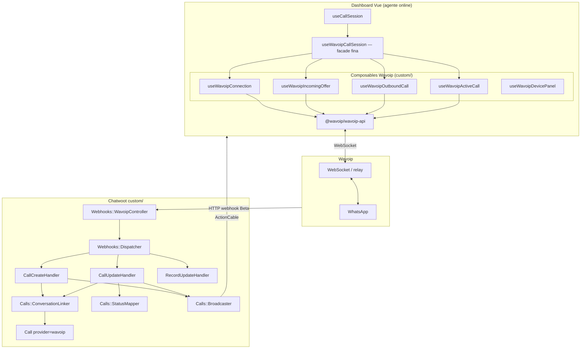
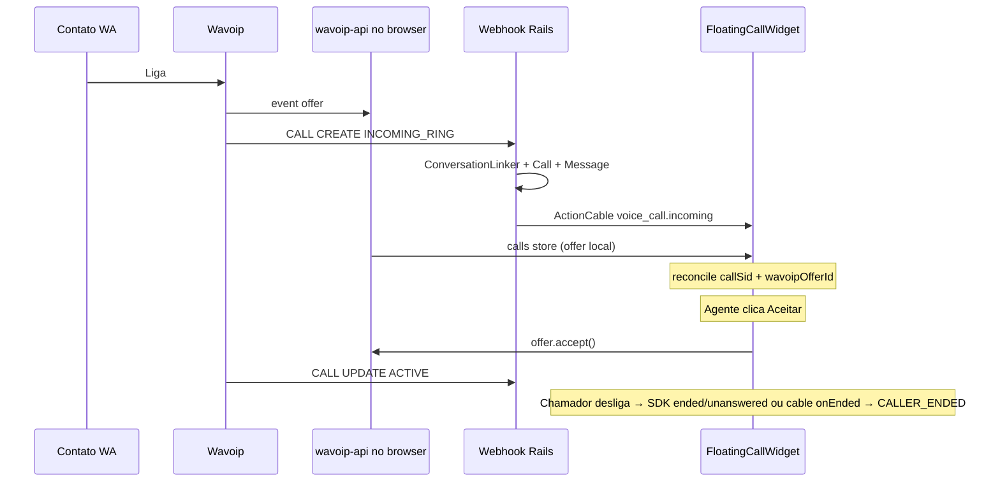
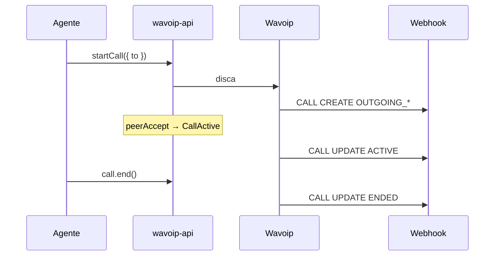

# Arquitetura — Wavoip no Chatwoot

Desenho técnico com **responsabilidades explícitas** e classes pequenas. Evita god class concentrando lógica em services nomeados por evento/ação.

**Relacionado:** [contracts-and-ports.md](./contracts-and-ports.md) · [wavoip-vs-meta.md](./wavoip-vs-meta.md) · [implementation-plan.md](./implementation-plan.md) · [sdk-reference.md](./sdk-reference.md) · [webhook-contract.md](./webhook-contract.md) · [official-docs.md](./official-docs.md) · [../architecture-and-flow.md §13](../architecture-and-flow.md#13-roadmap-de-refatoração-melhorias-sugeridas)

**Contratos e DI:** toda implementação deve seguir [contracts-and-ports.md](./contracts-and-ports.md) — handlers dependem de portas, não do SDK Wavoip no core.

**Pré-requisito:** concluir o spike e os gates do
[plano consolidado](./implementation-plan.md). O registry compartilhado vem depois;
extrair o WebRTC/SDP Meta não é necessário para Wavoip.

---

## 1. Visão geral



**Regra de ouro:** o **browser** é dono de `accept` / `reject` / `startCall` / `end`. O **servidor** é dono de contato, conversa, `Call`, bolha `voice_call` e broadcast auxiliar.

---

## 2. Modelo de canal

### `Channel::Wavoip` (novo channel model em `custom/`)

Tabela sugerida: `channel_wavoip` (espelha padrão `channel_*`).

| Campo | Uso |
|-------|-----|
| `phone_number` | Número E.164, único em `channel_wavoip` |
| `account_id` | Conta |
| `device_token` | Credencial dedicada; criptografar quando configurado |
| `webhook_key` | Chave opaca rotacionável para resolver o canal |
| `provider_config` (jsonb) | Preferências não secretas: `inbound_calls_enabled`, `incoming_call_include_administrators`, `incoming_call_offline_fallback`, `id_session`, `device_status`, `webhook_verified_at` |

Métodos no model (apenas delegação — sem lógica pesada):

```ruby
# custom/app/models/channel/wavoip.rb
def voice_enabled?
  device_token.present? && account.feature_enabled?('channel_voice')
end

def inbound_calls_enabled?
  provider_config['inbound_calls_enabled'] != false
end
```

**Por que channel model separado e não `Channel::Whatsapp` + provider string?**

- Voz Wavoip e mensagens Meta/gateway são **produtos distintos** com lifecycle diferente.
- Evita inflar `Channel::Whatsapp` e permite que o mesmo número tenha inbox de
  mensagens em outra tabela e inbox de voz Wavoip.
- Merge upstream mais seguro — zero mudança em `channel_whatsapp.rb` para Wavoip.

---

## 3. Backend — camada webhook

> **Contratos:** DTO `WebhookCallEvent`, portas `StatusMapper`, `CallBroadcaster`, `ConversationLinker` — ver [contracts-and-ports.md §4](./contracts-and-ports.md#4-contratos-backend-ruby).

### 3.1 Entrada fina

`Custom::Webhooks::WavoipController` — só autentica, enfileira job, retorna 200.

Contrato completo: [webhook-contract.md](./webhook-contract.md).

```ruby
# Responsabilidades: HTTP apenas
# - resolver e autenticar por webhook_key opaca no path
# - rate limit (Rack::Attack)
# - Wavoip::ProcessWebhookJob.perform_later(inbox_id, payload)
# - log produção: type, action, whatsapp_call_id, status — sem token/secret
```

### 3.2 Job + dispatcher (sem god class)

`Custom::Wavoip::ProcessWebhookJob` → `Custom::Wavoip::Webhooks::Dispatcher`

```ruby
# Dispatcher — switch por type, delega para handler
HANDLERS = {
  'CALL'   => Webhooks::Handlers::CallHandler,
  'RECORD' => Webhooks::Handlers::RecordHandler,
  'DEVICE' => Webhooks::Handlers::DeviceHandler,
}.freeze
```

### 3.3 Handlers (um arquivo por domínio)

| Classe | Responsabilidade | Não faz |
|--------|------------------|---------|
| `Webhooks::Handlers::CallHandler` | Roteia `CREATE` vs `UPDATE` | Criar contato diretamente |
| `Webhooks::Handlers::CallCreateHandler` | Inbound ring no servidor | WebRTC |
| `Webhooks::Handlers::CallUpdateHandler` | Transições de status | Aceitar chamada |
| `Webhooks::Handlers::RecordHandler` | Anexar `record_url` à mensagem | Gravar áudio |
| `Webhooks::Handlers::DeviceHandler` | Atualizar status dispositivo no inbox (`open`/`close`/`hibernating` via SDK em settings) | — |
| `Webhooks::PayloadNormalizer` | Hash simbólico → `Voice::Dto::WebhookCallEvent` | Side effects |
| `Calls::StatusMapper` | `INCOMING_RING` → `ringing`, `ACTIVE` → `in_progress`, etc. | DB |
| `Calls::ConversationLinker` | Contato + conversa (reusa regras WhatsApp) | Call API |
| `Calls::CallUpsertService` | find_or_create `Call` por `provider_call_id`; idempotente | Webhook parse |
| `Calls::CallUpdateHandler` | Ignora regressão de status terminal | Aceitar chamada |
| `Calls::MessageSyncService` | Bolha `voice_call` via `Voice::CallMessageBuilder` | WebRTC |
| `Calls::Broadcaster` | ActionCable `voice_call.*` com `provider: wavoip` | — |
| `Calls::IncomingCallRecipients` | Resolve agentes para cable + push (online → fallback configurável) | WebRTC |
| `Calls::InboundPushService` | Notificação in-app `voice_call_incoming` | Usa `IncomingCallRecipients` |
| `Calls::ClaimGuard` | `accepted_by_agent_id` presente → call já accepted | Multiagente |
| `Calls::ClearIncomingNotificationsService` | Destroy `voice_call_incoming` da conversa | Após accept / ended |

**Parar ring após accept (09 jul. 2026):** enquanto o status ainda é `ringing` (webhook `ACTIVE` pendente),
`ClaimGuard.claimed?` (só `accepted_by_agent_id`) bloqueia `broadcast_incoming`, `broadcast_escalated_ring`,
`EscalateRingJob` e `InboundPushService`. `JoiningAgentCache` impede double-accept no join/PATCH, mas
**não** silencia escalate/push sozinho — evita ring preso se o PATCH falhar após o join.
`broadcast_agent_accepted` limpa notificações in-app via `ClearIncomingNotificationsService`.

### 3.4 Mapeamento status Wavoip → Chatwoot

Baseado no [Webhook Beta](https://wavoip.gitbook.io/api/webhook-beta.md) — ver também [official-docs.md](./official-docs.md).

**Importante:** o webhook usa vocabulário diferente do SDK (`CALLING`, `RINGING`, `ACTIVE`…). Ver tabela dual em [sdk-reference.md §7](./sdk-reference.md#7-dois-vocabulários-de-status-crítico). O `StatusMapper` Rails trata **só webhook**; o browser usa `lib/wavoip/callStatusUI.js` para o widget.

| `status` Wavoip (webhook) | `Call.status` Chatwoot | Notas |
|-----------------|------------------------|-------|
| `INCOMING_RING`, `OUTGOING_RING`, `OUTGOING_CALLING`, `CONNECTING` | `ringing` | |
| `ACTIVE` | `in_progress` | |
| `ENDED` | `completed` | + `duration` |
| `NOT_ANSWERED` | `no_answer` | |
| `REJECTED`, `FAILED`, `CONNECTION_LOST` | `failed` | `end_reason` no meta |
| `HANDLED_REMOTELY` | `completed` ou ignorar | Outro cliente atendeu |

`provider_call_id` = `whatsapp_call_id` do payload (stringified).

### 3.5 API REST mínima

`accepted_by_agent_id` é gravado via `PATCH /calls/:id` (`CallsController#update`, com
`with_lock`) no momento do accept, ou pelo webhook `ACTIVE` como fallback (`JoiningAgentCache`)
— ver [webhook-contract §4](./webhook-contract.md#4-accepted_by_agent_id-sem-rest-mvp). Rotas
dedicadas `register_attempt`/`ack_accept` nunca foram necessárias — o PATCH único cobriu o caso.

### 3.6 ActionCable

Contrato por provider documentado em [webhook-contract §5](./webhook-contract.md#5-actioncable--contrato-por-provider). Wavoip **não** usa `voice_call.outbound_connected` nem SDP.

**Destinatários inbound** — `Wavoip::Calls::IncomingCallRecipients` (usado por `Broadcaster` e `InboundPushService`):

| Prioridade | Condição | Quem recebe |
|------------|----------|-------------|
| 1 | Há agentes **online** na lista de Agentes do inbox | `inbox.available_agents` (membros online) |
| 2 | Ninguém online | Fallback `incoming_call_offline_fallback` em `provider_config` |

Valores de `incoming_call_offline_fallback` (default: `assignee_or_inbox_members_and_administrators`):

| Valor | Comportamento |
|-------|---------------|
| `none` | Não notifica |
| `assignee` | Só o assignee da conversa |
| `assignee_or_inbox_members` | Assignee; se ausente, todos os membros do inbox |
| `assignee_or_inbox_members_and_administrators` | Assignee; se ausente, membros + admins (se `incoming_call_include_administrators` ≠ `false`) |

`incoming_call_include_administrators` (default `true`): quando `false`, administradores **fora** da aba Agentes não recebem cable, push nem conexão SDK. Configurável em Settings → Chamadas → **Incoming call routing** ([inbox-setup.md §3.6](./inbox-setup.md#36-seção--roteamento-de-chamadas-inbound-settings)).

No browser, `wavoipInboxCallRouting.js` aplica a mesma regra em `useWavoipConnection`, `useWavoipCallSession` e `actionCable.js` (defesa em profundidade).

### 3.7 Serializer / API inbox

| Campo | Exposição |
|-------|-----------|
| `device_token` | Somente admin inbox; listagem mascarada `••••{last4}` |
| `webhook_key` | Nunca em listagens/logs; aparece somente na URL de configuração |
| `webhook_url` | Read-only derivado de `webhook_key` |
| `incoming_call_include_administrators` | Toggle de roteamento (todos os agentes do inbox) |
| `incoming_call_offline_fallback` | Enum de fallback offline |
| `current_user_inbox_member` | `true` se o usuário atual é membro da aba Agentes |
| `provider_config` | Slice seguro: chaves de roteamento + `inbound_calls_enabled` |

---

## 4. Backend — model `Call`

Reutilizar `enterprise/app/models/call.rb` com uma alteração mínima explícita:

```ruby
# FORK: persist Wavoip voice calls in the shared call timeline
enum :provider, { twilio: 0, whatsapp: 1, wavoip: 2 }
```

`Call` não chama `prepend_mod_with`, e redefinir um enum após o boot pode colidir com
métodos já gerados. Preservar os valores `twilio: 0` e `whatsapp: 1`.

Enum prepend em Rails exige ordem estável — não reordenar valores existentes.

Se Enterprise indisponível: model espelho mínimo só em `custom/` (último recurso).

Meta Wavoip em `Call#meta`:

```json
{
  "wavoip_session_id": 123,
  "wavoip_call_type": "official",
  "record_url": "https://…"
}
```

---

## 5. Frontend — composables (sem god composable)

> **Contratos:** `BrowserVoiceSession`, `voiceSessionRegistry`, `wavoipSdkPort` — ver [contracts-and-ports.md §5](./contracts-and-ports.md#5-contratos-frontend-javascript).

### 5.1 Facade

`useWavoipCallSession.js` — **somente** orquestra e exporta API estável para `useCallSession`:

```javascript
export function useWavoipCallSession() {
  const connection = useWavoipConnection();
  const incoming = useWavoipIncomingOffer();
  const outbound = useWavoipOutboundCall();
  const active = useWavoipActiveCall();

  return {
    connectForInbox,
    disconnect,
    acceptIncomingCall: incoming.accept,
    rejectIncomingCall: incoming.reject,
    initiateOutboundCall: outbound.start,
    endCall: active.end,
    setMuted: active.setMuted,
  };
}
```

### 5.2 Responsabilidades por módulo

| Módulo | Linhas alvo | Faz |
|--------|-------------|-----|
| `lib/wavoip/wavoipSdkPort.js` | ~40 | Infrastructure — único import `@wavoip/wavoip-api` |
| `lib/wavoip/wavoipClientRegistry.js` | ~80 | Map `inboxId → Wavoip`; usa `wavoipSdkPort` |
| `lib/voice/browserVoiceProviders.js` | ~40 | `isBrowserVoiceProvider()` — evita FORK em 4+ Vue |
| `lib/voice/voiceCallCableRegistry.js` | ~220 | Port `VoiceCallCableHandlers` |
| `lib/voice/callStoreMappers.js` | ~80 | `mapCableToStoreEntry` / `mapWavoipOfferToStoreEntry` |
| `lib/voice/voiceSessionRegistry.js` | ~60 | Port factory `BrowserVoiceSession` |
| `composables/wavoip/useWavoipConnection.js` | ~120 | `new Wavoip({ tokens, platform: 'chatwoot' })`; connect on online |
| `composables/wavoip/useWavoipIncomingOffer.js` | ~150 | `on('offer')` → `calls` store; `accept`/`reject` |
| `composables/wavoip/useWavoipOutboundCall.js` | ~100 | `startCall`; eventos `peerAccept`/`peerReject` |
| `composables/wavoip/useWavoipActiveCall.js` | ~80 | `mute`/`end`; subscribe `ended` |
| `composables/wavoip/useWavoipCallSession.js` | ~60 | Facade |
| `composables/wavoip/useWavoipDevicePanel.js` | ~150 | Status básico no MVP; QR, `pairingCode`, restart/logout pós-MVP |
| `composables/wavoip/useWavoipNotifications.js` | ~100 | OS Notification quando aba sem foco |
| `lib/wavoip/callStatusUI.js` | ~60 | Map SDK `CallStatus` → widget (não misturar com Rails) |
| `lib/wavoip/wavoipDiagnosticsCollector.js` | ~120 | `iceDiagnostics`, `connectivityIssue`, `stats` (Fase 5) |
| `lib/wavoip/wavoipInboxCallRouting.js` | ~30 | `shouldAgentReceiveWavoipCalls` — filtro SDK/cable por inbox |

**Limite prático:** nenhum arquivo > ~200 linhas; extrair helpers para `lib/wavoip/`.

### 5.3 Integração com `useCallSession.js`

```javascript
// FORK: registry de providers de voz browser
import { BROWSER_VOICE_HANDLERS } from 'customDashboard/lib/voice/voiceSessionRegistry';

// voiceSessionRegistry.js (custom/) registra whatsapp + wavoip
```

`getVoiceCallProvider` em `inbox.js`:

```javascript
if (channelType === 'Channel::Wavoip') return VOICE_CALL_PROVIDERS.WAVOIP;
```

`isBrowserVoiceProvider(provider)` — import de `customDashboard/lib/voice/browserVoiceProviders` — usado em `FloatingCallWidget`, `calls.js`, etc. **sem FORK adicional**.

### 5.4 `FloatingCallWidget` e bolha

- Mute mic: `isBrowserVoiceProvider(activeCall.provider)` → delegar handler do registry
- **Ringtone inbound** (`FloatingCallWidget.vue` + `useCallSession.js`):
  - Loop em `ringtone.mp3` enquanto há chamada inbound não atendida
  - **Silêncio imediato ao rejeitar/dismissar:** `ringtoneSilencedCallSids` em `useCallSession.js` — só afeta o agente local; outros dispositivos continuam tocando
  - **Preferência persistente:** `useCallRingtonePreference.js` — botão bell no `CallCard` grava `call_ringtone_muted_{userId}` no `localStorage`; quando ativo, só aviso visual (sem som) em chamadas futuras
  - **Caller encerrou:** SDK (`unanswered`/`ended`) e cable (`onEnded`) disparam toast `CALLER_ENDED` e removem a entrada do store
- Bolha `VoiceCall.vue`: ver [frontend-integration §12](./frontend-integration.md#12-bolha-voicecallvue) — sem join SDP para Wavoip

---

## 6. Fluxos

### 6.1 Inbound



### 6.2 Outbound



---

## 7. Multi-agente

| Evento Wavoip | Comportamento Chatwoot |
|-----------------|------------------------|
| Vários agentes online, mesmo `device_token` | Todos recebem `offer` no SDK; ActionCable reforça ring |
| Primeiro `accept()` | Chamada ativa; outros recebem `acceptedElsewhere` |
| `HANDLED_REMOTELY` no webhook | Fechar ring nos outros; activity message opcional |

**Política documentada para admins:** um token Wavoip por inbox de voz; agentes compartilham o número.

---

## 8. Segurança

| Item | Abordagem |
|------|-----------|
| `device_token` | Coluna criptografada; nunca serializar em listagens |
| Webhook | Chave opaca por inbox; ver [webhook-contract](./webhook-contract.md) |
| Token no FE | Endpoint de bootstrap somente para agentes do inbox — nunca config global/localStorage |
| Logs | Sem payload completo em produção |

---

## 9. Anti-padrões (god class)

Ver também matriz completa em [contracts-and-ports.md §6](./contracts-and-ports.md#6-matriz-de-responsabilidades-anti-god-class).

| Anti-padrão | Substituto |
|-------------|------------|
| `WavoipService` com 800 linhas | Handlers por `type` + `action` |
| `useWavoipEverything.js` | Facade + 4 composables |
| Controller com lógica de conversa | `ConversationLinker` |
| Duplicar `InboundCallBuilder` inteiro | Chamar EE builder com adapter de params |
| Embutir React webphone | `@wavoip/wavoip-api` only |

---

## 10. Mapa de arquivos (`custom/`)

```
custom/
  config/
    features.yml          # channel_wavoip (piloto)
  app/
    models/channel/wavoip.rb
    models/custom/account.rb
    controllers/webhooks/wavoip_controller.rb
    jobs/wavoip/
      process_webhook_job.rb
      inbound_missed_push_job.rb
    services/wavoip/
      ...
  app/javascript/dashboard/
    lib/voice/
      browserVoiceProviders.js
      voiceCallCableRegistry.js
      voiceSessionRegistry.js
      callStoreMappers.js
    lib/wavoip/
      wavoipSdkPort.js
      wavoipClientRegistry.js
```

**Migration `channel_wavoip`:** em `db/migrate/` do fork — não existe em
`upstream/develop`. A alteração do enum fica marcada em `enterprise/app/models/call.rb`.

### Edições `# FORK:` upstream

| Arquivo | Mudança |
|---------|---------|
| `enterprise/app/models/call.rb` | enum `wavoip: 2` |
| `vite.shared.ts` | alias `customDashboard` |
| `app/javascript/dashboard/helper/inbox.js` | `Channel::Wavoip` + `VOICE_CALL_PROVIDERS.WAVOIP` |
| `ChannelList.vue` | tile `wavoip` |
| `ChannelFactory.vue` | map para `Wavoip.vue` |
| `ChannelItem.vue` | gate `channel_voice` / `channel_wavoip` |
| `useCallSession.js` | import registry |
| `actionCable.js` | delegação única ao `voiceCallCableRegistry` |
| `VoiceCall.vue` | bolha sem SDP join para Wavoip |

O diff final deve minimizar esse inventário, mas o número é uma meta de merge-safety,
não um teto que autorize branches espalhados ou documentação incompleta.
