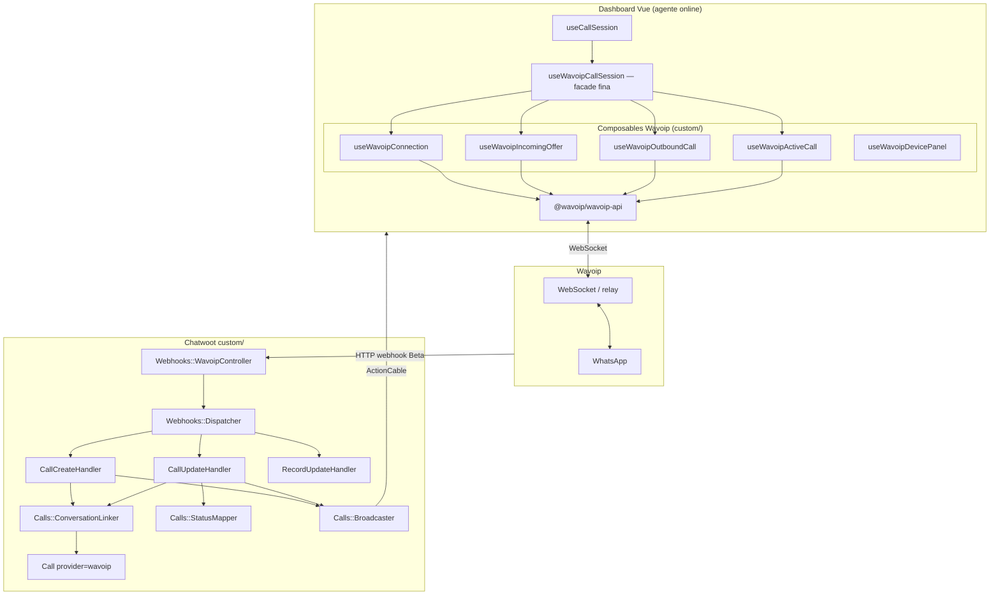
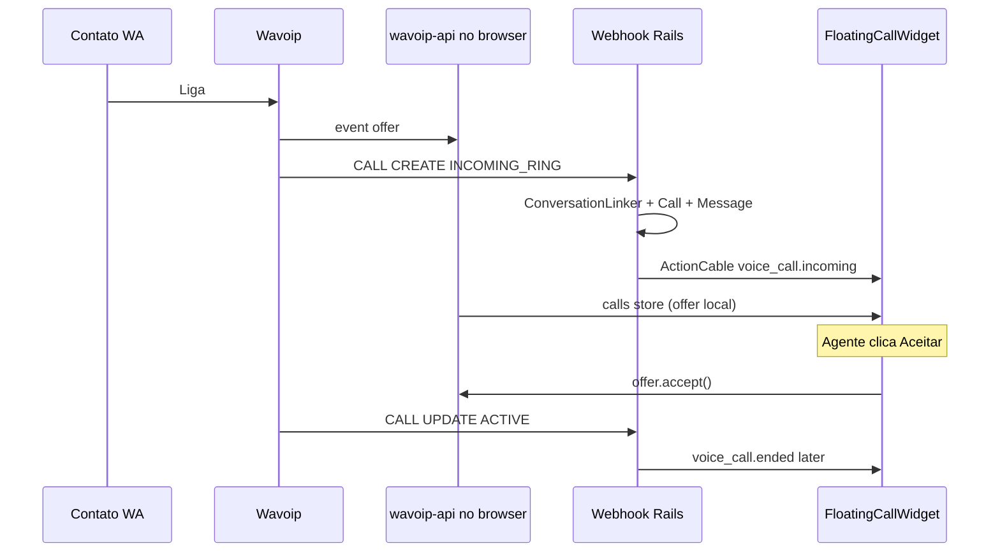
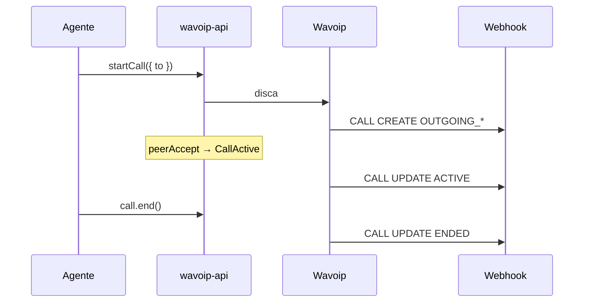

# Arquitetura — Wavoip no Chatwoot

Desenho técnico com **responsabilidades explícitas** e classes pequenas. Evita god class concentrando lógica em services nomeados por evento/ação.

**Relacionado:** [wavoip-vs-meta.md](./wavoip-vs-meta.md) · [implementation-plan.md](./implementation-plan.md) · [sdk-reference.md](./sdk-reference.md)

---

## 1. Visão geral



**Regra de ouro:** o **browser** é dono de `accept` / `reject` / `startCall` / `end`. O **servidor** é dono de contato, conversa, `Call`, bolha `voice_call` e broadcast auxiliar.

---

## 2. Modelo de canal

### `Channel::Wavoip` (novo STI em `custom/`)

Tabela sugerida: `channel_wavoip` (espelha padrão `channel_*`).

| Campo | Uso |
|-------|-----|
| `phone_number` | Número E.164 (unique global, como WhatsApp) |
| `account_id` | Conta |
| `provider_config` (jsonb) | `device_token`, `display_name`, `webhook_secret`, `inbound_calls_enabled`, `id_session` (cache opcional) |

Métodos no model (apenas delegação — sem lógica pesada):

```ruby
# custom/app/models/channel/wavoip.rb
def voice_enabled?
  device_token.present? && account.feature_enabled?('channel_voice')
end

def device_token
  provider_config['device_token']
end

def inbound_calls_enabled?
  provider_config['inbound_calls_enabled'] != false
end
```

**Por que STI separado e não `Channel::Whatsapp` + provider string?**

- Voz Wavoip e mensagens Meta/gateway são **produtos distintos** com lifecycle diferente.
- Evita inflar `Channel::Whatsapp` e conflito de `phone_number` unique entre inbox de mensagens e de voz.
- Merge upstream mais seguro — zero mudança em `channel_whatsapp.rb` para Wavoip.

---

## 3. Backend — camada webhook

### 3.1 Entrada fina

`Custom::Webhooks::WavoipController` — só autentica, enfileira job, retorna 200.

```ruby
# Responsabilidades: HTTP apenas
# - validar secret (header ou query)
# - resolver inbox por phone / id_session
# - Wavoip::ProcessWebhookJob.perform_later(inbox_id, payload)
```

### 3.2 Job + dispatcher (sem god class)

`Custom::Wavoip::ProcessWebhookJob` → `Custom::Wavoip::Webhooks::Dispatcher`

```ruby
# Dispatcher — switch por type, delega para handler
HANDLERS = {
  'CALL'   => Webhooks::Handlers::CallHandler,
  'RECORD' => Webhooks::Handlers::RecordHandler,
  'DEVICE' => Webhooks::Handlers::DeviceHandler,
}.freeze
```

### 3.3 Handlers (um arquivo por domínio)

| Classe | Responsabilidade | Não faz |
|--------|------------------|---------|
| `Webhooks::Handlers::CallHandler` | Roteia `CREATE` vs `UPDATE` | Criar contato diretamente |
| `Webhooks::Handlers::CallCreateHandler` | Inbound ring no servidor | WebRTC |
| `Webhooks::Handlers::CallUpdateHandler` | Transições de status | Aceitar chamada |
| `Webhooks::Handlers::RecordHandler` | Anexar `record_url` à mensagem | Gravar áudio |
| `Webhooks::Handlers::DeviceHandler` | Atualizar status dispositivo no inbox (`open`/`close`/`hibernating` via SDK em settings) | — |
| `Webhooks::PayloadNormalizer` | Hash simbólico a partir do JSON Wavoip | Side effects |
| `Calls::StatusMapper` | `INCOMING_RING` → `ringing`, `ACTIVE` → `in_progress`, etc. | DB |
| `Calls::ConversationLinker` | Contato + conversa (reusa regras WhatsApp) | Call API |
| `Calls::CallUpsertService` | find_or_create `Call` por `provider_call_id` | Webhook parse |
| `Calls::MessageSyncService` | Bolha `voice_call` via `Voice::CallMessageBuilder` | WebRTC |
| `Calls::Broadcaster` | ActionCable `voice_call.*` com `provider: wavoip` | — |

### 3.4 Mapeamento status Wavoip → Chatwoot

Baseado no [Webhook Beta](https://wavoip.gitbook.io/api/wavoip-docs/webhook-beta.md).

**Importante:** o webhook usa vocabulário diferente do SDK (`CALLING`, `RINGING`, `ACTIVE`…). Ver tabela dual em [sdk-reference.md §7](./sdk-reference.md#7-dois-vocabulários-de-status-crítico). O `StatusMapper` Rails trata **só webhook**; o browser usa `lib/wavoip/callStatusUI.js` para o widget.

| `status` Wavoip (webhook) | `Call.status` Chatwoot | Notas |
|-----------------|------------------------|-------|
| `INCOMING_RING`, `OUTGOING_RING`, `OUTGOING_CALLING`, `CONNECTING` | `ringing` | |
| `ACTIVE` | `in_progress` | |
| `ENDED` | `completed` | + `duration` |
| `NOT_ANSWERED` | `no_answer` | |
| `REJECTED`, `FAILED`, `CONNECTION_LOST` | `failed` | `end_reason` no meta |
| `HANDLED_REMOTELY` | `completed` ou ignorar | Outro cliente atendeu |

`provider_call_id` = `whatsapp_call_id` do payload (stringified).

### 3.5 API REST mínima (fora do MVP)

Rotas `register_attempt` / `ack_accept` **adiadas** — webhook + SDK são fonte de verdade. Reavaliar se relatórios exigirem `accepted_by_agent_id` antes do webhook `ACTIVE`.

---

## 4. Backend — model `Call`

Reutilizar `enterprise/app/models/call.rb` com extensão em `custom/`:

```ruby
# custom/app/models/custom/call.rb
module Custom::Call
  def self.prepended(base)
    base.enum :provider, { twilio: 0, whatsapp: 1, wavoip: 2 }
  end
end

# config/initializers ou custom/initializer
Call.prepend_mod_with('Custom::Call') if defined?(Call)
```

Se Enterprise indisponível: model espelho mínimo só em `custom/` (último recurso).

Meta Wavoip em `Call#meta`:

```json
{
  "wavoip_session_id": 123,
  "wavoip_call_type": "official",
  "device_token": "…",
  "record_url": "https://…"
}
```

---

## 5. Frontend — composables (sem god composable)

### 5.1 Facade

`useWavoipCallSession.js` — **somente** orquestra e exporta API estável para `useCallSession`:

```javascript
export function useWavoipCallSession() {
  const connection = useWavoipConnection();
  const incoming = useWavoipIncomingOffer();
  const outbound = useWavoipOutboundCall();
  const active = useWavoipActiveCall();

  return {
    connectForInbox,
    disconnect,
    acceptIncomingCall: incoming.accept,
    rejectIncomingCall: incoming.reject,
    initiateOutboundCall: outbound.start,
    endCall: active.end,
    setMuted: active.setMuted,
  };
}
```

### 5.2 Responsabilidades por módulo

| Módulo | Linhas alvo | Faz |
|--------|-------------|-----|
| `lib/wavoip/wavoipClientRegistry.js` | ~80 | Map `inboxId → Wavoip` instance; dedupe tokens |
| `composables/wavoip/useWavoipConnection.js` | ~120 | `new Wavoip({ tokens, platform: 'chatwoot' })`; connect on online |
| `composables/wavoip/useWavoipIncomingOffer.js` | ~150 | `on('offer')` → `calls` store; `accept`/`reject` |
| `composables/wavoip/useWavoipOutboundCall.js` | ~100 | `startCall`; eventos `peerAccept`/`peerReject` |
| `composables/wavoip/useWavoipActiveCall.js` | ~80 | `mute`/`end`; subscribe `ended` |
| `composables/wavoip/useWavoipCallSession.js` | ~60 | Facade |
| `composables/wavoip/useWavoipDevicePanel.js` | ~150 | QR, `pairingCode`, `wakeUp`, status — **Fase 1** |
| `composables/wavoip/useWavoipNotifications.js` | ~100 | OS Notification quando aba sem foco |
| `lib/wavoip/callStatusUI.js` | ~60 | Map SDK `CallStatus` → widget (não misturar com Rails) |
| `lib/wavoip/wavoipDiagnosticsCollector.js` | ~120 | `iceDiagnostics`, `connectivityIssue`, `stats` (Fase 5) |

**Limite prático:** nenhum arquivo > ~200 linhas; extrair helpers para `lib/wavoip/`.

### 5.3 Integração com `useCallSession.js`

```javascript
// FORK: registry de providers de voz browser
const BROWSER_VOICE_HANDLERS = {
  [VOICE_CALL_PROVIDERS.WHATSAPP]: whatsappSession,
  [VOICE_CALL_PROVIDERS.WAVOIP]: wavoipSession,
};
```

`getVoiceCallProvider` em `inbox.js`:

```javascript
if (channelType === 'Channel::Wavoip') return VOICE_CALL_PROVIDERS.WAVOIP;
```

### 5.4 `FloatingCallWidget`

Ajustes mínimos:

- `VOICE_CALL_PROVIDERS.WAVOIP` no mute (delegar `active.setMuted`)
- Ringtone existente (`/audio/dashboard/ringtone.mp3`) — já implementado
- Não auto-join outbound Wavoip (diferente de Twilio)

---

## 6. Fluxos

### 6.1 Inbound



### 6.2 Outbound



---

## 7. Multi-agente

| Evento Wavoip | Comportamento Chatwoot |
|-----------------|------------------------|
| Vários agentes online, mesmo `device_token` | Todos recebem `offer` no SDK; ActionCable reforça ring |
| Primeiro `accept()` | Chamada ativa; outros recebem `acceptedElsewhere` |
| `HANDLED_REMOTELY` no webhook | Fechar ring nos outros; activity message opcional |

**Política documentada para admins:** um token Wavoip por inbox de voz; agentes compartilham o número.

---

## 8. Segurança

| Item | Abordagem |
|------|-----------|
| `device_token` | Armazenado em `provider_config`; exposto ao FE só para agentes autorizados no inbox |
| Webhook | Secret por inbox em `provider_config`; validar em controller |
| Token no FE | Carregar via API inbox (como credenciais Twilio voice) — nunca em `window.chatwootConfig` global |

---

## 9. Anti-padrões (god class)

| Anti-padrão | Substituto |
|-------------|------------|
| `WavoipService` com 800 linhas | Handlers por `type` + `action` |
| `useWavoipEverything.js` | Facade + 4 composables |
| Controller com lógica de conversa | `ConversationLinker` |
| Duplicar `InboundCallBuilder` inteiro | Chamar EE builder com adapter de params |
| Embutir React webphone | `@wavoip/wavoip-api` only |

---

## 10. Mapa de arquivos (`custom/`)

```
custom/
  app/
    models/channel/wavoip.rb
    models/custom/call.rb
    controllers/webhooks/wavoip_controller.rb
    controllers/api/v1/accounts/wavoip_calls_controller.rb
    jobs/wavoip/process_webhook_job.rb
    services/wavoip/
      webhooks/
        dispatcher.rb
        payload_normalizer.rb
        handlers/
          call_handler.rb
          call_create_handler.rb
          call_update_handler.rb
          record_handler.rb
          device_handler.rb
      calls/
        conversation_linker.rb
        status_mapper.rb
        call_upsert_service.rb
        message_sync_service.rb
        broadcaster.rb
```

### Edições `# FORK:` upstream (mínimas)

| Arquivo | Mudança |
|---------|---------|
| `vite.shared.ts` | alias `customDashboard` → `custom/app/javascript/dashboard` |
| `app/javascript/dashboard/helper/inbox.js` | `Channel::Wavoip` + `VOICE_CALL_PROVIDERS.WAVOIP` |
| `app/javascript/dashboard/composables/useCallSession.js` | branch registry |
| `app/javascript/dashboard/routes/.../ChannelList.vue` | tile `wavoip` |
| `app/javascript/dashboard/routes/.../ChannelFactory.vue` | map para `Wavoip.vue` |
| `app/javascript/dashboard/components/widgets/ChannelItem.vue` | gate `wavoip` |
| `app/javascript/dashboard/helper/actionCable.js` | incluir `wavoip` nos filtros `voice_call.*` |
