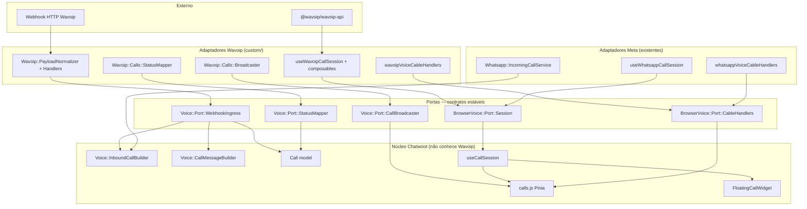
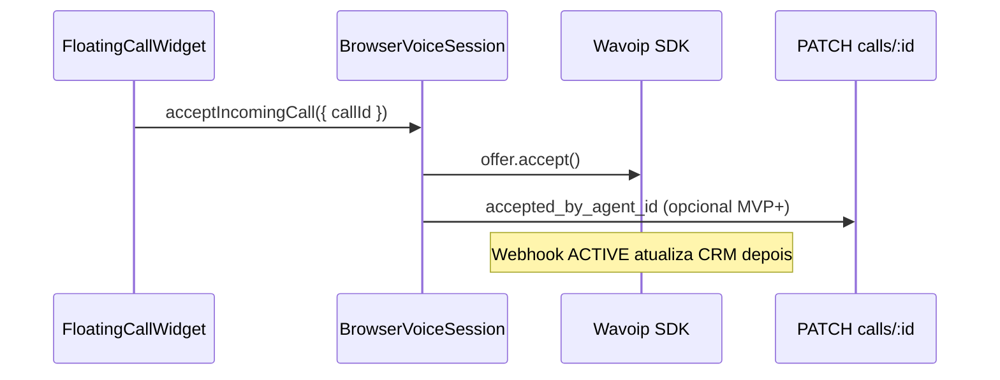

# Contratos, portas e inversão de dependência — Wavoip

**Fonte única** para limites entre Chatwoot (domínio/orquestração) e Wavoip (infraestrutura). Objetivo: implementar o primeiro provider alternativo **sem god class**, **sem acoplar** o core ao SDK ou ao formato webhook Wavoip.

**Relacionado:** [architecture.md](./architecture.md) · [webhook-contract.md](./webhook-contract.md) · [frontend-integration.md](./frontend-integration.md) · [sdk-reference.md](./sdk-reference.md) · [../architecture-and-flow.md §13](../architecture-and-flow.md#13-roadmap-de-refatoração-melhorias-sugeridas)

**Última revisão:** jun/2026.

---

## 1. Princípios (rules do projeto)

| Rule (`architecture.mdc`) | Aplicação Wavoip |
|---------------------------|------------------|
| Domain — invariantes, sem HTTP | `Call`, status terminal, unique `(provider, provider_call_id)` |
| Application — uma ação por classe | Handlers por `type`/`action`; sem `WavoipService` monolítico |
| Transport — delegar | `WavoipController` → job → dispatcher → handler |
| Infrastructure — APIs externas | `@wavoip/wavoip-api` **só** em composables `custom/`; webhook parse em `PayloadNormalizer` |
| Fork merge-safe | Portas estáveis em `custom/`; upstream recebe hooks pequenos e inventariados |

**Regra de ouro (repetida porque é contrato):**

| Camada | Dono de quê |
|--------|-------------|
| **Browser + SDK** | `accept` / `reject` / `startCall` / `end` / mute / WebRTC |
| **Servidor Rails** | Contato, conversa, `Call`, bolha `voice_call`, ActionCable auxiliar, gravação via URL |
| **Webhook Wavoip** | Histórico e transições de status **autoritativas** para CRM |
| **SDK `offer`** | Ring em tempo real + áudio; pode chegar **antes** do webhook |

Nunca inverter: o servidor **não** aceita chamada Wavoip; o browser **não** cria `Conversation` sozinho.

---

## 2. Visão hexagonal



**Direção das dependências:** adaptadores → portas → núcleo. O núcleo **nunca** importa `Wavoip`, `PayloadNormalizer` nem `@wavoip/wavoip-api`.

---

## 3. Fontes da verdade (evitar duplicidade conflitante)

| Dado | Fonte primária | Fonte secundária | Regra de reconciliação |
|------|----------------|------------------|------------------------|
| `Call.status` (CRM) | Webhook `CALL UPDATE` | SDK events | Servidor ganha; SDK só UI live |
| Ring inbound (widget) | SDK `on('offer')` | ActionCable `voice_call.incoming` | Unir por `provider_call_id` / `offer.id` |
| `accepted_by_agent_id` | `PATCH` após `offer.accept()` (MVP+) | Webhook `ACTIVE` | Preferir PATCH; webhook pode deixar `nil` |
| Contato / conversa | `ConversationLinker` + EE builder | — | Só servidor |
| Bolha `voice_call` | `CallMessageBuilder` | — | Criada no `CREATE` webhook ou idempotente |
| Gravação | Webhook `RECORD` → `record_url` | — | Sem `MediaRecorder` no browser |
| Dispositivo pronto | SDK `Device.status === 'open'` | Webhook `DEVICE` (cache) | SDK para UX agente; webhook para admin offline |
| Duração | Webhook `ENDED` + `duration` | Timer UI | Persistir duração do webhook |

---

## 4. Contratos backend (Ruby)

### 4.1 DTO normalizado (saída do parser — entrada dos handlers)

Objeto **imutável** após `PayloadNormalizer`. Handlers só recebem este shape, nunca `params` cru.

```ruby
# custom/app/services/voice/dto/webhook_call_event.rb
Voice::Dto::WebhookCallEvent = Data.define(
  :provider,           # :wavoip
  :external_call_id,    # whatsapp_call_id (string)
  :action,             # :create | :update
  :external_status,    # "INCOMING_RING", "ACTIVE", … (vocabulário Wavoip)
  :direction,          # :incoming | :outgoing | nil
  :from_phone,         # E.164 ou nil
  :to_phone,           # E.164 ou nil
  :peer_name,          # string | nil
  :duration_seconds,   # integer | nil
  :session_id,         # id_session webhook | nil
  :call_type,          # :official | :unofficial | nil
  :record_url,         # só em RECORD
  :record_status,     # READY | RECORDING | MIXING | DISABLED | EMPTY_RECORDING | nil
  :raw_type            # "CALL" | "RECORD" | "DEVICE" — debug only
) do
  def create? = action == :create
  def update? = action == :update
end
```

**Responsabilidade única:** `Wavoip::Webhooks::PayloadNormalizer` traduz JSON Wavoip → `WebhookCallEvent`. Bug do campo `type` duplicado no payload fica **contido** aqui.

### 4.2 Porta `Voice::Port::StatusMapper`

```ruby
# custom/app/services/voice/port/status_mapper.rb
module Voice::Port::StatusMapper
  # @param external_status [String] vocabulário do provider
  # @return [String, nil] Call::STATUSES member ou nil se ignorar (HANDLED_REMOTELY)
  def to_call_status(external_status); end

  def terminal?(call_status); end
end
```

| Implementação | Vocabulário de entrada |
|---------------|------------------------|
| `Wavoip::Calls::StatusMapper` | Webhook: `INCOMING_RING`, `ACTIVE`, … |
| (futuro) `Whatsapp::Calls::StatusMapper` | Meta webhook statuses |

**Não** misturar vocabulário SDK (`CallStatus::CALLING`) neste mapper — isso é **porta frontend** (`callStatusUI.js`).

### 4.3 Porta `Voice::Port::CallBroadcaster`

Contrato ActionCable **provider-agnostic** (estende [webhook-contract §5](./webhook-contract.md#5-actioncable--contrato-por-provider)):

```ruby
# custom/app/services/voice/port/call_broadcaster.rb
module Voice::Port::CallBroadcaster
  def broadcast_incoming(call:, inbox:, caller:, streams:, sdp_offer: nil, ice_servers: nil)
  def broadcast_ended(call:, status:, duration_seconds: nil)
  def broadcast_accepted(call:, accepted_by_agent_id:)
  # Wavoip: sdp_offer e ice_servers sempre nil
end
```

Implementação: `Voice::Adapters::ActionCableCallBroadcaster` (única, compartilhada Meta+Wavoip) — injeta `provider:` no payload.

### 4.4 Porta `Voice::Port::CallPersistence`

Orquestra upsert sem conhecer Wavoip:

```ruby
# custom/app/services/voice/port/call_persistence.rb
module Voice::Port::CallPersistence
  # Idempotente por (provider, provider_call_id)
  def upsert_from_webhook!(inbox:, event:, mapped_status:)
  def apply_terminal_guard!(call:, new_status:)
end
```

Implementação: `Wavoip::Calls::CallUpsertService` + `CallUpdateHandler` — delegam a `Voice::InboundCallBuilder` no `CREATE` inbound.

### 4.5 Porta `Voice::Port::ConversationLinker`

**Não duplicar** `InboundCallBuilder`. Adapter fino:

```ruby
# custom/app/services/wavoip/calls/conversation_linker.rb
class Wavoip::Calls::ConversationLinker
  def self.link!(inbox:, from_phone:, external_call_id:, extra_meta: {})
    Voice::InboundCallBuilder.perform!(
      inbox: inbox,
      from_number: normalize_e164(from_phone),
      call_sid: external_call_id.to_s,
      provider: :wavoip,
      extra_meta: extra_meta
    )
  end
end
```

Dependência: **inversão correta** — Wavoip depende do núcleo EE (`InboundCallBuilder`), não o contrário.

### 4.6 Porta `Voice::Port::WebhookIngress`

```ruby
# custom/app/services/voice/port/webhook_ingress.rb
module Voice::Port::WebhookIngress
  def normalize(payload); end  # → WebhookCallEvent | Array<WebhookCallEvent>
  def dispatch(normalized_event, inbox:); end
end
```

Implementação: `Wavoip::Webhooks::Dispatcher` + handlers.

### 4.7 Porta `Voice::Port::InboxResolver`

```ruby
module Voice::Port::InboxResolver
  def resolve_by_phone!(e164); end      # → Channel::Wavoip
  def resolve_by_session_id(id); end    # fallback
end
```

### 4.8 Porta `Voice::Port::RecordingAttacher`

```ruby
module Voice::Port::RecordingAttacher
  def attach_from_url!(call:, url:); end  # meta record_url + opcional download
end
```

Handler `RecordHandler` → esta porta → `Call#meta` / `Message` attachment (Fase 4).

### 4.9 `Channel::Wavoip` — contrato do aggregate

O model **só expõe** config e predicates — zero webhook/SDK:

```ruby
def voice_enabled?       # token + channel_voice
def inbound_calls_enabled?
def device_token         # coluna dedicada e protegida
def webhook_key          # nunca serializar em listagens ou logs
```

Serviços recebem `channel` injetado; não fazem `Channel::Wavoip.find` espalhado (resolver centralizado).

### 4.10 Injeção de dependências (prático Rails)

Handlers instanciados com dependências explícitas — facilita specs:

```ruby
class Wavoip::Webhooks::Handlers::CallCreateHandler
  def initialize(
    linker: Wavoip::Calls::ConversationLinker,
    broadcaster: Voice::Adapters::ActionCableCallBroadcaster.new,
    status_mapper: Wavoip::Calls::StatusMapper.new
  )
    @linker = linker
    @broadcaster = broadcaster
    @status_mapper = status_mapper
  end
end
```

Defaults no construtor; specs passam doubles. **Sem** container IoC global.

---

## 5. Contratos frontend (JavaScript)

### 5.1 Porta `BrowserVoiceSession` (substitui branching `isWhatsappCall`)

Contrato que `useCallSession` consome via registry:

```javascript
/**
 * @typedef {Object} BrowserVoiceSession
 * @property {(args: { callId: string, sdpOffer?: string, iceServers?: object[] }) => Promise<void>} acceptIncomingCall
 * @property {(callId: string) => Promise<void>} rejectIncomingCall
 * @property {(conversationId: number) => Promise<InitiateResult>} initiateOutboundCall
 * @property {(callIdOverride?: string) => Promise<void>} endActiveCall
 * @property {(muted: boolean) => boolean} setMuted
 * @property {() => void} cleanupSession
 * @property {() => boolean} hasActiveCall
 * @property {() => void} [connectForInbox] — Wavoip: ao ficar online
 * @property {() => void} [disconnect] — Wavoip: ao ficar offline
 */

/** @typedef {{ id?: number, status?: string }} InitiateResult */
```

| Provider | Implementação | SDP |
|----------|---------------|-----|
| Meta | `useWhatsappCallSession` (wrapper sobre `useWebRtcCallSession` pós-Fase 0) | Obrigatório |
| Wavoip | `useWavoipCallSession` (facade) | **Proibido** na porta |

### 5.2 Porta `VoiceCallCableHandlers`

```javascript
// custom/.../lib/voice/voiceCallCableRegistry.js
/** @type {Record<string, VoiceCallCableHandlers>} */
export const VOICE_CALL_CABLE_HANDLERS = {
  whatsapp: {
    onIncoming(data) { /* sdp_offer required */ },
    onOutboundConnected(data) { /* apply SDP */ },
    onOutboundAccepted(data) { /* arm recorder */ },
    onEnded(data) { /* local teardown guard */ },
  },
  wavoip: {
    onIncoming(data) { /* no sdp; merge store */ },
    onOutboundConnected() { /* noop */ },
    onOutboundAccepted(data) { /* setCallActive */ },
    onEnded(data) { /* teardown if local */ },
  },
};
```

`actionCable.js` — **único** `# FORK:`:

```javascript
const handler = VOICE_CALL_CABLE_HANDLERS[data?.provider];
handler?.onIncoming?.(data);
```

### 5.3 Porta `VoiceSessionRegistry` (inversão em `useCallSession`)

```javascript
// custom/.../lib/voice/voiceSessionRegistry.js
export const VOICE_SESSION_REGISTRY = {
  whatsapp: () => useWhatsappCallSession(),
  wavoip: () => useWavoipCallSession(),
  twilio: null, // conferência — caminho separado
};

export function getBrowserVoiceSession(provider) {
  const factory = VOICE_SESSION_REGISTRY[provider];
  if (!factory) return null;
  return factory();
}
```

`useCallSession.js` chama `getBrowserVoiceSession(call.provider)` — **não** importa Wavoip diretamente.

### 5.4 DTO `NormalizedCallStoreEntry` (Pinia)

Shape **único** para `FloatingCallWidget`:

```javascript
/**
 * @typedef {Object} NormalizedCallStoreEntry
 * @property {string} callSid       — provider_call_id externo
 * @property {number} [callId]      — DB id quando conhecido
 * @property {'whatsapp'|'wavoip'|'twilio'} provider
 * @property {'inbound'|'outbound'} callDirection
 * @property {number} conversationId
 * @property {number} inboxId
 * @property {boolean} isActive
 * @property {string} [sdpOffer]    — só whatsapp
 * @property {object[]} [iceServers] — só whatsapp
 * @property {{ phone: string, name?: string, avatar?: string }} [caller]
 * @property {string} [wavoipOfferId] — só wavoip; link com SDK Offer.id
 */
```

Mappers em `custom/.../lib/voice/callStoreMappers.js` (**implementado** — inclui reconciliação cable/SDK):

```javascript
export function mapCableToStoreEntry(data) { /* ... */ }
export function mapWavoipOfferToStoreEntry(offer, { inboxId, conversationId }) { /* ... */ }
export function mergeStoreEntries(existing, incoming) { /* ... */ }
export function reconcileWavoipStoreEntry(existing, incoming) { /* ... */ }

/** Match cable + SDK rows when whatsapp_call_id and Offer.id diverge. */
export function findWavoipCallForOffer(calls, offer, inboxId) { /* ... */ }
```

| Origem | Mapper |
|--------|--------|
| ActionCable `voice_call.incoming` | `mapCableToStoreEntry(data)` — preserva `callSid` do webhook |
| SDK `on('offer')` | `mapWavoipOfferToStoreEntry` + `reconcileWavoipStoreEntry` via `findWavoipCallForOffer` |
| `message.created` voice_call | `handleVoiceCallCreated` (existente) |

**Reconciliação:** a chave de merge depende do gate de correlação do spike. Só usar
`callSid` diretamente se `Offer.id`/`CallOutgoing.id` corresponder de forma
determinística a `whatsapp_call_id`.

### 5.5 Porta `WavoipSdkPort` (isolar npm)

Único módulo que importa `@wavoip/wavoip-api`:

```javascript
// custom/.../lib/wavoip/wavoipSdkPort.js
let WavoipClass = null;

export async function loadWavoipSdk() {
  if (!WavoipClass) {
    ({ Wavoip: WavoipClass } = await import('@wavoip/wavoip-api'));
  }
  return WavoipClass;
}

export function createWavoipClient({ tokens, platform = 'chatwoot' }) {
  return new WavoipClass({ tokens, platform });
}
```

Composables dependem de `wavoipSdkPort` + `wavoipClientRegistry` — **não** de import direto (testável com mock).

### 5.6 `callStatusUI.js` — porta SDK → UI (não Rails)

```javascript
// Vocabulário SDK CallStatus → VOICE_CALL_DIRECTION / widget state
export function sdkStatusToWidgetState(callStatus) { /* ... */ }
```

Separado de `Wavoip::Calls::StatusMapper` (webhook). **Dois mappers, duas fontes** — ver [sdk-reference §7](./sdk-reference.md#7-dois-vocabulários-de-status-crítico).

---

## 6. Matriz de responsabilidades (anti god class)

| Classe / módulo | Máx. linhas | Porta / adapter | Proibido |
|-----------------|-------------|-----------------|----------|
| `WavoipController` | 40 | Transport | Parse JSON, criar Call |
| `ProcessWebhookJob` | 30 | Transport | Lógica de negócio |
| `Webhooks::Dispatcher` | 50 | Ingress | SQL |
| `PayloadNormalizer` | 120 | → DTO | Side effects |
| `CallCreateHandler` | 80 | Application | WebRTC |
| `CallUpdateHandler` | 100 | Application | `offer.accept` |
| `ConversationLinker` | 40 | → EE core | Lógica de conversa duplicada |
| `StatusMapper` | 60 | Port impl | Broadcast |
| `Broadcaster` | 80 | Port impl; delega destinatários a `IncomingCallRecipients` | Webhook parse |
| `IncomingCallRecipients` | ~70 | Resolve users/pubsub_tokens (online + fallback) | — |
| `useWavoipCallSession` | 60 | Facade | Lógica SDK inline |
| `useWavoipIncomingOffer` | 150 | Adapter | Outbound |
| `wavoipSdkPort` | 40 | Infrastructure | UI |

Se um arquivo ultrapassa o limite → extrair helper para `lib/wavoip/`.

---

## 7. Fluxos com contratos explícitos

### 7.1 Inbound (dual path)

```mermaid
sequenceDiagram
  participant SDK as Wavoip SDK
  participant WH as Webhook Handler
  participant Core as InboundCallBuilder
  participant Cable as CallBroadcaster
  participant Store as calls.js

  par Path A — tempo real
    SDK->>Store: mapWavoipOfferToStoreEntry (offer)
  and Path B — CRM
    WH->>WH: PayloadNormalizer → DTO
    WH->>Core: ConversationLinker.link!
  WH->>Cable: broadcast_incoming (sem SDP)
  Cable->>Store: mapCableToStoreEntry
  Note over Store: merge pela correlação validada no spike
```

### 7.2 Accept (só browser)



---

## 8. Testes por contrato (quando solicitados)

| Porta | Spec | Estratégia |
|-------|------|------------|
| `PayloadNormalizer` | `spec/custom/.../payload_normalizer_spec.rb` | [fixtures/](./fixtures/) |
| `StatusMapper` | webhook vocabulary only | tabela §4.2 |
| `callStatusUI.js` | SDK vocabulary only | tabela sdk-reference §7.2 |
| `CallUpdateHandler` | terminal guard | double `CallPersistence` |
| `ConversationLinker` | delega builder | mock `InboundCallBuilder` |
| `BrowserVoiceSession` | Vitest | mock `wavoipSdkPort` |
| `voiceCallCableRegistry` | Vitest | payloads §5 webhook-contract |

**Contrato de boot:** `Call.providers` inclui `wavoip` após a edição mínima e marcada
do enum em `enterprise/app/models/call.rb`.

---

## 9. O que NÃO é porta (evitar over-engineering)

| Item | Motivo |
|------|--------|
| Interface Ruby formal para cada handler | Duck typing + specs bastam no Chatwoot |
| `Voice::OutboundWhatsappCallBuilder` no path Wavoip | Wavoip não usa `/whatsapp_calls` |
| Unificar mappers webhook + SDK num só arquivo | Vocabulários diferentes — bug garantido |
| Container DI global (dry-system) | Fora do padrão do projeto |

---

## 10. Checklist antes de codar cada fase

Todas as fases 1–4 estão code-complete (ver [implementation-plan.md](./implementation-plan.md)).
Checklist mantido como referência de contrato, não como pendência:

### Fase 1 (canal + webhook skeleton)

- [x] DTO `WebhookCallEvent` definido
- [x] `PayloadNormalizer` com fixtures reais
- [x] `InboxResolver` + auth [webhook-contract §1](./webhook-contract.md#1-autenticação-http)
- [x] Dispatcher sem lógica de domínio
- [x] Nenhum import SDK no Rails

### Fase 2 (outbound + handlers)

- [x] `StatusMapper` webhook-only
- [x] `CallUpsertService` idempotente
- [x] `ConversationLinker` → `InboundCallBuilder`
- [x] `voiceSessionRegistry` + `wavoipSdkPort`
- [x] `BrowserVoiceSession` implementado

### Fase 3 (inbound + widget)

- [x] Dual path reconciliado no store
- [x] `voiceCallCableRegistry` wavoip sem SDP
- [x] `acceptedElsewhere` → `dismissCall`
- [x] Device `open` gate antes de accept

### Fase 4+ (gravação, diagnóstico)

- [x] `RecordingPolicy` + `RecordingAttachmentService` + toggle `call_recording_enabled`
- [x] Fallback de gravação via URL direta (`DirectRecordingUrl` + `FetchDirectRecordingJob`, 04 jul. 2026)
- [ ] `wavoipDiagnosticsCollector` isolado

---

## 11. Referência cruzada — arquivos → portas

| Arquivo `custom/` | Porta(s) |
|-------------------|----------|
| `voice/dto/webhook_call_event.rb` | DTO |
| `wavoip/webhooks/payload_normalizer.rb` | WebhookIngress (parse) |
| `wavoip/webhooks/dispatcher.rb` | WebhookIngress (dispatch) |
| `wavoip/calls/status_mapper.rb` | StatusMapper |
| `voice/adapters/action_cable_call_broadcaster.rb` | CallBroadcaster |
| `wavoip/calls/conversation_linker.rb` | ConversationLinker |
| `wavoip/calls/recording_policy.rb` | RecordingPolicy (gate inbox + record_status) |
| `wavoip/calls/recording_attachment_service.rb` | RecordingAttacher (download ActiveStorage) |
| `lib/voice/callStoreMappers.js` | NormalizedCallStoreEntry mappers |
| `lib/wavoip/wavoipSdkPort.js` | Infrastructure FE |
| `lib/voice/voiceSessionRegistry.js` | BrowserVoiceSession factory |
| `lib/voice/voiceCallCableRegistry.js` | VoiceCallCableHandlers |
| `composables/wavoip/useWavoipCallSession.js` | BrowserVoiceSession impl |

---

## 12. Melhorias pendentes (backlog)

**Atualizado 04 jul. 2026.** A maioria dos itens W-F* e W-O* de UX foi implementada nesta
rodada; o que resta são gates operacionais (W1, G0.4, E2E browser) e melhorias Meta globais.

### 12.3 Frontend Wavoip — status

| ID | Melhoria | Status |
|----|----------|--------|
| W-F1 | `wavoipSdkPort.js` | ✅ |
| W-F2 | Mappers dual-path inbound | ✅ |
| W-F3 | Race offer/webhook | ✅ (spike + reconciliação) |
| W-F4 | `acceptedElsewhere` / `rejectedElsewhere` | ✅ (+ nome do agente no toast) |
| W-F5 | Gate `Device.status === 'open'` | ✅ preflight + banner conversa + widget |
| W-F6 | `useWavoipNotifications` + push perfil | ✅ OS Notification + `voice_call_incoming` no perfil |
| W-F7 | `VoiceCall.vue` + player + “processando” | ✅ |
| W-F8 | Dynamic import SDK | ✅ |
| W-F9 | Specs Vitest | ✅ |

### 12.4 Produto / ops — status

| ID | Melhoria | Status |
|----|----------|--------|
| W-O1 | Um token por inbox | Documentado (política) |
| W-O2 | `peerReject` Meta 138006 | ✅ mensagem `OUTBOUND_PERMISSION_DENIED` |
| W-O3 | iOS Safari / PWA | ✅ aviso no perfil + `WavoipConnectionHost` |
| W-O4 | `channel_wavoip` piloto | Runbook |
| W-O5 | i18n | ✅ `en` upstream + `pt_BR` |

### 12.5 Ainda pendente (não código ou validação manual)

| Item | Tipo |
|------|------|
| W1 — prova live webhook CALL no painel Wavoip | Ops / E2E |
| G0.4 — multiagente browser (2 abas) | E2E |
| O1 / D1 / F1 — outbound bidirecional, dismiss, accept fail | E2E browser |
| Reativar webhook Wavoip após 502 | Ops (runbook) |
| Split composables (`wavoipSdkSession`, etc.) | Refactor futuro |
| Payloads reais no spike → fixtures | Doc |
| Adapter MetaCloud / TURN UI admin | Meta backlog §12.6 |

### 12.6 Melhorias Meta (não bloqueiam Wavoip)

Ver [../README.md §Roadmap](../README.md#roadmap-de-melhorias-ordem-recomendada) P1–P2: adapter MetaCloud, OutboundWhatsappCallBuilder, permission service, handler `permission_granted`.

### 12.6 Critério “documentação completa”

- [x] Portas e DTOs definidos (este doc)
- [x] Fontes da verdade explícitas (§3)
- [x] Anti-patterns e limites de linhas (§6, §9)
- [x] Backlog pendente catalogado (§12)
- [ ] Payloads reais no spike substituem [fixtures](./fixtures/) templates
- [ ] Código `custom/` espelha mapa §11

As decisões de fase e go/no-go ficam em
[implementation-plan.md](./implementation-plan.md). Este documento descreve
contratos; não substitui evidência do spike.
