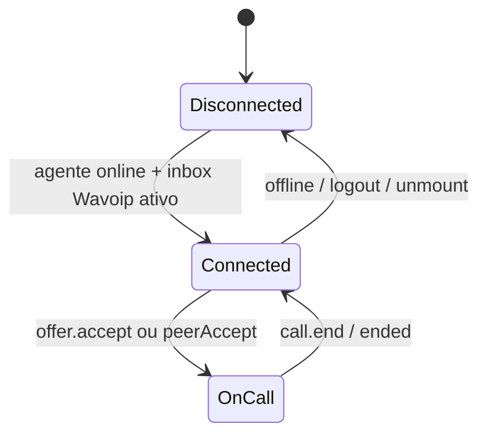

# Frontend — integração Wavoip no dashboard Vue

Como usar `@wavoip/wavoip-api` no Chatwoot **sem** `@wavoip/wavoip-webphone`, mapeando recursos do webphone para componentes existentes.

**Registry e portas FE:** [architecture.md §5](./architecture.md#5-frontend) — `voiceSessionRegistry`, `wavoipSdkPort`, `useWavoipCallSession`.

**Índice doc oficial Wavoip:** [official-docs.md](./official-docs.md)

**Refs internas:** [architecture.md](./architecture.md) · [sdk-reference.md](./sdk-reference.md) · [webhook-contract.md](./webhook-contract.md) · [operations-runbook.md](./operations-runbook.md)

**Refs oficiais webphone (comportamento — não instalar):**

- [Inicializando o Webphone](https://wavoip.gitbook.io/api/webphone/primeiros-passos/inicializacao.md)
- [API pública webphone](https://wavoip.gitbook.io/api/webphone/referencia/api-publica.md)
- [Notificações push](https://wavoip.gitbook.io/api/webphone/recursos/notificacoes-push.md)
- [Diagnóstico de chamada](https://wavoip.gitbook.io/api/webphone/recursos/diagnostico.md)

## 1. Por que não usar o webphone

| `@wavoip/wavoip-webphone` | Chatwoot |
|---------------------------|----------|
| React 18 + Radix + Shadow DOM | Vue 3 + Composition API |
| Widget flutuante próprio | `FloatingCallWidget` já existe |
| `window.wavoip` global | Estado em Pinia `calls.js` |
| ~6 MB unpacked ([npm](https://www.npmjs.com/package/@wavoip/wavoip-webphone)) | Bundle controlado |

Usar apenas [`@wavoip/wavoip-api`](https://wavoip.gitbook.io/api/wavoip-api/primeiros-passos/initialization.md) e replicar **comportamentos** necessários em composables Vue.

---

## 2. Registry de providers (reduzir FORK)

Centralizar em `custom/` para evitar `# FORK:` em cada componente Vue. Ver [architecture.md §5](./architecture.md#5-frontend).

```javascript
// custom/.../lib/voice/browserVoiceProviders.js
export const BROWSER_VOICE_PROVIDERS = ['whatsapp', 'wavoip'];

export const isBrowserVoiceProvider = provider =>
  BROWSER_VOICE_PROVIDERS.includes(provider);
```

| Consumidor | Uso |
|------------|-----|
| `FloatingCallWidget.vue` | `isBrowserVoiceProvider(activeCall?.provider)` para mute/end |
| `calls.js` | `teardownByProvider` via registry |
| `CallCard.vue` | Ícones/duração por provider |
| `actionCable.js` | Delega a `voiceCallCableRegistry.js` |

`inbox.js` reexporta `isBrowserVoiceProvider` com `# FORK:` mínimo.

---

## 3. Bootstrap do SDK

Equivalente ao [bootstrap com configuração](https://wavoip.gitbook.io/api/webphone/primeiros-passos/inicializacao.md), mas sem `render()`:

```javascript
// wavoipSdkPort.js — único import do pacote
export async function createWavoipClient(options) {
  const { Wavoip } = await import('@wavoip/wavoip-api');
  return new Wavoip(options);
}
```

| `WebphoneSettings` | Onde no Chatwoot |
|--------------------|------------------|
| `callSettings.displayName` | Recurso do webphone; não está no contrato `startCall` da API 2.6.x |
| `platform` | `'chatwoot'` fixo |
| `theme` / `widget.*` | N/A — UI Chatwoot |
| Tokens `localStorage` | **Evitar** — token vem do servidor por inbox |

**Persistência:** não usar `wavoip:tokens` do localStorage do webphone. Token administrado no inbox evita vazamento entre contas no mesmo browser.

---

## 4. Lifecycle por agente



| Evento Chatwoot | Ação SDK |
|-----------------|----------|
| Agente marca **online** | Construir `Wavoip({ tokens, platform })` só para inboxes onde `shouldAgentReceiveWavoipCalls` é `true` |
| Agente **offline** | `removeDevices([token])` e remover listeners |
| Troca de conta / logout | Remover devices/listeners de todas as instâncias |
| Navega para inbox não-Wavoip | Manter conexão se agente atende múltiplos inboxes Wavoip |
| `connectionStatus` → `disconnected` | Banner `DEVICE_DISCONNECTED`. `connectForInbox` espera o retry do SDK (~15s) antes de force-reconnect. Em chamada ativa, `connectionStatus` `"disconnected"` (transporte local após ~30s) encerra o widget; `status` `"DISCONNECTED"` só mostra banner de reconexão. |
| Token rotacionado no bootstrap | `connectInbox` busca token com `bypassCache: true` quando já havia client — reconecta se mudou |

Implementar em `useWavoipConnection.js` — **não** misturar com lógica de offer/outbound.

**Accept com WS morto (13 jul. 2026):** o card de incoming pode existir só via ActionCable (`awaitingSdkOffer`) enquanto o WebSocket do SDK está `disconnected`. `acceptIncomingCall` chama `connectForInbox` (reconnect + wait até `connected`), depois `waitForPendingOffer` / `offer.accept()`. Falhas tipadas (`DEVICE_DISCONNECTED`, `ACCEPT_OFFER_TIMEOUT`, `ACCEPT_FAILED`) — o card **permanece** para retry (`cleanupAfterBrowserVoiceJoinFailure` retorna `false`).

---

## 5. Mapa API webphone → composables Chatwoot

| API webphone (`window.wavoip`) | `@wavoip/wavoip-api` | Composable Chatwoot |
|--------------------------------|----------------------|---------------------|
| `call.start(to, config)` | `wavoip.startCall({ to, fromTokens })` | `useWavoipOutboundCall` |
| `call.getOffers()` | estado via `on('offer')` | `useWavoipIncomingOffer` |
| `call.onOffer(cb)` | `wavoip.on('offer', cb)` | idem |
| `device.add/enable` | `addDevices` no construtor | Admin configura token — sem UI device |
| `on('call:ended')` | `call.on('ended')` | `useWavoipActiveCall` |
| `widget.open/close` | — | `FloatingCallWidget` |
| `notifications.*` | — | `useWavoipNotifications` + Chatwoot push |

---

## 6. Notificações

### 6.1 Comportamento Wavoip (referência)

Fonte: [Notificações push](https://wavoip.gitbook.io/api/webphone/recursos/notificacoes-push.md)

| Condição | Wavoip webphone |
|----------|-----------------|
| Aba em foco | Ringtone; sem OS notification |
| Aba em background | `Notification` OS com tag `wavoip-offer` |
| Permissão não `granted` | Silencioso |
| Aba fechada | **Não funciona** — precisa Web Push + SW |

### 6.2 Estratégia Chatwoot

Camadas complementares:

| Camada | Implementação |
|--------|---------------|
| **Ringtone** | `FloatingCallWidget` (`RINGTONE_URL`) — ver §6.4 |
| **Quem recebe o ring** | `wavoipInboxCallRouting.js` + `IncomingCallRecipients` (backend) — ver [inbox-setup.md §3.6](./inbox-setup.md#36-seção--roteamento-de-chamadas-inbound-settings) |
| **OS Notification (aba aberta, sem foco)** | `useWavoipNotifications.js` — espelhar Wavoip com `Notification` API |
| **Web Push (aba fechada)** | Reusar `pushHelper.js` + VAPID — evento servidor no webhook `INCOMING_RING` |
| **Permissão** | Pedir no gesto “Ficar online” ou toggle em perfil (como push existente) |

```javascript
// useWavoipNotifications.js — padrão
export async function notifyIncomingOffer(offer) {
  if (document.visibilityState === 'visible') return;
  if (Notification.permission !== 'granted') return;

  new Notification(offer.peer.displayName ?? offer.peer.phone, {
    tag: 'chatwoot-wavoip-offer',
    body: offer.peer.phone,
    icon: '/brand-assets/logo_thumbnail.svg',
  });
}
```

### 6.3 Limitações a documentar para usuários

- **iOS Safari:** `Notification` só em PWA instalada — igual Wavoip doc.
- **Sem aceitar pela notification** — clique foca aba; aceitar no widget (mesma limitação Wavoip).
- **Chamadas perdidas in-memory no webphone** — Chatwoot persiste via webhook + conversa.

### 6.4 Ringtone e preferências do agente

Comportamento implementado em `FloatingCallWidget.vue`, `CallCard.vue`, `useCallSession.js` e
`useCallRingtonePreference.js` (upstream — compartilhado por todos os providers de voz no widget).

| Comportamento | Implementação |
|---------------|---------------|
| Tocar enquanto inbound não atendida | `ringingInbound` watcher em `FloatingCallWidget` |
| **Ringback outbound Wavoip (13 jul. 2026)** | Áudio `/audio/dashboard/ringback.mp3`. No clique: `unlock` mudo (gesto). Após `addCall` / widget “Ligando…”: `start` audível. **Sempre toca** — o botão “silenciar toque” vale só para inbound. Volume `0.55` até `peerAccept` / hangup |
| Parar ao aceitar / encerrar todas | Watcher desliga quando `!(ringingInbound \|\| ringingWavoipOutbound) \|\| hasActiveCall` |
| **Outro agente aceitou** | Cable `voice_call.accepted` / SDK `acceptedElsewhere` → `markCallDismissed` + dismiss store + `closeIncomingWavoipOfferNotification` (dismiss mesmo se `isCallJoining`; 2ª aba same-user sem toast) |
| **Este agente aceitou (aba em background)** | `useWavoipCallSession.acceptIncomingCall` fecha a OS Notification local imediatamente |
| **Este agente rejeitou** | `rejectIncomingCall` fecha OS Notification + SDK reject + dismiss store |
| **Escalação (`escalated: true`)** | `onIncoming` ignora se call já active/dismissed; senão grava `escalated` no store |
| **Rejeitar (✕) ou recusar** | `silenceCallRingtone(callSid, call)` em `rejectIncomingCall` / `dismissCall` **antes** do round-trip SDK — som para na hora **só neste agente**; outros dispositivos/agentes continuam tocando |
| **Chamador desligou** | SDK `offer.on('unanswered'/'ended')` + cable `onEnded` → toast `CONVERSATION.WAVOIP_CALL.CALLER_ENDED` + dismiss no store |
| **Silenciar toque (bell)** | Botão no `CallCard` (**incoming only**) → `toggleRingtoneMute` → `localStorage` key `call_ringtone_muted_{userId}` |
| Preferência persistente | Próximas **recebidas**: aviso visual sem áudio até reativar o bell. **Outbound Wavoip ignora** esta preferência (sempre toca `ringback.mp3`) |

Reconciliação de IDs (`whatsapp_call_id` ≠ `Offer.id`): `callStoreMappers.findWavoipCallForOffer`,
campo `wavoipOfferId` no store, aliases em `pendingOffers` — necessário para parar ringtone e
dismiss corretos quando cable e SDK usam IDs diferentes.

---

## 7. Diagnóstico

Fonte: [Diagnóstico de chamada](https://wavoip.gitbook.io/api/webphone/recursos/diagnostico.md)

O webphone expõe UI React; no Chatwoot, coletar eventos do SDK:

| Evento API | Uso |
|------------|-----|
| `iceDiagnostics` | Buffer em `wavoipDiagnosticsCollector.js` |
| `connectivityIssue` | Toast + entrada no relatório |
| `stats` / `serverStats` | Debug panel (admin) |
| `connectionStatus` | Banner “Reconectando…” no `FloatingCallWidget` |

### Relatório “Copiar diagnóstico”

Shape inspirado no JSON do webphone:

```json
{
  "generatedAt": "ISO-8601",
  "platform": "chatwoot",
  "inboxId": 1,
  "wavoipCallId": "…",
  "recentIceDiagnostics": [],
  "recentIssues": [],
  "browser": { "userAgent": "…", "online": true }
}
```

Botão apenas em **Settings → Wavoip** (admin), não poluir UI do agente.

### Catálogo `connectivityIssue`

Tratar mensagens i18n para: `STUN_UNREACHABLE`, `ICE_GATHERING_TIMEOUT`, `ICE_CONNECTION_FAILED`, `NO_HOST_CANDIDATES`, `SYMMETRIC_NAT_SUSPECTED` — ver troubleshooting Wavoip API.

---

## 8. Integração com `calls.js` (Pinia)

Objeto no store — mesma forma que WhatsApp para `FloatingCallWidget`:

```javascript
{
  id: call.id,                    // Wavoip call id (string)
  provider: 'wavoip',
  callDirection: 'inbound' | 'outbound',
  isActive: boolean,
  phone: peer.phone,
  name: peer.displayName,
  inboxId: number,
  // sem sdp_offer — Wavoip não expõe ao host
}
```

`teardownByProvider` — usar `voiceSessionRegistry` em `custom/`; **não** FORK em `calls.js` se importar registry.

---

## 9. `useCallSession` — contrato do branch Wavoip

Manter paridade com WhatsApp/Twilio para o widget:

| Método `useCallSession` | Wavoip |
|-------------------------|--------|
| `joinCall` | `connectForInbox` → `offer.accept()`; erros via `error.i18nKey` |
| `rejectIncomingCall` | `silenceCallRingtone` → `offer.reject()` → dismiss local |
| `endCall` | `callActive.end()` |
| `dismissCall` | inbound Wavoip: `silenceCallRingtone` → reject; demais: dismiss store |
| `formattedCallDuration` | Timer global existente |

**Falha no join/accept (Wavoip):** teardown do half-open SDK + `removePendingOffer`, mas **não** dismiss do store — o agente pode tentar atender de novo enquanto o chamador ainda toca.

Export auxiliar: `isCallRingtoneSilenced(callSid)` — usado pelo `FloatingCallWidget` para
suprimir áudio sem remover a notificação visual.

Não duplicar timer — reusar `globalDurationTimer` em `useCallSession.js`.

---

## 10. i18n

Chaves novas — seguir rule `chatwoot-core`: **somente `en`** em arquivos upstream; traduções `pt_BR` etc. só em `custom/` se o fork mantiver:

- `INBOX_MGMT.WAVOIP_CALL.*` — tile e settings (`en/inboxMgmt.json`)
- `CONVERSATION.WAVOIP_CALL.*` — erros outbound, `CALLER_ENDED`, `ACCEPTED_ELSEWHERE`, `CHANNELS_FULL` (linhas ocupadas / `SIMULTANEOUS_LIMIT`), `DEVICE_DISCONNECTED`, `ACCEPT_OFFER_TIMEOUT`, `ACCEPT_FAILED`, etc.
- `CONVERSATION.VOICE_WIDGET.MUTE_RINGTONE` / `UNMUTE_RINGTONE` — preferência de toque no widget
- `WAVOIP_CONNECTIVITY.*` — issues de rede
- `WAVOIP_ONBOARDING.*` — checklist semáforo

Cable handlers usam `createWavoipVoiceCableHandlers(t)` em `voiceCallCableRegistry.js` — `t`
injetado de `actionCable.js` para respeitar o idioma ativo (não importar JSON `en` diretamente).

Usar `replaceInstallationName` se strings mencionarem produto.

**Outbound sem permissão Meta:** mensagem clara em `peerReject` / `unanswered` — Wavoip não tem UI de “call permission”.

---

## 11. Performance

| Tática | Motivo |
|--------|--------|
| Dynamic `import('@wavoip/wavoip-api')` | Evitar parse em rotas sem Wavoip |
| Uma instância `Wavoip` por inboxId | `wavoipClientRegistry` |
| Desconectar quando agente offline | Reduz WebSockets ociosos |
| Não importar webphone | -6 MB |

---

## 12. Bolha `VoiceCall.vue`

Hoje acoplada a `useWhatsappCallSession` e join via SDP. Comportamento Wavoip:

| Estado bolha | WhatsApp | Wavoip |
|--------------|----------|--------|
| `ringing` inbound | Botão join + SDP | **Sem join** — usar widget flutuante |
| `in_progress` | Join se não ativo | Chamada já no browser via SDK |
| `completed` | Gravação upload local | `record_url` no `Call#meta` ou anexo ActiveStorage |
| `no-answer` / `failed` **inbound** (missed) | Botão **Ligar de volta** → `useWhatsappCallSession.initiateOutboundCall` | Botão **Ligar de volta** → preflight + `unlock` + `initiateOutboundCall` (ringback após `addCall`) |
| Player na bolha | Sempre que há anexo/URL | Só Wavoip + `completed` + `call_recording_enabled` + URL (`voiceCallRecording.js`) |
| Replay / ligar de novo (header) | Initiate via API Meta | `ConversationCallButton` / `startCall` na conversa |

```javascript
// VoiceCall.vue — branch
const isWavoip = computed(
  () => call.value?.provider === VOICE_CALL_PROVIDERS.WAVOIP
);

// canCallBack: missed inbound + sem chamada ativa/incoming
// Ocultar botões join/rejoin SDP quando isWavoip
// AudioChip: shouldShowVoiceCallRecording({ provider, callStatus, recordingUrl, callRecordingEnabled })
```

Gate UI (`custom/.../lib/wavoip/voiceCallRecording.js`):

| Condição | Mostrar player |
|----------|----------------|
| Provider ≠ `wavoip` | Sim (comportamento Meta/Twilio inalterado) |
| `call_recording_enabled === false` | Não |
| `status !== completed` | Não |
| Sem `recording_url` / anexo áudio | Não |

**Sem** `useWhatsappCallSession` para Wavoip — único `# FORK:` necessário na bolha.

---

## 13. Arquivos frontend (resumo)

```
custom/app/javascript/dashboard/
  lib/voice/
    browserVoiceProviders.js
    voiceCallCableRegistry.js
    voiceSessionRegistry.js
    callStoreMappers.js          # mapCable + mapOffer + findWavoipCallForOffer
  lib/wavoip/
    voiceCallRecording.js        # shouldShowVoiceCallRecording + resolveVoiceCallRecordingUrl
    wavoipClientRegistry.js
    wavoipCallDiagnostics.js     # connectivityIssue → i18n
    wavoipDiagnosticsCollector.js
    wavoipInboundConversation.js
    wavoipOutboundGuard.js
    wavoipOutboundPreflight.js
    wavoipInboxCallRouting.js
  composables/wavoip/
    useWavoipConnection.js
    useWavoipIncomingOffer.js
    useWavoipOutboundCall.js
    useWavoipActiveCall.js
    useWavoipCallSession.js
    useWavoipNotifications.js
    useWavoipQrSession.js
  components/wavoip/
    WavoipConnectionHost.vue
    WavoipQrDisplay.vue
    WavoipQrScanModal.vue
    WavoipConversationDeviceBanner.vue
  routes/dashboard/settings/inbox/
    channels/Wavoip.vue
    settingsPage/
      WavoipCallingPage.vue
      WavoipDevicePanel.vue
      WavoipOnboardingChecklist.vue
      WavoipRecordingChecklist.vue

app/javascript/dashboard/          # upstream — widget de voz compartilhado
  lib/voice/whatsappVoiceCableRegistry.js
  composables/spec/useWebRtcCallSession.spec.js
  composables/useCallRingtonePreference.js
  composables/useCallSession.js    # ringtoneSilencedCallSids, reject/dismiss
  components-next/call/
    FloatingCallWidget.vue
    CallCard.vue                   # botão bell mute ringtone (incoming)
```

**Componentes de setup (existentes):**

| Componente | Responsabilidade |
|------------|------------------|
| `Wavoip.vue` | Wizard de criação + alerta com URL do webhook pós-criação |
| `WavoipCallingPage.vue` | Settings → Chamadas: device panel, inbound toggle, **roteamento inbound**, webhook, status |
| `WavoipOnboardingChecklist.vue` | Checklist semáforo de onboarding (Settings) |
| `WavoipRecordingChecklist.vue` | Checklist de gravação (Settings) |
| `WavoipConversationDeviceBanner.vue` | Banner de device não pronto na conversa (`components/wavoip/`) |

**Implementados:** `WavoipDevicePanel.vue` (device status, **QR escaneável**, pairing, wakeUp, restart/logout, diagnostics, **activeCalls v2.6.x**), `WavoipQrDisplay.vue`, `useWavoipQrSession.js`, `wavoipCallDiagnostics.js`, `wavoipOutboundPreflight.js`, `wavoipOutboundGuard.js`.

Alias Vite `customDashboard` em `vite.shared.ts`.

Edições pontuais `# FORK:` em componentes upstream — inventário em [architecture.md §10](./architecture.md#edições-fork-típicas).
