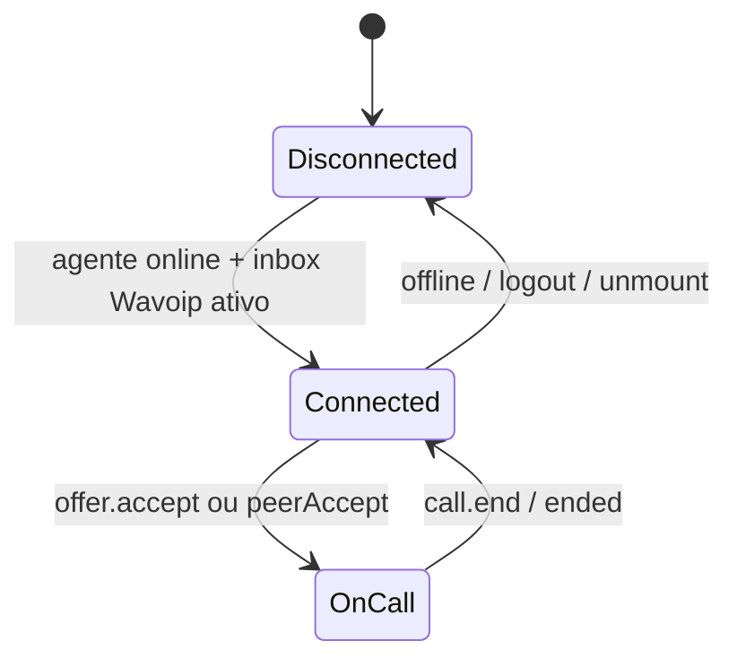

# Frontend — integração Wavoip no dashboard Vue

Como usar `@wavoip/wavoip-api` no Chatwoot **sem** `@wavoip/wavoip-webphone`, mapeando recursos do webphone para componentes existentes.

**Refs Wavoip:**

- [Inicializando o Webphone](https://wavoip.gitbook.io/api/webphone/primeiros-passos/inicializacao.md) — settings equivalentes
- [API pública webphone](https://wavoip.gitbook.io/api/webphone/referencia/api-publica.md) — mapa mental dos métodos
- [Notificações push](https://wavoip.gitbook.io/api/webphone/recursos/notificacoes-push.md)
- [Diagnóstico de chamada](https://wavoip.gitbook.io/api/webphone/recursos/diagnostico.md)

---

## 1. Por que não usar o webphone

| `@wavoip/wavoip-webphone` | Chatwoot |
|---------------------------|----------|
| React 18 + Radix + Shadow DOM | Vue 3 + Composition API |
| Widget flutuante próprio | `FloatingCallWidget` já existe |
| `window.wavoip` global | Estado em Pinia `calls.js` |
| ~6 MB unpacked ([npm](https://www.npmjs.com/package/@wavoip/wavoip-webphone)) | Bundle controlado |

Usar apenas [`@wavoip/wavoip-api`](https://wavoip.gitbook.io/api/wavoip-api/primeiros-passos/initialization.md) e replicar **comportamentos** necessários em composables Vue.

---

## 2. Bootstrap do SDK

Equivalente ao [bootstrap com configuração](https://wavoip.gitbook.io/api/webphone/primeiros-passos/inicializacao.md), mas sem `render()`:

```javascript
// useWavoipConnection.js
import { Wavoip } from '@wavoip/wavoip-api';

const wavoip = new Wavoip({
  tokens: [inbox.deviceToken],
  platform: 'chatwoot',
});
```

| `WebphoneSettings` | Onde no Chatwoot |
|--------------------|------------------|
| `callSettings.displayName` | `Channel::Wavoip#provider_config['display_name']` |
| `platform` | `'chatwoot'` fixo |
| `theme` / `widget.*` | N/A — UI Chatwoot |
| Tokens `localStorage` | **Evitar** — token vem do servidor por inbox |

**Persistência:** não usar `wavoip:tokens` do localStorage do webphone. Token administrado no inbox evita vazamento entre contas no mesmo browser.

---

## 3. Lifecycle por agente



| Evento Chatwoot | Ação SDK |
|-----------------|----------|
| Agente marca **online** | `wavoipClientRegistry.connect(inboxId, token)` |
| Agente **offline** | `disconnect(inboxId)` — manter ou não conforme política |
| Troca de conta / logout | `destroyAll()` |
| Navega para inbox não-Wavoip | Manter conexão se agente atende múltiplos inboxes Wavoip |

Implementar em `useWavoipConnection.js` — **não** misturar com lógica de offer/outbound.

---

## 4. Mapa API webphone → composables Chatwoot

| API webphone (`window.wavoip`) | `@wavoip/wavoip-api` | Composable Chatwoot |
|--------------------------------|----------------------|---------------------|
| `call.start(to, config)` | `wavoip.startCall({ to, fromTokens })` | `useWavoipOutboundCall` |
| `call.getOffers()` | estado via `on('offer')` | `useWavoipIncomingOffer` |
| `call.onOffer(cb)` | `wavoip.on('offer', cb)` | idem |
| `device.add/enable` | `addDevices` no construtor | Admin configura token — sem UI device |
| `on('call:ended')` | `call.on('ended')` | `useWavoipActiveCall` |
| `widget.open/close` | — | `FloatingCallWidget` |
| `notifications.*` | — | `useWavoipNotifications` + Chatwoot push |

---

## 5. Notificações

### 5.1 Comportamento Wavoip (referência)

Fonte: [Notificações push](https://wavoip.gitbook.io/api/webphone/recursos/notificacoes-push.md)

| Condição | Wavoip webphone |
|----------|-----------------|
| Aba em foco | Ringtone; sem OS notification |
| Aba em background | `Notification` OS com tag `wavoip-offer` |
| Permissão não `granted` | Silencioso |
| Aba fechada | **Não funciona** — precisa Web Push + SW |

### 5.2 Estratégia Chatwoot

Camadas complementares:

| Camada | Implementação |
|--------|---------------|
| **Ringtone** | Já em `FloatingCallWidget` (`RINGTONE_URL`) |
| **OS Notification (aba aberta, sem foco)** | `useWavoipNotifications.js` — espelhar Wavoip com `Notification` API |
| **Web Push (aba fechada)** | Reusar `pushHelper.js` + VAPID — evento servidor no webhook `INCOMING_RING` |
| **Permissão** | Pedir no gesto “Ficar online” ou toggle em perfil (como push existente) |

```javascript
// useWavoipNotifications.js — padrão
export async function notifyIncomingOffer(offer) {
  if (document.visibilityState === 'visible') return;
  if (Notification.permission !== 'granted') return;

  new Notification(offer.peer.displayName ?? offer.peer.phone, {
    tag: 'chatwoot-wavoip-offer',
    body: offer.peer.phone,
    icon: '/brand-assets/logo_thumbnail.svg',
  });
}
```

### 5.3 Limitações a documentar para usuários

- **iOS Safari:** `Notification` só em PWA instalada — igual Wavoip doc.
- **Sem aceitar pela notification** — clique foca aba; aceitar no widget (mesma limitação Wavoip).
- **Chamadas perdidas in-memory no webphone** — Chatwoot persiste via webhook + conversa.

---

## 6. Diagnóstico

Fonte: [Diagnóstico de chamada](https://wavoip.gitbook.io/api/webphone/recursos/diagnostico.md)

O webphone expõe UI React; no Chatwoot, coletar eventos do SDK:

| Evento API | Uso |
|------------|-----|
| `iceDiagnostics` | Buffer em `wavoipDiagnosticsCollector.js` |
| `connectivityIssue` | Toast + entrada no relatório |
| `stats` / `serverStats` | Debug panel (admin) |
| `connectionStatus` | Banner “Reconectando…” no `FloatingCallWidget` |

### Relatório “Copiar diagnóstico”

Shape inspirado no JSON do webphone:

```json
{
  "generatedAt": "ISO-8601",
  "platform": "chatwoot",
  "inboxId": 1,
  "wavoipCallId": "…",
  "recentIceDiagnostics": [],
  "recentIssues": [],
  "browser": { "userAgent": "…", "online": true }
}
```

Botão apenas em **Settings → Wavoip** (admin), não poluir UI do agente.

### Catálogo `connectivityIssue`

Tratar mensagens i18n para: `STUN_UNREACHABLE`, `ICE_GATHERING_TIMEOUT`, `ICE_CONNECTION_FAILED`, `NO_HOST_CANDIDATES`, `SYMMETRIC_NAT_SUSPECTED` — ver troubleshooting Wavoip API.

---

## 7. Integração com `calls.js` (Pinia)

Objeto no store — mesma forma que WhatsApp para `FloatingCallWidget`:

```javascript
{
  id: call.id,                    // Wavoip call id (string)
  provider: 'wavoip',
  callDirection: 'inbound' | 'outbound',
  isActive: boolean,
  phone: peer.phone,
  name: peer.displayName,
  inboxId: number,
  // sem sdp_offer — Wavoip não expõe ao host
}
```

`teardownByProvider` em `calls.js` — adicionar case `wavoip` chamando `useWavoipActiveCall().cleanup()`.

---

## 8. `useCallSession` — contrato do branch Wavoip

Manter paridade com WhatsApp/Twilio para o widget:

| Método `useCallSession` | Wavoip |
|-------------------------|--------|
| `joinCall` | `offer.accept()` ou noop se já ativa |
| `rejectIncomingCall` | `offer.reject()` |
| `endCall` | `callActive.end()` |
| `dismissCall` | reject + limpar store |
| `formattedCallDuration` | Timer global existente |

Não duplicar timer — reusar `globalDurationTimer` em `useCallSession.js`.

---

## 9. i18n

Chaves novas apenas em `en.json` e `pt_BR` (regra do projeto):

- `INBOX_MGMT.WAVOIP_CALL.*` — tile e settings
- `CONVERSATION.WAVOIP_CALL_*` — erros outbound
- `WAVOIP_CONNECTIVITY.*` — issues de rede

Usar `replaceInstallationName` se strings mencionarem produto.

---

## 10. Performance

| Tática | Motivo |
|--------|--------|
| Dynamic `import('@wavoip/wavoip-api')` | Evitar parse em rotas sem Wavoip |
| Uma instância `Wavoip` por inboxId | `wavoipClientRegistry` |
| Desconectar quando agente offline | Reduz WebSockets ociosos |
| Não importar webphone | -6 MB |

---

## 11. Arquivos frontend (resumo)

```
custom/app/javascript/dashboard/
  lib/wavoip/
    wavoipClientRegistry.js
    wavoipDiagnosticsCollector.js
  composables/wavoip/
    useWavoipConnection.js
    useWavoipIncomingOffer.js
    useWavoipOutboundCall.js
    useWavoipActiveCall.js
    useWavoipCallSession.js
    useWavoipNotifications.js
  routes/dashboard/settings/inbox/channels/WavoipCall.vue
  routes/dashboard/settings/inbox/settingsPage/WavoipCallingPage.vue
```

Edições pontuais `# FORK:` em componentes upstream listados em [implementation-plan.md](./implementation-plan.md).
