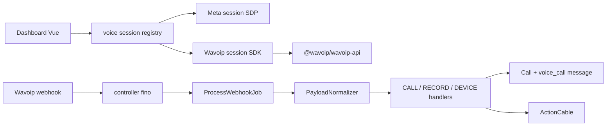

# Plano consolidado de implementação — Wavoip

Fonte única para ordem, escopo, gates e critérios de pronto da integração Wavoip.
Os demais documentos desta pasta detalham contratos e referências; quando houver
divergência de prioridade ou fase, este plano prevalece.

**Reavaliado em:** 20 jun. 2026

**Estado do código:** Fases 1–4 **code complete** + audit fixes (jun. 2026). E2E live de webhooks CALL pendente — ver [spike-notes.md](./spike-notes.md).

## Doc status (Jun 2026)

| Métrica | Estimativa |
|---------|------------|
| **MVP código** | ~95% |
| **Piloto produção** | ~60% |
| **Bloqueador piloto** | Webhooks CALL do painel Wavoip em chamadas live (G0.2/G0.3) |
| **`WavoipCallingPage` bug** | ✅ Corrigido jun. 2026 |

## Implementation status (Jun 2026)

| Fase | Status | Evidência |
|------|--------|-----------|
| **0 — Spike** | ✅ `go com restrições` | [spike-notes.md](./spike-notes.md) |
| **1 — Fundação** | ✅ Done | `Channel::Wavoip`, migration `channel_wavoip`, webhook `POST /webhooks/wavoip/:webhook_key`, tile `Wavoip.vue` |
| **2 — Outbound** | ✅ Done | Composables SDK, `CallUpsertService`, outbound RINGING → ACTIVE em produção |
| **3 — Inbound + registry** | ✅ Done | `voiceSessionRegistry`, `voiceCallCableRegistry`, `useCallSession` dispatch, `CallsController#update` |
| **4 — Hardening** | ✅ Done | 76 RSpec + 21 Vitest; audit + optional improvements jun. 2026 |

### Backend (`custom/`)

| Módulo | Path |
|--------|------|
| Model | `custom/app/models/channel/wavoip.rb` |
| Webhook ingress | `custom/app/controllers/webhooks/wavoip_controller.rb` |
| Job | `custom/app/jobs/wavoip/process_webhook_job.rb` |
| Pipeline | `custom/app/services/wavoip/webhooks/{dispatcher,payload_normalizer,handlers/*}` |
| Call persistence | `custom/app/services/wavoip/calls/{call_upsert_service,conversation_linker,broadcaster,status_mapper}` |
| Accept audit | `custom/app/controllers/api/v1/accounts/calls_controller.rb` |
| Inbox create | `custom/app/controllers/custom/api/v1/accounts/inboxes_controller.rb` (prepend) |

### Frontend (`custom/app/javascript/` — 18 arquivos)

Registry (`lib/voice/`), composables (`composables/wavoip/`), `WavoipConnectionHost.vue`, `WavoipCallingPage.vue`, `api/calls.js`, Vitest em `lib/voice/specs/`. Tile de criação: `custom/app/javascript/dashboard/routes/dashboard/settings/inbox/channels/Wavoip.vue`.

### FORK upstream (mínimo)

- `enterprise/app/models/call.rb` — `enum :provider, { twilio: 0, whatsapp: 1, wavoip: 2 }`
- `config/routes.rb` — `POST webhooks/wavoip/:webhook_key`
- `app/views/api/v1/models/_inbox.json.jbuilder` — `wavoip_webhook_url`, `wavoip_setup_pending`
- Hooks em `useCallSession.js`, `actionCable.js`, `ChannelFactory.vue`, etc.

### Piloto restante

- [ ] Webhooks CALL do painel Wavoip em chamadas live (G0.2/G0.3) — usar `bin/wavoip-pilot-verify`
- [ ] G0.4 multiagente (`acceptedElsewhere`) — procedimento em [operations-runbook.md](./operations-runbook.md)

### Corrigido (Jun 2026)

- [x] `WavoipCallingPage` — lê `wavoip_webhook_url` / `wavoip_setup_pending` com fallbacks camelCase
- [x] **Audit fixes (20 jun. 2026):** `source_id` digits-only via `prepend_mod_with` em `Voice::InboundCallBuilder`; teardown SDK scoped por call; guard `inbound_calls_enabled` server-side; `channel_wavoip` em `voice_enabled?`; idempotência `CallUpsertService`; rotação de webhook key; specs Dispatcher/ConversationLinker/DeviceHandler

---

## Decisões consolidadas

| Tema | Decisão |
|------|---------|
| Integração | `@wavoip/wavoip-api` no browser + webhook próprio no Rails |
| Canal | `Channel::Wavoip` e tabela `channel_wavoip`, separados de `Channel::Whatsapp` |
| UI compartilhada | Reusar store/widget/bolha por um registry de sessão; não reutilizar SDP Meta |
| WebRTC Meta | Extrair `useWebRtcCallSession` é melhoria Meta/CPaaS, **não bloqueia Wavoip** |
| Histórico | Reusar `Call`, `Voice::InboundCallBuilder` e `Voice::CallMessageBuilder` |
| Provider do `Call` | Adicionar `wavoip: 2` diretamente no enum com `# FORK:`; `Call` não possui hook `prepend_mod_with` |
| Webhook | URL com chave opaca rotacionável; não usar telefone no path nem secret em query string |
| Credencial SDK | Coluna dedicada e criptografada quando a criptografia do Chatwoot estiver configurada |
| MVP | Inbox + outbound + inbound + histórico + aceite auditável |
| Pós-MVP | Pareamento completo, push com aba fechada, gravação e diagnóstico avançado |
| Pacote | Começar com versão exata validada no spike; em 19 jun. 2026 a versão publicada é `2.5.0` |

## O que mudou após a reavaliação

1. O spike passa a ocorrer **antes** de qualquer refactor compartilhado.
2. `useWebRtcCallSession(callsAPI)` saiu do caminho crítico: Wavoip encapsula mídia e
   sinalização no próprio SDK.
3. O requisito compartilhado virou um registry pequeno para `join`, `reject`, `end`,
   mute, cleanup e eventos cable por provider.
4. O wizard não exige confirmação de webhook antes de criar o inbox. A URL só existe
   após a criação, portanto a configuração vira um passo de ativação.
5. Push offline não pertence ao MVP: ele pode avisar, mas não mantém uma oferta do SDK
   viva nem permite aceitar com a aba fechada.
6. A extensão do enum `Call` não será feita por prepend: o model não chama
   `prepend_mod_with`, e redefinir o enum após boot é frágil.
7. O schema publicado do webhook contém um campo `type` duplicado no exemplo `CALL`.
   Payload bruto real e correlação de IDs são gates de go/no-go.

## Gates de go/no-go

Nenhuma implementação de produto começa sem registrar estes resultados em
`spike-notes.md`:

| Gate | Evidência necessária | Se falhar |
|------|----------------------|-----------|
| G0.1 SDK | `2.5.0` instala, conecta e faz áudio bidirecional | Reavaliar versão/API |
| G0.2 IDs | `Offer.id`/`CallOutgoing.id` correlaciona de forma determinística com `whatsapp_call_id` | Definir endpoint de correlação ou não seguir |
| G0.3 Webhook bruto | Capturar bytes reais de `CALL`, `RECORD` e `DEVICE`; confirmar como o `type` duplicado chega | Normalizer só após contrato real |
| G0.4 Multiagente | Duas sessões recebem offer e `acceptedElsewhere`/`rejectedElsewhere` funciona | Limitar a um agente por inbox ou não seguir |
| G0.5 Lifecycle | `open`, `hibernating`, `wakeUp`, reconnect e logout observados | Ajustar gates e runbook |
| G0.6 Segurança | Token pode ser entregue somente a agentes autorizados do inbox | Criar endpoint dedicado antes do SDK |
| G0.7 Histórico | `Call` aceita `provider: :wavoip` após a alteração mínima do enum e builder cria uma única bolha | Usar modelo próprio como fallback |

## Arquitetura mínima



O browser controla `startCall`, `offer.accept/reject`, mute e end. O Rails controla
autorização, inbox, contato, conversa, `Call`, mensagem e broadcasts auxiliares.

## Fase 0 — spike isolado

**Duração:** 2–4 dias. **Status:** ✅ concluído — `go com restrições` ([spike-notes.md](./spike-notes.md)).

- [x] Criar página/fixture de laboratório fora do fluxo de produção.
- [x] Instalar exatamente `@wavoip/wavoip-api@2.5.0`.
- [x] Validar outbound, inbound, mute, end e áudio bidirecional.
- [x] Capturar payload HTTP bruto antes de `JSON.parse`.
- [x] Comparar IDs SDK ↔ webhook e ordem temporal dos eventos.
- [ ] Testar duas abas e, se possível, dois browsers/agentes (G0.4 pendente).
- [x] Testar `open`, `hibernating`, `wakeUp()` e reconexão.
- [x] Substituir fixtures de exemplo pelos payloads reais sanitizados.
- [x] Preencher [spike-notes.md](./spike-notes.md).

**Saída:** decisão explícita `go`, `go com restrições` ou `no-go`.

## Fase 1 — fundação segura

**Duração:** 4–6 dias. **Status:** ✅ code complete.

### Backend

- [x] Migration `channel_wavoip` com:
  - `phone_number` único **na tabela Wavoip**, permitindo coexistir com inbox de mensagens;
  - `device_token` dedicado;
  - `webhook_key` opaca e rotacionável;
  - `provider_config` apenas para preferências não secretas;
  - timestamps e índices de lookup necessários.
- [x] `Channel::Wavoip` com `self.table_name = 'channel_wavoip'`.
- [x] `Custom::Account` adiciona `has_many :wavoip_channels` e o controller cria o
  canal por essa associação.
- [x] `encrypts :device_token if Chatwoot.encryption_configured?`.
- [x] `has_secure_token :webhook_key`.
- [x] Uma edição em `enterprise/app/models/call.rb`:

```ruby
# FORK: persist Wavoip voice calls in the shared call timeline
enum :provider, { twilio: 0, whatsapp: 1, wavoip: 2 }
```

- [x] Controller `POST /webhooks/wavoip/:webhook_key`:
  - resolve o canal pela chave;
  - retorna `202` rapidamente;
  - enfileira payload + inbox id;
  - nunca loga URL completa, token ou body em produção.
- [x] `PayloadNormalizer` baseado nos payloads do spike.
- [x] Idempotência por índice `(provider, provider_call_id)`, lock da linha e
  transições no-op quando o estado não mudou.
- [x] Endpoints de criação/configuração usam autorização de account/inbox e exigem admin.
- [x] Endpoint de bootstrap SDK restrito a agentes associados ao inbox; nunca expor
  o token na listagem geral de inboxes.

### Frontend / setup

- [x] Tile `wavoip` sob `channel_voice` + `channel_wavoip`.
- [x] Formulário de criação: nome, número E.164, token e inbound enabled.
- [x] Após criar: mostrar URL do webhook e checklist “configurar → receber primeiro evento”.
- [x] Status “configuração pendente” até webhook/device ser validado.
- [x] Carregamento dinâmico do pacote apenas quando houver inbox Wavoip autorizado.

**Done:** inbox criado, credenciais protegidas, SDK conecta e webhook real é aceito.

## Fase 2 — outbound MVP

**Duração:** 4–6 dias. **Status:** ✅ code complete (E2E live: RINGING → ACTIVE comprovado).

### Frontend

- [x] `wavoipSdkPort.js` como único import do pacote.
- [x] Registry `inboxId → Wavoip` com teardown em logout/troca de conta.
- [x] `useWavoipOutboundCall` e `useWavoipActiveCall`.
- [x] Gate por device `open`; tentar `wakeUp()` quando `hibernating`.
- [x] Botão de ligar usa `startCall({ to, fromTokens: [token] })`.
- [x] Tratar `peerAccept`, `peerReject`, `unanswered`, `ended` e erros por device.

### Backend

- [x] `CALL CREATE/UPDATE` faz upsert idempotente.
- [x] Resolver contato/conversa e criar uma única bolha `voice_call`.
- [x] Mapear `OUTCOMING` e `OUTGOING` defensivamente para outbound.
- [x] Guardar detalhes específicos em `Call#meta`, nunca o `device_token`.

**Done:** chamada outbound completa, término local/remoto e histórico consistente.

## Fase 3 — inbound MVP e integração compartilhada

**Duração:** 6–8 dias. **Status:** ✅ code complete (correlação live SDK/webhook pendente).

### Registry compartilhado

- [x] Introduzir contrato mínimo `BrowserVoiceSession`.
- [x] `useCallSession` despacha por provider para Meta ou Wavoip.
- [x] `actionCable.js` despacha eventos por provider sem exigir SDP para Wavoip.
- [x] Generalizar os consumidores reais encontrados no código:
  `calls.js`, `FloatingCallWidget.vue`, `ConversationCallButton.vue`,
  `components-next/Contacts/VoiceCallButton.vue`, `CallCard.vue` e `VoiceCall.vue`.
- [x] Manter o caminho Meta sem mudança comportamental.

### Inbound

- [x] Reconciliar SDK offer e webhook pela estratégia validada no gate G0.2 (simulado).
- [x] Ring funciona mesmo se apenas o offer local chegou; histórico aparece quando o
  webhook persistir a chamada.
- [x] `accept`, `reject`, `acceptedElsewhere`, `rejectedElsewhere`, `unanswered`.
- [x] Endpoint fino para registrar `accepted_by_agent_id` após `offer.accept()`.
- [x] Autorizar o agente pelo inbox/conversa; o body não escolhe outro user id.
- [x] `HANDLED_REMOTELY` encerra o ring e grava `end_reason`.
- [x] Notification API somente com aba aberta em background.

**Done:** inbound multiagente, aceite auditável, teardown consistente e sem regressão Meta.

## Fase 4 — hardening e rollout piloto

**Duração:** 3–5 dias. **Status:** ✅ code complete — piloto live aguarda webhooks CALL do painel.

- [x] Specs Ruby: normalizer, status, idempotência, auth, enum e autorização.
- [x] Specs Vitest: registry, races SDK/webhook, accepted elsewhere e teardown.
- [ ] Testes manuais em Chrome/Firefox, rede corporativa e troca de conta (piloto).
- [ ] Métricas: webhook inválido, atraso webhook, call sem correlação, falha SDK,
  device indisponível e chamadas terminais (pós-MVP).
- [x] Runbook atualizado com os resultados reais do spike.
- [x] Piloto: inbox 42 (account 2), device `556697193168` — rollback por `channel_wavoip`.

## Pós-MVP

| Item | Motivo para adiar |
|------|-------------------|
| Pareamento QR/código, restart e logout no Chatwoot | Admin pode operar primeiro no painel Wavoip |
| Web Push com aba fechada | Apenas avisa; não preserva a oferta nem garante aceite |
| Gravação `RECORD` | Dependência de política, retenção, consentimento e download seguro |
| Diagnóstico ICE/stats | Útil após validar uso real |
| Seleção de mic/speaker | O browser default cobre o happy path |
| Refactor `useWebRtcCallSession` Meta | Beneficia Meta-like/CPaaS, não Wavoip |
| Adapter/builders Meta | Trilha separada; não bloquear entrega Wavoip |

## Status e normalização

| Webhook Wavoip | `Call.status` | Observação |
|----------------|---------------|------------|
| `INCOMING_RING`, `OUTGOING_RING`, `OUTGOING_CALLING`, `CONNECTING` | `ringing` | |
| `ACTIVE` | `in_progress` | definir `started_at` uma vez |
| `ENDED` | `completed` | usar duração do provider quando válida |
| `NOT_ANSWERED` | `no_answer` | |
| `REJECTED`, `FAILED`, `CONNECTION_LOST` | `failed` | preservar `end_reason` |
| `HANDLED_REMOTELY` | `completed` | `end_reason: handled_remotely`; fecha ring |
| `REMOTE_CALL_IN_PROGRESS` | sem transição automática | registrar e validar no spike |

O exemplo oficial `CALL` usa `direction: OUTCOMING` e declara `type` duas vezes.
Não codificar uma suposição silenciosa: fixtures reais governam o normalizer.

## Inventário esperado de mudanças upstream

Mudanças devem ser mínimas, contíguas e marcadas:

| Área | Mudança provável |
|------|------------------|
| `enterprise/app/models/call.rb` | enum `wavoip: 2` |
| `config/routes.rb` | mount/rota webhook e endpoint de aceite |
| `inbox.js` | provider Wavoip |
| setup de canais | tile/factory/gate |
| `useCallSession.js` | dispatch de sessão |
| `actionCable.js` | dispatch de eventos |
| componentes de chamada | helpers provider-agnostic onde o código atual está acoplado |
| Vite | alias apenas se o import de `custom/` realmente exigir |

Antes de implementar o alias, verificar se a configuração atual já expõe o overlay
frontend. Não adicionar infraestrutura especulativa.

## Critérios finais de pronto

- [x] Gates G0.1–G0.7 documentados ([spike-notes.md](./spike-notes.md)).
- [x] Nenhum segredo aparece em serializer, log, erro ou analytics.
- [x] Outbound e inbound produzem uma única `Call` e uma única mensagem (simulado + pipeline).
- [x] Aceite registra o agente autenticado (`CallsController#update`).
- [x] Meta inbound/outbound/terminate continua funcionando.
- [x] Races SDK-before-webhook e webhook-before-SDK têm testes.
- [x] Rollback desativa UI/conexões sem apagar histórico.
- [x] `rg "FORK:"` e `bin/fork-inventory` refletem todas as edições compartilhadas.
- [ ] Live webhook CALL do painel Wavoip em produção (bloqueador piloto).

## Referências

- [contracts-and-ports.md](./contracts-and-ports.md) — contratos e DTOs
- [architecture.md](./architecture.md) — desenho de módulos
- [frontend-integration.md](./frontend-integration.md) — integração Vue/SDK
- [webhook-contract.md](./webhook-contract.md) — webhook e realtime
- [sdk-reference.md](./sdk-reference.md) — API Wavoip validada
- [operations-runbook.md](./operations-runbook.md) — operação
- [official-docs.md](./official-docs.md) — links oficiais atuais
