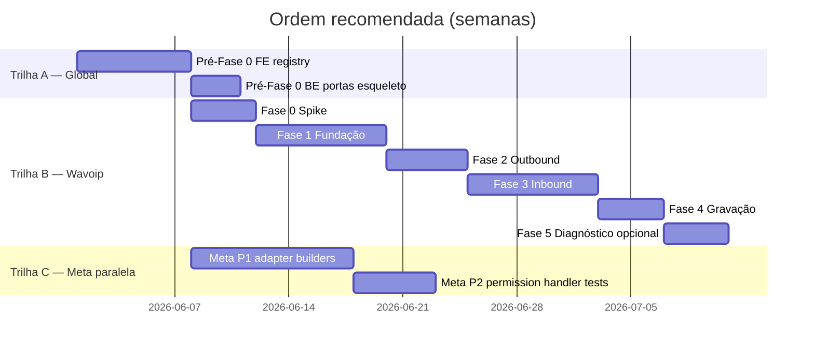

# Plano de implementação — Wavoip + melhorias de voz (mestre)

Plano **incrementado** com todas as melhorias da reanálise arquitetural (jun/2026): portas/DI ([contracts-and-ports.md](./contracts-and-ports.md)), refactor FE global ([second-provider-strategy §Fase 0](../second-provider-strategy.md#fase-0--refactor-pré-requisito-recomendado)), backlog Meta ([../README.md §Roadmap](../README.md#roadmap-de-melhorias-ordem-recomendada)).

**Pré-requisitos leitura:** [contracts-and-ports.md](./contracts-and-ports.md) · [architecture.md](./architecture.md) · [official-docs.md](./official-docs.md) · feature `channel_voice` na conta.

**Status código (jun/2026):** stack Meta oficial em `enterprise/`; Wavoip + refactors **somente documentados** — nenhum código em `custom/` ainda.

---

## Visão geral das trilhas



| Trilha | Escopo | Bloqueia Wavoip? |
|--------|--------|------------------|
| **A — Pré-Fase 0** | Registry FE + portas BE + Vite alias | **Sim** (FE obrigatório) |
| **B — Wavoip 0–5** | Canal, webhook, SDK, widget | — |
| **C — Meta P1–P2** | Adapter, builders, permission FE | **Não** (paralelo após Trilha A) |

---

## Mapa de IDs (rastreabilidade)

Cada tarefa referencia um ID do backlog global ([../README.md](../README.md)) ou Wavoip ([contracts §12](./contracts-and-ports.md#12-melhorias-pendentes-backlog)).

| Prefixo | Origem |
|---------|--------|
| `G1–G8` | Backlog global README |
| `W-P0.*` | Pré-requisitos Wavoip FE/infra |
| `W-B*` | Backend Wavoip |
| `W-F*` | Frontend Wavoip |
| `W-O*` | Produto/ops Wavoip |
| `M-P0/P1/P2` | Melhorias Meta (architecture §13) |

---

## Trilha A — Pré-Fase 0 global (bloqueante)

**Objetivo:** registry browser-voice compartilhado Meta + Wavoip; esqueleto de portas Rails. **Duração:** ~1–1,5 semana.

### A.1 Frontend (obrigatório)

| ID | # | Tarefa | Entrega | Done |
|----|---|--------|---------|------|
| G1, W-P0.1 | A.1.1 | Extrair `useWebRtcCallSession(callsAPI)` | `app/.../composables/useWebRtcCallSession.js` — WebRTC, recorder, race buffers, beacon; API injetável | [ ] |
| G1, W-P0.1 | A.1.2 | `useWhatsappCallSession` → thin wrapper | &lt; 80 linhas; delega `WhatsappCallsAPI` | [ ] |
| G1, W-P0.2 | A.1.3 | `voiceSessionRegistry.js` | `getBrowserVoiceSession(provider)` — [contratos §5.3](./contracts-and-ports.md#53-porta-voicesessionregistry-inversão-em-usecallsession) | [ ] |
| G1, W-P0.2 | A.1.4 | `voiceCallCableRegistry.js` | Handlers `whatsapp` + stub `wavoip` | [ ] |
| G1, W-P0.2 | A.1.5 | `# FORK:` `useCallSession.js` | `getBrowserVoiceSession` em vez de `isWhatsappCall` branching | [ ] |
| G1, W-P0.2 | A.1.6 | `# FORK:` `actionCable.js` | Uma delegação: `VOICE_CALL_CABLE_HANDLERS[data.provider]` | [ ] |
| W-P0.3 | A.1.7 | `browserVoiceProviders.js` | `isBrowserVoiceProvider()`; reexport em `inbox.js` | [ ] |
| W-P0.3 | A.1.8 | `callStoreMappers.js` | `mapCableToStoreEntry`, `mapWavoipOfferToStoreEntry` (stubs OK) | [ ] |
| W-P0.4 | A.1.9 | Alias Vite `customDashboard` | `vite.shared.ts` `# FORK:` | [ ] |
| G6, W-F9 | A.1.10 | Specs Vitest Meta | `pendingOutboundAnswers`, `beaconTerminate`, permission 422 | [ ] |
| G6 | A.1.11 | Specs Vitest registry | Mock cable handlers por provider | [ ] |

**Critério de saída A.1:** regressão Meta inbound/outbound/terminate em staging; `rg isWhatsappCall` reduzido a registry.

### A.2 Backend portas (recomendado com Fase 1 Wavoip)

| ID | # | Tarefa | Arquivo | Done |
|----|---|--------|---------|------|
| W-B1 | A.2.1 | DTO `Voice::Dto::WebhookCallEvent` | `custom/.../voice/dto/webhook_call_event.rb` | [ ] |
| W-B2 | A.2.2 | `PayloadNormalizer` + spec fixtures | `custom/.../wavoip/webhooks/payload_normalizer.rb` | [ ] |
| W-B5 | A.2.3 | `Voice::Adapters::ActionCableCallBroadcaster` | Porta `CallBroadcaster` compartilhada | [ ] |
| — | A.2.4 | Módulos porta (`StatusMapper`, `CallPersistence`) | `custom/.../voice/port/*.rb` | [ ] |
| W-B4 | A.2.5 | `Custom::Call` prepend `wavoip: 2` | Smoke: `Call.providers.keys` inclui `wavoip` | [ ] |

---

## Trilha B — Fase 0 Spike Wavoip

**Objetivo:** validar áudio, webhook e multi-aba antes do canal. **Duração:** 2–4 dias (paralelo a A.1).

**Docs:** [official-docs § Fase 0](./official-docs.md#por-fase-de-implementação-chatwoot)

| ID | # | Tarefa | Done |
|----|---|--------|------|
| — | 0.1 | Dispositivo em app.wavoip.com — token + `open` | [ ] |
| — | 0.2 | HTML mínimo: SDK offer + `startCall` — áudio bidirecional | [ ] |
| — | 0.3 | Ciclo Device: QR, `hibernating`, `wakeUp` — notas [runbook](./operations-runbook.md) | [ ] |
| — | 0.4 | Webhook ngrok → payloads `CALL` reais | [ ] |
| — | 0.5 | 2 abas / `acceptedElsewhere` | [ ] |
| — | 0.6 | `official` vs `unofficial` + `connectivityIssue` | [ ] |
| W-B2 | 0.7 | Campo `type` duplicado no JSON — regra no normalizer | [ ] |
| W-B4 | 0.8 | `rails runner` `InboundCallBuilder.perform!(..., provider: :wavoip)` | [ ] |
| — | 0.9 | Substituir [fixtures/](./fixtures/) por JSON reais | [ ] |

**Saída:** `spike-notes.md` ([template](./spike-notes.template.md)).

---

## Trilha B — Fase 1 Fundação

**Objetivo:** inbox criável, webhook 200, painel dispositivo. **Sem chamadas.** **Duração:** ~1–1,5 semana.

### Infra

| ID | Entrega | Arquivo | Done |
|----|---------|---------|------|
| W-P0.4 | Alias `customDashboard` | `vite.shared.ts` | [ ] |
| W-B3 | Migration `channel_wavoip` | `db/migrate/…` | [ ] |
| W-B3 | Model `Channel::Wavoip` | `custom/app/models/channel/wavoip.rb` | [ ] |
| W-B9 | `CreateValidator` | `wavoip/channels/create_validator.rb` | [ ] |
| — | `create_wavoip_channel` | `prepend_mod_with` InboxesController | [ ] |
| W-B10 | Webhook route + controller fino | `webhooks/wavoip_controller.rb` | [ ] |
| W-B10 | Rate limit 120/min | `Rack::Attack` em `custom/` | [ ] |
| — | `ProcessWebhookJob` + `Dispatcher` | log/ack Fase 1 | [ ] |
| W-B2 | `PayloadNormalizer` produção | integrado ao job | [ ] |
| W-B9 | `Channel::WavoipPolicy` | policies | [ ] |
| W-O4 | `channel_wavoip` feature | `custom/config/features.yml` | [ ] |

### Frontend

| ID | Entrega | Done |
|----|---------|------|
| — | Tile + `ChannelFactory` + `ChannelItem` gates | [ ] |
| — | Wizard [inbox-setup.md](./inbox-setup.md) | [ ] |
| — | `WavoipCallingPage` + `WavoipDevicePanel` + `WavoipOnboardingChecklist` | [ ] |
| W-O1 | Copy política: um token por inbox | [ ] |
| W-O5 | i18n chaves `en` only upstream | [ ] |
| W-F1 | `wavoipSdkPort.js` (stub dynamic import) | [ ] |
| — | `wavoipClientRegistry.js` stub | [ ] |

### `WavoipDevicePanel` (SDK Device)

| Status | UI |
|--------|-----|
| `connecting` | QR |
| `close` | pareamento / `pairingCode` |
| `open` | badge verde |
| `hibernating` | `wakeUp()` |
| `WAITING_PAYMENT`, `EXTERNAL_INTEGRATION_ERROR` | banner bloqueante |

### Done Fase 1

- [ ] Webhook auth + 200 + job (W-B10)
- [ ] Token mascarado API; secret só na URL admin
- [ ] Checklist semáforo 6 passos ([runbook](./operations-runbook.md))
- [ ] Device panel mostra status real SDK
- [ ] [contracts §10 Fase 1](./contracts-and-ports.md#fase-1-canal--webhook-skeleton)

---

## Trilha B — Fase 2 Outbound

**Objetivo:** ligar da conversa + histórico CRM. **Duração:** ~1 semana.

### Backend

| ID | Classe | Done |
|----|--------|------|
| W-B2 | `CallHandler` → `CallCreateHandler` / `CallUpdateHandler` outbound | [ ] |
| W-B2 | `Wavoip::Calls::StatusMapper` (só webhook) | [ ] |
| W-B2 | `CallUpsertService` idempotente | [ ] |
| W-B2 | `CallUpdateHandler` terminal guard | [ ] |
| — | `MessageSyncService` bolha outbound | [ ] |
| W-B2 | `ConversationLinker` → `InboundCallBuilder` | [ ] |
| W-B5 | `Broadcaster` sem SDP | [ ] |

### Frontend

| ID | Módulo | Done |
|----|--------|------|
| W-F1 | `wavoipSdkPort.js` completo | [ ] |
| W-F8 | Dynamic import só em inbox Wavoip | [ ] |
| W-F5 | `useWavoipConnection.js` — online + `wakeUp` | [ ] |
| — | `callStatusUI.js` (SDK vocab) | [ ] |
| — | `useWavoipOutboundCall.js` | [ ] |
| — | `useWavoipActiveCall.js` + `connectivityIssue` toast | [ ] |
| W-O2 | UX `peerReject` / `unanswered` (sem Meta 138006) | [ ] |
| — | `useWavoipCallSession.js` facade | [ ] |
| G1 | `voiceSessionRegistry` registra `wavoip` | [ ] |
| W-P0.3 | `ConversationCallButton` via `isBrowserVoiceProvider` | [ ] |
| W-P0.3 | `calls.js` teardown via registry (sem FORK) | [ ] |

### Gates runtime

1. `Device.status === 'open'` (W-F5)
2. `wakeUp()` se `hibernating`
3. Gesto do usuário no clique
4. `fromTokens: [inboxDeviceToken]`
5. E.164 no contato

### Done Fase 2

- [ ] Outbound end-to-end + bolha + webhook `ENDED`
- [ ] `err.devices[]` visível ao agente
- [ ] [contracts §10 Fase 2](./contracts-and-ports.md#fase-2-outbound--handlers)

---

## Trilha B — Fase 3 Inbound

**Objetivo:** ring, accept, multi-agente, push offline. **Duração:** 1–1,5 semana.

### Backend

| ID | Entrega | Done |
|----|---------|------|
| — | `CallCreateHandler` inbound + `inbound_calls_enabled?` | [ ] |
| W-B5 | `Broadcaster` `voice_call.incoming` sem SDP | [ ] |
| — | `InboundMissedPushJob` (VAPID) | [ ] |
| — | `DeviceHandler` cache status webhook | [ ] |
| G8, W-B6 | **`PATCH /api/v1/accounts/:id/calls/:id`** em `custom/` | [ ] |
| W-B7 | `AssigneeOnAcceptService` (opcional) | [ ] |

Contrato PATCH: [webhook-contract §4.1](./webhook-contract.md#41-rota-api-pendente--implementar-em-custom).

### Frontend

| ID | Módulo | Done |
|----|--------|------|
| W-F2, W-F3 | `useWavoipIncomingOffer.js` + mappers dual-path | [ ] |
| W-F4 | `acceptedElsewhere` / `rejectedElsewhere` | [ ] |
| W-F6 | `useWavoipNotifications.js` | [ ] |
| W-O3 | Doc iOS PWA nas settings | [ ] |
| G1 | `voiceCallCableRegistry` handlers Wavoip | [ ] |
| W-F7 | `VoiceCall.vue` branch sem SDP join | [ ] |
| W-P0.3 | `FloatingCallWidget` via `isBrowserVoiceProvider` | [ ] |
| G8 | Após accept: `PATCH` `accepted_by_agent_id` | [ ] |

### Fluxo accept

1. SDK `offer` → store (W-F3)
2. Webhook `INCOMING_RING` → CRM + cable (W-F2 merge)
3. Clique → `offer.accept()` + PATCH agent (G8)
4. Webhook `ACTIVE` → bolha `in_progress`
5. `acceptedElsewhere` → dismiss (W-F4)

### Done Fase 3

- [ ] Inbound ring + accept/reject
- [ ] `HANDLED_REMOTELY` limpa UI
- [ ] Push offline agente ausente
- [ ] [contracts §10 Fase 3](./contracts-and-ports.md#fase-3-inbound--widget)

---

## Trilha B — Fase 4 Gravação

**Duração:** 3–5 dias.

| ID | Entrega | Done |
|----|---------|------|
| W-B8 | `RecordHandler` + `RecordingAttacher` porta | [ ] |
| W-B8 | `record_url` em meta + anexo opcional | [ ] |
| — | `DeviceHandler` completo webhook ↔ SDK | [ ] |
| W-F7 | Bolha player `record_url` quando `completed` | [ ] |

---

## Trilha B — Fase 5 Diagnóstico (opcional)

**Duração:** 3–5 dias.

| Entrega | Done |
|---------|------|
| `wavoipDiagnosticsCollector.js` | [ ] |
| Botão “Copiar diagnóstico” admin | [ ] |
| `runStunProbe` em settings | [ ] |
| `useWavoipMedia` seletor mic/speaker | [ ] |

**Não** usar `@wavoip/wavoip-webphone`.

---

## Trilha C — Melhorias Meta (paralela)

Não bloqueia Wavoip após Trilha A. Pode contribuir upstream ou `prepend_mod_with` no fork.

| ID | Prioridade | Tarefa | Esforço | Done |
|----|------------|--------|---------|------|
| G2, M-P1 | P1 | `Voice::Provider::MetaCloud::Adapter` — delegar `WhatsappCloudService` | 3–5 d | [ ] |
| G3, M-P1 | P1 | `Voice::OutboundWhatsappCallBuilder` | 2–3 d | [ ] |
| G4, M-P1 | P1 | `Whatsapp::CallPermissionRequestService` (sair do controller) | 1–2 d | [ ] |
| G5, M-P2 | P2 | Handler FE `voice_call.permission_granted` | 1 d | [ ] |
| G6, M-P2 | P2 | Specs Vitest Meta (se não feito em A.1.10) | 2–3 d | [ ] |
| —, M-P2 | P2 | TURN em `VOICE_CALL_STUN_URLS` + doc admin | 1–2 d | [ ] |
| —, M-P3 | P3 | Renomear `/voice_calls` (opcional) | amplo | [ ] |

Detalhe: [architecture-and-flow §13](../architecture-and-flow.md#13-roadmap-de-refatoração-melhorias-sugeridas).

---

## Inventário FORK (≤ 8 upstream)

| Arquivo | Mudança | Fase |
|---------|---------|------|
| `vite.shared.ts` | alias `customDashboard` | A / 1 |
| `inbox.js` | `WAVOIP` + reexport `isBrowserVoiceProvider` | 1 |
| `ChannelList.vue` | tile `wavoip` | 1 |
| `ChannelItem.vue` | gate `channel_voice` (+ `channel_wavoip`) | 1 |
| `ChannelFactory.vue` | map `Wavoip.vue` | 1 |
| `useCallSession.js` | import `voiceSessionRegistry` | A |
| `actionCable.js` | delegação `voiceCallCableRegistry` | A |
| `VoiceCall.vue` | branch Wavoip sem SDP | 3 |

**Evitar FORK:** `FloatingCallWidget`, `ConversationCallButton`, `CallCard`, `calls.js`, `WhatsappCallsController`, `useWhatsappCallSession` (só thin wrapper), `WhatsappEventsJob`.

### Mapa `custom/` completo

Ver [contracts §11](./contracts-and-ports.md#11-referência-cruzada--arquivos--portas) + [architecture §10](./architecture.md#10-mapa-de-arquivos-custom).

---

## Dependências npm

```json
{ "@wavoip/wavoip-api": "^2.5.0" }
```

Import **somente** via `wavoipSdkPort.js` (W-F1).

---

## Testes (quando solicitados)

| Camada | ID | Foco |
|--------|-----|------|
| `PayloadNormalizer` | W-B2 | [fixtures/](./fixtures/) |
| `StatusMapper` | W-B2 | Webhook vocab only |
| `callStatusUI.js` | — | SDK vocab only |
| `CallUpdateHandler` | W-B2 | Terminal guard |
| `ConversationLinker` | W-B2 | Mock `InboundCallBuilder` |
| `Custom::Call` | W-B4 | Boot providers |
| Registry / mappers | W-F9, G6 | Vitest |
| `BrowserVoiceSession` | W-F9 | Mock `wavoipSdkPort` |
| Meta WebRTC | G6 | race, beacon, 422 |

Espelhar specs em `spec/custom/` (layout fork).

---

## Rollout

1. `channel_voice` na conta
2. `channel_wavoip` piloto — [feature-flags.md](./feature-flags.md)
3. 1 inbox, 1 token, 1 agente — [operations-runbook.md](./operations-runbook.md)
4. Validar: `open` → outbound → inbound → gravação
5. GA: remover gate `channel_wavoip` ou `enabled: true`

---

## Estimativa total (incrementada)

| Trilha | Escopo | Tempo |
|--------|--------|-------|
| **A** | Pré-Fase 0 FE + BE portas | **1–1,5 sem** |
| **B.0** | Spike Wavoip | **2–4 dias** |
| **B.1–3** | MVP atendimento Wavoip | **3–4 sem** |
| **B.4–5** | Gravação + diagnóstico | **+1 sem** |
| **C** | Meta P1–P2 (paralelo) | **2–3 sem** overlap |

**Total Wavoip MVP (A + B.0–B.3):** ~5–6 semanas · **Com polish (B.4–5):** ~6–7 semanas.

---

## Checklist merge-safety (final)

- [ ] Todas as fases: [contracts §10](./contracts-and-ports.md#10-checklist-antes-de-codar-cada-fase)
- [ ] IDs W-* / G-* rastreados neste plano
- [ ] Zero edição `WhatsappCallsController` / `WhatsappEventsJob`
- [ ] `useWhatsappCallSession` ≤ 80 linhas (wrapper)
- [ ] Dois mappers status (webhook Rails ≠ SDK browser)
- [ ] `bin/fork-inventory` atualizado
- [ ] Tile Meta `whatsapp_call` inalterado
- [ ] Fixtures spike substituem templates
- [ ] Código `custom/` espelha [contracts §11](./contracts-and-ports.md#11-referência-cruzada--arquivos--portas)

---

## Master checklist — todas as melhorias

Legenda: ☐ pendente · legado doc apenas.

### Global / Pré-Fase 0

- [ ] G1 — `useWebRtcCallSession` + registry (A.1)
- [ ] G6 — Specs Vitest Meta (A.1.10 / C)
- [ ] W-P0.1 — WebRTC core extraído
- [ ] W-P0.2 — `voiceSessionRegistry` + `voiceCallCableRegistry`
- [ ] W-P0.3 — `isBrowserVoiceProvider` + `callStoreMappers`
- [ ] W-P0.4 — Vite `customDashboard`

### Wavoip backend

- [ ] G7 — Canal + webhook (Fases 1–3)
- [ ] W-B1 — DTO `WebhookCallEvent`
- [ ] W-B2 — `PayloadNormalizer` + handlers
- [ ] W-B3 — `Channel::Wavoip`
- [ ] W-B4 — Enum `wavoip` em `Call`
- [ ] W-B5 — `ActionCableCallBroadcaster`
- [ ] G8, W-B6 — `PATCH calls/:id`
- [ ] W-B7 — `AssigneeOnAcceptService`
- [ ] W-B8 — `RecordingAttacher`
- [ ] W-B9 — Policy + validator
- [ ] W-B10 — Webhook auth + rate limit

### Wavoip frontend

- [ ] W-F1 — `wavoipSdkPort`
- [ ] W-F2 — Store mappers
- [ ] W-F3 — Race offer/webhook
- [ ] W-F4 — `acceptedElsewhere`
- [ ] W-F5 — Device `open` gate
- [ ] W-F6 — OS notifications
- [ ] W-F7 — `VoiceCall.vue` branch
- [ ] W-F8 — Dynamic import SDK
- [ ] W-F9 — Specs composables

### Produto / ops

- [ ] W-O1 — Política um token/inbox
- [ ] W-O2 — UX sem Meta permission
- [ ] W-O3 — iOS PWA doc
- [ ] W-O4 — `channel_wavoip` flag
- [ ] W-O5 — i18n `en` upstream

### Meta (trilha C)

- [ ] G2 — `MetaCloud::Adapter`
- [ ] G3 — `OutboundWhatsappCallBuilder`
- [ ] G4 — `CallPermissionRequestService`
- [ ] G5 — Handler `permission_granted`
- [ ] M-P2 — TURN documentado

---

## Referências

| Documento | Uso |
|-----------|-----|
| [contracts-and-ports.md](./contracts-and-ports.md) | Portas, DTOs, DI, §12 backlog |
| [webhook-contract.md](./webhook-contract.md) | HTTP, ActionCable, PATCH |
| [frontend-integration.md](./frontend-integration.md) | SDK, notificações, bolha |
| [sdk-reference.md](./sdk-reference.md) | Vocabulários status |
| [../second-provider-strategy.md](../second-provider-strategy.md) | Fase 0 FE detalhe |
| [../architecture-and-flow.md §13](../architecture-and-flow.md#13-roadmap-de-refatoração-melhorias-sugeridas) | Meta refactor |
| [../README.md](../README.md) | Backlog global G1–G8 |
