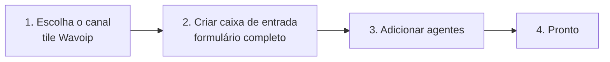

# Caixa de entrada Wavoip — setup na criação

Especificação do fluxo **Configurações → Caixas de Entrada → novo tile → Criar caixa de entrada**, coletando **todos os dados necessários** em um único formulário (padrão `Voice.vue` / `Telegram.vue`), antes do passo **Adicionar agentes**.

**UI de referência:** slot vazio na grade de canais (ao lado de “Chamada WhatsApp” Meta).

**Relacionado:** [implementation-plan.md](./implementation-plan.md) · [architecture.md](./architecture.md) · [frontend-integration.md](./frontend-integration.md) · [sdk-reference.md](./sdk-reference.md) · [official-docs.md](./official-docs.md)

---

## 1. Fluxo do wizard (4 passos Chatwoot)



| Passo | Componente | Responsabilidade |
|-------|------------|------------------|
| 1 | `ChannelList.vue` + `ChannelItem.vue` | Tile `wavoip` (Beta), gate `channel_voice` |
| 2 | `custom/.../channels/Wavoip.vue` | Formulário com todos os campos abaixo |
| 3 | Rota `settings_inboxes_add_agents` | Igual aos demais canais |
| 4 | Dashboard | Inbox operacional após agentes adicionados |

**Não** usar `@wavoip/wavoip-webphone` no passo 2 — apenas formulário Vue + API Rails.

---

## 2. Tile na grade de canais

| Propriedade | Valor |
|-------------|-------|
| `key` | `wavoip` |
| `icon` | `i-woot-whatsapp` (ou ícone dedicado fork) |
| `title` (i18n) | `INBOX_MGMT.ADD.AUTH.CHANNEL.WAVOIP.TITLE` — ex.: “Chamada Wavoip” |
| `description` | `INBOX_MGMT.ADD.AUTH.CHANNEL.WAVOIP.DESCRIPTION` |
| `isBeta` | `true` |
| `isActive` | `enabledFeatures.channel_voice` && (`channel_wavoip` se em piloto) |

Registro em `ChannelFactory.vue` (`# FORK:`):

```javascript
wavoip: Wavoip, // import from custom/
```

---

## 3. Campos do formulário (passo 2)

Todos os campos abaixo são apresentados **na criação**. Pareamento do dispositivo (QR / código) fica em **Settings → Chamadas** após criar o inbox — ver [sdk-reference.md §2](./sdk-reference.md#2-dispositivo-device). O dispositivo precisa estar em status `open` antes de receber ou originar chamadas.

### 3.1 Seção — Identidade da caixa

| Campo | API / storage | Obrigatório | Validação | Notas |
|-------|---------------|-------------|-----------|-------|
| **Nome da caixa de entrada** | `inbox.name` | Não | max 255 | Default: `Wavoip ({phone_number})` se vazio |
| **Número WhatsApp** | `channel.phone_number` | Sim | E.164 (`isPhoneE164`) | Mesmo número vinculado ao dispositivo Wavoip; unique global |

### 3.2 Seção — Dispositivo Wavoip

Dados obtidos em [app.wavoip.com/devices](https://app.wavoip.com/devices) — ver [Vincule um Whatsapp](https://wavoip.gitbook.io/api/vincule-um-whatsapp.md) e [official-docs.md](./official-docs.md).

| Campo | `provider_config` key | Obrigatório | Validação | Notas |
|-------|----------------------|-------------|-----------|-------|
| **Token do dispositivo** | `device_token` | Sim | present, min length | `type="password"`; API lista mascarada `••••last4`; nunca logar |
| **ID da sessão** | `id_session` | Não | integer opcional | **Somente cache/fallback** — webhook `DEVICE` preenche; resolução de inbox prioriza `phone_number` ([webhook-contract](./webhook-contract.md)) |

Referência SDK: [`new Wavoip({ tokens: [...] })`](https://wavoip.gitbook.io/api/wavoip-api/primeiros-passos/initialization.md).

### 3.3 Seção — Comportamento de chamadas

| Campo | `provider_config` key | Obrigatório | Default | Mapeamento Wavoip |
|-------|----------------------|-------------|---------|-------------------|
| **Nome exibido ao ligar** | `display_name` | Não | nome da conta ou vazio | `callSettings.displayName` / `startCall({ displayName })` |
| **Aceitar chamadas recebidas** | `inbound_calls_enabled` | Não | `true` | Se `false`, SDK ignora offers + webhook registra missed |
| **Identificador da plataforma** | `platform` | — | `'chatwoot'` | Fixo no backend; repassado ao `new Wavoip({ platform })` |

### 3.4 Seção — Webhook (servidor Chatwoot)

Gerado pelo Chatwoot na criação; admin configura no painel Wavoip (**Integrações → Webhook**).

| Campo | Storage | Obrigatório | Quem gera |
|-------|---------|-------------|-----------|
| **URL do webhook** | derivado | — | Read-only: `{FRONTEND_URL}/webhooks/wavoip/{phone_e164}?secret={webhook_secret}` |
| **Segredo do webhook** | `provider_config.webhook_secret` | Sim | Backend: `SecureRandom.hex(32)` se admin não informar |
| **Segredo customizado** | mesmo key | Não | Campo opcional “avançado”; senão auto-gerado |

| Campo UI (checkbox) | Obrigatório para submit |
|---------------------|-------------------------|
| **Confirmo que configurei o webhook no painel Wavoip** | Sim (acknowledgment) |

Referência: [Webhook (Beta)](https://wavoip.gitbook.io/api/wavoip-docs/webhook-beta.md) · contrato auth [webhook-contract.md](./webhook-contract.md).

### 3.5 Seção — Notificações do agente (opcional, colapsada)

Comportamento espelhado da [doc de notificações push](https://wavoip.gitbook.io/api/webphone/recursos/notificacoes-push.md), implementado no Chatwoot (`useWavoipNotifications`), não no webphone.

| Campo | `provider_config` key | Default |
|-------|----------------------|---------|
| **Notificar quando aba em segundo plano** | `offer_notification_enabled` | `true` |
| **Ícone da notificação (URL)** | `offer_notification_icon` | logo da instalação |

Permissão `Notification` continua sendo pedida no gesto “ficar online” (não no formulário de criação — browsers bloqueiam prompt sem gesto).

---

## 4. Layout do formulário (wireframe lógico)

```
┌─────────────────────────────────────────────────────────┐
│ Chamada Wavoip                                          │
│ Integre chamadas de voz WhatsApp via Wavoip.            │
├─────────────────────────────────────────────────────────┤
│ Identidade                                                │
│   [ Nome da caixa de entrada        ]                     │
│   [ Número WhatsApp (E.164)         ] *                   │
├─────────────────────────────────────────────────────────┤
│ Dispositivo Wavoip                                        │
│   [ Token do dispositivo            ] *  (password)       │
│   [ ID da sessão (opcional)         ]                     │
│   ℹ️ Crie o dispositivo em app.wavoip.com/devices         │
├─────────────────────────────────────────────────────────┤
│ Chamadas                                                  │
│   [ Nome exibido ao ligar           ]                     │
│   [x] Aceitar chamadas recebidas                          │
├─────────────────────────────────────────────────────────┤
│ Webhook                                                   │
│   URL (somente leitura): https://…/webhooks/wavoip/+55…   │
│   [ Copiar URL ] [ Copiar segredo ]                       │
│   [ Segredo customizado (avançado)  ]                     │
│   [x] Configurei o webhook no painel Wavoip *             │
├─────────────────────────────────────────────────────────┤
│ ▼ Notificações (opcional)                                 │
│   [x] Notificar agente com aba em segundo plano           │
├─────────────────────────────────────────────────────────┤
│                              [ Criar caixa de entrada ]   │
└─────────────────────────────────────────────────────────┘
```

Componentes Vue sugeridos (evitar god component):

| Componente | Responsabilidade |
|------------|------------------|
| `Wavoip.vue` | Orquestra submit + navegação |
| `WavoipInboxIdentityFields.vue` | Nome + telefone |
| `WavoipDeviceFields.vue` | Token + id_session |
| `WavoipCallBehaviorFields.vue` | display_name + inbound toggle |
| `WavoipWebhookInstructions.vue` | URL read-only, copy, acknowledgment |
| `WavoipNotificationFields.vue` | Campos opcionais colapsados |

---

## 5. Payload de criação

### 5.1 Frontend → API

```javascript
await store.dispatch('inboxes/createWavoipChannel', {
  name: state.inboxName || `Wavoip (${state.phoneNumber})`,
  wavoip: {
    phone_number: state.phoneNumber,
    provider_config: {
      device_token: state.deviceToken,
      id_session: state.idSession || null,
      display_name: state.displayName || null,
      inbound_calls_enabled: state.inboundCallsEnabled,
      webhook_secret: state.webhookSecret || undefined, // backend gera se omitido
      offer_notification_enabled: state.offerNotificationEnabled,
      offer_notification_icon: state.offerNotificationIcon || null,
      platform: 'chatwoot',
    },
  },
});
```

### 5.2 Store action (`custom/` ou `# FORK:` em `channelActions.js`)

```javascript
createWavoipChannel: async ({ commit }, params) => {
  const response = await InboxesAPI.create({
    name: params.name,
    channel: { ...params.wavoip, type: 'wavoip' },
  });
  // ...
};
```

### 5.3 Backend — strong params

```ruby
# custom/.../enterprise/inboxes_controller.rb (prepend)
def create_wavoip_channel
  raise Pundit::NotAuthorizedError unless Current.account.feature_enabled?('channel_voice')

  wavoip_params = params.require(:channel).permit(
    :phone_number,
    provider_config: [
      :device_token,
      :id_session,
      :display_name,
      :inbound_calls_enabled,
      :webhook_secret,
      :offer_notification_enabled,
      :offer_notification_icon
    ]
  )

  config = wavoip_params[:provider_config] || {}
  config['webhook_secret'] ||= SecureRandom.hex(32)
  config['platform'] = 'chatwoot'
  config['inbound_calls_enabled'] = config.fetch('inbound_calls_enabled', true)

  Current.account.channel_wavoip.create!(
    phone_number: wavoip_params[:phone_number],
    provider_config: config
  )
end
```

Validação em service dedicado (não no model):

```ruby
# custom/app/services/wavoip/channels/create_validator.rb
class Wavoip::Channels::CreateValidator
  def initialize(phone_number:, provider_config:)
    @phone_number = phone_number
    @provider_config = provider_config
  end

  def validate!
    raise ArgumentError, 'device_token required' if @provider_config['device_token'].blank?
    raise ArgumentError, 'invalid phone' unless phone_e164?(@phone_number)
  end
end
```

### 5.4 Resposta API (inbox criado)

Incluir na serialização do inbox (somente para admins da conta):

```json
{
  "webhook_url": "https://app.example.com/webhooks/wavoip/%2B5511999999999",
  "webhook_configured": false
}
```

`webhook_url` também visível no formulário **antes** do submit (preview calculado no FE com `phone_number` digitado).

---

## 6. Pós-criação imediato

Após `POST /inboxes` bem-sucedido:

1. `router.replace({ name: 'settings_inboxes_add_agents', params: { inbox_id } })` — igual `Voice.vue`.
2. Toast opcional: “Configure o webhook no Wavoip se ainda não marcou a confirmação.”
3. **Não** conectar SDK Wavoip neste passo — conexão só quando agente ficar **online** (ver [frontend-integration.md](./frontend-integration.md)).

---

## 7. Settings (edição posterior)

Tab **Chamadas** no inbox (`WavoipCallingPage.vue`) expõe os **mesmos campos** editáveis, mais **`WavoipDevicePanel`**:

| Painel | SDK | Quando mostrar |
|--------|-----|----------------|
| Status do dispositivo | `device.status`, `statusChanged` | Sempre |
| QR code | `qrCodeChanged` | `status === 'connecting'` |
| Código de pareamento | `pairingCode(phone)` | Alternativa ao QR |
| Acordar | `wakeUp()` | `hibernating` |
| Reiniciar / logout | `restart()`, `logout()` | Admin troubleshooting |

Detalhes: [sdk-reference.md §2](./sdk-reference.md#2-dispositivo-device).

**`WavoipOnboardingChecklist`:** semáforo 6 passos — [operations-runbook.md](./operations-runbook.md#checklist-de-onboarding-semáforo).

Campos editáveis:

| Campo | Editável após criar? |
|-------|----------------------|
| `phone_number` | Não (recreate inbox) |
| `device_token` | Sim (rotacionar token) |
| `display_name`, toggles, notification | Sim |
| `webhook_secret` | Sim (rotacionar — exige atualizar Wavoip) |
| `webhook_url` | Read-only (derivado do phone) |

---

## 8. i18n (somente `en.json` + `pt_BR`)

Chaves sugeridas:

```json
{
  "INBOX_MGMT": {
    "ADD": {
      "AUTH": {
        "CHANNEL": {
          "WAVOIP": {
            "TITLE": "Wavoip Call",
            "DESCRIPTION": "Receive and place WhatsApp voice calls via Wavoip"
          }
        }
      },
      "WAVOIP": {
        "TITLE": "Wavoip Voice Channel",
        "DESC": "Connect your Wavoip device to handle WhatsApp voice calls.",
        "INBOX_NAME": { "LABEL": "Inbox name", "PLACEHOLDER": "Support (Wavoip)" },
        "PHONE_NUMBER": { "LABEL": "WhatsApp number", "PLACEHOLDER": "+5511999999999", "ERROR": "..." },
        "DEVICE_TOKEN": { "LABEL": "Device token", "PLACEHOLDER": "...", "HELP": "From app.wavoip.com/devices" },
        "ID_SESSION": { "LABEL": "Session ID (optional)", "PLACEHOLDER": "12345" },
        "DISPLAY_NAME": { "LABEL": "Outbound display name", "PLACEHOLDER": "Support" },
        "INBOUND_ENABLED": { "LABEL": "Accept incoming calls" },
        "WEBHOOK": {
          "TITLE": "Webhook",
          "URL_LABEL": "Webhook URL",
          "SECRET_LABEL": "Webhook secret",
          "COPY_URL": "Copy URL",
          "COPY_SECRET": "Copy secret",
          "HELP": "Paste the URL in Wavoip → Device → Integrations → Webhook",
          "ACK_LABEL": "I configured the webhook in the Wavoip dashboard"
        },
        "NOTIFICATIONS": {
          "TITLE": "Agent notifications",
          "ENABLED": "Notify when tab is in background"
        },
        "SUBMIT_BUTTON": "Create Wavoip inbox",
        "API": { "ERROR_MESSAGE": "Could not create the Wavoip inbox" }
      }
    }
  }
}
```

---

## 9. Diferença vs tile “Chamada WhatsApp” (Meta)

| | Meta `whatsapp_call` | Wavoip `wavoip` |
|--|----------------------|-----------------|
| Gate UI | `channel_voice` + `whatsappAppId` | `channel_voice` apenas |
| Passo 2 | Embedded signup Meta | Formulário manual (este doc) |
| Credencial | WABA / Cloud API | Token dispositivo Wavoip |
| Webhook | Meta → `/webhooks/whatsapp` | Wavoip → `/webhooks/wavoip/:phone` |

Os dois tiles podem aparecer na mesma grade; são produtos paralelos.

---

## 10. Critérios de done (setup inbox)

- [ ] Tile `wavoip` visível com `channel_voice` habilitada
- [ ] Formulário valida E.164 + token obrigatório + acknowledgment webhook
- [ ] `Channel::Wavoip` criado com `provider_config` completo
- [ ] `webhook_secret` gerado e persistido
- [ ] Redirect para adicionar agentes
- [ ] Settings permitem editar token, display_name e toggles
- [ ] Nenhum dado sensível em `window.chatwootConfig` global
