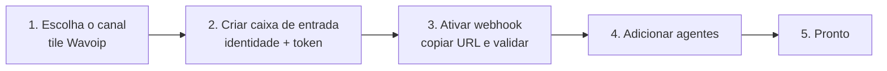

# Caixa de entrada Wavoip — setup na criação

Especificação do fluxo **Configurações → Caixas de Entrada → novo tile → Criar caixa
de entrada**. A criação coleta identidade e token; a ativação do webhook ocorre depois
que o backend gerar a URL.

**UI de referência:** slot vazio na grade de canais (ao lado de “Chamada WhatsApp” Meta).

**Relacionado:** [architecture.md](./architecture.md) · [frontend-integration.md](./frontend-integration.md) · [sdk-reference.md](./sdk-reference.md) · [operations-runbook.md](./operations-runbook.md) · [official-docs.md](./official-docs.md) · [README.md](./README.md)

---

## 1. Fluxo do wizard



| Passo | Componente | Responsabilidade |
|-------|------------|------------------|
| 1 | `ChannelList.vue` + `ChannelItem.vue` | Tile `wavoip` (Beta), gate `channel_voice` |
| 2 | `custom/.../channels/Wavoip.vue` | Formulário com todos os campos abaixo |
| 3 | `Wavoip.vue` (alerta pós-criação) | Configurar URL e aguardar primeiro evento — ver §3.4 |
| 4 | Rota `settings_inboxes_add_agents` | Igual aos demais canais |
| 5 | Dashboard | Inbox operacional após agentes adicionados |

**Não** usar `@wavoip/wavoip-webphone` no passo 2 — apenas formulário Vue + API Rails.

---

## 2. Tile na grade de canais

| Propriedade | Valor |
|-------------|-------|
| `key` | `wavoip` |
| `icon` | `i-woot-whatsapp` (ou ícone dedicado fork) |
| `title` (i18n) | `INBOX_MGMT.ADD.AUTH.CHANNEL.WAVOIP.TITLE` — ex.: “Chamada Wavoip” |
| `description` | `INBOX_MGMT.ADD.AUTH.CHANNEL.WAVOIP.DESCRIPTION` |
| `isBeta` | `true` |
| `isActive` | `enabledFeatures.channel_voice` && (`channel_wavoip` se em piloto) |

Registro em `ChannelFactory.vue` (`# FORK:`):

```javascript
wavoip: Wavoip, // import from custom/
```

---

## 3. Campos do formulário (passo 2)

O setup tem duas etapas: criar o inbox e depois ativar o webhook. A URL contém uma
chave gerada pelo backend e só existe após a criação. Pareamento QR/código fica em
**Settings → Chamadas** (`WavoipDevicePanel` + `WavoipQrDisplay`); o admin também pode
operar o dispositivo no painel Wavoip.

### 3.1 Seção — Identidade da caixa

| Campo | API / storage | Obrigatório | Validação | Notas |
|-------|---------------|-------------|-----------|-------|
| **Nome da caixa de entrada** | `inbox.name` | Não | max 255 | Default: `Wavoip ({phone_number})` se vazio |
| **Número WhatsApp** | `channel.phone_number` | Sim | E.164 (`isPhoneE164`) | Único entre canais Wavoip; pode coexistir com inbox de mensagens. Aceita celular **e** fixo BR (ex. `+5566999050319` ou `+556635159875`). No form, `HELP_TEXT` usa `message-type: info` — não misturar com erro de validação. |

### 3.2 Seção — Dispositivo Wavoip

Dados obtidos em [app.wavoip.com/devices](https://app.wavoip.com/devices) — ver
[Vincule um Whatsapp](https://wavoip.gitbook.io/api/dispositivo/vincule-um-whatsapp.md)
e [official-docs.md](./official-docs.md).

| Campo | Storage | Obrigatório | Validação | Notas |
|-------|----------------------|-------------|-----------|-------|
| **Token do dispositivo** | coluna `device_token` | Sim | present, min length | `type="password"`; criptografado quando disponível; nunca entra em listagens |
| **ID da sessão** | `provider_config.id_session` | Não | integer opcional | Cache de validação/correlação; não resolve autenticação do webhook |

Referência SDK: [`new Wavoip({ tokens: [...] })`](https://wavoip.gitbook.io/api/wavoip-api/primeiros-passos/initialization.md).

### 3.3 Seção — Comportamento de chamadas

| Campo | `provider_config` key | Obrigatório | Default | Mapeamento Wavoip |
|-------|----------------------|-------------|---------|-------------------|
| **Aceitar chamadas recebidas** | `inbound_calls_enabled` | Não | `true` | Se `false`, SDK ignora offers + webhook registra missed |
| **Gravar ligações no histórico** | `call_recording_enabled` | Não | `true` | Opt-out no Chatwoot; exige gravação ON no painel Wavoip + evento **RECORD** no webhook |
| **Identificador da plataforma** | `platform` | — | `'chatwoot'` | Fixo no backend; repassado ao `new Wavoip({ platform })` |

### 3.4 Ativação — webhook do servidor

Exibida **após** o inbox ser criado. O admin configura a URL no painel Wavoip
(**Integrações → Webhook**) e o Chatwoot marca a integração como validada ao receber o
primeiro evento autenticado.

| Campo | Storage | Comportamento |
|-------|---------|---------------|
| **URL do webhook** | derivada de `webhook_key` | `{FRONTEND_URL}/webhooks/wavoip/{webhook_key}` — **não** usar inbox id no path |
| **Rotacionar URL** | gera nova chave | Invalida a anterior e exige atualizar o painel |
| **Status** | `pending` / `verified` | `verified` após primeiro webhook válido (`webhook_verified_at`) |

> **Erro comum:** colar `/webhooks/wavoip/42` (id do inbox). O path correto usa a chave opaca
> gerada em `channel_wavoip.webhook_key` (ex. `mz5uFxCZ4tVZn94Nm5osnqCQ`).

No painel Wavoip: além da URL, **ativar o toggle** do webhook e selecionar eventos **CALL** e **RECORD**
(no device correto). Ver [operations-runbook.md](./operations-runbook.md#checklist-painel-wavoip-obrigatório).

Referência: [Webhook (Beta)](https://wavoip.gitbook.io/api/webhook-beta.md) ·
contrato auth [webhook-contract.md](./webhook-contract.md).

### 3.5 Seção — Gravação no histórico (Settings)

Configurável na tab **Chamadas** (`WavoipCallingPage.vue`), toggle **Gravar ligações no histórico**. Persistido em `provider_config.call_recording_enabled` via `PATCH /inboxes/:id` (helper `patchWavoipProviderConfig`).

| Campo UI (i18n) | `provider_config` key | Default | Comportamento |
|-----------------|----------------------|---------|---------------|
| **Gravar ligações no histórico** | `call_recording_enabled` | `true` | `false` = ignora webhooks `RECORD` no backend e oculta player na bolha |

**Três toggles independentes** (todos precisam estar ON para o player aparecer):

1. **Wavoip painel** — `app.wavoip.com` → Configurações gerais → Gravação
2. **Webhook Wavoip** — evento **RECORD** selecionado na URL do inbox
3. **Chatwoot** — `call_recording_enabled` nesta seção

Política backend: `Wavoip::Calls::RecordingPolicy` (só anexa quando `record_status` é `READY` ou ausente com URL e `Call.status == completed`). Ver [webhook-contract.md §5](./webhook-contract.md#5-evento-record).

**Wireframe (Settings → Chamadas):**

```
┌─────────────────────────────────────────────────────────┐
│ Device status / QR …                                    │
├─────────────────────────────────────────────────────────┤
│ [x] Aceitar chamadas recebidas                          │
│ [x] Gravar ligações no histórico                        │
│     ℹ️ Gravação no painel Wavoip + evento RECORD        │
├─────────────────────────────────────────────────────────┤
│ Incoming call routing …                                 │
└─────────────────────────────────────────────────────────┘
```

### 3.6 Seção — Roteamento de chamadas inbound (Settings)

Configurável na tab **Chamadas** (`WavoipCallingPage.vue`), seção **Incoming call routing**. Persistido em `provider_config` via `PATCH /inboxes/:id` (`channel.provider_config` merge).

| Campo UI (i18n) | `provider_config` key | Default | Comportamento |
|-----------------|----------------------|---------|---------------|
| **Include account administrators** | `incoming_call_include_administrators` | `true` | `false` = só agentes listados na aba Agentes recebem ring/cable/push/SDK |
| **When no agent is online** | `incoming_call_offline_fallback` | `assignee_or_inbox_members_and_administrators` | Ver tabela em [architecture.md §3.6](./architecture.md#36-actioncable) |

**Regra operacional:** com administradores desligados e fallback `assignee_or_inbox_members`, apenas agentes **online** listados na aba Agentes tocam em condições normais. A atribuição automática de conversas (`enable_auto_assignment`) é independente.

Lógica centralizada em `custom/app/services/wavoip/calls/incoming_call_recipients.rb`.

### 3.7 Seção — Notificações do agente (opcional, colapsada)

Comportamento espelhado da [doc de notificações push](https://wavoip.gitbook.io/api/webphone/recursos/notificacoes-push.md), implementado no Chatwoot (`useWavoipNotifications`), não no webphone.

| Campo | `provider_config` key | Default |
|-------|----------------------|---------|
| **Notificar quando aba em segundo plano** | `offer_notification_enabled` | `true` |
| **Ícone da notificação (URL)** | `offer_notification_icon` | logo da instalação |

Permissão `Notification` continua sendo pedida no gesto “ficar online” (não no formulário de criação — browsers bloqueiam prompt sem gesto).

---

## 4. Layout do formulário (wireframe lógico)

```
┌─────────────────────────────────────────────────────────┐
│ Chamada Wavoip                                          │
│ Integre chamadas de voz WhatsApp via Wavoip.            │
├─────────────────────────────────────────────────────────┤
│ Identidade                                                │
│   [ Nome da caixa de entrada        ]                     │
│   [ Número WhatsApp (E.164)         ] *                   │
├─────────────────────────────────────────────────────────┤
│ Dispositivo Wavoip                                        │
│   [ Token do dispositivo            ] *  (password)       │
│   [ ID da sessão (opcional)         ]                     │
│   ℹ️ Crie o dispositivo em app.wavoip.com/devices         │
├─────────────────────────────────────────────────────────┤
│ Chamadas                                                  │
│   [x] Aceitar chamadas recebidas                          │
├─────────────────────────────────────────────────────────┤
│ Webhook                                                   │
│   URL disponível após criar o inbox.                      │
│   O próximo passo orientará a configuração no Wavoip.     │
├─────────────────────────────────────────────────────────┤
│ ▼ Notificações (opcional)                                 │
│   [x] Notificar agente com aba em segundo plano           │
├─────────────────────────────────────────────────────────┤
│                              [ Criar caixa de entrada ]   │
└─────────────────────────────────────────────────────────┘
```

Componentes Vue sugeridos (evitar god component):

| Componente | Responsabilidade |
|------------|------------------|
| `Wavoip.vue` | Orquestra submit + navegação |
| `WavoipInboxIdentityFields.vue` | Nome + telefone |
| `WavoipDeviceFields.vue` | Token + id_session |
| `WavoipCallBehaviorFields.vue` | inbound toggle |
| `WavoipWebhookInstructions.vue` | URL pós-criação, copy, rotação e status de verificação — **removido**; lógica em `Wavoip.vue` (alerta pós-criação) |
| `WavoipNotificationFields.vue` | Campos opcionais colapsados |

---

## 5. Payload de criação

### 5.1 Frontend → API

```javascript
await store.dispatch('inboxes/createWavoipChannel', {
  name: state.inboxName || `Wavoip (${state.phoneNumber})`,
  wavoip: {
    phone_number: state.phoneNumber,
    device_token: state.deviceToken,
    provider_config: {
      id_session: state.idSession || null,
      inbound_calls_enabled: state.inboundCallsEnabled,
      offer_notification_enabled: state.offerNotificationEnabled,
      offer_notification_icon: state.offerNotificationIcon || null,
      platform: 'chatwoot',
    },
  },
});
```

### 5.2 Store action (`custom/` ou `# FORK:` em `channelActions.js`)

```javascript
createWavoipChannel: async ({ commit }, params) => {
  const response = await InboxesAPI.create({
    name: params.name,
    channel: { ...params.wavoip, type: 'wavoip' },
  });
  // ...
};
```

### 5.3 Backend — strong params

```ruby
# custom/.../enterprise/inboxes_controller.rb (prepend)
def create_wavoip_channel
  raise Pundit::NotAuthorizedError unless Current.account.feature_enabled?('channel_voice')

  wavoip_params = params.require(:channel).permit(
    :phone_number,
    :device_token,
    provider_config: [
      :id_session,
      :inbound_calls_enabled,
      :offer_notification_enabled,
      :offer_notification_icon
    ]
  )

  config = wavoip_params[:provider_config] || {}
  config['platform'] = 'chatwoot'
  config['inbound_calls_enabled'] = config.fetch('inbound_calls_enabled', true)

  Current.account.wavoip_channels.create!(
    phone_number: wavoip_params[:phone_number],
    device_token: wavoip_params[:device_token],
    provider_config: config
  )
end
```

Validação no model `Channel::Wavoip` (`validates :phone_number`, `ring_timeout_seconds_value`) e falha explícita do `create!` no controller — sem service `CreateValidator` dedicado:

```ruby
# custom/app/controllers/custom/api/v1/accounts/inboxes_controller.rb
def create_wavoip_channel
  raise Pundit::NotAuthorizedError unless Current.account.feature_enabled?('channel_voice') &&
                                          Current.account.feature_enabled?('channel_wavoip')

  wavoip_params = params.require(:channel).permit(
    :phone_number,
    :device_token,
    provider_config: %i[inbound_calls_enabled call_recording_enabled ...]
  )

  Current.account.wavoip_channels.create!(wavoip_params)
end
```

### 5.4 Resposta API (inbox criado)

Incluir na serialização do inbox (somente para **administradores** da conta):

```json
{
  "wavoip_webhook_url": "https://app.example.com/webhooks/wavoip/opaque-random-key",
  "wavoip_setup_pending": true,
  "wavoip_device_token_configured": true
}
```

Implementado em `app/views/api/v1/models/_inbox.json.jbuilder` (`# FORK:`). `wavoip_webhook_url` só é
exibida para admins; nunca expor `device_token` nem `webhook_key` brutos.

**Pós-criação (`Wavoip.vue`):** lê `channel.wavoip_webhook_url` ou `channel.wavoipWebhookUrl` do
response e exibe alerta com botão copiar.

**Settings (`WavoipCallingPage.vue`):** lê os mesmos campos (`wavoip_webhook_url` /
`wavoip_setup_pending` + fallbacks camelCase) — corrigido jun. 2026.

---

## 6. Pós-criação imediato

Após `POST /inboxes` bem-sucedido:

1. Exibir a etapa de ativação com URL, botão copiar e status `pending`.
2. Após confirmação do admin, navegar para `settings_inboxes_add_agents`.
3. **Não** conectar o SDK neste passo — conexão só quando agente autorizado ficar
   **online** (ver [frontend-integration.md](./frontend-integration.md)).

---

## 7. Settings (edição posterior)

A tab **Chamadas** (`WavoipCallingPage.vue`) expõe painel de device, inbound toggle, **roteamento de chamadas inbound**, **pareamento QR escaneável** (`WavoipDevicePanel` + `WavoipQrDisplay`), webhook (URL, teste, rotação) e status de setup.

**Pareamento WhatsApp:** em Settings → Chamadas, quando o device está `close` ou `connecting`, o admin vê um **QR escaneável** (renderizado via `qrcode` a partir do evento SDK `qrCodeChanged`, com fallback para `https://devices.wavoip.com/{token}/whatsapp/qr-image`). Alternativa: botão **Get pairing code**. O wizard de criação (`Wavoip.vue`) continua exigindo apenas o device token — o QR não aparece no passo de criação.

| Campo API | Significado |
|-----------|-------------|
| `wavoip_webhook_url` | URL read-only derivada de `webhook_key` (admin) |
| `wavoip_setup_pending` | `true` até primeiro webhook válido |
| `wavoip_device_token_configured` | `device_token` presente (sem expor valor) |
| `inbound_calls_enabled` | Toggle de chamadas recebidas |
| `incoming_call_include_administrators` | Incluir admins da conta fora da aba Agentes |
| `incoming_call_offline_fallback` | Fallback quando ninguém online (ver §3.6) |
| `current_user_inbox_member` | Membro da aba Agentes para o usuário atual |
| `provider_config` | Slice com chaves de roteamento (merge seguro no PATCH) |

Checklist de onboarding (semáforo): `WavoipOnboardingChecklist.vue` em Settings → Chamadas.
O passo “Token configurado” usa `wavoip_device_token_configured` (a API **nunca** serializa
`device_token` bruto). Detalhes: [operations-runbook.md](./operations-runbook.md#checklist-de-onboarding-semáforo).

Campos editáveis:

| Campo | Editável após criar? |
|-------|----------------------|
| `phone_number` | Não (recreate inbox) |
| `device_token` | Sim (rotacionar token) |
| Roteamento inbound (§3.6) | Sim (Settings → Chamadas) |
| toggles e notification | Sim |
| `webhook_key` | Rotação por ação dedicada; nunca aceitar valor escolhido pelo cliente |
| `wavoip_webhook_url` | Read-only na API (derivada da chave) |

### `users.wavoip_token` (legado)

Coluna legada na tabela `users` — **não** usada pelo canal Wavoip. Credencial do dispositivo fica em
`channel_wavoip.device_token` (criptografado quando disponível).

---

## 8. i18n

Seguir a regra do projeto: atualizar somente inglês nos arquivos upstream. Traduções
adicionais pertencem ao overlay do fork, se ele optar por mantê-las.

Chaves sugeridas:

```json
{
  "INBOX_MGMT": {
    "ADD": {
      "AUTH": {
        "CHANNEL": {
          "WAVOIP": {
            "TITLE": "Wavoip Call",
            "DESCRIPTION": "Receive and place WhatsApp voice calls via Wavoip"
          }
        }
      },
      "WAVOIP": {
        "TITLE": "Wavoip Voice Channel",
        "DESC": "Connect your Wavoip device to handle WhatsApp voice calls.",
        "INBOX_NAME": { "LABEL": "Inbox name", "PLACEHOLDER": "Support (Wavoip)" },
        "PHONE_NUMBER": { "LABEL": "WhatsApp number", "PLACEHOLDER": "+556635159875", "HELP_TEXT": "E.164; BR mobile or landline", "ERROR": "..." },
        "DEVICE_TOKEN": { "LABEL": "Device token", "PLACEHOLDER": "...", "HELP": "From app.wavoip.com/devices" },
        "ID_SESSION": { "LABEL": "Session ID (optional)", "PLACEHOLDER": "12345" },
        "INBOUND_ENABLED": { "LABEL": "Accept incoming calls" },
        "WEBHOOK": {
          "TITLE": "Webhook",
          "URL_LABEL": "Webhook URL",
          "COPY_URL": "Copy URL",
          "HELP": "Paste the URL in Wavoip → Device → Integrations → Webhook",
          "PENDING": "Waiting for the first webhook event",
          "VERIFIED": "Webhook verified"
        },
        "NOTIFICATIONS": {
          "TITLE": "Agent notifications",
          "ENABLED": "Notify when tab is in background"
        },
        "ROUTING": {
          "LABEL": "Incoming call routing",
          "INCLUDE_ADMINISTRATORS": { "LABEL": "Include account administrators" },
          "OFFLINE_FALLBACK": { "LABEL": "When no agent is online" }
        },
        "SUBMIT_BUTTON": "Create Wavoip inbox",
        "API": { "ERROR_MESSAGE": "Could not create the Wavoip inbox" }
      }
    }
  }
}
```

---

## 9. Diferença vs tile “Chamada WhatsApp” (Meta)

| | Meta `whatsapp_call` | Wavoip `wavoip` |
|--|----------------------|-----------------|
| Gate UI | `channel_voice` + `whatsappAppId` | `channel_voice` apenas |
| Passo 2 | Embedded signup Meta | Formulário manual (este doc) |
| Credencial | WABA / Cloud API | Token dispositivo Wavoip |
| Webhook | Meta → `/webhooks/whatsapp` | Wavoip → `/webhooks/wavoip/:webhook_key` |

Os dois tiles podem aparecer na mesma grade; são produtos paralelos.

---

## 10. Critérios de done (setup inbox)

- [x] Tile `wavoip` visível com `channel_voice` habilitada
- [x] Formulário valida E.164 + token obrigatório
- [x] `Channel::Wavoip` criado com `provider_config` completo
- [x] `webhook_key` opaca gerada pelo backend
- [x] Pós-criação mostra URL e status de verificação
- [x] Redirect para adicionar agentes
- [x] Settings permitem editar token e toggles
- [x] Nenhum dado sensível em `window.chatwootConfig` global
- [x] `WavoipCallingPage` usa `wavoip_webhook_url` / `wavoip_setup_pending` (jun. 2026)
