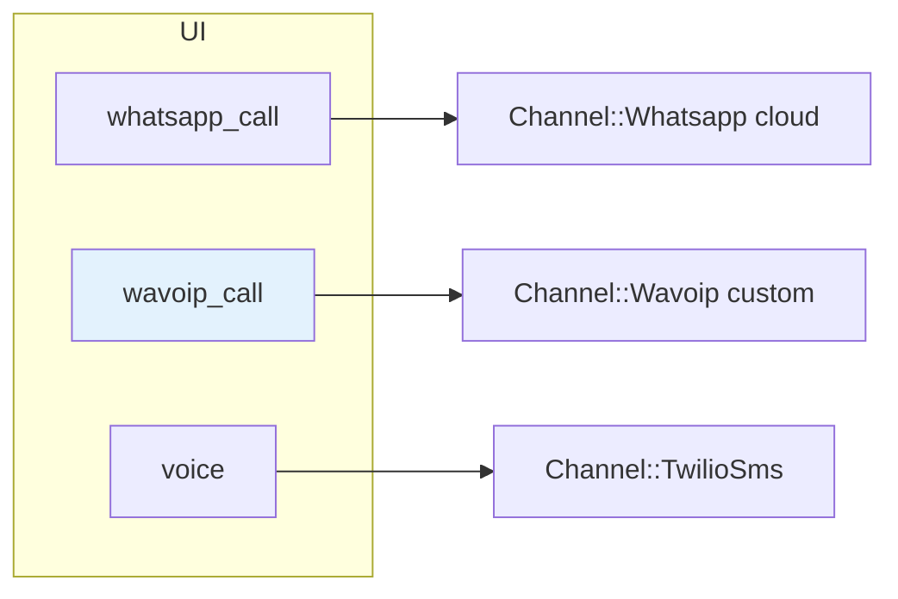

# Wavoip vs Meta Cloud Calling

Comparação para decisão de produto e para **não** tentar encaixar Wavoip no plano [second-provider-strategy.md](../second-provider-strategy.md) (adapter Graph API).

**Docs Wavoip:** [Inicialização API](https://wavoip.gitbook.io/api/wavoip-api/primeiros-passos/initialization.md) · [Webhook](https://wavoip.gitbook.io/api/wavoip-docs/webhook-beta.md)

---

## Classificação na árvore do fork

| Pergunta | Wavoip | Meta (upstream) |
|----------|--------|-----------------|
| API expõe Graph `/calls` + SDP no servidor? | ❌ | ✅ |
| Sinalização no browser? | ✅ WebSocket SDK | ✅ WebRTC manual + REST |
| Webhook para servidor? | ✅ HTTP próprio (Beta) | ✅ `field=calls` Meta |
| Requisita `WHATSAPP_APP_ID`? | ❌ (token de dispositivo) | ✅ |
| Requisita Calling API enrollment Meta? | ❌ (depende do modo `official`/`unofficial` do Wavoip) | ✅ |

Wavoip cai no eixo **gateway com SDK browser + webhook proprietário**, não no eixo **CPaaS Meta-like**.

---

## Tabela comparativa

| Dimensão | Chatwoot + Meta | Chatwoot + Wavoip (proposto) |
|----------|-----------------|------------------------------|
| **Onde aceita inbound** | `POST /whatsapp_calls/:id/accept` + SDP | `offer.accept()` no browser |
| **Onde inicia outbound** | `POST /whatsapp_calls/initiate` + SDP | `wavoip.startCall({ to })` no browser |
| **Modelo de canal** | `Channel::Whatsapp` (`whatsapp_cloud`) | `Channel::Wavoip` (`custom/`) |
| **Tile UI** | `whatsapp_call` | `wavoip_call` |
| **ID externo da call** | Meta `call_id` | `whatsapp_call_id` (webhook) |
| **Gravação** | `MediaRecorder` → upload | Webhook `RECORD` + `record_url` |
| **Permissão outbound Meta 138006** | Sim | Não documentado no Wavoip |
| **Multi-agente** | ActionCable → agentes online | SDK `offer` + `acceptedElsewhere` |
| **Dependência npm** | Nenhuma (WebRTC nativo) | `@wavoip/wavoip-api` |
| **UI pronta** | `FloatingCallWidget` Chatwoot | Não usar `@wavoip/wavoip-webphone` (React) |

---

## O que NÃO fazer

1. **Não** estender `WhatsappCallsController` com branch Wavoip — contratos incompatíveis (SDP vs SDK).
2. **Não** prepend `WhatsappEventsJob` com payload Wavoip — formatos diferentes; rota webhook dedicada.
3. **Não** reutilizar `useWhatsappCallSession` — encapsula RTCPeerConnection Meta; Wavoip gerencia WebRTC internamente.
4. **Não** usar `@wavoip/wavoip-webphone` no dashboard Vue — React 18 + Shadow DOM competindo com `FloatingCallWidget`.
5. **Não** unificar tiles `whatsapp_call` e `wavoip_call` — gates e setup distintos.

---

## Quando escolher cada um

| Cenário | Escolha |
|---------|---------|
| WABA oficial, embedded signup, Calling API Meta | **Meta** (`whatsapp_call`) |
| Número no Wavoip / Evolution / Baileys via Wavoip, sem Graph Calling | **Wavoip** (`wavoip_call`) |
| Ligação telefônica PSTN | **Twilio** (tile `voice`) |
| Mensagens gateway + voz Wavoip no mesmo número | **Dois inboxes** (ver [architecture.md](./architecture.md)) |

---

## Coexistência no mesmo fork

Os três caminhos podem coexistir:

Nenhum substitui o outro. Habilitar Meta não desbloqueia Wavoip e vice-versa.
